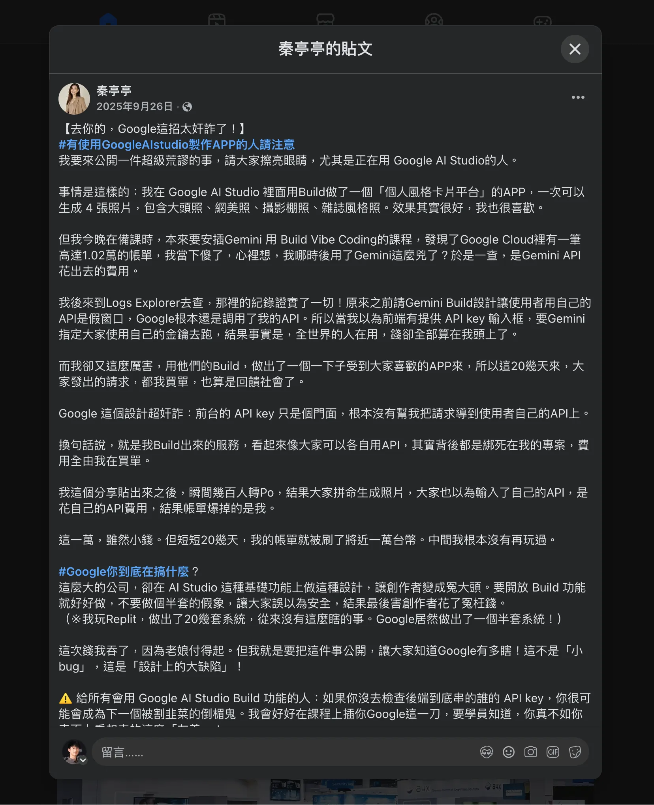
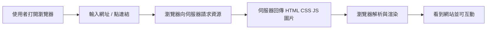
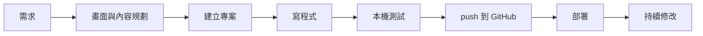

# AI 協作前端開發入門

毛哥EM

<div class="mt-6 opacity-80">
從零開始做出個人網站，理解現代前端與 AI 協作流程
</div>

---
layout: full
class: px-14
---

<div class="h-full grid grid-cols-[1fr_420px] items-center">
<div>

**關於我**

## 毛哥EM

- 十年網頁開發經驗
- 國際網頁設計競賽 Awwwards - 常態評審
- 陽明交通大學 軟體開發社 - 前端開發組長、設計組長
- 陽明交通大學 網路安全策進會 - 網管
- 2024/2025 學生計算機年會 - 講者

</div>

<div class="flex justify-center">
    
  </div>
</div>

---

## 課程目標

- 理解前端開發的基本結構與流程
- 知道 **HTML / CSS / JS / Git / Markdown** 在實務中的角色與基本語法
- 對現代前端工具鏈與 **AI 協作工作流** 有初步認識
- 能使用 AI 工具協助生成、修改、整理網頁內容
- 完成一個簡單個人專案並部署到 **Vercel**

---

## 事前準備

- 註冊 GitHub 帳號：<https://github.com/>
- 申請 GitHub Education：<https://education.github.com/pack>
- 安裝
  - VS Code
  - Node.js & pnpm
  - Git
- 建議帶自己的自介素材
  - 姓名 / 照片 / 系級 / 技能 / 作品 / 社群連結

---

## 課程安排

本課程共 **兩堂**，每堂 **120 分鐘**

1. **課程 1：前端開發基礎與個人履歷網頁實作**
2. **課程 2：現代網頁架構、AI 協作流程與個人專案實作**

整體設計目標：

- 零基礎可跟上
- 能完成作品
- 能理解 AI 怎麼幫你加速開發
- 知道部署與展示作品的完整流程

---
layout: section
---

## 課程 1

前端開發基礎與個人履歷網頁實作

---

## 今天你會做到什麼？

- 知道一個網站是怎麼形成的
- 寫出基本 HTML / CSS / JS
- 用終端機建立與執行專案
- 用 Git 做最基本版本控制
- 把個人網站部署到 GitHub Pages
- 開始用 AI 幫你產生初稿、改版、整理內容

> 今天的目標：**把網站做出來、放上網、自己能繼續改**

---
layout: statement
---

我們先來談談 AI

---
layout: statement
---

# AI 時代的工程師

一群正在努力把自己搞失業的一群人

---
layout: statement
---

# AI 時代的工程師

不是比較會背語法的人

而是更會 **拆需求、查資料、驗證結果、整合工具** 的人

---

未來的面試可能會分為兩 Part：

- **十分核心底層原理**
- **AI 應用能力**

_-莊育棋 Andes 軟體研發處協理_

---

## vibe coding 是什麼？

一種很常見的現代開發方式：

- 先用自然語言描述你要的東西
- 讓 AI 幫你起草畫面、程式、文案、結構
- 你再去判斷、修正、測試、整合

---
layout: statement
---

> 我不是在 Vibe Coding，我這叫做 「Agentic Coding」

---
layout: statement
---

> 我這不叫做畫畫，我是在人物素描

---
layout: statement
---

# AI 是一個精英放大器

---
layout: image
---



---

## 網頁是怎麼運作的？



---

## 前端、後端、資料庫各自做什麼？

| 部分            | 負責什麼       | 例子                   |
| --------------- | -------------- | ---------------------- |
| 前端 Frontend   | 畫面與互動     | 按鈕、表單、動畫、頁面 |
| 後端 Backend    | 商業邏輯與 API | 登入、權限、資料處理   |
| 資料庫 Database | 儲存資料       | 使用者、文章、訂單     |

> 今天主角是 **前端**

---

## 一個網站最基本的組成

- **HTML**：骨架，描述內容是什麼
- **CSS**：外觀，決定長相與排版
- **JavaScript**：行為，讓頁面有互動
- **Git**：版本控制
- **GitHub**：放程式碼與協作
- **GitHub Pages / Vercel**：快速部署網站

---

## HTML / CSS / JS

| 技術       | 比喻         | 作用                         |
| ---------- | ------------ | ---------------------------- |
| HTML       | 房子的結構   | 哪裡是標題、段落、圖片、按鈕 |
| CSS        | 裝潢與擺設   | 顏色、字體、排版、動畫       |
| JavaScript | 電器與自動化 | 點擊事件、表單驗證、切換狀態 |

---

## 實務開發流程長什麼樣？



---
layout: section
---

## 環境建置

---

## 我們會用到的工具

- **VS Code**：編輯器
- **Node.js**：執行 JavaScript 生態工具
- **pnpm**：套件管理器
- **Git**：版本控制
- **GitHub**：程式碼託管
- **GitHub Pages / Vercel**：部署平台
- **GitHub Copilot / ChatGPT / Claude**：AI 協作工具

---

## 為什麼要裝 Node.js？

你今天不一定會直接寫很多 Node.js 程式

但它是整個前端工具鏈的基礎：

- 安裝前端套件
- 跑本機開發伺服器
- 使用 Vite / Next.js / Astro 等框架
- 執行 CLI 工具

---

## 為什麼推薦 pnpm？

- 安裝速度快
- 省硬碟空間
- 管理 monorepo 很舒服
- 現代前端圈常見

常見指令：

```bash
pnpm install
pnpm dev
pnpm add 套件名
pnpm build
```

---

## 建議安裝流程

1. 安裝 **Node.js LTS**
2. 確認終端機可執行 `node -v` / `npm -v`
3. 安裝 pnpm

```bash
npm install -g corepack
corepack enable pnpm
```

4. 安裝 Git
5. 安裝 VS Code
6. 登入 GitHub 與 VS Code 擴充套件

---

## VS Code 推薦安裝的擴充套件

- GitHub Copilot
- Prettier
- Live Server（純 HTML 專案可用）
- Tailwind CSS IntelliSense（之後可能用到）
- Markdown All in One

---

## 終端機是什麼？

終端機（Terminal）是你用文字操作電腦的地方。

你可以用它來：

- 切換資料夾
- 建立專案
- 安裝套件
- 啟動開發伺服器
- 使用 Git
- 執行各種 CLI 工具

> 現代前端幾乎避不掉終端機

---

## 基礎終端機指令

```bash
pwd         # 顯示目前資料夾
ls          # 列出檔案
cd 專案資料夾
mkdir my-site
cd my-site
touch index.html style.css script.js
```

Windows PowerShell / cmd 指令可能略有差異，  
但概念是一樣的：**切換位置、建立檔案、執行指令**

---

## 專案資料夾建議長這樣

```txt
my-site/
├─ index.html
├─ style.css
├─ script.js
└─ assets/
   ├─ avatar.jpg
   └─ project-1.png
```

先從最簡單的靜態網站開始，  
之後再進到 React / Next.js / Astro。

---
layout: section
---

## HTML 基礎

---

## HTML 常見元素

- `h1` ~ `h6`：標題
- `p`：段落
- `a`：連結
- `img`：圖片
- `ul` / `ol` / `li`：清單
- `section` / `main` / `header` / `footer`：區塊語意
- `button`：按鈕

> HTML 為的是「語意」，不是「好看」

---

## 第一個 HTML 頁面

```html
<!doctype html>
<html lang="zh-Hant">
	<head>
		<meta charset="UTF-8" />
		<meta name="viewport" content="width=device-width, initial-scale=1.0" />
		<title>我的個人網站</title>
		<link rel="stylesheet" href="./style.css" />
	</head>
	<body>
		<h1>你好，我是小明</h1>
		<p>這是我的第一個網站。</p>

		<script src="./script.js"></script>
	</body>
</html>
```

---

## 常見 HTML 語意結構

```html
<body>
	<header>導覽列 / Logo</header>
	<main>
		<section>自我介紹</section>
		<section>技能</section>
		<section>作品集</section>
		<section>聯絡方式</section>
	</main>
	<footer>版權資訊</footer>
</body>
```

---

好的語意結構有幾個好處：

- 更容易維護
- 對 SEO 友善
- 對無障礙更好
- AI 讀你的程式也比較容易理解

---

## 小提醒：HTML 不要只用 div

`div` 很萬用，但不是所有東西都該用 `div`

優先思考：

- 這是不是標題？
- 這是不是導覽？
- 這是不是一個段落？
- 這是不是一個獨立區塊？

當語意正確時，程式可讀性會高很多。

---

## 履歷網站 HTML 範例

```html
<main class="container">
	<section class="hero">
		
		<h1>毛哥EM</h1>
		<p>Frontend Developer / Designer / Speaker</p>
	</section>

	<section>
		<h2>About Me</h2>
		<p>我喜歡做好看、好用、體驗好的網站。</p>
	</section>

	<section>
		<h2>Projects</h2>
		<ul>
			<li>個人作品集網站</li>
			<li>社團活動網站</li>
			<li>互動式前端實驗</li>
		</ul>
	</section>
</main>
```

---
layout: section
---

## CSS 基礎

---

## CSS 在做什麼？

- 控制顏色
- 控制字體
- 控制間距
- 控制排版
- 控制 RWD 響應式
- 控制 hover / transition / animation

---

## CSS 的基本語法

```css
選擇器 {
	屬性: 屬性值;
}
```

範例：

```css
h1 {
	color: #ff79c6;
	font-size: 48px;
}
```

---

## 常見 CSS 屬性

```css
body {
	margin: 0;
	font-family: system-ui, sans-serif;
	line-height: 1.6;
	color: #f8f8f2;
	background: #1e1f29;
}

.container {
	max-width: 960px;
	margin: 0 auto;
	padding: 32px 20px;
}
```

---

## Flexbox：最常用的排版武器

```css
.hero {
	display: flex;
	flex-direction: column;
	align-items: center;
	gap: 16px;
}
```

Flexbox 常用在：

- 水平 / 垂直置中
- 卡片排列
- 按鈕群組
- 導覽列

---

## Grid：二維排版工具

```css
.projects {
	display: grid;
	grid-template-columns: repeat(3, 1fr);
	gap: 20px;
}
```

適合：

- 作品集卡片牆
- Dashboard
- 複雜區塊分欄

---

## 一個實用的作品卡片樣式

```css
.card {
	padding: 20px;
	border: 1px solid rgba(255, 255, 255, 0.12);
	border-radius: 16px;
	background: rgba(255, 255, 255, 0.04);
	backdrop-filter: blur(8px);
}

.card h3 {
	margin-top: 0;
}
```

---

## RWD 是什麼？

RWD = Responsive Web Design

同一個網站在：

- 手機
- 平板
- 筆電
- 大螢幕

都能正常閱讀與操作。

---

## RWD 基本做法

```css
h1 {
	font-size: 48px;
}

@media (max-width: 768px) {
	h1 {
		font-size: 32px;
	}
}
```

---

## RWD 設計思路

手機優先可以這樣想：

1. 最重要的資訊是什麼？
2. 哪些內容可以折行？
3. 哪些東西在手機上不需要並排？
4. 按鈕會不會太小？
5. 行距、字距、留白夠不夠？

---

## 初學者常見 CSS 問題

- 什麼都用 `position: absolute`
- 用固定寬高把畫面鎖死
- 忽略手機版
- 顏色太多
- 字級層級不明確
- 間距沒有規律

---
layout: section
---

## JavaScript 基礎

---

## JavaScript 在前端負責什麼？

- 回應點擊
- 切換內容
- 驗證表單
- 更新畫面
- 串 API
- 操作 網頁元素

今天先學最基本的互動概念。

---

## 最簡單的 JS 範例

```js
console.log("Hello world");
```

在瀏覽器開發者工具的 Console 可以看到輸出。

---

## 變數、函式、事件

```js
const button = document.querySelector("#hello-btn");

function sayHi() {
	alert("你好，歡迎來到我的網站！");
}

button.addEventListener("click", sayHi);
```

---

## HTML 搭配 JS 的例子

```html
<button id="hello-btn">打招呼</button>
```

```js
const button = document.querySelector("#hello-btn");

button.addEventListener("click", () => {
	document.body.classList.toggle("dark");
});
```

---
layout: section
---

## Git 與 GitHub 基礎

---

## 為什麼要學 Git？

因為你一定會遇到：

- 剛剛明明是好的，現在壞了
- 我改了好多，想回到昨天版本
- 我想把作品放到 GitHub
- 我想跟別人合作
- 我想讓 Vercel 自動部署

---

## Git 的核心概念

- **repository**：專案倉庫
- **commit**：一次版本快照
- **branch**：分支
- **remote**：遠端倉庫
- **push**：把本地修改推到遠端
- **pull**：把遠端更新抓下來

---

## 最基本的 Git 流程

你至少要懂的 4 個指令

```bash
git clone <網址>
git add .
git commit -m "你的訊息"
git push
```

---

## commit 訊息可以怎麼寫？

幾個簡單做法：

- `init: create project`
- `feat: add hero section`
- `style: update card layout`
- `fix: correct mobile spacing`

重點不是一定要看起來很專業，而是 **未來看得懂你改了什麼**

---

## GitHub 在幹嘛？

- 存放程式碼
- 顯示 commit 紀錄
- 管理 issue / PR
- 和部署平台整合
- 當作品集的一部分

---
layout: section
---

## 部署到 GitHub Pages

---

## 什麼是部署？

部署 = 把你本機寫好的網站放到網路上，  
讓別人可以打開網址看到。

---

## GitHub Pages 是什麼？

GitHub Pages 是 GitHub 提供的免費靜態網站託管服務，讓你可以直接從 GitHub repository 部署網站。

---

## GitHub Pages 部署流程

1. 把專案 push 到 GitHub
2. 進入 repository 設定 -> Pages
3. 選擇 GitHub Actions 部署
4. 建立一個靜態部署的腳本

---

## 靜態網站部署注意事項

如果你是純 HTML / CSS / JS：

- `index.html` 要在根目錄或正確的輸出資料夾
- 圖片路徑不要寫錯
- 檔名大小寫要注意
- 本機正常不代表部署一定正常  
  因為路徑與大小寫在雲端比較嚴格

---

## 網站做完後要檢查什麼？

- 手機版正常嗎？
- 所有連結可點嗎？
- 圖片有載入嗎？
- 頭像 / 專案圖有壓縮嗎？
- 標題與自介清楚嗎？
- GitHub / 社群連結正確嗎？

---
layout: section
---

## 練習：建立個人履歷網頁

---

## 練習目標

做出一個可以公開展示的單頁個人網站，  
至少包含以下內容：

- 姓名 / 暱稱
- 一句自我定位
- 自我介紹
- 技能
- 作品或經歷
- 聯絡方式
- GitHub / 社群連結

---

## 履歷網站的建議結構

```txt
Hero
├─ 名字
├─ 一句定位
├─ CTA 按鈕
About
├─ 自我介紹
Skills
├─ 技能標籤 / 熟悉工具
Projects
├─ 2~4 個作品
Contact
└─ Email / GitHub / 社群
```

---

## 用 AI 幫你產生第一版內容

你可以這樣問 AI：

```md
請根據以下資訊，幫我整理成個人網站首頁文案。風格：自然、學生感、不要太油資訊：

- 我是資工系學生
- 喜歡前端與互動設計
- 做過社團報名網站
- 想找實習
```

再手動調整成像你本人說話的方式。

---

## 用 GitHub Copilot 幫你起草畫面

可以直接在 VS Code 註解描述需求：

```html
<!--
請幫我建立一個簡潔深色風格的個人履歷網站，
包含 hero、about、skills、projects、contact 五個區塊，
支援手機版，風格偏現代、留白多一點。
-->
```

> Copilot 很適合「補全」  
> 但不代表生成後可以不看

---

## AI 產出要怎麼驗證？

- 有沒有跑得起來？
- 結構有沒有語意？
- class 命名亂不亂？
- 有沒有硬寫奇怪尺寸？
- 手機版有沒有炸掉？
- 文案像不像你本人？
- 有沒有偷偷加錯誤資訊？

---

## 一個簡化版履歷網頁範例

```html
<main class="container">
	<section class="hero">
		<h1>毛哥EM</h1>
		<p>Frontend Developer / Designer / Speaker</p>
		<a href="#projects">看我的作品</a>
	</section>

	<section id="about">
		<h2>About</h2>
		<p>我喜歡用設計與技術打造好用的網頁體驗。</p>
	</section>

	<section id="projects" class="projects">
		<article class="card">
			<h3>作品 A</h3>
			<p>活動網站設計與前端開發。</p>
		</article>
	</section>
</main>
```

---

## 一個簡化版樣式範例

```css
:root {
	color-scheme: dark;
}

body {
	margin: 0;
	font-family: "Inter", system-ui, sans-serif;
	background: linear-gradient(180deg, #16161e, #0f172a);
	color: white;
}

.container {
	width: min(960px, calc(100% - 32px));
	margin: 0 auto;
	padding: 72px 0;
}

.hero {
	text-align: center;
	padding: 64px 0;
}
```

---

## 可以加分的小功能

- 平滑滾動導覽
- 深淺色切換
- 專案卡 hover 效果
- 技能 tag 視覺化
- 頭像、插畫或簡單個人品牌識別
- 加入履歷 PDF 下載按鈕

---

## 常見作品網站踩雷

- 內容太空，只有名字沒故事
- 視覺很炫但看不懂重點
- 手機版爆版
- 作品沒有說你做了什麼
- 社群連結壞掉
- 一堆 placeholder 沒改完

---

## 今日收尾：你應該至少完成到哪？

- [ ] 專案建立完成
- [ ] 個人內容已整理
- [ ] 首頁畫面可看
- [ ] GitHub 已建立 repo
- [ ] 至少 commit 一次
- [ ] 網站成功部署到 Vercel

---
layout: statement
---

# 課程 1 結束後

你已經能做出一個可上線的個人網站

---
layout: center
---

本投影片由 [毛哥EM](https://elvismao.com/) 製作  
採用創用 CC「[姓名標示 4.0 國際](https://creativecommons.org/licenses/by/4.0/deed.zh-hant)」授權


[毛哥EM資訊密技](https://emtech.cc/) · [毛哥EM公開簡報](https://g.elvismao.com/slides)
