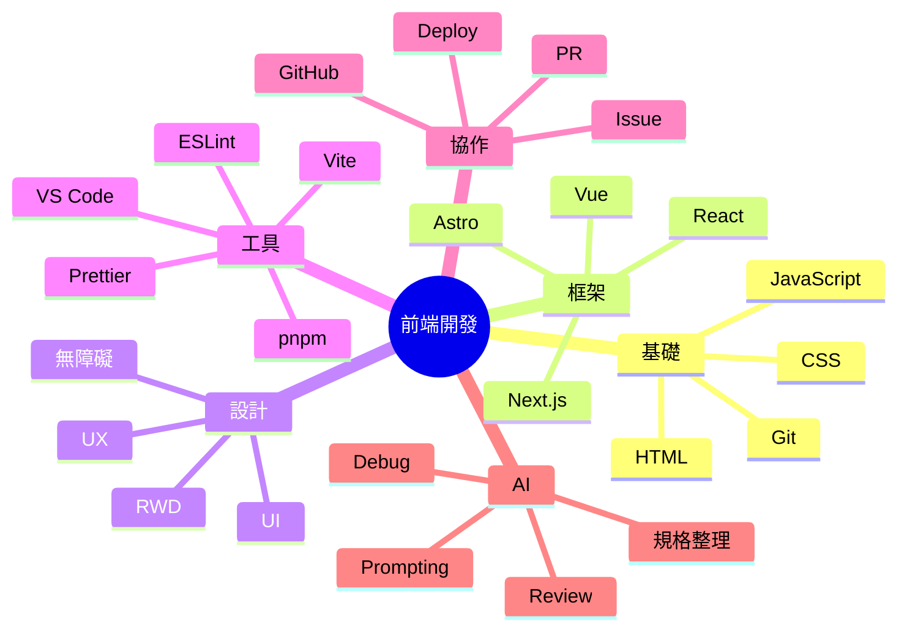
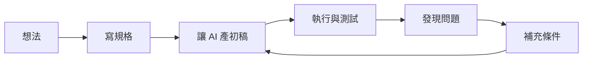

---

# AI 協作前端開發入門

毛哥EM

<div class="mt-6 opacity-80">
從零開始做出個人網站，理解現代前端與 AI 協作流程
</div>

---
layout: section
---

## 課程 2

現代網頁架構、AI 協作流程與個人專案實作

---

## 課程 2 重點

- 常見前端框架與差異
- React 檔案架構
- LLM / Chatbot / Agent 基本觀念
- Markdown 與規格整理
- 工具比較與串接
- 用 AI 規劃並完成個人專案
- 再次部署與整理成作品

---

## 現代前端的世界長什麼樣？

以前：

- HTML / CSS / JS
- jQuery
- 傳統模板

現在：

- 元件化開發
- 框架 / SSR / SSG / Islands
- 設計系統
- 套件生態
- AI 輔助開發
- 雲端部署與自動化

---

## 常見前端框架比較

| 技術    | 特點               | 適合什麼               |
| ------- | ------------------ | ---------------------- |
| React   | 生態最大、彈性高   | 大量職缺、元件思維     |
| Vue     | 容易上手、語法直觀 | 入門與中小型專案       |
| Angular | 完整度高、規範強   | 大型企業系統           |
| Next.js | React 全端框架     | SEO、SSR、部署便利     |
| Astro   | 內容型網站強       | 部落格、作品集、文件站 |

---

## 框架到底幫你解決什麼？

- 元件重用
- 狀態管理
- 路由
- 建置流程
- SSR / SSG
- 與資料串接
- 專案規模變大後的可維護性

> 靜態網站不一定要用框架  
> 但現代開發很常會碰到

---

## 先用一句話理解它們

- **React**：UI 元件函式化
- **Vue**：模板直覺、上手快
- **Angular**：完整、重型、規範導向
- **Next.js**：React + routing + server 能力
- **Astro**：內容為主，預設少送 JS

---

## 如果我是初學者，怎麼選？

- 想先懂網頁本質：**先學 HTML / CSS / JS**
- 想接職缺最多的主流：**React / Next.js**
- 想快速上手框架：**Vue**
- 想做作品集 / 部落格：**Astro**
- 想做大型企業系統：之後再看 **Angular**

---

## React 在想什麼？

React 的核心心法：

- UI = state 的函式
- 把畫面拆成元件
- 資料往下傳
- 互動透過事件更新 state
- 畫面依 state 重新渲染

---

## React 元件最小範例

```jsx
function ProfileCard() {
	return (
		<section>
			<h2>毛哥EM</h2>
			<p>Frontend Developer</p>
		</section>
	);
}

export default ProfileCard;
```

---

## React 檔案架構範例

```txt
src/
├─ components/
│  ├─ layout/
│  ├─ ui/
│  └─ sections/
├─ pages/
├─ hooks/
├─ lib/
├─ assets/
├─ styles/
└─ App.jsx
```

說人話版本：

- `components`：可重用元件
- `pages`：頁面
- `hooks`：自訂邏輯
- `lib`：工具函式
- `assets`：圖片 / icons
- `styles`：樣式

---

## 元件化的好處

假設你有 10 張作品卡片：

如果每張都手刻一次，很難改  
如果做成 `<ProjectCard />`，就可以重複用

```jsx
<ProjectCard title="作品 A" desc="活動網站" />
<ProjectCard title="作品 B" desc="個人作品集" />
<ProjectCard title="作品 C" desc="互動實驗" />
```

---

## 現代前端常見能力圖



---
layout: section
---

## 部署到 Vercel

---

## 為什麼選 Vercel？

- 對前端專案友善
- 連 GitHub 很方便
- 自動部署
- 對靜態網站、Next.js 支援很好
- 免費方案對學生與個人作品很夠用

---

## Vercel 基本部署流程

1. 把專案 push 到 GitHub
2. 登入 Vercel
3. 匯入 GitHub repository
4. 按下 Deploy
5. 拿到公開網址
6. 之後每次 push 都可自動更新

---
layout: section
---

## AI 類：原理、限制、工作流

---

## Chatbot / LLM 是什麼？

LLM（大型語言模型）本質上是在做：

- 根據上下文預測下一段最可能的內容
- 能理解與生成文字
- 可寫 code、整理內容、轉換格式、摘要資訊

但它不是全知全能，也不是絕對正確。

---

## LLM 常見限制

- 會掰答案（hallucination）
- 會漏條件
- 會產生看似合理但不能跑的 code
- 上下文太長時可能忽略前面資訊
- 不一定理解你的真實需求
- 若沒有即時工具，知識可能過時

> 所以工程師的價值變成：**定義問題與驗證結果**

---

## Chatbot vs Agent

| 類型    | 特徵                                       |
| ------- | ------------------------------------------ |
| Chatbot | 主要靠對話，一來一回回答問題               |
| Agent   | 會更主動地拆任務、使用工具、執行多步驟流程 |

簡化理解：

- Chatbot 比較像「會講話的助手」
- Agent 比較像「會做事的助手」

---

## AI 可以在哪些地方幫你？

- 文案整理
- 畫面結構建議
- 產生 HTML / CSS / JS 初稿
- Debug
- 寫 commit message
- 產生 README
- 整理規格
- 拆分待辦清單

---

## AI 不應該直接取代你的部分

- 最終需求判斷
- 是否符合真實使用情境
- 是否可信
- 是否安全
- 是否可維護
- 是否真的像你本人風格

---

## 初學者最實用的 AI 使用原則

1. 先說清楚目標
2. 再補上下文
3. 指定輸出格式
4. 讓 AI 先產初稿
5. 自己測試與迭代
6. 每次只改一小塊

---

## 好 prompt 長什麼樣？

```md
請幫我做一個單頁個人網站。

需求：

- 風格：深色、簡潔、科技感
- 區塊：hero / about / skills / projects / contact
- 技術：HTML + CSS + JS
- 限制：不要用外部框架
- 目標：適合學生作品集、支援手機版
- 輸出：分成 index.html / style.css / script.js
```

---

## 更好的 prompt：加入評估標準

```md
請幫我輸出一版個人網站程式碼，並符合以下標準：

- 語意化 HTML
- CSS 結構清楚
- 手機版可用
- 不要過度炫技
- 先求穩定能跑
- 每段程式加簡短註解
```

> AI 不只會做  
> 也可以要求它解釋自己為什麼這樣做

---

## 如何跟 AI 一起 debug？

你可以提供：

- 錯誤訊息
- 目前程式碼
- 預期行為
- 實際行為
- 你已經試過什麼

範例：

```md
這段 JS 點擊按鈕沒有反應。請幫我找出原因，並說明你修改了哪裡、為什麼。
```

---

## AI 協作不是一次出完，而是迭代



---

## 平台怎麼選？

| 平台                  | 你可以拿來做什麼               |
| --------------------- | ------------------------------ |
| ChatGPT               | 規劃、生成、整理、解釋、修正   |
| Claude                | 長文整理、規格撰寫、結構化內容 |
| GitHub Copilot        | 在編輯器中補全與局部生成       |
| Cursor / 類 IDE Agent | 與程式碼庫更緊密整合           |
| CLI Agent 類工具      | 終端機與專案層級協作           |

> 不同工具不是互斥，而是適合不同工作階段

---
layout: section
---

## Markdown：最重要的基礎格式之一

---

## 為什麼要學 Markdown？

因為它幾乎到處都會出現：

- README
- 筆記
- 文件站
- PR 描述
- AI prompt 素材
- Slidev 簡報
- issue / 規格書

---

## Markdown 常用語法

```md
# 大標題

## 小標題

- 清單 1
- 清單 2

1. 步驟一
2. 步驟二

[連結](https://example.com)

`inline code`
```

---

## 程式碼區塊

````md
```js
const name = "Mao";
console.log(name);
```
````

> 在寫技術文件時非常常用

---

## 表格與引用

```md
| 技術 | 用途 |
| ---- | ---- |
| HTML | 結構 |
| CSS  | 樣式 |

> 這是一段引用
```

---

## Markdown 在 AI 協作中的用途

你可以用 Markdown 來寫：

- 專案需求
- 頁面架構
- 功能清單
- 待辦事項
- 開發筆記
- 最終 README

這會讓 AI 比較容易讀懂你的上下文。

---

## 一份簡單 spec 可以長這樣

```md
# 個人作品網站規格

## 目標

建立一個能展示自我介紹與作品的單頁網站

## 受眾

老師、同學、實習面試官

## 區塊

- Hero
- About
- Skills
- Projects
- Contact

## 風格

簡潔、現代、深色、留白感

## 技術限制

- HTML / CSS / JS
- 不使用外部框架
```

---

## 為什麼規格重要？

因為 AI 很會補空白。  
你講得越模糊，它補得越隨機。

規格的價值：

- 對齊需求
- 降低誤解
- 方便拆工
- 方便驗收
- 方便之後繼續改

---
layout: section
---

## 工具比較與串接

---

## 常見工作型態比較

| 型態        | 優點               | 適合什麼               |
| ----------- | ------------------ | ---------------------- |
| Web Chat    | 快速提問、整理想法 | 需求發散、學習、除錯   |
| IDE 裡的 AI | 直接改程式碼       | 局部生成、補完、重構   |
| CLI 工具    | 接近專案與指令流程 | 建置、批次操作、工程化 |

---

## Codex App / IDE / CLI 可以怎麼理解？

- **App / Web**：比較像顧問，適合討論與規劃
- **IDE**：比較像坐在你旁邊一起改 code
- **CLI**：比較像進到工作現場直接操作工具鏈

這三種其實可以串成一條流程。

---

## 一個實務工作流範例

1. 在 ChatGPT / Claude 整理規格
2. 把 spec 丟進 IDE / Copilot 幫忙起草
3. 用終端機跑專案與測試
4. 用 Git 記錄進度
5. push 到 GitHub
6. 用 Vercel 部署
7. 再回頭讓 AI 幫你寫 README / 優化文案

---

## MCP 是什麼？

你可以先用很實用的角度理解：

> 讓 AI 可以透過標準方式接上外部工具與資料來源

例如：

- 檔案系統
- 資料庫
- API
- GitHub
- 瀏覽器工具
- 文件系統

重點不是背縮寫，  
而是理解 **AI 能不能拿到正確上下文與工具**

---

## MCP 的價值

如果 AI 只能聊天，它只能猜。  
如果 AI 能讀檔案、查專案、跑工具，它就比較能做事。

所以從 Chatbot 走向 Agent，  
核心之一就是：**工具使用能力**

---

## 工具選型原則

不要一開始裝一堆工具，  
先問自己：

- 我現在最常卡在哪？
- 我需要的是產 code、改 code、還是整理規格？
- 我需要的是快速、穩定、還是可控？
- 我能不能驗證它產生的內容？

---

## 給學生的最小可行組合

- VS Code
- GitHub Copilot 或常用 LLM 平台
- GitHub
- Vercel
- Node.js + pnpm

進階再加：

- React / Next.js / Astro
- ESLint / Prettier
- 設計系統
- Agent / CLI 工具

---
layout: section
---

## 實作：用 AI 做個人專案

---

## 什麼叫做「個人專案」？

不是一定要超大。

重點是：

- 有清楚目標
- 有明確受眾
- 有完成度
- 能展示你的想法與能力

---

## 適合學生的個人專案題目

- 個人作品集網站
- 社團活動頁
- 課表 / 待辦工具
- 學習筆記網站
- 展覽 / 活動介紹頁
- 簡單作品展示平台
- 自介 landing page

---

## 開始前先做架構規劃

### 需求層

- 情境是什麼？
- 目標是什麼？
- 畫面有哪些區塊？
- 使用者會做什麼操作？

### 開發層

- 要有哪些檔案？
- 元件怎麼拆？
- 功能優先順序？
- 哪些先做、哪些可加分？

---

## SDD / Spec-Driven Development

先規格，後開發。

因為你先把以下內容講清楚：

- 這是給誰用？
- 需要解決什麼問題？
- 成功標準是什麼？
- 功能有哪些？
- 不做哪些東西？

這樣 AI 才比較不會亂長。

---

## 一份更完整的專案規格範例

```md
# 專案：學生個人作品集網站

## 目標

用來展示自我介紹、技能、作品、聯絡方式

## 受眾

實習面試官、社團學弟妹、合作對象

## 頁面

- 首頁

## 區塊

- Hero
- About
- Skills
- Projects
- Contact
- Footer

## 功能

- 主題切換
- 導覽列錨點
- 專案卡 hover
- 手機版支援

## 非目標

- 不做後台
- 不做登入
- 不串資料庫
```

---

## 任務分解怎麼做？

把一個大專案拆成小步驟：

1. 建專案
2. 寫首頁 HTML
3. 補 CSS
4. 做手機版
5. 加上互動效果
6. 整理內容
7. Git commit
8. 部署
9. 寫 README

> 每一步都能交給 AI 幫忙，但你要會驗收

---

## 你可以這樣請 AI 幫你拆任務

```md
請把這個個人網站專案拆成 10 個可執行的小任務，每個任務都要清楚說明輸出成果與驗收標準。
```

---

## AI 合作時的三層提示法

### 1. 情境

我是資工系學生，要做一個面向實習面試官的作品集網站

### 2. 目標

希望網站簡潔、可信、能快速理解我做過什麼

### 3. 約束

使用 HTML/CSS/JS，不使用大型框架，手機版要正常

---

## 如果要進到框架專案

例如使用 Vite + React：

```bash
pnpm create vite my-portfolio --template react
cd my-portfolio
pnpm install
pnpm dev
```

如果今天時間有限，  
也可以維持純 HTML 版本，先把作品做完。

---

## Opencode 安裝與定位

如果課堂會帶到 Opencode，可這樣介紹：

- 它是一種幫助你更快與程式碼互動的工具
- 可用來協助閱讀、修改、整理專案
- 核心重點不是工具名字，而是 **你怎麼管理上下文與驗證輸出**

> 安裝步驟可依當下版本與平台補充示範

---

## 開發時最重要的不是一直生成

而是這四件事：

- **規劃**
- **驗證**
- **整理**
- **重構**

AI 很適合幫你跨過空白頁，  
但專案成熟靠的是反覆整理。

---

## 專案驗收清單

- [ ] 需求有被滿足嗎？
- [ ] 網站打得開嗎？
- [ ] 手機版正常嗎？
- [ ] 內容像你本人嗎？
- [ ] 程式結構你看得懂嗎？
- [ ] GitHub 有紀錄嗎？
- [ ] 可公開分享嗎？

---

## README 應該至少寫什麼？

```md
# 我的個人網站

## 專案簡介

這是一個用來展示個人介紹與作品的單頁網站

## 技術

- HTML
- CSS
- JavaScript

## 功能

- RWD
- 導覽列
- 專案展示

## 部署

Vercel
```

---

## 個人專案要怎麼講給別人聽？

不要只說：

- 我做了一個網站

要說：

- 我為什麼做這個
- 給誰用
- 解決什麼問題
- 我做了哪些設計與技術選擇
- 如果繼續做，下一步會做什麼

---

## 最後一哩路：部署與展示

作品完成後：

1. push 到 GitHub
2. 部署到 Vercel
3. 把網址放到
   - GitHub repo
   - 個人簡介
   - 履歷
   - Linktree / 社群
4. 持續更新

> 沒有公開網址的作品，存在感會低很多

---
layout: statement
---

# AI 不會取代會用 AI 的人

但會淘汰沒有流程的人

---

## 兩堂課結束後，你應該帶走什麼？

- 一個已上線的個人網站 / 專案
- 一套基本前端開發地圖
- 一套 AI 協作的最小工作流
- 知道如何繼續往 React / Next.js / Astro 前進
- 知道怎麼把作品整理成能展示的形式

---

## 下一步建議

### 先做熟

- 多改自己的個人網站
- 練習 Git commit
- 多寫 README
- 練習請 AI 幫你 debug

### 再進階

- React / Next.js / Astro
- API 串接
- 表單處理
- 元件化設計
- 更完整的部署流程

---

## 課後練習建議

1. 把今天作品補到可公開分享
2. 新增 2 個專案卡片
3. 做手機版優化
4. 寫 README
5. 用 AI 幫你把文案改成更像你
6. 試著把純 HTML 版重做成 React 版

---

## Q&A

---
layout: center
---

本投影片由 [毛哥EM](https://elvismao.com/) 製作  
採用創用 CC「[姓名標示 4.0 國際](https://creativecommons.org/licenses/by/4.0/deed.zh-hant)」授權


[毛哥EM資訊密技](https://emtech.cc/) · [毛哥EM公開簡報](https://g.elvismao.com/slides)
