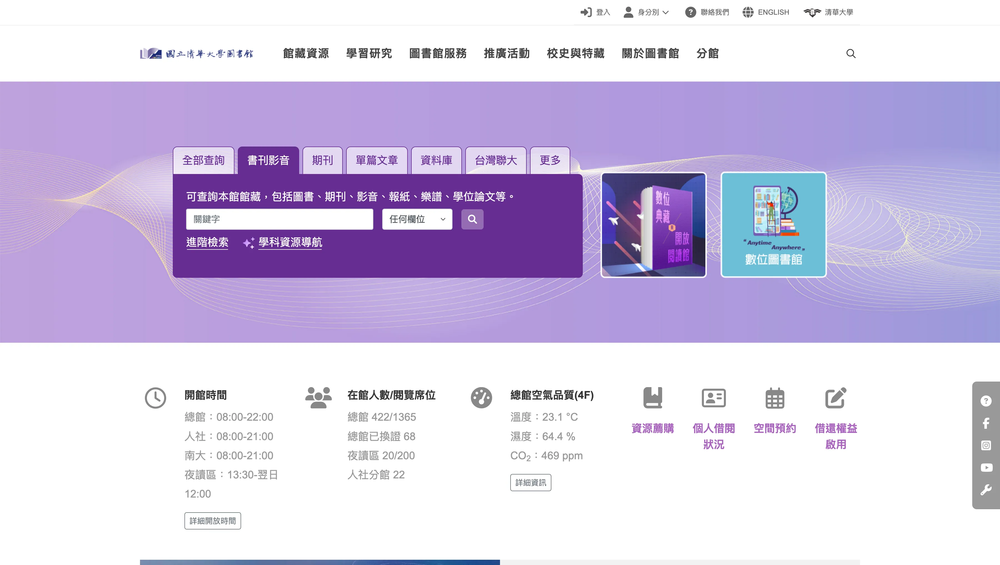
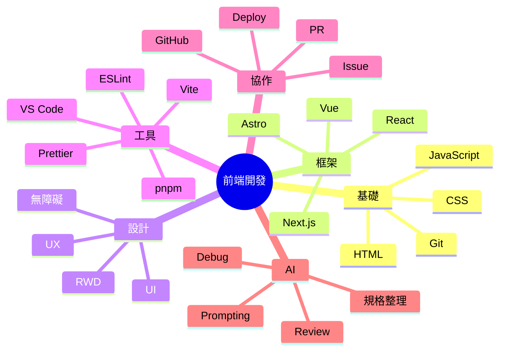
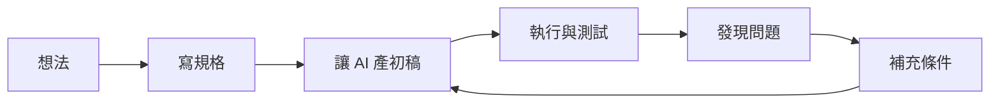
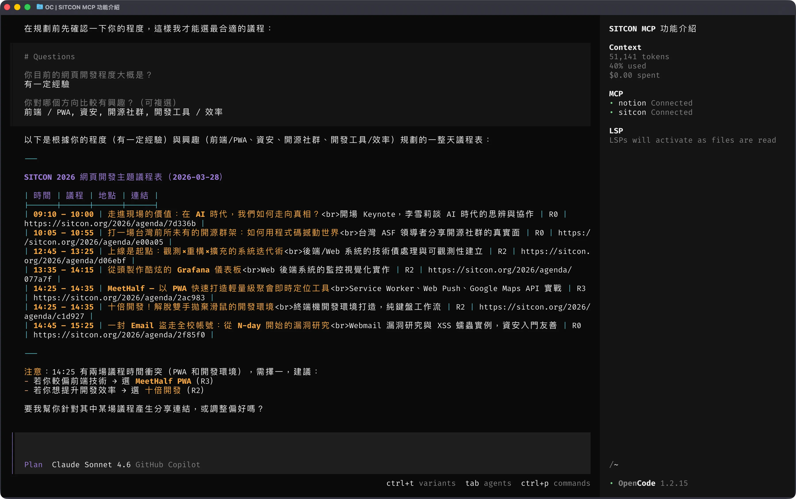

# AI 協作前端開發入門 2

毛哥EM

<div class="mt-6 opacity-80">
從零開始做出個人網站，理解現代前端與 AI 協作流程
</div>

---
layout: section
---

## 課程 2

現代網頁架構、AI 協作流程與個人專案實作

---

## 課程 2 重點

- 常見前端框架與差異
- React 檔案架構
- LLM / Chatbot / Agent 基本觀念
- Markdown 與規格整理
- 工具比較與串接
- AI Skills 與 MCP

---
layout: statement
---

## 我們要一直用重複的東西欸



---
layout: statement
title: "如果沒有元件化，我們就要一直複製貼上"
---

難道我要一直複製貼上嗎？

---
layout: statement
title: "改一個東西全部都要改欸..."
---

改一個東西全部都要改欸...

---

## Component - 發明自己的 HTML

React 中假設你有 10 張作品卡片：

如果每張都手刻一次，很難改  
如果做成 `<ProjectCard />`，就可以重複用

```jsx
<ProjectCard title="作品 A" desc="活動網站" />
<ProjectCard title="作品 B" desc="個人作品集" />
<ProjectCard title="作品 C" desc="互動實驗" />
```

---

## 現代前端的世界長什麼樣？

<div class="flex gap-30 mt-12">
<div>
以前：

- HTML / CSS / JS
- jQuery
- 傳統模板
</div>
<div>
現在：

- 元件化開發
- 框架 / SSR / SSG / Islands
- 設計系統
- 套件生態
- **AI 輔助開發**
- **雲端部署與自動化**

</div>
</div>

---

## 常見前端框架比較

其實 React、Vue、Angular 更多是信仰問題。選自己用的順手就好了。

- **React**：UI 元件函式化。生態豐富要什麼自己裝
- **Vue**：模板直覺、上手快
- **Angular**：完整、重型、規範導向
- **Next.js**：幫你裝好一堆套件的 React（內建 routing + server 能力）
- **Astro**：內容為主，適合靜態網站，支援多框架

---

## 框架到底幫你解決什麼？

- 元件重用
- 狀態管理
- 路由
- 建置流程
- SSR / SSG
- 與資料串接
- 專案規模變大後的可維護性

---

## 如果我是初學者，怎麼選？

- \*一定要先懂網頁本質：**先學 HTML / CSS / JS\***
- 想做作品集 / 部落格這種靜態網頁：**Astro**
- 想接職缺最多的主流：**React / Next.js / Vue**
- 想做大型企業系統／公司需要：**Angular**

---

## React 在想什麼？

React 的核心心法：

- UI = state 的函式
- 把畫面拆成元件
- 資料往下傳
- 互動透過事件更新 state
- 畫面依 state 重新渲染

---

## React 元件最小範例

```jsx
function ProfileCard() {
	return (
		<section>
			<h2>毛哥EM</h2>
			<p>Frontend Developer</p>
		</section>
	);
}

export default ProfileCard;
```

---

## 初始化

例如使用 Vite + React：

```bash
pnpm create vite my-portfolio --template react
cd my-portfolio
pnpm install
pnpm dev
```

---

## 元件化的好處

假設你有 10 張作品卡片：

如果每張都手刻一次，很難改  
如果做成 `<ProjectCard />`，就可以重複用

```jsx
<ProjectCard title="作品 A" desc="活動網站" />
<ProjectCard title="作品 B" desc="個人作品集" />
<ProjectCard title="作品 C" desc="互動實驗" />
```

---

## React 檔案架構範例

```bash
src/
├─ components/ #可重用元件
│  ├─ layout/
│  ├─ ui/
│  └─ sections/
├─ pages/ #頁面
├─ hooks/ #自訂邏輯
├─ lib/ #工具函式
├─ assets/ #圖片 / icons
├─ styles/ #樣式
└─ App.jsx
```

---

<div class="pl-10">
<div class="absolute left-10 top-10">現代前端常見能力圖（非常簡略）</div>



</div>

---
layout: section
---

## 部署到 Vercel

---

## 為什麼選 Vercel？

- 對前端專案友善
- 連 GitHub 很方便
- 自動部署
- 對靜態網站、Next.js 支援很好
- 免費方案對學生與個人作品很夠用

> 小心用太多會很貴，不過個人使用不容易要花錢

---

## Vercel 基本部署流程

https://vercel.com/

1. 把專案 push 到 GitHub
2. 登入 Vercel
3. 匯入 GitHub repository
4. 按下 Deploy
5. 拿到公開網址
6. 之後每次 push 都可自動更新

---
layout: section
---

## AI 類：原理、限制、工作流

---
layout: statement
---

## _prompt, paste, and pray?_

---

## Chatbot / LLM 是什麼？

LLM（大型語言模型）本質上是在做：

- 根據上下文預測下一段最可能的內容
- 能理解與生成文字
- 可寫 code、整理內容、轉換格式、摘要資訊

所以它不是全知全能，也不是絕對正確。

---

## LLM 常見限制

- 會掰答案（hallucination）
- 會漏條件
- 會產生看似合理但不能跑的 code
- 上下文太長時可能忽略前面資訊
- 不一定理解你的真實需求
- 若沒有即時工具，知識可能過時

> 所以工程師很重要的工作是：**定義問題與驗證結果**

---

## Chatbot vs Agent

| 類型    | 特徵               |
| ------- | ------------------ |
| Chatbot | 空出一張嘴         |
| Agent   | 話更多，不過會做事 |

---

## AI 可以在哪些地方幫你？

_額就所有地方_

- 整理規格
- 文案整理
- 畫面結構建議
- 拆分待辦清單
- 產生初稿
- Debug
- 寫 commit message
- 產生 README

---

## AI 不應該直接取代你的部分

- 最終需求判斷
- 是否符合真實使用情境
- 是否可信
- 是否安全
- 是否可維護
- 是否符合你的風格

---

## 五種發展模型

- **完全自動化：** 人類給出高階目標，代理自行規劃與實作，適合批量任務或實驗性專案，但風險與不確定性極高。

- **迭代式對話協作：** 人類與代理透過多輪對話細化需求、改寫程式與修 bug，是目前主流的實務形態。

- **規劃導向：** 代理先產生分解計畫（例如 CoT/ToT），再依計畫生成程式碼，可提升結構化與可維護性。

- **測試導向：** 以單元測試與自動化測試為核心評估訊號，代理持續改寫直至測試通過，貼近 TDD 思維。

- **加強上下文模型：** 強調 RAG、長期記憶與專案知識管理，以減少「模型不知道全局」造成的錯誤與重工。

---

## 實用的 AI 使用原則

1. **先說清楚目標**
2. 指定輸出格式
3. 讓 AI 先產初稿
4. 自己測試與迭代

---

## 好 prompt 長什麼樣？

請幫我做一個**深色、簡潔、科技感**的**單頁**個人網站來**展示我的專案**，給**實習面試**官看。包含 **hero / about / skills / projects / contact**。使用 **HTML + CSS + JS**，**不要用外部框架**，要同時支援**電腦和手機版**。請分成 index.html / style.css / script.js **三個檔案**。

- 需求：一個個人作品集網站
- 目的：展示專案給實習面試官
- 風格：深色、簡潔、科技感
- 區塊：hero / about / skills / projects / contact
- 技術：HTML + CSS + JS
- 限制：不要用外部框架
- 目標：支援電腦和手機版
- 輸出：分成 index.html / style.css / script.js

---

## 如何跟 AI 一起 debug？

你可以提供：

- 錯誤訊息
- 預期行為
- 實際行為
- 你已經試過什麼
- 檔案在哪／目前程式碼
- 他可能需要看的文件（如果有的話）

---



---

## 典型工作流：從規格到代碼

### 規格對話階段

- 用自然語言與 LLM 來回討論需求、邊界條件、非功能性需求（效能、安全、相容性等）。
- 最終產出一份可讀的「開發說明/設計草稿」，作為後續 AI 產碼與人工審查的共同依據。

### 架構與模組設計

- 要求 LLM 先畫出架構圖、模組分解與資料流，再逐模組生成程式碼，避免一次生成 monolith。
- 對每個模組明確指定介面（函式簽章、事件、API schema），提高後續 refactor 與替換的彈性。

---

### 程式碼生成與本地驗證

- 在支援 LLM 的 IDE（如 Cursor、Copilot Chat、Claude Code、ChatGPT in IDE）中選定檔案或專案範圍，讓模型產生或修改程式碼。
- 立刻跑測試、lint 與型別檢查，將錯誤訊息與 log 貼回對話中要求修正。

### 迭代與 refactor

- 當功能通了之後，再用「請重構以下檔案以符合某某架構/設計原則」之類的 prompt 要求模型整理程式碼。
- 在重要路徑上人工做一次 code review，必要時手動重寫關鍵區塊。

---

## 平台怎麼選？

- ChatGPT / Claude 是模型
  - 他們自己也有出 IDE 插件或 CLI 工具，但也可以用在其他平台
- GitHub Copilot / Cursor 是把模型放在 IDE 裡
- Open Code 等等 Cli Agent 是把模型放在終端機裡

用習慣的就好，個人經驗是**除了 GPT Web Dev 很爛建議用 Claude** 以外其他都很聰明了。

---
layout: section
---

## Markdown：最重要的基礎格式之一

---

## 為什麼要學 Markdown？

因為它幾乎到處都會出現：

- README
- 筆記
- 文件站
- PR 描述
- AI prompt 素材
- Slidev 簡報
- issue / 規格書

---

## Markdown 常用語法

```md
# 大標題

## 小標題

- 清單 1
- 清單 2

1. 步驟一
2. 步驟二

[連結](https://example.com)

`inline code`
```

---

## 程式碼區塊

````md
```js
const name = "Mao";
console.log(name);
```
````

---

## 表格與引用

```md
| 技術 | 用途 |
| ---- | ---- |
| HTML | 結構 |
| CSS  | 樣式 |

> 這是一段引用
```

---

## Markdown 在 AI 協作中的用途

你可以用 Markdown 來寫：

- 專案需求
- 頁面架構
- 功能清單
- 待辦事項
- 開發筆記
- 最終 README

這會讓 AI 比較容易讀懂你的上下文。

---

## 一份簡單 spec 可以長這樣

```md
# 個人作品網站規格

## 目標

建立一個能展示自我介紹與作品的單頁網站

## 受眾

老師、同學、實習面試官

## 區塊

- Hero
- About
- Skills
- Projects
- Contact
```

---

## 為什麼規格重要？

因為 AI 很會補空白。  
你講得越模糊，它補得越隨機。

規格的價值：

- 對齊需求
- 降低誤解
- 方便拆工
- 方便驗收
- 方便之後繼續改

---
layout: section
---

## 工具比較與串接

---

## 常見工作型態比較

| 型態        | 優點 | 適合什麼 |
| ----------- | ---- | -------- |
| Web Chat    |      |          |
| IDE 裡的 AI |      |          |
| CLI 工具    |      |          |

**沒什麼好比的你爽就好。**

---

## Agent.md

- 在 Claude Code 叫做 `CLAUDE.md`，OpenCode 兩個都會找。
- 就只是個 README Preprompt，告訴他工作規則。
- Claude 官方甚至建議直接 `@README.md`。

---
layout: section
---

## Skills & MCP

讓 AI 能做更多事。

---

## 要做更多事的話他就得要

- 有手：用 MCP 操作工具
- 有腦：讀書，給他技能（Skills）

---
layout: section
---

## Skills

讓 AI 學會新的技能

---

### 背後長怎樣？

一個 Skills 的基本結構很簡單，至少需要一個 SKILL.md 檔案：

```
skill-name/
└── SKILL.md
```

這個 SKILL.md 檔案開頭必須包含一段 YAML frontmatter：

```
---
name: skill-name
description: A description of what this skill does and when to use it.
---
```

---

如果你的 Skills 比較複雜，需要額外的腳本或參考資料，可以建立這樣的目錄結構：

```
skill-name/
├── SKILL.md      # 必要的
├── scripts/      # 可執行的程式碼（Python、Bash、JavaScript）
├── references/   # 額外的參考文件
└── assets/       # 靜態資源（範本、圖片、資料檔）
```

> 更多規範可以參考：https://agentskills.io

---


---

## 很重要嗎？

你要寫的爛 Code 如果很間單的話 GPT 直接就能寫出來了。如果要用的東西很冷門或是很新的話建議可以使用。

---

## 實際使用範例：

- 實用工具合集：https://github.com/blencorp/claude-code-kit
- 我做簡報用的 Slidev：https://sli.dev/guide/work-with-ai

以 Slidev 為例，安裝方式為：

```bash
pnpx skills add slidevjs/slidev
```

接下來你在和 AI 溝通時他就會在需要時自己去查資料囉！

---
layout: section
---

## MCP

給他工具

---

## MCP 是什麼？

讓 AI 可以透過標準方式接上外部工具與資料來源

例如：

- 檔案系統
- 資料庫
- API
- GitHub
- 瀏覽器工具
- 文件系統

讓 Chatbot 走向 Agent 獲得**工具使用能力**

---

## 很重要嗎？

其實重要的基本上都內建好了：

- 寫文件
- 操作終端機
- 上網

---

```
  opencode mcp add            add an MCP server
  opencode mcp list           list MCP servers and their status
  opencode mcp auth [name]    authenticate with an OAuth-enabled MCP server
  opencode mcp logout [name]  remove OAuth credentials for an MCP server
  opencode mcp debug <name>   debug OAuth connection for an MCP server
```

---

## 範例：連接 Notion

```
opencode mcp auth notion
```

---

## 範例：使用 SITCON MCP 來讀取專案文件

在你的專案根目錄（或 ~/.config/opencode/opencode.json 作為全域設定）中加入以下內容：

```yaml
{ "$schema": "https://opencode.ai/config.json", "mcp": { "sitcon": { "type": "remote", "url": "https://mcp.sitcon.org/mcp", "enabled": true } } }
```

---
layout: statement
---

啟動 OpenCode，即可開始使用！



---

## 總結

### 事前

- 先跟 Chatbot 討論完再執行
- 用好工具：
  - OpenCode / Claude Code
- 把你要做什麼事情講清楚，寫好規格跟需求
- AI 記憶力很有限話不要太多，用完就扔
- 要用很新很小眾的東西建議給 Skills
- 記得自行檢查，實在無法請 AI 詳細檢查
- 不要把 Token 寫進 Code 裡！
- **重要的事花錢交給專業的**

---
src: ../global/cc.md
---
