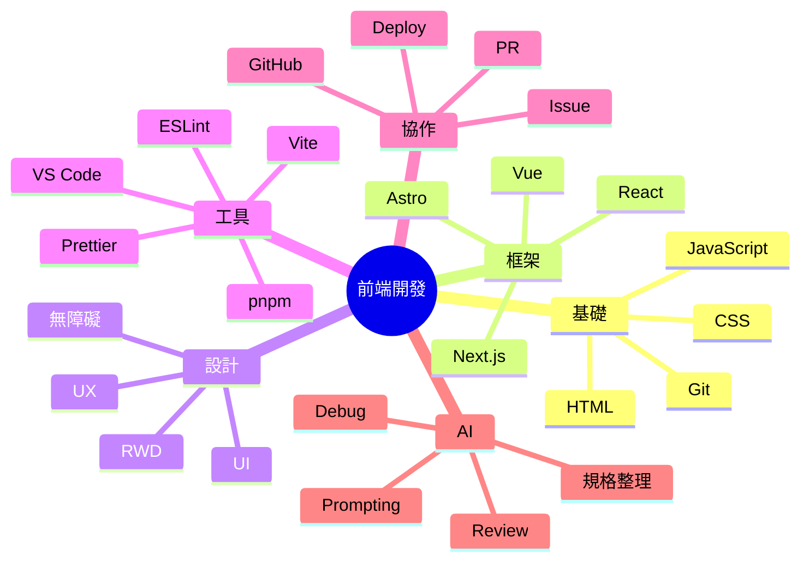
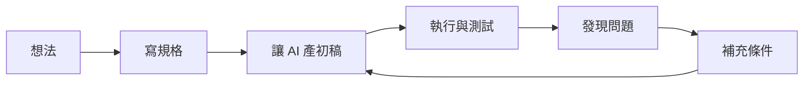

# AI 協作前端開發入門 2

毛哥EM

<div class="mt-6 opacity-80">
從零開始做出個人網站，理解現代前端與 AI 協作流程
</div>

---
layout: section
---

## 課程 2

現代網頁架構、AI 協作流程與個人專案實作

---

## 課程 2 重點

- 常見前端框架與差異
- React 檔案架構
- LLM / Chatbot / Agent 基本觀念
- Markdown 與規格整理
- 工具比較與串接
- 用 AI 規劃並完成個人專案
- 再次部署與整理成作品

---

## 我們要一直用重複的東西欸


---
layout: quote
---

難道我要一直複製貼上嗎？

---
layout: quote
---

改一個東西全部都要改欸...

---

React 中假設你有 10 張作品卡片：

如果每張都手刻一次，很難改  
如果做成 `<ProjectCard />`，就可以重複用

```jsx
<ProjectCard title="作品 A" desc="活動網站" />
<ProjectCard title="作品 B" desc="個人作品集" />
<ProjectCard title="作品 C" desc="互動實驗" />
```

---

## 現代前端的世界長什麼樣？

<div class="flex gap-30 mt-12">
<div>
以前：

- HTML / CSS / JS
- jQuery
- 傳統模板
</div>
<div>
現在：

- 元件化開發
- 框架 / SSR / SSG / Islands
- 設計系統
- 套件生態
- AI 輔助開發
- 雲端部署與自動化

</div>
</div>

---

## 常見前端框架比較

其實 React、Vue、Angular 更多是信仰問題。

- **React**：UI 元件函式化。生態豐富要什麼自己裝
- **Vue**：模板直覺、上手快
- **Angular**：完整、重型、規範導向
- **Next.js**：React + routing + server 能力
- **Astro**：內容為主，預設少送 JS

---

## 框架到底幫你解決什麼？

- 元件重用
- 狀態管理
- 路由
- 建置流程
- SSR / SSG
- 與資料串接
- 專案規模變大後的可維護性

---

## 如果我是初學者，怎麼選？

- 一定要先懂網頁本質：**先學 HTML / CSS / JS**
- 想做作品集 / 部落格這種靜態網頁：**Astro**
- 想接職缺最多的主流：**React / Next.js**
- 想快速上手框架：**Vue**
- 想做大型企業系統／公司需要：**Angular**

---

## React 在想什麼？

React 的核心心法：

- UI = state 的函式
- 把畫面拆成元件
- 資料往下傳
- 互動透過事件更新 state
- 畫面依 state 重新渲染

---

## React 元件最小範例

```jsx
function ProfileCard() {
	return (
		<section>
			<h2>毛哥EM</h2>
			<p>Frontend Developer</p>
		</section>
	);
}

export default ProfileCard;
```

---

## 初始化

例如使用 Vite + React：

```bash
pnpm create vite my-portfolio --template react
cd my-portfolio
pnpm install
pnpm dev
```

---

## React 檔案架構範例

```txt
src/
├─ components/ #可重用元件
│  ├─ layout/
│  ├─ ui/
│  └─ sections/
├─ pages/ #頁面
├─ hooks/ #自訂邏輯
├─ lib/ #工具函式
├─ assets/ #圖片 / icons
├─ styles/ #樣式
└─ App.jsx
```

---

## 元件化的好處

假設你有 10 張作品卡片：

如果每張都手刻一次，很難改  
如果做成 `<ProjectCard />`，就可以重複用

```jsx
<ProjectCard title="作品 A" desc="活動網站" />
<ProjectCard title="作品 B" desc="個人作品集" />
<ProjectCard title="作品 C" desc="互動實驗" />
```

---

<div class="pl-10">
<div class="absolute left-20 top-10">現代前端常見能力圖</div>



</div>

---
layout: section
---

## 部署到 Vercel

---

## 為什麼選 Vercel？

- 對前端專案友善
- 連 GitHub 很方便
- 自動部署
- 對靜態網站、Next.js 支援很好
- 免費方案對學生與個人作品很夠用

---

## Vercel 基本部署流程

https://vercel.com/

1. 把專案 push 到 GitHub
2. 登入 Vercel
3. 匯入 GitHub repository
4. 按下 Deploy
5. 拿到公開網址
6. 之後每次 push 都可自動更新

---
layout: section
---

## AI 類：原理、限制、工作流

---

## Chatbot / LLM 是什麼？

LLM（大型語言模型）本質上是在做：

- 根據上下文預測下一段最可能的內容
- 能理解與生成文字
- 可寫 code、整理內容、轉換格式、摘要資訊

所以它不是全知全能，也不是絕對正確。

---

## LLM 常見限制

- 會掰答案（hallucination）
- 會漏條件
- 會產生看似合理但不能跑的 code
- 上下文太長時可能忽略前面資訊
- 不一定理解你的真實需求
- 若沒有即時工具，知識可能過時

> 所以工程師的價值變成：**定義問題與驗證結果**

---

## Chatbot vs Agent

| 類型    | 特徵                                       |
| ------- | ------------------------------------------ |
| Chatbot | 主要靠對話，一來一回回答問題               |
| Agent   | 會更主動地拆任務、使用工具、執行多步驟流程 |

---

## AI 可以在哪些地方幫你？

- 文案整理
- 畫面結構建議
- 產生 HTML / CSS / JS 初稿
- Debug
- 寫 commit message
- 產生 README
- 整理規格
- 拆分待辦清單

_額就所有地方_

---

## AI 不應該直接取代你的部分

- 最終需求判斷
- 是否符合真實使用情境
- 是否可信
- 是否安全
- 是否可維護
- 是否真的像你本人風格

---

## 五種發展模型

- **完全自動化：** 人類給出高階目標，代理自行規劃與實作，適合批量任務或實驗性專案，但風險與不確定性極高。

- **迭代式對話協作：** 人類與代理透過多輪對話細化需求、改寫程式與修 bug，是目前主流的實務形態。

- **規劃導向：** 代理先產生分解計畫（例如 CoT/ToT），再依計畫生成程式碼，可提升結構化與可維護性。

- **測試導向：** 以單元測試與自動化測試為核心評估訊號，代理持續改寫直至測試通過，貼近 TDD 思維。

- **加強上下文模型：** 強調 RAG、長期記憶與專案知識管理，以減少「模型不知道全局」造成的錯誤與重工。

---

## 實用的 AI 使用原則

1. **先說清楚目標**
2. 指定輸出格式
3. 讓 AI 先產初稿
4. 自己測試與迭代
5. 每次只改一小塊

---

## 好 prompt 長什麼樣？

```md
請幫我做一個單頁個人網站。

需求：

- 原因：我想要一個作品集網站來展示我的專案，給實習面試官看
- 風格：深色、簡潔、科技感
- 區塊：hero / about / skills / projects / contact
- 技術：HTML + CSS + JS
- 限制：不要用外部框架
- 目標：支援電腦和手機版
- 輸出：分成 index.html / style.css / script.js
```

---

## 更好的 prompt：加入評估標準

```md
請幫我輸出一版個人網站程式碼，並符合以下標準：

- 語意化 HTML
- CSS 結構清楚
- 手機版可用
- 不要過度炫技
- 先求穩定能跑
- 每段程式加簡短註解
```

---

## 如何跟 AI 一起 debug？

你可以提供：

- 錯誤訊息
- 目前程式碼
- 預期行為
- 實際行為
- 你已經試過什麼

---

## AI 協作不是一次出完，而是不斷迭代



---

## 平台怎麼選？

- ChatGPT / Claude 是模型
  - 他們自己也有出 IDE 插件或 CLI 工具，但也可以用在其他平台
- GitHub Copilot / Cursor 是把模型放在 IDE 裡
- Open Code 等等 Cli Agent 是把模型放在終端機裡

用習慣的就好，個人經驗是**除了前端 GPT 很爛建議用 Claude** 以外其他都很聰明了。

---
layout: section
---

## Markdown：最重要的基礎格式之一

---

## 為什麼要學 Markdown？

因為它幾乎到處都會出現：

- README
- 筆記
- 文件站
- PR 描述
- AI prompt 素材
- Slidev 簡報
- issue / 規格書

---

## Markdown 常用語法

```md
# 大標題

## 小標題

- 清單 1
- 清單 2

1. 步驟一
2. 步驟二

[連結](https://example.com)

`inline code`
```

---

## 程式碼區塊

````md
```js
const name = "Mao";
console.log(name);
```
````

---

## 表格與引用

```md
| 技術 | 用途 |
| ---- | ---- |
| HTML | 結構 |
| CSS  | 樣式 |

> 這是一段引用
```

---

## Markdown 在 AI 協作中的用途

你可以用 Markdown 來寫：

- 專案需求
- 頁面架構
- 功能清單
- 待辦事項
- 開發筆記
- 最終 README

這會讓 AI 比較容易讀懂你的上下文。

---

## 一份簡單 spec 可以長這樣

```md
# 個人作品網站規格

## 目標

建立一個能展示自我介紹與作品的單頁網站

## 受眾

老師、同學、實習面試官

## 區塊

- Hero
- About
- Skills
- Projects
- Contact
```

---

```markdown
## 風格

簡潔、現代、深色、留白感

## 技術限制

- HTML / CSS / JS
- 不使用外部框架
```

---

## 為什麼規格重要？

因為 AI 很會補空白。  
你講得越模糊，它補得越隨機。

規格的價值：

- 對齊需求
- 降低誤解
- 方便拆工
- 方便驗收
- 方便之後繼續改

---
layout: section
---

## 工具比較與串接

---

## 常見工作型態比較

| 型態        | 優點 | 適合什麼 |
| ----------- | ---- | -------- |
| Web Chat    |      |          |
| IDE 裡的 AI |      |          |
| CLI 工具    |      |          |

**你爽就好。**

---

## 一個實務工作流範例

1. 在 ChatGPT / Claude 整理規格
2. 把 spec 丟進 Agent 幫忙起草
3. 用終端機跑專案與測試
4. 用 Git 記錄進度
5. push 到 GitHub
6. 用 Vercel 部署
7. 再回頭讓 AI 幫你寫 README / 最佳化文案

---

## Agent.md

- 在 Claude Code 叫做 `CLAUDE.md`，OpenCode 兩個都會找。
- 就只是個 README Preprompt，告訴他工作規則。
- Claude 官方甚至建議直接 `@README.md`。

---

## Skills

---

## MCP 是什麼？

讓 AI 可以透過標準方式接上外部工具與資料來源

例如：

- 檔案系統
- 資料庫
- API
- GitHub
- 瀏覽器工具
- 文件系統

讓 Chatbot 走向 Agent 獲得**工具使用能力**

---
src: ../global/cc.md
---
