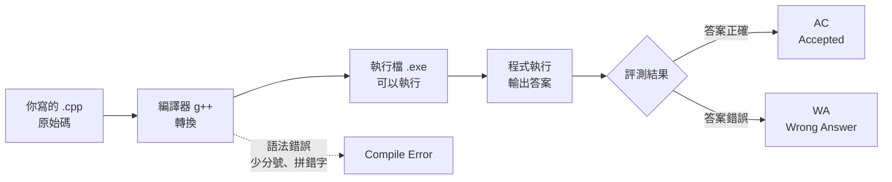
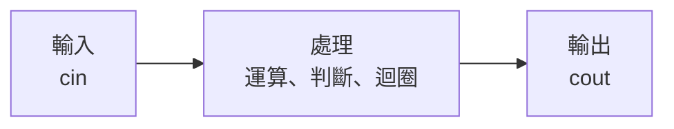
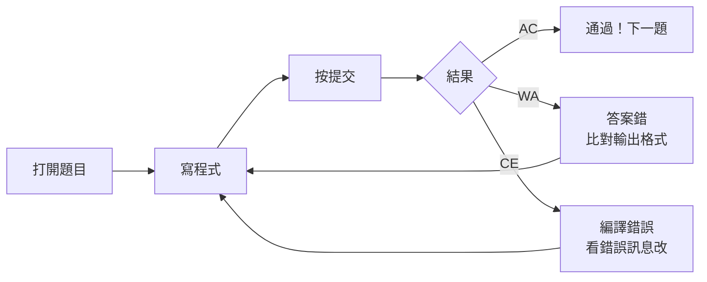

# 第一天 資訊啟蒙

大里 APCS 營隊 · 從第一支程式開始

郭家睿

---
layout: default
---

## 今天的目標

- 知道**電腦是怎麼執行你寫的程式**的
- 寫出人生第一支 C++ 程式
- 學會 `cout` **輸出**、`cin` **輸入**
- 認識所有程式共同的骨架：**輸入 → 處理 → 輸出**
- 在 itouOJ 上完成第一題並通過

<br>

> 今天不求快，只求**跑得起來**。跑起來的那一刻你就是寫程式的人了。

<!--
今天只做一件事：讓你寫出第一支程式，而且讓它跑起來。
-->

---
layout: section
---

# 開場暖身

<!--
（過場）
-->

---

## 暖身問題

如果今天要計算三天氣溫的平均，你會怎麼把這件事情拆開？

<!--
寫程式不是一開始就打開編輯器。

通常我們會先想：
這個問題到底要怎麼解決？

把大問題拆成幾個小步驟，
這就是寫程式前很重要的一件事。
-->

---

## 從想法到程式

<div class="flex flex-col gap-4 mt-8">

<div class="flex items-center gap-4">
<div class="border rounded-lg p-4 w-40 text-center">
保存三天氣溫
</div>

<div class="text-2xl">
→
</div>

<div class="border rounded-lg p-4 w-40 text-center text-blue-500">
變數
</div>
</div>

<div class="flex items-center gap-4" v-click>
<div class="border rounded-lg p-4 w-40 text-center">
加總氣溫<br>÷ 3
</div>

<div class="text-2xl">
→
</div>

<div class="border rounded-lg p-4 w-40 text-center text-green-500">
運算
</div>
</div>

<div class="flex items-center gap-4" v-click>
<div class="border rounded-lg p-4 w-40 text-center">
顯示答案
</div>

<div class="text-2xl">
→
</div>

<div class="border rounded-lg p-4 w-40 text-center text-orange-500">
輸出
</div>
</div>

</div>

<!--
就程式的視角來說

第一步，把三天氣溫保存起來
在程式裡，我們叫它「變數」

第二步，把資料拿來計算
像加法、除法，這些叫做「運算」

最後，把答案顯示出來
這叫做「輸出」
-->

---
layout: section
---

# 電腦怎麼看懂你的程式

<!--
在開始寫程式之前，我們先花一點時間了解：

電腦是怎麼看懂你的程式的?

因為之後寫程式遇到問題時，
你要知道問題是在「寫錯」、「翻譯失敗」，
還是「程式跑了但是想錯」。

搞懂這個流程，之後除錯會容易很多
-->

---

## 什麼是「程式」？

<v-clicks>

- 程式是一連串寫給電腦執行的指令
- 每一行指令都有明確的意思與執行順序
- 電腦不會像人一樣理解「大概的意思」，只能按照規則執行

</v-clicks>

<!--
先從最基本的開始。

程式其實就是把我們解決問題的方法，
寫成電腦可以一步一步執行的指令。

例如今天我們想算平均，
人的想法可能是：
先把數字加起來，再除以數量。

但是電腦不知道「算平均」這三個字代表什麼，
它需要我們把每一步都寫清楚。
-->

---

## 你寫的字，電腦看不懂

我們寫的是 **原始碼**（source code），電腦只看得懂 **0 和 1**。中間需要一個翻譯官，叫做**編譯器**。



<br>

> **編譯錯誤不是壞事**，它只是在告訴你哪裡寫錯了。

<!--
但是，即使我們寫好了程式碼，
電腦還不能直接執行。

我們寫的 C++ 程式叫做「原始碼」，
它比較接近人類閱讀的文字。

例如變數名稱、if、for，
這些都是讓程式設計師看得懂的東西。

可是電腦最後執行的是機器碼，
也就是更接近 0 和 1 的形式。

所以中間需要一個轉換步驟，
這個工具叫做「編譯器」。

它會把我們寫的 .cpp 原始碼，
轉換成電腦可以執行的檔案。
-->

---

## 兩種錯誤，兩種感覺


<div class="grid grid-cols-2 gap-4 mt-4 text-sm">
  <div class="border-l-4 border-red-500 pl-4">
    <div class="font-bold mb-1">編譯期錯誤（CE）</div>
    程式<b>根本沒跑起來</b>。<br/>
    通常是漏了分號、拼錯字、
    括號沒對齊。
  </div>
  <div class="border-l-4 border-orange-500 pl-4">
    <div class="font-bold mb-1">邏輯錯誤(WA)</div>
    程式<b>跑起來了，但答案不對</b>。<br/>
    語法完全沒問題，
    是想法或算式有誤。
  </div>
</div>

<!--
第一種是編譯期錯誤

簡單來說就是
程式根本沒有成功開始執行。

通常看到的是一堆錯誤訊息，
例如少分號、括號錯誤。

第二種是邏輯錯誤。

你可以把它簡單理解為你平常數學算錯了

例如你本來想算平均，
結果不小心開根號
-->

---

## 今天用的工具：itouOJ

<v-clicks>

- 我寫的一個 Online Judge

</v-clicks>

---

## 登入 itouOJ

<div class="text-sm">

1. 打開瀏覽器，前往 [**oj.itousouta.me**](https://oj.itousouta.me)
2. 用你的學校的Google帳號登入
3. 確認畫面右上角顯示你的帳號名稱

</div>

<!--
打開 oj.itousouta.me，登入
-->

---

## 找到今天的課程

<div class="text-sm">

1. 點選上方選單的「課程」
2. 找到 **APCS 初級營 Day1｜資訊啟蒙**
3. 確認看得到第 1 題「哈囉，資訊！」

</div>

<!--
再來點上面的「課程」，找到 Day1，確認看得到第一題「哈囉，資訊！
-->

---
layout: section
---

# 第一支程式

---

## 完整程式先看一次

```cpp
#include <iostream>
using namespace std;

int main() {
    cout << "Hello, World!" << endl;
    return 0;
}
```

<div class="mt-6 text-sm opacity-70">

接下來我們一行一行拆開看。

</div>

---

## 逐行拆解①：`#include <iostream>`

```cpp {1}
#include <iostream>
using namespace std;

int main() {
    cout << "Hello, World!" << endl;
    return 0;
}
```

<div class="mt-4 border-l-4 border-blue-500 pl-4 text-sm">

`#include` 是「借工具」的意思。`<iostream>` 是一個裝著輸入輸出工具（`cout`、`cin`）的工具箱。**沒有借，等一下就用不了 `cout`。**

</div>

<!--
第一行：

#include <iostream>

我們可以先把它想成「借工具」。

C++ 本身不會預先準備所有功能，
像是輸出文字這種事情，要額外拿工具。

等等會用到的 cout，
就是放在 iostream 這個工具箱裡。

所以想使用 cout，
前面就要先把這個工具箱拿進來。
-->

---

## 逐行拆解②：`using namespace std;`

```cpp {2}
#include <iostream>
using namespace std;

int main() {
    cout << "Hello, World!" << endl;
    return 0;
}
```

<div class="mt-4 border-l-4 border-blue-500 pl-4 text-sm">

`std` 是 C++ 標準工具的「名字空間」。這行等於說：「等一下我打 `cout`，指的就是 `std` 裡面那個 `cout`」，不用每次都寫成很長的 `std::cout`。

</div>

<!--
using namespace std;

這行比較像是偷懶用的。

其實 cout 完整名字叫：

std::cout

但是每次都打一長串很麻煩。

所以我們告訴 C++：
等等看到 cout，就要自動在前面加上std::
-->

---

## 逐行拆解③：`int main()`

```cpp {4}
#include <iostream>
using namespace std;

int main() {
    cout << "Hello, World!" << endl;
    return 0;
}
```

<div class="mt-4 border-l-4 border-blue-500 pl-4 text-sm">

`main` 是**程式的進入點**。電腦執行你的程式時，一律從 `main` 裡面的第一行開始跑，不管你把其他程式碼寫在哪裡。

</div>

---

## 逐行拆解④：大括號 `{ }`

```cpp {4,7}
#include <iostream>
using namespace std;

int main() {
    cout << "Hello, World!" << endl;
    return 0;
}
```

<div class="mt-4 border-l-4 border-blue-500 pl-4 text-sm">

大括號把「這一段要做的事」包起來。`{` 開始、`}` 結束，中間夾的所有句子，都算是 `main` 要做的事。

</div>

<!--
大括號的作用是把「這一段要做的事」包成一包。

這個「範圍」的概念之後 if、迴圈都會用到。
-->

---

## 逐行拆解⑤：`cout` 那一行

```cpp {5}
#include <iostream>
using namespace std;

int main() {
    cout << "Hello, World!" << endl;
    return 0;
}
```

<div class="mt-4 border-l-4 border-blue-500 pl-4 text-sm">

這是真正「做事」的那一行：把雙引號裡的文字，送到螢幕上顯示出來。

</div>

<!--
這行才是真正在做事的：把雙引號裡的文字送到螢幕上。

前面幾行都是準備工作。
-->

---

## 逐行拆解⑥：分號 `;`

```cpp {5}
#include <iostream>
using namespace std;

int main() {
    cout << "Hello, World!" << endl;
    return 0;
}
```

<div class="mt-4 border-l-4 border-blue-500 pl-4 text-sm">

分號代表「這句話講完了」，就像中文的句號。C++ **不看換行**，只看分號來判斷一句話在哪裡結束。

</div>

<!--
分號代表「這句話講完了」，像中文的句號。

反直覺的地方是：C++ 不看換行，只看分號。

（示範把整支程式擠成一行）你看，一樣能跑。我們分行寫只是給人看的。
-->

---

## 忘記分號會怎樣？

```cpp
cout << "Hello, World!" << endl
return 0;
```

<div class="mt-4 border-l-4 border-red-500 pl-4 text-sm">

編譯器會說「缺少 `;`」，而且**通常指到下一行**（這裡是 `return 0;` 那行），不是真正漏寫分號的那一行。看到這種錯誤，養成習慣：**往上一行找**。

</div>

<!--
忘記分號的話，編譯器會指到「下一行」，不是真正漏掉的那行。

所以養成習慣：看到缺少分號，往上一行找。

這句話今天我會再講兩次，因為等一下一定有人遇到。
-->

---

## 逐行拆解⑦：`return 0;`

```cpp {6}
#include <iostream>
using namespace std;

int main() {
    cout << "Hello, World!" << endl;
    return 0;
}
```

<div class="mt-4 border-l-4 border-blue-500 pl-4 text-sm">

告訴作業系統「我正常執行完畢」。`0` 是慣例上代表「沒有錯誤」的數字。現在只要記得每個 `main` 最後都寫 `return 0;` 就好。

</div>

---

## 完整程式再看一次

```cpp
#include <iostream>      // 借輸入輸出工具箱
using namespace std;     // 之後不用寫 std::

int main() {             // 程式從這裡開始
    cout << "Hello!";    // 印出文字
    return 0;            // 正常結束
}
```

<div class="mt-6 text-sm opacity-70">

現在每一行你都看得懂了。這就是你今天要記住的**骨架**，之後每一支程式都長得很像這樣。

</div>

<!--
再看一次完整版，這次每行都有註解。

問一下，這六行有哪一行你完全不知道在幹嘛的？舉手。

（沒人就往下）好，這就是骨架，之後每支程式都長很像。
-->

---

## 你的第一支程式

```cpp
#include <iostream>
using namespace std;

int main() {
    cout << "Hello, World!" << endl;
    return 0;
}
```

<div class="mt-6 grid grid-cols-3 gap-3 text-sm">
  <div class="border border-gray-400 border-opacity-40 p-3">
    <div class="opacity-60 text-xs mb-1">cout</div>
    輸出。把資料<b>送到螢幕</b>
  </div>
  <div class="border border-gray-400 border-opacity-40 p-3">
    <div class="opacity-60 text-xs mb-1">&lt;&lt;</div>
    箭頭朝外，<b>資料往螢幕流</b>
  </div>
  <div class="border border-gray-400 border-opacity-40 p-3">
    <div class="opacity-60 text-xs mb-1">endl</div>
    換行。end line 的縮寫
  </div>
</div>

<!--
三個關鍵字：`cout` 是輸出、兩個箭頭是方向、`endl` 是換行。

箭頭方向等一下有專門一張，先有印象。
-->

---

## `<<` 的方向就是資料的方向

<div class="my-6 text-center font-mono text-lg">
  <div class="inline-block border-2 border-green-500 px-6 py-3">
    你的資料
  </div>
  <span class="mx-4 text-2xl">→</span>
  <div class="inline-block border-2 border-blue-500 px-6 py-3">
    cout
  </div>
  <span class="mx-4 text-2xl">→</span>
  <div class="inline-block border-2 border-purple-500 px-6 py-3">
    螢幕
  </div>
  
  <div class="mt-2 text-sm opacity-70">
    cout &lt;&lt; 資料（把資料交給 cout 輸出）
  </div>
</div>
<div class="my-6 text-center font-mono text-lg">
  <div class="inline-block border-2 border-blue-500 px-6 py-3">
    鍵盤
  </div>
  <span class="mx-4 text-2xl">→</span>
  <div class="inline-block border-2 border-purple-500 px-6 py-3">
    cin
  </div>
  <span class="mx-4 text-2xl">→</span>
  <div class="inline-block border-2 border-green-500 px-6 py-3">
    你的變數
  </div>

  <div class="mt-2 text-sm opacity-70">
    cin &gt;&gt; 變數（從 cin 讀資料放入變數）
  </div>
</div>

> 記不住方向？看箭頭**指向誰**，資料就是流向誰。

<!--
`cout` 是資料往螢幕流，`cin` 是鍵盤往變數流。

記法很簡單：看箭頭指向誰，資料就流向誰。

（做手勢）`cout` 往外推，`cin` 往自己拉。之後有人搞混我就回來指這張。
-->

---
layout: fact
---

# 動手做

把上面這支程式，一字不漏打進 Code::Block

執行看看，你應該會看到 `Hello, World!`

<!--
換你們了。把這支程式一字不漏打進 Code::Block，執行看看。

用手打，不要複製貼上。手打才會打錯，打錯才學得到東西。

給你們十分鐘，卡住就舉手。
-->

---
layout: section
---

# 讓程式聽你的話

<!--
（過場）到現在程式都只會講話，不會聽。接下來讓它學會聽你的。
-->

---

## `cin` 讀取輸入

```cpp
#include <iostream>
using namespace std;

int main() {
    int age;                // ① 先準備一個盒子
    cin >> age;             // ② 把鍵盤打的數字放進盒子
    cout << age << endl;    // ③ 把盒子裡的東西印出來
    return 0;
}
```

<br>

執行時畫面會**停住等你打字**，按下 Enter 才會繼續。

<!--
照註解的順序看：先準備一個盒子、把鍵盤打的數字放進去、再印出來。

這支程式跑的時候畫面會停住，等你打字。第一次遇到會以為當機，其實它只是在等你。
-->

---

## 逐步拆解①：先宣告變數

```cpp {3}
int main() {
    int age;
    cin >> age;
    cout << age << endl;
    return 0;
}
```

<div class="mt-4 border-l-4 border-blue-500 pl-4 text-sm">

`int age;` 是在跟電腦說：「幫我準備一個叫 `age` 的盒子，裡面要放整數」。這時盒子裡還是空的（其實是垃圾值），只是先佔好位置。

</div>

<!--
`int age;` 就是跟電腦說：幫我準備一個叫 age 的盒子，放整數。

這時盒子還是空的——其實裡面是上個程式留下的垃圾值。這個詞先記著。
-->

---

## 為什麼要先宣告？

<v-clicks>

- 電腦的記憶體很大，需要一個**名字**才能找到你要的那一小塊
- 宣告的同時也決定了「這格要放什麼型態的資料」（這裡是整數）
- 沒有先宣告就直接用：編譯器會說它不認識這個名字

</v-clicks>

<!--
（可略）為什麼要先宣告？因為記憶體很大，要有名字才找得到你那一小塊。

沒宣告就用的話，編譯器會說它不認識這個名字。
-->

---

## 逐步拆解②：`cin >>` 那一行

```cpp {4}
int main() {
    int age;
    cin >> age;
    cout << age << endl;
    return 0;
}
```

<div class="mt-4 border-l-4 border-blue-500 pl-4 text-sm">

`cin >> age;` 是「把鍵盤打的東西，放進 `age` 這個盒子」。箭頭 `>>` 指向 `age`，資料就是往 `age` 流過去。

</div>

<!--
`cin >> age;` 就是把鍵盤打的東西放進 age。

箭頭指向 age，資料就往 age 流。跟剛剛的 `cout` 剛好相反。
-->

---

## 執行時畫面會停住

<div class="mt-6 text-sm">

程式跑到 `cin >> age;` 這一行時會**暫停**，等你在鍵盤上打字、按 Enter，才會把值放進 `age`、繼續往下跑。

</div>

<!--
這裡要補充一件事：在 OJ 上，輸入是事先寫好的，不是你當場打字。

所以你在 OJ 上不會看到畫面停住。但邏輯完全一樣，程式不用改。

不講的話等一下你會找不到「要在哪打字」。
-->

---

## 逐步拆解③：印出來

```cpp {5}
int main() {
    int age;
    cin >> age;
    cout << age << endl;
    return 0;
}
```

<div class="mt-4 border-l-4 border-blue-500 pl-4 text-sm">

`cout << age << endl;` 把盒子裡現在的值印出來。如果輸入是 `16`，這裡就會印出 `16`。

</div>

<!--
第三步就是把盒子裡的值印出來。輸入 16 就印 16。
-->

---

## 一次讀好幾個

```cpp
int a, b;
cin >> a >> b;        // 輸入 3 5 → a=3, b=5

string name;
int age;
cin >> name >> age;   // 輸入 Alice 16 → name="Alice", age=16
```

<div class="mt-4 text-sm opacity-70">

`cin` 可以像 `cout` 一樣一直串下去，一次讀好幾個變數。

</div>

<!--
`cin` 跟 `cout` 一樣可以串下去，一次讀好幾個。

這裡出現了 `string`，是拿來裝文字的，今天會用就好。
-->

---

## `cin >>` 會自動跳過空白和換行

`cin >>` 會自動**跳過空白和換行**。所以底下兩種輸入方式，程式讀到的完全一樣：

<div class="grid grid-cols-2 gap-4 mt-3 font-mono text-sm">
  <div class="border border-gray-400 border-opacity-40 p-3">Alice 16</div>
  <div class="border border-gray-400 border-opacity-40 p-3">Alice<br/>16</div>
</div>

<div class="mt-4 text-sm opacity-70">

不管中間隔的是空格還是換行，`cin >>` 只在乎「下一個看到的一段文字」是什麼。

</div>

<!--
這件事很多人困惑，先講清楚：`cin` 會自動跳過空白跟換行。

所以下面這兩種輸入，程式讀到的完全一樣，用空格或換行都沒差。

講清楚可以省掉之後很多困惑，因為 OJ 的輸入常常是分行的。
-->

---

## 練習：追蹤這段程式

```cpp
int a, b;
cin >> a >> b;
cout << a + b << endl;
cout << a * b << endl;
```

如果輸入是 `3 5`，會印出什麼？

<v-click>

<div class="mt-6 border-l-4 border-green-500 pl-4">

```
8
15
```

`a=3, b=5`，第一行印 `a+b=8`，第二行印 `a*b=15`。

</div>

</v-click>

<!--
輸入 3 跟 5，這段會印什麼？

不要猜，一行一行跟著跑一遍。給你們一分鐘。

（公佈）8 跟 15，分兩行。

「追蹤程式」這個能力比會寫還重要，今天開始練。
-->

---

## 常見錯誤：宣告了但忘記 cin

```cpp
int age;
cout << age << endl;   // 忘記先 cin >> age;
```

<div class="mt-4 border-l-4 border-red-500 pl-4 text-sm">

`age` 只是被宣告，從來沒有被賦值，裡面是**不確定的垃圾值**。編譯通常不會報錯，但印出來的數字會很奇怪。這是邏輯錯誤，不是編譯錯誤。

</div>

<!--
常見錯誤一：宣告了但忘記讀取。

age 從來沒被賦值，裡面就是剛剛講的垃圾值。

重點是這種錯誤編譯不會報錯，程式能跑，但印出來的數字很奇怪。就是我們說的「能跑但是錯」。
-->

---

## 常見錯誤：型態不合

```cpp
int age;
cin >> age;   // 輸入卻是 "十六"（中文字，不是數字）
```

<div class="mt-4 border-l-4 border-red-500 pl-4 text-sm">

`age` 是 `int`，只能讀進數字。如果輸入不是數字格式，讀取會失敗，後面的變數會拿到不正確的值。今天的題目輸入格式都會事先講清楚，照著格式讀就不會遇到這個問題。

</div>

<!--
常見錯誤二：型態不合。age 是 int，輸入不是數字就會讀失敗。

今天不太會遇到，因為題目都會講清楚格式。知道有這件事就好。
-->

---

## 常見錯誤：cin 跟 cout 順序顛倒

```cpp
int age;
cout << age << endl;   // 還沒讀就先印
cin >> age;
```

<div class="mt-4 border-l-4 border-red-500 pl-4 text-sm">

程式是**由上往下**照順序執行的。這裡先印再讀，印出來的當然是還沒讀到值之前的垃圾值。記住順序：**先讀，才能用**。

</div>

<!--
常見錯誤三：`cin` 跟 `cout` 顛倒。

程式由上往下跑，這裡還沒讀就先印，印出來當然是垃圾值。

口訣：先讀，才能用。第五天複習還會考這句。
-->

---

## 小測驗：這樣輸入會印出什麼？

```cpp
int a, b;
cin >> a >> b;
cout << a - b << endl;
```

輸入是 `10 3`

<v-click>

<div class="mt-6 border-l-4 border-green-500 pl-4">

答案：`7`（`a=10, b=3, a-b=7`）

</div>

</v-click>

<!--
最後一題快問快答。輸入 10 跟 3，印什麼？

（十秒）7。
-->

---
layout: section
---

# 所有程式都是這個骨架

<!--
（過場）接下來這張，是今天唯一要你背起來的東西。
-->

---

## 所有程式都是這個骨架



<div class="mt-6">

```cpp
int a, b;
cin >> a >> b;              // 輸入
int sum = a + b;            // 處理
cout << sum << endl;        // 輸出
```

</div>

<br>

> 接下來四天，變的只有中間那塊「處理」。**輸入和輸出永遠是這樣**。

<!--
所有程式都是這個骨架：輸入、處理、輸出。

下面這段：讀兩個數字是輸入，加起來是處理，印出來是輸出。

今天最重要的一句話：接下來四天，變的只有中間那塊「處理」。

意思是你今天學的 `cin`、`cout`，學會就是學會了，之後幾乎不會再變。之後是「加東西」，不是打掉重練。
-->

---

## 為什麼每支程式都逃不出這三步

<v-clicks>

- 程式存在的目的，就是「拿到一些資料、做點什麼、給出結果」
- 拿資料 = 輸入；做什麼 = 處理；給結果 = 輸出
- 差別只在於「處理」那一步在做什麼——這正是接下來要學的內容

</v-clicks>

<!--
為什麼？因為程式存在的目的就是「拿資料、做點什麼、給結果」。

差別只在中間那步在做什麼，那正是接下來四天要學的。
-->

---

## 舉例：計算機程式屬於哪一步？

計算機讓你輸入兩個數字、選運算符號，然後顯示結果。

<v-click>

<div class="mt-6 border-l-4 border-green-500 pl-4">

**輸入**：兩個數字、運算符號　**處理**：做對應的運算　**輸出**：顯示結果

</div>

</v-click>

<!--
把日常的東西套進這三步驟看看。

計算機：輸入兩個數字跟符號、做運算、顯示結果。哪些是輸入哪些是輸出？喊出來。
-->

---

## 舉例：今天要交的作業屬於哪一步？

「輸入姓名年齡，印出自我介紹」這一題呢？

<v-click>

<div class="mt-6 border-l-4 border-green-500 pl-4">

**輸入**：姓名、年齡　**處理**：把文字拼接起來　**輸出**：印出整句話

這題的「處理」特別簡單，幾乎只是把輸入原封不動接進固定文字裡。

</div>

</v-click>

<!--
那今天的作業呢？「輸入姓名年齡，印出自我介紹」。

（讓他們答）輸入是姓名年齡，處理是把文字接起來，輸出是印出整句。

你會發現這題的「處理」特別簡單，所以今天的題目其實不難。
-->

---

## 接下來四天：只有「處理」在變

<div class="text-sm">

| 天數         | 處理在學什麼           |
| ------------ | ---------------------- |
| Day1（今天） | 幾乎沒有處理，直接輸出 |
| Day2         | 用 if / else 做決定    |
| Day3         | 用迴圈重複做事         |
| Day4         | 用陣列一次處理一堆資料 |
| Day5         | 把前面全部組合起來     |

</div>

<div class="mt-4 border-l-4 border-yellow-500 pl-4 text-sm">

輸入和輸出的寫法今天學完就不太會變了，之後你可以把力氣全部放在「處理」上。

</div>

<!--
這是接下來四天的地圖。

你看，輸入輸出那一欄從頭到尾沒變過。

所以今天學完，之後可以把力氣全部放在「處理」上。
-->

---
layout: section
---

# 實作時間

<!--
（過場）接下來是主餐，前面都是配菜。
-->

---

## itouOJ 是什麼？

<v-clicks>

- 一個線上寫程式、線上判題的網站
- 你交程式碼上去，伺服器幫你**編譯 + 執行**，跟範例答案比對
- 通過所有測資才算 **AC**（Accepted，通過）
- 這五天的題目、課程進度，都在這個網站上

</v-clicks>

<!--
你交程式碼上去，伺服器幫你編譯執行，再跟正確答案比對。

關鍵是要通過「所有」測資才算 AC。

我強調「所有」是因為等一下會有人說「我範例明明對了」——除了範例，背後還有你看不到的測資。
-->

---

## 今日題目：哈囉，資訊！

<div class="text-sm opacity-70 mb-2">itouOJ 課程 Day1｜第 1 題</div>

輸入一位新生的**姓名**與**年齡**，印出一句自我介紹。

| 項目 | 內容                                                                  |
| ---- | --------------------------------------------------------------------- |
| 輸入 | 第一行：不含空白的字串 `name`<br/>第二行：整數 `age`（1 ≤ age ≤ 120） |
| 輸出 | `Hello, my name is {name}. I am {age} years old!`                     |

<div class="grid grid-cols-2 gap-4 mt-4 font-mono text-sm">
  <div class="border border-gray-400 border-opacity-40 p-3">
    <div class="opacity-60 text-xs mb-1">範例輸入</div>
    itouSouta<br/>17
  </div>
  <div class="border border-gray-400 border-opacity-40 p-3">
    <div class="opacity-60 text-xs mb-1">範例輸出</div>
    Hello, my name is itouSouta. I am 17 years old!
  </div>
</div>

<!--
今天的題目：輸入姓名跟年齡，印出一句自我介紹。

輸入第一行是姓名，第二行是年齡。輸出就是下面這一整句。

先給你們一分鐘自己看，不要急著寫。
-->

---

## 讀題第一步：找出「輸入」

<div class="text-sm">

再看一次題目：「第一行：不含空白的字串 name；第二行：整數 age」

</div>

<v-click>

<div class="mt-6 border-l-4 border-green-500 pl-4">

**輸入有兩個東西**：一個字串（姓名）、一個整數（年齡），分別在**兩行**，順序是先姓名再年齡。

</div>

</v-click>

<!--
這叫讀題。每一題都要做這件事，不是只有今天這題。

第一步，找出輸入。輸入有幾個東西？

（讓他們答）兩個，一個字串一個整數，先姓名後年齡。
-->

---

## 讀題第二步：找出「輸出」

<div class="text-sm">

再看一次：`Hello, my name is {name}. I am {age} years old!`

</div>

<v-click>

<div class="mt-6 border-l-4 border-green-500 pl-4">

**輸出是一整句話**，裡面嵌入了 name 和 age 兩個變數的值，其他部分都是**固定不變**的文字。

</div>

</v-click>

<!--
第二步，找出輸出。

（讓他們看）輸出是一整句話，裡面嵌了兩個變數，其他部分都是固定文字。

「其他都是固定的」這個觀察等一下寫 `cout` 就靠它。
-->

---

## 讀題第三步：把輸出格式拆開看

```
Hello, my name is itouSouta. I am 16 years old!
└──────┬──────┘    └─┬─┘  └──┬──┘ └┬┘ └────┬────┘
     固定文字       name     固定   age    固定文字
```

<div class="mt-4 border-l-4 border-yellow-500 pl-4 text-sm">

**一個字元都不能差。** 句點、驚嘆號、每個空白都要對。判題是逐字比對的，少一個空白就是錯。

</div>

<!--
第三步，把輸出格式拆開看。這段固定、這裡放 name、這段固定、這裡放 age。

現在講一件會決定你會不會 WA 的事：一個字元都不能差。句點、驚嘆號、每個空白都要對。

等一下你如果 WA，九成是這裡，不是你邏輯錯。
-->

---

## 動手規劃：需要幾個變數？

<v-click>

<div class="mt-6 border-l-4 border-green-500 pl-4">

兩個：一個存姓名（型態 `string`），一個存年齡（型態 `int`）。

</div>

</v-click>

<!--
動手前先想清楚：這題需要幾個變數？

（讓他們答）兩個。
-->

---

## 動手規劃：變數要宣告成什麼型態？

```cpp
string name;   // 姓名，文字
int age;       // 年齡，整數
```

<div class="mt-4 text-sm opacity-70">

`string` 這個型態專門用來裝文字，今天只要會用就好，細節明天會再深入。

</div>

<!--
型態呢？姓名用 `string`，年齡用 `int`。

`string` 今天會用就好，明天再深入。另外用它要多借一個工具箱 `#include <string>`。
-->

---

## 動手規劃：先寫出骨架，沒有內容

```cpp
#include <iostream>
#include <string>
using namespace std;

int main() {
    // 這裡等一下要：讀輸入、處理、印輸出
    return 0;
}
```

<div class="mt-4 text-sm opacity-70">

先把骨架搭好，再一步一步把內容填進去，比一次全部寫完更不容易出錯。

</div>

<!--
接下來這個工作方法：先寫骨架，不寫內容。

先把架子搭好再一步步填，比一次全寫完再找錯容易很多。

現在就把這幾行打進去，不要等我講完。
-->

---

## 逐步完成①：加上 cin

```cpp {7,8}
#include <iostream>
#include <string>
using namespace std;

int main() {
    string name;
    int age;
    cin >> name >> age;
    return 0;
}
```

<!--
第一步，加上輸入。宣告兩個變數，一行 `cin` 讀進來。

大家跟著打，我等一下。
-->

---

## 逐步完成②：加上輸出的固定文字

```cpp
cout << "Hello, my name is "
     << ". I am "
     << " years old!" << endl;
```

<div class="mt-4 text-sm opacity-70">

先把固定不變的部分打出來，中間先留空——等一下把 name、age 接進去。

</div>

<!--
第二步，先把固定不變的文字打出來，中間留空。

好處是你一次只想一件事，先處理不會變的。
-->

---

## 逐步完成③：把 name、age 接進去

```cpp
cout << "Hello, my name is " << name
     << ". I am " << age << " years old!" << endl;
```

<div class="mt-4 border-l-4 border-blue-500 pl-4 text-sm">

在該接變數的地方，用 `<<` 把 `name`、`age` 串進去。 `<<` 可以串接**任意多個**文字和變數，順序就是輸出的順序。

</div>

<!--
第三步，把 name 跟 age 接進去。

再說一次，箭頭可以串任意多個，串的順序就是輸出的順序。
-->

---

## 完整程式：組合起來

```cpp
#include <iostream>
#include <string>
using namespace std;

int main() {
    string name;
    int age;
    cin >> name >> age;
    cout << "Hello, my name is " << name
         << ". I am " << age << " years old!" << endl;
    return 0;
}
```

<!--
完整程式在這。建議先自己寫，寫不出來再看。

已經自己寫出來的，給自己拍拍手。
-->

---

## 常見錯誤①：忘記空白

```cpp
cout << "Hello, my name is" << name    // 少了 "is" 後面的空白
     << ". I am" << age << "years old!" << endl;
```

<div class="mt-4 border-l-4 border-red-500 pl-4 text-sm">

會印出 `Hello, my name isitouSouta`，`is` 和名字黏在一起。固定文字裡該有的空白，要自己打在雙引號**裡面**。

</div>

<!--
三個容易犯的錯。第一個，忘記空白。

`is` 後面少一格，印出來就變成 `isitouSouta` 黏在一起。

引號裡該有的空白要你自己打，電腦不會幫你加。
-->

---

## 常見錯誤②：標點符號打錯

```cpp
cout << "Hello, my name is " << name
     << "，I am " << age << " years old!" << endl;
```

<div class="mt-4 border-l-4 border-red-500 pl-4 text-sm">

用了中文全形逗號「，」而不是英文句點 `.`。判題逐字比對，標點符號錯了就是 WA，即使只差一個字元。

</div>

<!--
第二個，標點打錯。這裡用了中文全形逗號。

我們前面才講過，這就是它實際會害到你的地方。差一個字元就是 WA。
-->

---

## 常見錯誤③：變數名稱打錯

```cpp
string name;
int age;
cin >> Name >> age;   // Name 不是 name，大小寫不同
```

<div class="mt-4 border-l-4 border-red-500 pl-4 text-sm">

`Name` 跟 `name` 是**兩個不同的變數**，而且 `Name` 根本沒有被宣告過。這種錯誤在編譯期就會被抓到，錯誤訊息會說找不到 `Name`。

</div>

<!--
第三個，變數名稱打錯。上面宣告 `name`，下面用 `Name`。

這個有個好處：編譯期就會被抓到。編譯期抓到，總比程式跑出錯答案你卻不知道為什麼要好。
-->

---

## 在 itouOJ 上交題



<div class="mt-4 text-sm">

課程連結：[**oj.itousouta.me/courses/3**](https://oj.itousouta.me/courses/3)

</div>

<!--
交題流程：寫程式、按提交、看結果。

AC 就過了。WA 回去比對輸出格式。CE 去看錯誤訊息。

照這個流程走，不要亂改。有方向改起來才快。
-->

---

## 判題結果代表什麼

| 代號  | 全名                | 意思                         |
| ----- | ------------------- | ---------------------------- |
| `AC`  | Accepted            | 通過了 🎉                    |
| `WA`  | Wrong Answer        | 跑完了但答案不對             |
| `CE`  | Compile Error       | 程式有語法錯誤，根本沒跑起來 |
| `TLE` | Time Limit Exceeded | 跑太久（通常是無窮迴圈）     |
| `RE`  | Runtime Error       | 跑到一半爆掉                 |

<br>

> 第一天最常見的是 **CE**（打錯字）和 **WA**（格式沒對齊）。兩個都很正常。

<!--
AC、WA、CE 這三個今天會一直看到。

AC 通過、WA 答案錯、CE 編譯錯誤、TLE 跑太久、RE 跑到一半爆掉。

第一天最常見是 CE 跟 WA，兩個都很正常。
-->

---
layout: section
---

# 隨堂小測驗

<!--
（過場）正式開始寫之前，花五分鐘確認觀念，五題很快。
-->

---

## Q1

程式是**由上往下**、還是**隨機順序**執行的？

<v-click>

<div class="mt-6 border-l-4 border-green-500 pl-4">**由上往下**，一行一行照順序執行。</div>

</v-click>

<!--
程式是由上往下還是隨機執行？

（全班喊）由上往下。
-->

---

## Q2

`cout << a << b;` 跟 `cout << b << a;` 印出來的結果一樣嗎？

<v-click>

<div class="mt-6 border-l-4 border-green-500 pl-4">**不一樣**。`<<` 的順序就是輸出的順序，`a` 和 `b` 對調就會印反。</div>

</v-click>

<!--
`cout << a << b;` 跟 `cout << b << a;` 一樣嗎？

覺得一樣的舉手。（數完）不一樣，串接順序就是輸出順序。
-->

---

## Q3

`cin >> age;` 之前，如果沒有先寫 `int age;`，會發生什麼事？

<v-click>

<div class="mt-6 border-l-4 border-green-500 pl-4">**編譯錯誤**。`age` 這個名字還沒被宣告過，編譯器不認識它。</div>

</v-click>

<!--
沒有先寫 `int age;` 就 `cin >> age;` 會怎樣？

（讓他們答）編譯錯誤，編譯器不認識這個名字。
-->

---

## Q4

程式編譯成功、也執行完了，但印出的答案跟範例不一樣，這是 itouOJ 上的哪一種結果？

<v-click>

<div class="mt-6 border-l-4 border-green-500 pl-4">**WA（Wrong Answer）**。編譯、執行都沒問題，只是答案不對。</div>

</v-click>

<!--
編譯執行都成功，但答案不對，是哪一種？

（讓他們答）WA。

這題答對代表今天的重點有進去。
-->

---

## Q5

`cin >> a >> b;` 讀取輸入 `3` 和 `5` 時，中間用空格分開跟用換行分開，結果一樣嗎？

<v-click>

<div class="mt-6 border-l-4 border-green-500 pl-4">**一樣**。`cin >>` 會自動跳過空白和換行。</div>

</v-click>

<!--
`cin >> a >> b;` 讀 3 跟 5，空格跟換行結果一樣嗎？

（讓他們答）一樣，`cin` 會自動跳過。
-->

---

## 小測驗結束

<v-clicks>

- 程式由上往下執行，順序不能亂
- 輸出順序就是 `<<` 串接的順序
- 變數要先宣告才能用
- 判題結果分好幾種：AC 才是真的過了
- `cin` 不在乎空格還是換行

</v-clicks>

<!--
快速複習：由上往下執行、串接順序就是輸出順序、先宣告才能用、AC 才算過、`cin` 不在乎空格換行。

好，接下來時間都是你們的。
-->

---
layout: fact
---

# 動手做

打開 [oj.itousouta.me → 課程 → Day1](https://oj.itousouta.me/courses/3)

按照剛剛的步驟，寫到 AC 為止

<!--
打開 OJ 的 Day1，寫到 AC 為止。

再說一次除錯順序：CE 看錯誤訊息第一行；WA 回去一個字一個字比對輸出格式。

助教會走動，卡住超過一分鐘就舉手，不要自己耗。

目標是下課前全班都 AC。
-->

---
layout: section
---

# 今日重點回顧

<!--
（過場）最後幾分鐘收一下今天的東西。
-->

---

## 回顧①：編譯與執行

<v-clicks>

- 原始碼要經過**編譯器**翻譯，才變成電腦能跑的執行檔
- 編譯期錯誤：程式**根本沒跑起來**（漏分號、拼錯字）
- 執行期 / 邏輯錯誤：程式**跑完了但答案不對**

</v-clicks>

<!--
第一，編譯跟執行是兩件事。

編譯錯誤是根本沒跑起來，邏輯錯誤是跑完了但答案不對。
-->

---

## 回顧②：cout 與 cin 的方向

<v-clicks>

- `cout <<` 資料流向螢幕：**輸出**
- `cin >>` 資料流向變數：**輸入**
- 記不住方向，就看箭頭指向誰

</v-clicks>

<!--
第二，方向。`cout` 流向螢幕，`cin` 流向變數。

記不住就（做手勢）看箭頭指向誰。
-->

---

## 回顧③：程式骨架

<v-clicks>

- 所有程式都是 **輸入 → 處理 → 輸出**
- 接下來四天只有「處理」在變
- 變數要先宣告才能使用，程式由上往下執行

</v-clicks>

<!--
第三，骨架：所有程式都是輸入、處理、輸出，之後只有「處理」在變。

另外，變數要先宣告才能用，程式由上往下跑。
-->

---

## 回顧④：判題結果種類

<v-clicks>

- `AC` 通過、`WA` 答案錯、`CE` 編譯錯誤
- `TLE` 跑太久、`RE` 執行期出錯
- 今天最常見的是 `CE` 和 `WA`，都很正常

</v-clicks>

<!--
第四，判題結果。AC、WA、CE、TLE、RE。

今天最常見是 CE 跟 WA。
-->

---

## 回顧⑤：三個常見錯誤

<v-clicks>

- 忘記分號 —— 看到 `expected ';'` 往上一行找
- 中文標點 —— 打程式碼前先切英文輸入法
- 大小寫寫錯 —— 關鍵字全小寫，命名前後一致

</v-clicks>

<!--
第五，三個常見錯誤：分號往上一行找、打程式前切英文輸入法、關鍵字全小寫。

問一下，今天中過至少一個的舉手？

（通常全班都舉，笑一下）很好，代表你們真的有在寫程式。
-->

---

## 明天預告

<div class="text-lg mt-6">

明天我們讓程式學會**記住東西**和**做決定**——變數、運算子、if / else。

</div>

<div class="mt-6 text-sm opacity-70">

今天的 `string`、`int` 只是暖身，明天會學到更多型態，還有怎麼讓程式「自己選擇要做什麼」。

</div>

<!--
明天讓程式學會兩件事：記住東西、還有做決定。

也就是說明天的程式會自己判斷，你給不同資料它會走不同的路。

明天一樣，來了先登入 OJ。
-->

---
layout: statement
---

# 謝謝大家

<!--
今天到這裡。

今天早上你們大部分人連 Hello World 都沒寫過，現在都寫出來了。

想回家練的，網站隨時開著。明天見。
-->
