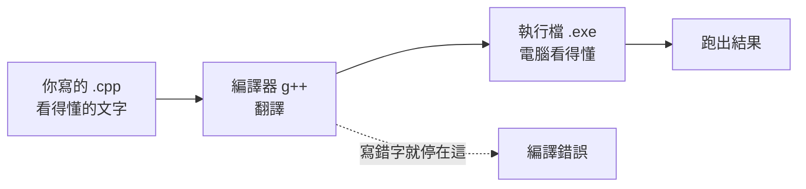
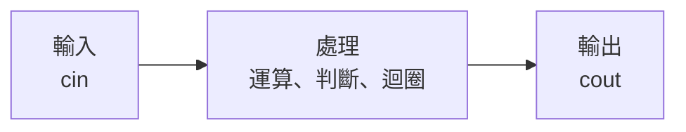
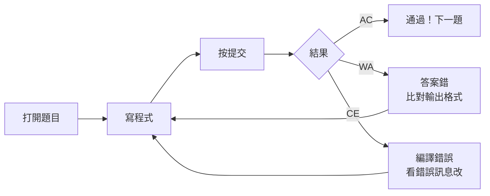

# 第一天 資訊啟蒙

大里 APCS 營隊 · 從第一支程式開始

郭家睿

<!--
開場先讓氣氛鬆下來。自我介紹 30 秒就好，重點放在「今天不會有人被當掉」。

可以先問一句：「這裡有人以前寫過程式的舉手？」——大概會有 1～2 個，順勢說「沒寫過才是正常的，今天就是為你們設計的」。

全天節奏：概念 40 分 → 第一支程式 40 分 → 休息 → cin / 骨架 40 分 → 實作到 AC。
-->

---
layout: default
---

## 今天的目標

- 知道**電腦是怎麼執行你寫的程式**的
- 寫出人生第一支 C++ 程式
- 學會 `cout` **輸出**、`cin` **輸入**
- 認識所有程式共同的骨架：**輸入 → 處理 → 輸出**
- 在 itouOJ 上完成第一題並通過

<br>

> 今天不求快，只求**跑得起來**。跑起來的那一刻你就是寫程式的人了。

<!--
不要逐條唸完。挑「寫出人生第一支 C++ 程式」和最後那句引言講就好。

「今天不求快，只求跑得起來」這句要停一下講——這是今天所有挫折的解藥，等一下有人卡住時你會一直回來引用它。
-->

---
layout: section
---

# 開場暖身

<!--
過場，不用停。
-->

---

## 暖身問題（不用寫程式）

用中文，把「算三天氣溫的平均」拆成幾個步驟。不用想程式，用你自己的話說。

<div class="mt-6 text-sm opacity-70">

想 30 秒，等一下公佈參考答案。

</div>

<!--
真的讓他們想 30 秒，不要急著往下。可以走下台看看有沒有人在紙上寫。

強調「用你自己的話」——目的是讓他們發現自己本來就會拆解步驟，只是還不會用程式講。

想不出來的人不用逼，等一下看答案就會「喔原來是這個意思」。
-->

---

## 暖身問題：參考答案

<v-clicks>

1. 準備三個空位，分別記第一天、第二天、第三天的氣溫
2. 把三個氣溫加起來
3. 把總和除以 3
4. 把結果講出來（或寫下來）

</v-clicks>

<div class="mt-6 border-l-4 border-green-500 pl-4" v-click>

這四步，等一下就會變成程式。「準備空位」叫**變數**，「加起來除以 3」叫**運算**，「講出來」叫**輸出**。你已經會寫程式的邏輯了，只差**怎麼跟電腦說**。

</div>

<!--
一步一步點出來，每點一步問一次「這樣對嗎？」讓他們有參與感。

最後那個綠框是今天最重要的一張投影片之一：**他們已經會邏輯了，缺的只是語法**。這句話會決定他們今天卡住時是覺得「我不會寫程式」還是「我只是還不熟指令」。
-->

---

## 環境檢查①：登入 itouOJ

<div class="text-sm">

1. 打開瀏覽器，前往 [**oj.itousouta.me**](https://oj.itousouta.me)
2. 用你的帳號登入（沒有帳號跟老師說）
3. 確認畫面右上角顯示你的帳號名稱

</div>

<div class="mt-6 border-l-4 border-yellow-500 pl-4 text-sm">

登不進去的舉手，不要自己卡關超過 1 分鐘。

</div>

<!--
這裡一定要等。不要因為想趕進度就往下——有一台登不進去，那個學生整天都廢了。

明講「不要自己卡超過 1 分鐘」，新手很容易因為不好意思而默默卡著。

助教這時候應該在教室裡走動，不是站在台上。
-->

---

## 環境檢查②：找到今天的課程

<div class="text-sm">

1. 點選上方選單的「課程」
2. 找到 **APCS 初級營 Day1｜資訊啟蒙**
3. 確認看得到第 1 題「哈囉，資訊！」

</div>

<div class="mt-6 text-sm opacity-70">

看得到的人舉手，我們確認全班都到齊了再開始。

</div>

<!--
一樣要等到全班都舉手。這是今天唯一一次全班同步的機會，之後每個人寫程式的速度會差很多。
-->

---
layout: section
---

# 電腦怎麼看懂你的程式

<!--
過場。可以說：「在寫第一行程式之前，先花十分鐘搞懂電腦到底在幹嘛，等一下出錯你才知道錯在哪一層。」
-->

---

## 什麼是「程式」？

<v-clicks>

- 程式就是**一串指令**，告訴電腦「先做什麼、再做什麼」
- 跟食譜很像：先切菜、再下鍋、最後裝盤——順序不能亂
- 差別在於：電腦**不會自己猜**你的意思，指令必須寫得非常精確

</v-clicks>

<!--
食譜的比喻要講滿，這是今天最好用的比喻。

「電腦不會自己猜」這點可以舉反例：你跟朋友說「幫我買個飲料」他會自己判斷買什麼；電腦不會，你要說清楚品項、大小、冰塊、甜度。

不用超過 3 分鐘。
-->

---

## 你寫的字，電腦看不懂

你寫的是 **原始碼**（source code），電腦只看得懂 **0 和 1**。中間需要一個翻譯官，叫做**編譯器**。



<br>

> **編譯錯誤不是壞事**，它是在你出糗之前先告訴你哪裡寫錯了。

<!--
這張圖是今天的地圖，後面講 CE 的時候會一直指回來。

重點講最下面那條虛線：**編譯錯誤會停在中間，根本走不到「跑出結果」**。這解釋了為什麼 CE 的時候他們什麼輸出都看不到。

最後那句引言要講：「編譯錯誤不是壞事，是在你出糗之前先告訴你」——降低他們等一下看到紅字的恐懼。
-->

---

## 什麼是「原始碼」

<v-clicks>

- 原始碼（source code）就是你**打出來的那些文字**
- 存成副檔名 `.cpp` 的檔案
- 它本身**不能直接執行**，只是一份「說明書」
- 要交給編譯器翻譯之後，才變成電腦真的能跑的東西

</v-clicks>

<!--
快速帶過，重點在「它本身不能執行，只是說明書」。

可以拿實體比喻：食譜不能吃，要照著做出來才能吃。
-->

---

## 什麼是「編譯器」

<v-clicks>

- 編譯器（compiler）是一支**專門做翻譯**的程式
- 我們用的編譯器叫 **g++**，專門翻譯 C++
- 它會**逐字檢查**你的原始碼，語法有問題就停下來報錯
- 語法沒問題，就產出一份電腦看得懂的「執行檔」

</v-clicks>

<div class="mt-6 border-l-4 border-blue-500 pl-4" v-click>

itouOJ 已經幫你裝好 g++ 了，你只需要專心寫程式碼，不用自己安裝任何東西。

</div>

<!--
重點是「逐字檢查」——所以少一個分號它就停，不是它機車，是它真的看不懂。

最後那個藍框要強調：**他們不用安裝任何東西**。第一天最大的勸退因素就是環境設定，我們直接跳過。
-->

---

## 編譯 vs 執行：兩個不同的階段

<div class="grid grid-cols-2 gap-4 mt-4 text-sm">
  <div class="border-2 border-blue-500 p-4">
    <div class="font-bold text-base mb-2">① 編譯（Compile）</div>
    把原始碼翻譯成執行檔。<br/>
    這階段只檢查<b>語法</b>對不對，
    完全不管你的邏輯對不對。
  </div>
  <div class="border-2 border-green-500 p-4">
    <div class="font-bold text-base mb-2">② 執行（Run）</div>
    真的把翻譯好的程式跑起來。<br/>
    這階段才會看到<b>結果</b>，
    邏輯對不對這時才看得出來。
  </div>
</div>

<div class="mt-6 border-l-4 border-yellow-500 pl-4 text-sm">

語法錯字在**編譯階段**就會被抓到；邏輯想錯了，程式**能編譯、能執行**，只是印出來的答案不對。這是完全不同的兩種錯誤。

</div>

<!--
這張是今天的核心概念之一，值得停久一點。

關鍵句：「編譯階段只檢查語法對不對，完全不管你的邏輯對不對。」

可以舉例：你想印 3 卻寫成 `cout << 1 + 1;`，編譯完全會過，因為語法沒錯，只是你想錯了。
-->

---

## 兩種錯誤，兩種感覺

<div class="grid grid-cols-2 gap-4 mt-4 text-sm">
  <div class="border-l-4 border-red-500 pl-4">
    <div class="font-bold mb-1">編譯期錯誤（Compile Error）</div>
    程式<b>根本沒跑起來</b>。<br/>
    通常是漏了分號、拼錯字、
    括號沒對齊。
  </div>
  <div class="border-l-4 border-orange-500 pl-4">
    <div class="font-bold mb-1">執行期錯誤 / 邏輯錯誤</div>
    程式<b>跑起來了，但答案不對</b>。<br/>
    語法完全沒問題，
    是想法或算式有誤。
  </div>
</div>

<div class="mt-6 text-sm opacity-70" v-click>

今天你會兩種都遇到，很正常——itouOJ 上分別叫 `CE` 和 `WA`，等一下會講。

</div>

<!--
用「感覺」來記：CE 是「什麼都沒發生」，WA 是「有東西但不對」。

最後那句要講：**今天兩種你都會遇到，很正常**。先打預防針，等一下他們真的遇到就不會慌。
-->

---

## 小測驗：哪一種錯誤？

<div class="text-sm">

情境：小明寫完程式按下提交，網站顯示程式**順利跑完**，但輸出的答案跟範例不一樣。

</div>

<v-click>

<div class="mt-6 border-l-4 border-green-500 pl-4">

**答案：執行期 / 邏輯錯誤。** 程式有跑完，代表編譯沒問題；答案不對，代表想法或算式哪裡有誤。

</div>

</v-click>

<!--
舉手表決：覺得是編譯錯誤的舉手、覺得是邏輯錯誤的舉手。先數一下再公佈。

不要直接唸答案，讓他們先承諾一個選擇，記憶會深很多。
-->

---

## 小測驗：哪一種錯誤？（二）

<div class="text-sm">

情境：小華寫完程式按下提交，網站顯示一堆看不懂的紅字，完全沒有印出任何東西。

</div>

<v-click>

<div class="mt-6 border-l-4 border-green-500 pl-4">

**答案：編譯期錯誤。** 程式根本沒有被翻譯成功，所以連跑都沒跑，更不用談答案對不對。

</div>

</v-click>

<!--
同上，舉手表決。這題比較好答，答對率高有助於建立信心。

公佈完可以說：「這兩題你們都答對了，代表你們已經會分辨兩種錯誤了——這比背語法重要。」
-->

---

## 今天用的工具：itouOJ

<v-clicks>

- 不需要在自己電腦上安裝 C++ 環境
- 打開瀏覽器、登入、寫程式碼、按提交，伺服器幫你編譯 + 執行
- 好處：**大家的環境完全一樣**，不會有「我的電腦可以但你的不行」
- 之後回家想練習，同一個網站，換台電腦也能用

</v-clicks>

<!--
重點講「大家的環境完全一樣」。順便說：以後回家自己練習，換台電腦也能用，不用重裝。

30 秒帶過。
-->

---
layout: section
---

# 第一支程式

<!--
過場。可以說：「接下來十分鐘，你們每個人都會有人生第一支跑起來的程式。」
-->

---

## 完整程式先看一次

```cpp
#include <iostream>
using namespace std;

int main() {
    cout << "Hello, World!" << endl;
    return 0;
}
```

<div class="mt-6 text-sm opacity-70">

先別急著懂全部。接下來我們一行一行拆開看。

</div>

<!--
先讓他們看 10 秒，然後明講「現在看不懂是正常的，不要焦慮」。

不要急著解釋。這張的目的只是讓他們先有個整體印象，知道「原來一支程式大概這麼長」——大部分人會鬆一口氣，因為比想像中短。
-->

---

## 逐行拆解①：`#include <iostream>`

```cpp {1}
#include <iostream>
using namespace std;

int main() {
    cout << "Hello, World!" << endl;
    return 0;
}
```

<div class="mt-4 border-l-4 border-blue-500 pl-4 text-sm">

`#include` 是「借工具」的意思。`<iostream>` 是一個裝著輸入輸出工具（`cout`、`cin`）的工具箱。**沒有借，等一下就用不了 `cout`。**

</div>

<!--
「借工具」這個說法要一直用，比「引入標頭檔」好懂太多。

強調最後那句：**沒有借，等一下就用不了 `cout`**。這會對應到他們之後可能遇到的錯誤。
-->

---

## 為什麼需要 #include？

<v-clicks>

- C++ 本身只提供最基本的功能，輸入輸出不算在裡面
- `cout`、`cin` 這些工具被放在一個叫 `iostream` 的「函式庫」裡
- 想用某個工具箱，就要先用 `#include` 把它借過來
- 忘記借的話：編譯器會說它不認識 `cout`

</v-clicks>

<!--
這張是補充，趕時間可以跳過。

如果講，重點在最後一條：忘記 include 的話，編譯器會說它不認識 `cout`——先讓他們看過這個錯誤長相。
-->

---

## 逐行拆解②：`using namespace std;`

```cpp {2}
#include <iostream>
using namespace std;

int main() {
    cout << "Hello, World!" << endl;
    return 0;
}
```

<div class="mt-4 border-l-4 border-blue-500 pl-4 text-sm">

`std` 是 C++ 標準工具的「名字空間」。這行等於說：「等一下我打 `cout`，指的就是 `std` 裡面那個 `cout`」，不用每次都寫成很長的 `std::cout`。

</div>

<!--
不用講太深。「就是為了少打 `std::` 這幾個字」講完就過。

有學生問「那不寫會怎樣」可以現場示範 `std::cout`，但不要花超過 1 分鐘，這在第一天不重要。
-->

---

## 逐行拆解③：`int main()`

```cpp {4}
#include <iostream>
using namespace std;

int main() {
    cout << "Hello, World!" << endl;
    return 0;
}
```

<div class="mt-4 border-l-4 border-blue-500 pl-4 text-sm">

`main` 是**程式的進入點**。電腦執行你的程式時，一律從 `main` 裡面的第一行開始跑，不管你把其他程式碼寫在哪裡。

</div>

<!--
「程式的進入點」要講清楚——電腦不管你把程式碼寫在哪，一律從 `main` 開始。

可以問：「那如果我把 `cout` 寫在 `main` 外面會怎樣？」不用真的答，留個懸念。
-->

---

## 為什麼一定要有 main？

<v-clicks>

- 每一支 C++ 程式**都必須有、而且只能有一個** `main`
- 它是電腦跟你的程式之間的「約定」：從這裡開始
- 沒有 `main`：編譯器會直接報錯，說找不到進入點
- 現在你可以把 `main` 想成「故事的第一頁」

</v-clicks>

<!--
「故事的第一頁」這個比喻可以用。快速帶過，第一天不需要深究。
-->

---

## 逐行拆解④：大括號 `{ }`

```cpp {4,7}
#include <iostream>
using namespace std;

int main() {
    cout << "Hello, World!" << endl;
    return 0;
}
```

<div class="mt-4 border-l-4 border-blue-500 pl-4 text-sm">

大括號把「這一段要做的事」包起來。`{` 開始、`}` 結束，中間夾的所有句子，都算是 `main` 要做的事。

</div>

<!--
用手比出括號的形狀，講「這一段是一包的」。

重點：大括號是「範圍」的概念，之後 if、for 都會用到同一套概念——先埋下伏筆。
-->

---

## 大括號沒對齊會怎樣？

```cpp
int main() {
    cout << "Hello, World!" << endl;
    return 0;
// 少了這裡的 }
```

<div class="mt-4 border-l-4 border-red-500 pl-4 text-sm">

編譯器會說「缺少 `}`」，而且通常會指到**檔案最後一行**，不是你漏寫的那個位置。這是新手最容易卡住的錯誤之一，先知道「找不到位置很正常」，冷靜數一數左右括號是不是一樣多。

</div>

<!--
這張很重要，因為這是他們最容易卡住又最難自己找到的錯誤。

關鍵句：**錯誤訊息通常指到檔案最後一行，不是你漏寫的那個位置**。

教一個實用技巧：從上往下數，看到 `{` 加一、看到 `}` 減一，最後應該是 0。
-->

---

## 逐行拆解⑤：`cout` 那一行

```cpp {5}
#include <iostream>
using namespace std;

int main() {
    cout << "Hello, World!" << endl;
    return 0;
}
```

<div class="mt-4 border-l-4 border-blue-500 pl-4 text-sm">

這是真正「做事」的那一行：把雙引號裡的文字，送到螢幕上顯示出來。

</div>

<!--
「這是真正做事的那一行」——前面幾行都是準備工作，只有這行有產出。

快速帶過，因為下一張要講分號。
-->

---

## 逐行拆解⑥：分號 `;`

```cpp {5}
#include <iostream>
using namespace std;

int main() {
    cout << "Hello, World!" << endl;
    return 0;
}
```

<div class="mt-4 border-l-4 border-blue-500 pl-4 text-sm">

分號代表「這句話講完了」，就像中文的句號。C++ **不看換行**，只看分號來判斷一句話在哪裡結束。

</div>

<!--
「C++ 不看換行，只看分號」這句要講清楚，這是新手最反直覺的地方之一。

可以現場示範：把整支程式擠成一行，一樣能跑。這個示範很有效果，他們會「哇」一聲。
-->

---

## 忘記分號會怎樣？

```cpp
cout << "Hello, World!" << endl
return 0;
```

<div class="mt-4 border-l-4 border-red-500 pl-4 text-sm">

編譯器會說「缺少 `;`」，而且**通常指到下一行**（這裡是 `return 0;` 那行），不是真正漏寫分號的那一行。看到這種錯誤，養成習慣：**往上一行找**。

</div>

<!--
跟大括號那張一樣的道理：**錯誤訊息指到下一行，要往上一行找**。

這句話今天會重複至少三次，因為等一下實作時一定有人遇到。可以要求他們跟著唸一次。
-->

---

## 逐行拆解⑦：`return 0;`

```cpp {6}
#include <iostream>
using namespace std;

int main() {
    cout << "Hello, World!" << endl;
    return 0;
}
```

<div class="mt-4 border-l-4 border-blue-500 pl-4 text-sm">

告訴作業系統「我正常執行完畢」。`0` 是慣例上代表「沒有錯誤」的數字。現在只要記得每個 `main` 最後都寫 `return 0;` 就好。

</div>

<!--
第一天不要解釋回傳值的意義，會失焦。

直接說「現在只要記得每個 `main` 最後都寫這一行就好，之後會懂」。誠實告訴他們這是暫時的簡化，比硬掰一個解釋好。
-->

---

## 完整程式再看一次

```cpp
#include <iostream>      // 借輸入輸出工具箱
using namespace std;     // 之後不用寫 std::

int main() {             // 程式從這裡開始
    cout << "Hello!";    // 印出文字
    return 0;            // 正常結束
}
```

<div class="mt-6 text-sm opacity-70">

現在每一行你都看得懂了。這就是你今天要記住的**骨架**，之後每一支程式都長得很像這樣。

</div>

<!--
回到完整版，這次每行都有註解。

問一句：「現在這六行，有哪一行你還完全不知道在幹嘛的？」有人舉手就回頭補，沒人舉手就進實作。

強調「這就是骨架，之後每一支程式都長得很像」，減輕他們的記憶負擔。
-->

---

## 你的第一支程式

```cpp
#include <iostream>
using namespace std;

int main() {
    cout << "Hello, World!" << endl;
    return 0;
}
```

<div class="mt-6 grid grid-cols-3 gap-3 text-sm">
  <div class="border border-gray-400 border-opacity-40 p-3">
    <div class="opacity-60 text-xs mb-1">cout</div>
    輸出。把資料<b>送到螢幕</b>
  </div>
  <div class="border border-gray-400 border-opacity-40 p-3">
    <div class="opacity-60 text-xs mb-1">&lt;&lt;</div>
    箭頭朝外，<b>資料往螢幕流</b>
  </div>
  <div class="border border-gray-400 border-opacity-40 p-3">
    <div class="opacity-60 text-xs mb-1">endl</div>
    換行。end line 的縮寫
  </div>
</div>

<!--
底下三格是重點卡片：`cout`（輸出）、`<<`（方向）、`endl`（換行）。

`<<` 的方向等一下有專門一張，這裡先點到為止。
-->

---
layout: fact
---

# 動手做

把上面這支程式，一字不漏打進 itouOJ

執行看看，你應該會看到 `Hello, World!`

<!--
這是今天第一個實作，最關鍵的一個。

明確指令：**一字不漏打進去**，不要複製貼上——手打才會遇到錯誤，遇到錯誤才學得到東西。

預留 10 分鐘。助教全部下場走動。看到有人跑出 `Hello, World!` 就大聲說出來，製造氣氛。
-->

---

## 動手練習：換成你的名字

把 `"Hello, World!"` 改成 `"Hello, 你的名字!"`，重新執行。

<v-click>

<div class="mt-6 border-l-4 border-green-500 pl-4">

```cpp
cout << "Hello, itouSouta!" << endl;
```

雙引號裡面的文字**完全由你決定**，只要保留頭尾的雙引號就好。

</div>

</v-click>

<!--
小小的成就感練習，但很重要——這是他們第一次「改」程式而不是「抄」程式。

可以讓幾個人唸出自己印了什麼。有人會皮，印一些奇怪的東西，那很好，代表他們在玩，玩就會學。
-->

---

## `<<` 的方向就是資料的方向

<div class="my-6 text-center font-mono text-lg">
  <div class="inline-block border-2 border-green-500 px-6 py-3">你的資料</div>
  <span class="mx-4 text-2xl">&nbsp;&gt;&gt;&gt;&gt;&nbsp;</span>
  <div class="inline-block border-2 border-blue-500 px-6 py-3">螢幕</div>
  <div class="mt-2 text-sm opacity-70">cout &lt;&lt; 資料&nbsp;&nbsp;（箭頭指向 cout，資料流向螢幕）</div>
</div>

<div class="my-6 text-center font-mono text-lg">
  <div class="inline-block border-2 border-blue-500 px-6 py-3">鍵盤</div>
  <span class="mx-4 text-2xl">&nbsp;&gt;&gt;&gt;&gt;&nbsp;</span>
  <div class="inline-block border-2 border-green-500 px-6 py-3">你的變數</div>
  <div class="mt-2 text-sm opacity-70">cin &gt;&gt; 變數&nbsp;&nbsp;（箭頭指向變數，資料流進變數）</div>
</div>

> 記不住方向？看箭頭**指向誰**，資料就是流向誰。

<!--
這張圖是今天最值得記住的一張。

用手臂比方向：`cout` 是往外送（指螢幕），`cin` 是往內收（指自己）。身體記憶比死背有效。

「看箭頭指向誰，資料就流向誰」——這句要他們跟著唸。之後每次有人搞混就回來指這張。
-->

---

## 一次輸出很多東西

```cpp
int age = 16;

cout << "我今年 " << age << " 歲" << endl;
// 我今年 16 歲

cout << "1 + 1 = " << 1 + 1 << endl;
// 1 + 1 = 2
```

<v-clicks>

- 可以用 `<<` **一直串下去**，文字和數字混在一起沒問題
- 文字要用**雙引號** `" "` 包起來，數字和變數不用
- `"1 + 1"` 是文字，會原樣印出；`1 + 1` 是算式，會先算出 `2`

</v-clicks>

<!--
重點在第三條：加了雙引號的 "1 + 1" 是文字，會原樣印出；沒加引號的 1 + 1 是算式，會先算成 2。

現場示範這兩個的差別，效果最好。這是雙引號概念的第一次正式登場。
-->

---

## 練習：串三段文字

寫一行 `cout`，印出：`3 加 4 等於 7`（其中 7 要用算式 `3 + 4` 算出來，不能直接打 7）

<v-click>

<div class="mt-6 border-l-4 border-green-500 pl-4">

```cpp
cout << "3 加 4 等於 " << 3 + 4 << endl;
```

固定文字用雙引號包起來，數字用算式接上去，中間繼續用 `<<` 串。

</div>

</v-click>

<!--
讓他們自己寫，不要直接看答案。給 2 分鐘。

常見錯誤：把 7 直接打上去。要抓出來講——題目說要用算式算出來，這是在練「讓電腦算」而不是「自己算好填進去」的思維。
-->

---
layout: section
---

# 三個一定會犯的錯

<!--
過場。可以說：「接下來這三個錯誤，今天你們每個人至少會中一個。我先講，等一下你們就認得出來。」

這段是預防性教學，比等他們卡住再救有效。
-->

---

## 錯誤①：忘記分號 —— 長什麼樣子

```cpp
cout << "hi" << endl
return 0;
```

<div class="mt-4 border-l-4 border-red-500 pl-4 text-sm">

第一行結尾少了 `;`。編譯器沒辦法判斷這句話到底在哪裡結束。

</div>

<!--
快速帶過，重點在下一張的錯誤訊息。
-->

---

## 錯誤①：itouOJ 的錯誤訊息長這樣

```
error: expected ';' before 'return'
```

<div class="mt-4 border-l-4 border-yellow-500 pl-4 text-sm">

翻譯：「我在 `return` 前面，原本預期會看到一個 `;`」。 **它指的是 `return` 那一行，但真正該修的是上一行。**

</div>

<!--
把英文錯誤訊息唸一次、翻譯一次。很多學生看到英文就直接放棄，要先破除這個。

強調粗體那句：**它指的是 `return` 那一行，但真正該修的是上一行**。
-->

---

## 錯誤①：怎麼抓、怎麼修

<v-clicks>

- 看到 `expected ';'`，先去看**錯誤訊息指的那一行的上一行**
- 補上分號，重新編譯
- 這是新手最常見的錯誤，沒有之一——遇到了不代表你笨

</v-clicks>

<!--
最後一條要用力講：「這是新手最常見的錯誤，沒有之一——遇到了不代表你笨。」

第一天的心理建設比技術重要。
-->

---

## 錯誤②：中文標點

```cpp
cout << "hi"；
```

<div class="mt-4 border-l-4 border-red-500 pl-4 text-sm">

這個 `；` 是**全形分號**（中文輸入法打出來的），跟英文的 `;` 長得很像，但電腦完全不認得。

</div>

<!--
這個錯誤在台灣的教室裡超級常見，因為大家都開著中文輸入法。

先讓他們看程式碼，問「你看得出哪裡有問題嗎？」大部分人看不出來，這正是重點。
-->

---

## 錯誤②：怎麼看出是全形符號

<div class="grid grid-cols-2 gap-6 mt-4 text-center font-mono text-2xl">
  <div class="border-2 border-red-500 p-4">
    ；
    <div class="text-sm mt-2 opacity-70">全形（中文），錯誤</div>
  </div>
  <div class="border-2 border-green-500 p-4">
    ;
    <div class="text-sm mt-2 opacity-70">半形（英文），正確</div>
  </div>
</div>

<div class="mt-4 text-sm opacity-70">

放大看會發現全形符號比較胖、佔的寬度比較大。平常肉眼很容易漏看。

</div>

<!--
放大對照圖。讓他們真的盯著看幾秒，感受一下「原來差這麼少」。

講「全形比較胖」這個直覺判斷法。
-->

---

## 錯誤②：怎麼避免

<v-clicks>

- 打程式碼之前，**先切回英文輸入法**
- 逗號、分號、括號、引號，全部都要用半形
- itouOJ 的編輯器通常會把中文標點用比較顯眼的方式顯示，多留意

</v-clicks>

<!--
最實用的一條：**打程式碼之前先切回英文輸入法**。

可以現在就叫全班一起按一次切換鍵，養成肌肉記憶。
-->

---

## 錯誤③：大小寫寫錯

```cpp
Cout << "hi" << endl;
INT main() {
```

<div class="mt-4 border-l-4 border-red-500 pl-4 text-sm">

`Cout` 不是 `cout`、`INT` 不是 `int`。編譯器會說它不認識這些字。

</div>

<!--
快速帶過。
-->

---

## 錯誤③：C++ 每一個字都要對

<v-clicks>

- C++ **區分大小寫**：`a`、`A` 是兩個不同的東西
- 關鍵字（`int`、`cout`、`return`……）都是**全小寫**
- 你自己取名字（變數名）可以自己決定大小寫，但要**前後一致**

</v-clicks>

<!--
重點：關鍵字一律小寫；自己命名的變數可以自己決定，但要前後一致。

「`a` 和 `A` 是兩個不同的東西」——這在中文語感裡很反直覺，要特別點出來。
-->

---

## 三個常見錯誤總複習

| 錯誤       | 長什麼樣子      | 怎麼避免                           |
| ---------- | --------------- | ---------------------------------- |
| 忘記分號   | 缺 `;`          | 看到 `expected ';'`，往上一行找    |
| 中文標點   | 全形 `；`、`（` | 打程式碼前先切英文輸入法           |
| 大小寫寫錯 | `Cout`、`INT`   | 關鍵字一律小寫，自己命名要前後一致 |

<br>

> 這三個錯誤幾乎每個人第一天都會遇到至少一次，遇到了不用緊張，對照這張表找就好。

<!--
這張表叫他們拍照或截圖。等一下實作卡住時，先自己對照這張表。

最後那句引言講完就進下一段：「遇到了不用緊張，對照這張表找就好。」
-->

---
layout: section
---

# 讓程式聽你的話

<!--
過場。可以說：「到目前為止程式都只會講話，不會聽。接下來讓它學會聽你的。」
-->

---

## `cin` 讀取輸入

```cpp
#include <iostream>
using namespace std;

int main() {
    int age;                // ① 先準備一個盒子
    cin >> age;             // ② 把鍵盤打的數字放進盒子
    cout << age << endl;    // ③ 把盒子裡的東西印出來
    return 0;
}
```

<br>

執行時畫面會**停住等你打字**，按下 Enter 才會繼續。

<!--
程式碼裡的 ①②③ 註解就是講解順序，照著講。

最後那句「執行時畫面會停住等你打字」要強調——這是他們第一次遇到「程式會等」，很多人會以為當機了。
-->

---

## 逐步拆解①：先宣告變數

```cpp {3}
int main() {
    int age;
    cin >> age;
    cout << age << endl;
    return 0;
}
```

<div class="mt-4 border-l-4 border-blue-500 pl-4 text-sm">

`int age;` 是在跟電腦說：「幫我準備一個叫 `age` 的盒子，裡面要放整數」。這時盒子裡還是空的（其實是垃圾值），只是先佔好位置。

</div>

<!--
「盒子」這個比喻要用滿，整個五天都會用到。

「這時盒子裡還是空的（其實是垃圾值）」——垃圾值先埋個伏筆，等一下常見錯誤那張會回來。
-->

---

## 為什麼要先宣告？

<v-clicks>

- 電腦的記憶體很大，需要一個**名字**才能找到你要的那一小塊
- 宣告的同時也決定了「這格要放什麼型態的資料」（這裡是整數）
- 沒有先宣告就直接用：編譯器會說它不認識這個名字

</v-clicks>

<!--
補充張，趕時間可跳。

如果講，重點在「需要一個名字才找得到那一小塊記憶體」。
-->

---

## 逐步拆解②：`cin >>` 那一行

```cpp {4}
int main() {
    int age;
    cin >> age;
    cout << age << endl;
    return 0;
}
```

<div class="mt-4 border-l-4 border-blue-500 pl-4 text-sm">

`cin >> age;` 是「把鍵盤打的東西，放進 `age` 這個盒子」。箭頭 `>>` 指向 `age`，資料就是往 `age` 流過去。

</div>

<!--
再指一次箭頭方向：`>>` 指向 `age`，所以資料流進 `age`。

跟前面 `<<` 那張呼應，形成對照。
-->

---

## 執行時畫面會停住

<div class="mt-6 text-sm">

程式跑到 `cin >> age;` 這一行時會**暫停**，等你在鍵盤上打字、按 Enter，才會把值放進 `age`、繼續往下跑。

</div>

<div class="mt-6 border-l-4 border-yellow-500 pl-4 text-sm">

在 itouOJ 上，「輸入」是**事先寫好**的（範例輸入），不是你當場打字——但邏輯完全一樣：程式一樣是先讀輸入，再處理。

</div>

<!--
黃框那段是重點：**在 itouOJ 上輸入是事先寫好的，不是當場打字**。

這個落差一定要講清楚，不然他們在 OJ 上看不到「停住」的現象會困惑。
-->

---

## 逐步拆解③：印出來

```cpp {5}
int main() {
    int age;
    cin >> age;
    cout << age << endl;
    return 0;
}
```

<div class="mt-4 border-l-4 border-blue-500 pl-4 text-sm">

`cout << age << endl;` 把盒子裡現在的值印出來。如果輸入是 `16`，這裡就會印出 `16`。

</div>

<!--
快速帶過，這張只是把三步驟收尾。
-->

---

## 一次讀好幾個

```cpp
int a, b;
cin >> a >> b;        // 輸入 3 5 → a=3, b=5

string name;
int age;
cin >> name >> age;   // 輸入 Alice 16 → name="Alice", age=16
```

<div class="mt-4 text-sm opacity-70">

`cin` 可以像 `cout` 一樣一直串下去，一次讀好幾個變數。

</div>

<!--
「`cin` 可以像 `cout` 一樣一直串下去」——對稱性讓他們好記。

順便帶到 `string` 型態的第一次出現，但不深入。
-->

---

## `cin >>` 會自動跳過空白和換行

`cin >>` 會自動**跳過空白和換行**。所以底下兩種輸入方式，程式讀到的完全一樣：

<div class="grid grid-cols-2 gap-4 mt-3 font-mono text-sm">
  <div class="border border-gray-400 border-opacity-40 p-3">Alice 16</div>
  <div class="border border-gray-400 border-opacity-40 p-3">Alice<br/>16</div>
</div>

<div class="mt-4 text-sm opacity-70">

不管中間隔的是空格還是換行，`cin >>` 只在乎「下一個看到的一段文字」是什麼。

</div>

<!--
這張很重要，因為 OJ 題目的輸入格式常常是分行的，他們會擔心「要不要特別處理換行」。

答案是不用。這張講清楚可以省掉之後很多困惑。
-->

---

## 練習：追蹤這段程式

```cpp
int a, b;
cin >> a >> b;
cout << a + b << endl;
cout << a * b << endl;
```

如果輸入是 `3 5`，會印出什麼？

<v-click>

<div class="mt-6 border-l-4 border-green-500 pl-4">

```
8
15
```

`a=3, b=5`，第一行印 `a+b=8`，第二行印 `a*b=15`。

</div>

</v-click>

<!--
讓他們自己在紙上或心裡算，給 1 分鐘再公佈。

「追蹤程式」這個能力比會寫還重要，今天開始就要練。
-->

---

## 常見錯誤：宣告了但忘記 cin

```cpp
int age;
cout << age << endl;   // 忘記先 cin >> age;
```

<div class="mt-4 border-l-4 border-red-500 pl-4 text-sm">

`age` 只是被宣告，從來沒有被賦值，裡面是**不確定的垃圾值**。編譯通常不會報錯，但印出來的數字會很奇怪。這是邏輯錯誤，不是編譯錯誤。

</div>

<!--
回收前面埋的「垃圾值」伏筆。

關鍵：**編譯不會報錯，但印出來的數字很奇怪**。這是他們第一次遇到「能跑但是錯」的例子，跟前面 CE / WA 的概念扣起來。
-->

---

## 常見錯誤：型態不合

```cpp
int age;
cin >> age;   // 輸入卻是 "十六"（中文字，不是數字）
```

<div class="mt-4 border-l-4 border-red-500 pl-4 text-sm">

`age` 是 `int`，只能讀進數字。如果輸入不是數字格式，讀取會失敗，後面的變數會拿到不正確的值。今天的題目輸入格式都會事先講清楚，照著格式讀就不會遇到這個問題。

</div>

<!--
快速帶過即可，今天的題目不會遇到。

講最後那句就好：「今天的題目輸入格式都會事先講清楚，照著格式讀就不會遇到這個問題。」
-->

---

## 常見錯誤：cin 跟 cout 順序顛倒

```cpp
int age;
cout << age << endl;   // 還沒讀就先印
cin >> age;
```

<div class="mt-4 border-l-4 border-red-500 pl-4 text-sm">

程式是**由上往下**照順序執行的。這裡先印再讀，印出來的當然是還沒讀到值之前的垃圾值。記住順序：**先讀，才能用**。

</div>

<!--
「程式由上往下執行」的直接應用。

關鍵口訣：**先讀，才能用**。這句之後 Day5 的程式碼健檢還會再考一次。
-->

---

## 小測驗：這樣輸入會印出什麼？

```cpp
int a, b;
cin >> a >> b;
cout << a - b << endl;
```

輸入是 `10 3`

<v-click>

<div class="mt-6 border-l-4 border-green-500 pl-4">

答案：`7`（`a=10, b=3, a-b=7`）

</div>

</v-click>

<!--
快問快答，10 秒。答對率應該很高，用來收尾建立信心。
-->

---
layout: section
---

# 所有程式都是這個骨架

<!--
過場。
-->

---

## 所有程式都是這個骨架



<div class="mt-6">

```cpp
int a, b;
cin >> a >> b;              // 輸入
int sum = a + b;            // 處理
cout << sum << endl;        // 輸出
```

</div>

<br>

> 接下來四天，變的只有中間那塊「處理」。**輸入和輸出永遠是這樣**。

<!--
今天第二個最重要的概念（第一個是「你已經會邏輯了」）。

那句引言要講滿：**接下來四天，變的只有中間那塊「處理」**。

這句話的價值在於——它讓他們知道今天學的東西不會白費，而且之後的學習是「加東西」不是「重來」。
-->

---

## 為什麼每支程式都逃不出這三步

<v-clicks>

- 程式存在的目的，就是「拿到一些資料、做點什麼、給出結果」
- 拿資料 = 輸入；做什麼 = 處理；給結果 = 輸出
- 差別只在於「處理」那一步在做什麼——這正是接下來要學的內容

</v-clicks>

<!--
補充說明，快速帶過。
-->

---

## 舉例：計算機程式屬於哪一步？

計算機讓你輸入兩個數字、選運算符號，然後顯示結果。

<v-click>

<div class="mt-6 border-l-4 border-green-500 pl-4">

**輸入**：兩個數字、運算符號　**處理**：做對應的運算　**輸出**：顯示結果

</div>

</v-click>

<!--
讓他們喊出來，不要自己講。

這種「把日常東西套進三步驟」的練習可以多做幾個，時間夠的話現場加：LINE 傳訊息、遊戲按按鍵。
-->

---

## 舉例：今天要交的作業屬於哪一步？

「輸入姓名年齡，印出自我介紹」這一題呢？

<v-click>

<div class="mt-6 border-l-4 border-green-500 pl-4">

**輸入**：姓名、年齡　**處理**：把文字拼接起來　**輸出**：印出整句話

這題的「處理」特別簡單，幾乎只是把輸入原封不動接進固定文字裡。

</div>

</v-click>

<!--
直接連到今天的題目，開始暖身進實作模式。

「這題的處理特別簡單」——先降低他們對題目的恐懼。
-->

---

## 接下來四天：只有「處理」在變

<div class="text-sm">

| 天數         | 處理在學什麼           |
| ------------ | ---------------------- |
| Day1（今天） | 幾乎沒有處理，直接輸出 |
| Day2         | 用 if / else 做決定    |
| Day3         | 用迴圈重複做事         |
| Day4         | 用陣列一次處理一堆資料 |
| Day5         | 把前面全部組合起來     |

</div>

<div class="mt-4 border-l-4 border-yellow-500 pl-4 text-sm">

輸入和輸出的寫法今天學完就不太會變了，之後你可以把力氣全部放在「處理」上。

</div>

<!--
給他們看整個五天的地圖。

重點在黃框：**輸入輸出今天學完就不太會變了**。這是給他們的定心丸——今天學的東西 CP 值很高。
-->

---
layout: section
---

# 實作時間

<!--
過場。這裡開始是今天的主餐，前面都是配菜。

確認一下時間，實作至少要留 40 分鐘。
-->

---

## itouOJ 是什麼？

<v-clicks>

- 一個線上寫程式、線上判題的網站
- 你交程式碼上去，伺服器幫你**編譯 + 執行**，跟範例答案比對
- 通過所有測資才算 **AC**（Accepted，通過）
- 這五天的題目、課程進度，都在這個網站上

</v-clicks>

<!--
重點講 AC 的定義：**通過所有測資才算 AC**。

先講清楚「所有」，不然等一下有人過了範例卻沒 AC 會很困惑。
-->

---

## 今日題目：哈囉，資訊！

<div class="text-sm opacity-70 mb-2">itouOJ 課程 Day1｜第 1 題</div>

輸入一位新生的**姓名**與**年齡**，印出一句自我介紹。

| 項目 | 內容                                                                  |
| ---- | --------------------------------------------------------------------- |
| 輸入 | 第一行：不含空白的字串 `name`<br/>第二行：整數 `age`（1 ≤ age ≤ 120） |
| 輸出 | `Hello, my name is {name}. I am {age} years old!`                     |

<div class="grid grid-cols-2 gap-4 mt-4 font-mono text-sm">
  <div class="border border-gray-400 border-opacity-40 p-3">
    <div class="opacity-60 text-xs mb-1">範例輸入</div>
    itouSouta<br/>17
  </div>
  <div class="border border-gray-400 border-opacity-40 p-3">
    <div class="opacity-60 text-xs mb-1">範例輸出</div>
    Hello, my name is itouSouta. I am 17 years old!
  </div>
</div>

<!--
把題目完整唸一次，包含輸入輸出格式。

不要急著講怎麼寫，先讓他們自己看 1 分鐘。
-->

---

## 讀題第一步：找出「輸入」

<div class="text-sm">

再看一次題目：「第一行：不含空白的字串 name；第二行：整數 age」

</div>

<v-click>

<div class="mt-6 border-l-4 border-green-500 pl-4">

**輸入有兩個東西**：一個字串（姓名）、一個整數（年齡），分別在**兩行**，順序是先姓名再年齡。

</div>

</v-click>

<!--
示範「讀題」這個動作本身——這是今天要教的方法，不只是這一題的答案。

問他們：「輸入有幾個東西？」讓他們回答。
-->

---

## 讀題第二步：找出「輸出」

<div class="text-sm">

再看一次：`Hello, my name is {name}. I am {age} years old!`

</div>

<v-click>

<div class="mt-6 border-l-4 border-green-500 pl-4">

**輸出是一整句話**，裡面嵌入了 name 和 age 兩個變數的值，其他部分都是**固定不變**的文字。

</div>

</v-click>

<!--
同上，讓他們自己找。

重點：**其他部分都是固定不變的文字**——這個觀察是等一下寫 `cout` 的關鍵。
-->

---

## 讀題第三步：把輸出格式拆開看

```
Hello, my name is itouSouta. I am 16 years old!
└──────┬──────┘    └─┬─┘  └──┬──┘ └┬┘ └────┬────┘
     固定文字       name     固定   age    固定文字
```

<div class="mt-4 border-l-4 border-yellow-500 pl-4 text-sm">

**一個字元都不能差。** 句點、驚嘆號、每個空白都要對。判題是逐字比對的，少一個空白就是錯。

</div>

<!--
這張圖是今天防 WA 的關鍵。

用力講黃框：**一個字元都不能差，句點、驚嘆號、每個空白都要對**。

可以說：「等一下如果你 WA 了，九成是這裡出問題，不是你的邏輯錯。」
-->

---

## 動手規劃：需要幾個變數？

<v-click>

<div class="mt-6 border-l-4 border-green-500 pl-4">

兩個：一個存姓名（型態 `string`），一個存年齡（型態 `int`）。

</div>

</v-click>

<!--
讓他們回答。這是在教「動手前先想清楚」的習慣，Day5 會正式講成四步驟。
-->

---

## 動手規劃：變數要宣告成什麼型態？

```cpp
string name;   // 姓名，文字
int age;       // 年齡，整數
```

<div class="mt-4 text-sm opacity-70">

`string` 這個型態專門用來裝文字，今天只要會用就好，細節明天會再深入。

</div>

<!--
`string` 第一次正式登場。誠實說「今天只要會用就好，細節明天講」。

提醒要 `#include <string>`（下一張的骨架裡有）。
-->

---

## 動手規劃：先寫出骨架，沒有內容

```cpp
#include <iostream>
#include <string>
using namespace std;

int main() {
    // 這裡等一下要：讀輸入、處理、印輸出
    return 0;
}
```

<div class="mt-4 text-sm opacity-70">

先把骨架搭好，再一步一步把內容填進去，比一次全部寫完更不容易出錯。

</div>

<!--
「先搭骨架再填內容」——這個工作方法比這一題本身重要。

叫他們現在就把這幾行打進去，不要等看完全部才動手。
-->

---

## 逐步完成①：加上 cin

```cpp {7,8}
#include <iostream>
#include <string>
using namespace std;

int main() {
    string name;
    int age;
    cin >> name >> age;
    return 0;
}
```

<!--
一步一步跟著做。這裡開始要放慢，確認大家都跟得上。
-->

---

## 逐步完成②：加上輸出的固定文字

```cpp
cout << "Hello, my name is "
     << ". I am "
     << " years old!" << endl;
```

<div class="mt-4 text-sm opacity-70">

先把固定不變的部分打出來，中間先留空——等一下把 name、age 接進去。

</div>

<!--
「先把固定的部分打出來，中間留空」——這個技巧很實用，減少一次要想的事情。
-->

---

## 逐步完成③：把 name、age 接進去

```cpp
cout << "Hello, my name is " << name
     << ". I am " << age << " years old!" << endl;
```

<div class="mt-4 border-l-4 border-blue-500 pl-4 text-sm">

在該接變數的地方，用 `<<` 把 `name`、`age` 串進去。 `<<` 可以串接**任意多個**文字和變數，順序就是輸出的順序。

</div>

<!--
收尾。到這裡完整程式就出來了。

再強調一次 `<<` 可以無限串接，順序就是輸出順序。
-->

---

## 完整程式：組合起來

```cpp
#include <iostream>
#include <string>
using namespace std;

int main() {
    string name;
    int age;
    cin >> name >> age;
    cout << "Hello, my name is " << name
         << ". I am " << age << " years old!" << endl;
    return 0;
}
```

<!--
給他們對答案用。但要說：「先自己寫，寫不出來再看這張。」

如果有人已經自己寫出來了，大力稱讚。
-->

---

## 常見錯誤①：忘記空白

```cpp
cout << "Hello, my name is" << name    // 少了 "is" 後面的空白
     << ". I am" << age << "years old!" << endl;
```

<div class="mt-4 border-l-4 border-red-500 pl-4 text-sm">

會印出 `Hello, my name isitouSouta`，`is` 和名字黏在一起。固定文字裡該有的空白，要自己打在雙引號**裡面**。

</div>

<!--
這是今天最可能造成 WA 的錯誤。

現場示範 `isitouSouta` 黏在一起的樣子，視覺衝擊比口頭說明有效。
-->

---

## 常見錯誤②：標點符號打錯

```cpp
cout << "Hello, my name is " << name
     << "，I am " << age << " years old!" << endl;
```

<div class="mt-4 border-l-4 border-red-500 pl-4 text-sm">

用了中文全形逗號「，」而不是英文句點 `.`。判題逐字比對，標點符號錯了就是 WA，即使只差一個字元。

</div>

<!--
回收前面「中文標點」那段。

強調：**即使只差一個字元也是 WA**。判題沒有「差不多」這回事。
-->

---

## 常見錯誤③：變數名稱打錯

```cpp
string name;
int age;
cin >> Name >> age;   // Name 不是 name，大小寫不同
```

<div class="mt-4 border-l-4 border-red-500 pl-4 text-sm">

`Name` 跟 `name` 是**兩個不同的變數**，而且 `Name` 根本沒有被宣告過。這種錯誤在編譯期就會被抓到，錯誤訊息會說找不到 `Name`。

</div>

<!--
大小寫問題的實際應用。

這個會在編譯期被抓到，所以比前兩個好處理——順便讓他們感受一下「編譯期抓到反而是好事」。
-->

---

## 在 itouOJ 上交題



<div class="mt-4 text-sm">

課程連結：[**oj.itousouta.me/courses/3**](https://oj.itousouta.me/courses/3)

</div>

<!--
把流程圖走一次，特別是 WA 和 CE 兩條回頭的路。

「WA 就回去比對輸出格式、CE 就看錯誤訊息」——給他們明確的除錯路徑，不要讓他們亂改。
-->

---

## 判題結果代表什麼

| 代號  | 全名                | 意思                         |
| ----- | ------------------- | ---------------------------- |
| `AC`  | Accepted            | 通過了 🎉                    |
| `WA`  | Wrong Answer        | 跑完了但答案不對             |
| `CE`  | Compile Error       | 程式有語法錯誤，根本沒跑起來 |
| `TLE` | Time Limit Exceeded | 跑太久（通常是無窮迴圈）     |
| `RE`  | Runtime Error       | 跑到一半爆掉                 |

<br>

> 第一天最常見的是 **CE**（打錯字）和 **WA**（格式沒對齊）。兩個都很正常。

<!--
這張表也叫他們拍照。

最後那句要講：**第一天最常見的是 CE 和 WA，兩個都很正常**。再一次心理建設。

TLE 和 RE 今天幾乎不會遇到，帶過就好。
-->

---
layout: section
---

# 隨堂小測驗

<!--
過場。可以說：「寫程式之前先確認觀念有沒有進去，五題很快。」

如果時間不夠，這整段可以跳過，直接進實作——實作比小測驗重要。
-->

---

## Q1

程式是**由上往下**、還是**隨機順序**執行的？

<v-click>

<div class="mt-6 border-l-4 border-green-500 pl-4">**由上往下**，一行一行照順序執行。</div>

</v-click>

<!--
快問快答。全班一起喊答案。
-->

---

## Q2

`cout << a << b;` 跟 `cout << b << a;` 印出來的結果一樣嗎？

<v-click>

<div class="mt-6 border-l-4 border-green-500 pl-4">**不一樣**。`<<` 的順序就是輸出的順序，`a` 和 `b` 對調就會印反。</div>

</v-click>

<!--
這題有點陷阱，會有人答「一樣」。先數舉手再公佈。
-->

---

## Q3

`cin >> age;` 之前，如果沒有先寫 `int age;`，會發生什麼事？

<v-click>

<div class="mt-6 border-l-4 border-green-500 pl-4">**編譯錯誤**。`age` 這個名字還沒被宣告過，編譯器不認識它。</div>

</v-click>

<!--
考「先宣告才能用」。
-->

---

## Q4

程式編譯成功、也執行完了，但印出的答案跟範例不一樣，這是 itouOJ 上的哪一種結果？

<v-click>

<div class="mt-6 border-l-4 border-green-500 pl-4">**WA（Wrong Answer）**。編譯、執行都沒問題，只是答案不對。</div>

</v-click>

<!--
考 CE / WA 的分辨。這題答對代表今天最重要的觀念有進去。
-->

---

## Q5

`cin >> a >> b;` 讀取輸入 `3` 和 `5` 時，中間用空格分開跟用換行分開，結果一樣嗎？

<v-click>

<div class="mt-6 border-l-4 border-green-500 pl-4">**一樣**。`cin >>` 會自動跳過空白和換行。</div>

</v-click>

<!--
考 `cin` 跳過空白換行。
-->

---

## 小測驗結束

<v-clicks>

- 程式由上往下執行，順序不能亂
- 輸出順序就是 `<<` 串接的順序
- 變數要先宣告才能用
- 判題結果分好幾種：AC 才是真的過了
- `cin` 不在乎空格還是換行

</v-clicks>

<!--
五條快速複習一次，不用展開。

然後進實作，這是今天剩下時間的主軸。
-->

---
layout: fact
---

# 動手做

打開 [oj.itousouta.me → 課程 → Day1](https://oj.itousouta.me/courses/3)

按照剛剛的步驟，寫到 AC 為止

<!--
今天的主要實作時段。至少留 30～40 分鐘。

助教全部下場。重點盯三件事：
1. 有沒有人卡在登入 / 找不到題目
2. WA 的人先看輸出格式，不要急著改邏輯
3. CE 的人先看錯誤訊息第一行

看到有人 AC 就公開恭喜，氣氛很重要。目標是**下課前全班都 AC**。
-->

---
layout: section
---

# 今日重點回顧

<!--
過場。剩最後 10 分鐘的話，回顧可以壓縮成只講骨架圖那一張。
-->

---

## 回顧①：編譯與執行

<v-clicks>

- 原始碼要經過**編譯器**翻譯，才變成電腦能跑的執行檔
- 編譯期錯誤：程式**根本沒跑起來**（漏分號、拼錯字）
- 執行期 / 邏輯錯誤：程式**跑完了但答案不對**

</v-clicks>

<!--
快速帶過，重點是 CE / WA 的分辨。
-->

---

## 回顧②：cout 與 cin 的方向

<v-clicks>

- `cout <<` 資料流向螢幕：**輸出**
- `cin >>` 資料流向變數：**輸入**
- 記不住方向，就看箭頭指向誰

</v-clicks>

<!--
再比一次手勢。
-->

---

## 回顧③：程式骨架

<v-clicks>

- 所有程式都是 **輸入 → 處理 → 輸出**
- 接下來四天只有「處理」在變
- 變數要先宣告才能使用，程式由上往下執行

</v-clicks>

<!--
今天最重要的一張，回顧時要再講一次。
-->

---

## 回顧④：判題結果種類

<v-clicks>

- `AC` 通過、`WA` 答案錯、`CE` 編譯錯誤
- `TLE` 跑太久、`RE` 執行期出錯
- 今天最常見的是 `CE` 和 `WA`，都很正常

</v-clicks>

<!--
快速帶過。
-->

---

## 回顧⑤：三個常見錯誤

<v-clicks>

- 忘記分號 —— 看到 `expected ';'` 往上一行找
- 中文標點 —— 打程式碼前先切英文輸入法
- 大小寫寫錯 —— 關鍵字全小寫，命名前後一致

</v-clicks>

<!--
快速帶過。可以問「今天誰中了三個裡面的至少一個？」通常全班都會舉手，用笑聲收尾。
-->

---

## 明天預告

<div class="text-lg mt-6">

明天我們讓程式學會**記住東西**和**做決定**——變數、運算子、if / else。

</div>

<div class="mt-6 text-sm opacity-70">

今天的 `string`、`int` 只是暖身，明天會學到更多型態，還有怎麼讓程式「自己選擇要做什麼」。

</div>

<!--
吊胃口：「明天程式會學會**做決定**——它會自己判斷該做什麼。」

順便提醒明天一樣先登入 OJ。
-->

---
layout: statement
---

# 謝謝大家

<!--
收尾。可以說一句：「今天你們每個人都讓電腦照你的話做事了，這件事比你們想像的厲害。」

提醒：想回家練習的，同一個網站隨時能用。
-->
