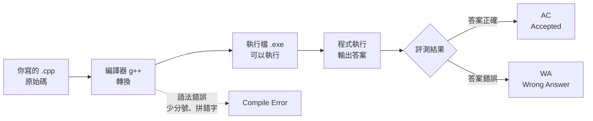
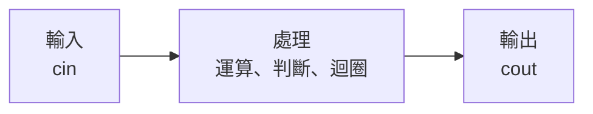
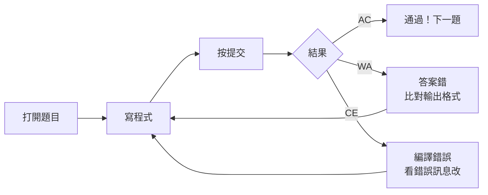

# 第一天 資訊啟蒙

大里 APCS 營隊 · 從第一支程式開始

---
layout: default
---

## 今天的目標

- 知道**電腦是怎麼執行你寫的程式**的
- 寫出人生第一支 C++ 程式
- 學會 `cout` **輸出**、`cin` **輸入**
- 認識所有程式共同的骨架：**輸入 → 處理 → 輸出**
- 在 itouOJ 上完成第一題並通過

<br>

> 今天不求快，只求**跑得起來**。跑起來的那一刻你就是寫程式的人了。

---
layout: section
---

# 開場暖身

---

## 暖身問題

如果今天要計算三天氣溫的平均，你會怎麼把這件事情拆開？

---

## 從想法到程式

<div class="flex flex-col gap-4 mt-8">

<div class="flex items-center gap-4">
<div class="border rounded-lg p-4 w-40 text-center">
保存三天氣溫
</div>

<div class="text-2xl">
→
</div>

<div class="border rounded-lg p-4 w-40 text-center text-blue-500">
變數
</div>
</div>

<div class="flex items-center gap-4" v-click>
<div class="border rounded-lg p-4 w-40 text-center">
加總氣溫<br>÷ 3
</div>

<div class="text-2xl">
→
</div>

<div class="border rounded-lg p-4 w-40 text-center text-green-500">
運算
</div>
</div>

<div class="flex items-center gap-4" v-click>
<div class="border rounded-lg p-4 w-40 text-center">
顯示答案
</div>

<div class="text-2xl">
→
</div>

<div class="border rounded-lg p-4 w-40 text-center text-orange-500">
輸出
</div>
</div>

</div>

---
layout: section
---

# 電腦怎麼看懂你的程式

---

## 什麼是「程式」？

<v-clicks>

- 程式是一連串寫給電腦執行的指令
- 每一行指令都有明確的意思與執行順序
- 電腦不會像人一樣理解「大概的意思」，只能按照規則執行

</v-clicks>

---

## 你寫的字，電腦看不懂

我們寫的是 **原始碼**（source code），電腦只看得懂 **0 和 1**。中間需要一個翻譯官，叫做**編譯器**。



<br>

> **編譯錯誤不是壞事**，它只是在告訴你哪裡寫錯了。

---

## 兩種錯誤，兩種感覺


<div class="grid grid-cols-2 gap-4 mt-4 text-sm">
  <div class="border-l-4 border-red-500 pl-4">
    <div class="font-bold mb-1">編譯期錯誤（CE）</div>
    程式<b>根本沒跑起來</b>。<br/>
    通常是漏了分號、拼錯字、
    括號沒對齊。
  </div>
  <div class="border-l-4 border-orange-500 pl-4">
    <div class="font-bold mb-1">邏輯錯誤(WA)</div>
    程式<b>跑起來了，但答案不對</b>。<br/>
    語法完全沒問題，
    是想法或算式有誤。
  </div>
</div>

---

## 今天用的工具：itouOJ

<v-clicks>

- 我寫的一個 Online Judge

</v-clicks>

---

## 登入 itouOJ

<div class="text-sm">

1. 打開瀏覽器，前往 [**oj.itousouta.me**](https://oj.itousouta.me)
2. 用你的學校的Google帳號登入
3. 確認畫面右上角顯示你的帳號名稱

</div>

<!--
打開 oj.itousouta.me，登入
-->

---

## 找到今天的課程

<div class="text-sm">

1. 點選上方選單的「課程」
2. 找到 **APCS 初級營 Day1｜資訊啟蒙**
3. 確認看得到第 1 題「哈囉，資訊！」

</div>

<!--
再來點上面的「課程」，找到 Day1，確認看得到第一題「哈囉，資訊！
-->

---
layout: section
---

# 第一支程式

---

## 完整程式先看一次

```cpp
#include <iostream>
using namespace std;

int main() {
    cout << "Hello, World!" << endl;
    return 0;
}
```

<div class="mt-6 text-sm opacity-70">

接下來我們一行一行拆開看。

</div>

---

## 逐行拆解①：`#include <iostream>`

```cpp {1}
#include <iostream>
using namespace std;

int main() {
    cout << "Hello, World!" << endl;
    return 0;
}
```

<div class="mt-4 border-l-4 border-blue-500 pl-4 text-sm">

`#include` 是「借工具」的意思。`<iostream>` 是一個裝著輸入輸出工具（`cout`、`cin`）的工具箱。**沒有借，等一下就用不了 `cout`。**

</div>

---

## 逐行拆解②：`using namespace std;`

```cpp {2}
#include <iostream>
using namespace std;

int main() {
    cout << "Hello, World!" << endl;
    return 0;
}
```

<div class="mt-4 border-l-4 border-blue-500 pl-4 text-sm">

`std` 是 C++ 標準工具的「名字空間」。這行等於說：「等一下我打 `cout`，指的就是 `std` 裡面那個 `cout`」，不用每次都寫成很長的 `std::cout`。

</div>

---

## 逐行拆解③：`int main()`

```cpp {4}
#include <iostream>
using namespace std;

int main() {
    cout << "Hello, World!" << endl;
    return 0;
}
```

<div class="mt-4 border-l-4 border-blue-500 pl-4 text-sm">

`main` 是**程式的進入點**。電腦執行你的程式時，一律從 `main` 裡面的第一行開始跑，不管你把其他程式碼寫在哪裡。

</div>

---

## 逐行拆解④：大括號 `{ }`

```cpp {4,7}
#include <iostream>
using namespace std;

int main() {
    cout << "Hello, World!" << endl;
    return 0;
}
```

<div class="mt-4 border-l-4 border-blue-500 pl-4 text-sm">

大括號把「這一段要做的事」包起來。`{` 開始、`}` 結束，中間夾的所有句子，都算是 `main` 要做的事。

</div>

---

## 逐行拆解⑤：`cout` 那一行

```cpp {5}
#include <iostream>
using namespace std;

int main() {
    cout << "Hello, World!" << endl;
    return 0;
}
```

<div class="mt-4 border-l-4 border-blue-500 pl-4 text-sm">

這是真正「做事」的那一行：把雙引號裡的文字，送到螢幕上顯示出來。

</div>

---

## 逐行拆解⑥：分號 `;`

```cpp {5}
#include <iostream>
using namespace std;

int main() {
    cout << "Hello, World!" << endl;
    return 0;
}
```

<div class="mt-4 border-l-4 border-blue-500 pl-4 text-sm">

分號代表「這句話講完了」，就像中文的句號。C++ **不看換行**，只看分號來判斷一句話在哪裡結束。

</div>

---

## 忘記分號會怎樣？

```cpp
cout << "Hello, World!" << endl
return 0;
```

<div class="mt-4 border-l-4 border-red-500 pl-4 text-sm">

編譯器會說「缺少 `;`」，而且**通常指到下一行**（這裡是 `return 0;` 那行），不是真正漏寫分號的那一行。看到這種錯誤，養成習慣：**往上一行找**。

</div>

---

## 逐行拆解⑦：`return 0;`

```cpp {6}
#include <iostream>
using namespace std;

int main() {
    cout << "Hello, World!" << endl;
    return 0;
}
```

<div class="mt-4 border-l-4 border-blue-500 pl-4 text-sm">

告訴作業系統「我正常執行完畢」。`0` 是慣例上代表「沒有錯誤」的數字。現在只要記得每個 `main` 最後都寫 `return 0;` 就好。

</div>

---

## 完整程式再看一次

```cpp
#include <iostream>      // 借輸入輸出工具箱
using namespace std;     // 之後不用寫 std::

int main() {             // 程式從這裡開始
    cout << "Hello!";    // 印出文字
    return 0;            // 正常結束
}
```

<div class="mt-6 text-sm opacity-70">

現在每一行你都看得懂了。這就是你今天要記住的**骨架**，之後每一支程式都長得很像這樣。

</div>

---

## 你的第一支程式

```cpp
#include <iostream>
using namespace std;

int main() {
    cout << "Hello, World!" << endl;
    return 0;
}
```

<div class="mt-6 grid grid-cols-3 gap-3 text-sm">
  <div class="border border-gray-400 border-opacity-40 p-3">
    <div class="opacity-60 text-xs mb-1">cout</div>
    輸出。把資料<b>送到螢幕</b>
  </div>
  <div class="border border-gray-400 border-opacity-40 p-3">
    <div class="opacity-60 text-xs mb-1">&lt;&lt;</div>
    箭頭朝外，<b>資料往螢幕流</b>
  </div>
  <div class="border border-gray-400 border-opacity-40 p-3">
    <div class="opacity-60 text-xs mb-1">endl</div>
    換行。end line 的縮寫
  </div>
</div>

---

## `<<` 的方向就是資料的方向

<div class="my-6 text-center font-mono text-lg">
  <div class="inline-block border-2 border-green-500 px-6 py-3">
    你的資料
  </div>
  <span class="mx-4 text-2xl">→</span>
  <div class="inline-block border-2 border-blue-500 px-6 py-3">
    cout
  </div>
  <span class="mx-4 text-2xl">→</span>
  <div class="inline-block border-2 border-purple-500 px-6 py-3">
    螢幕
  </div>
  
  <div class="mt-2 text-sm opacity-70">
    cout &lt;&lt; 資料（把資料交給 cout 輸出）
  </div>
</div>
<div class="my-6 text-center font-mono text-lg">
  <div class="inline-block border-2 border-blue-500 px-6 py-3">
    鍵盤
  </div>
  <span class="mx-4 text-2xl">→</span>
  <div class="inline-block border-2 border-purple-500 px-6 py-3">
    cin
  </div>
  <span class="mx-4 text-2xl">→</span>
  <div class="inline-block border-2 border-green-500 px-6 py-3">
    你的變數
  </div>

  <div class="mt-2 text-sm opacity-70">
    cin &gt;&gt; 變數（從 cin 讀資料放入變數）
  </div>
</div>

> 記不住方向？看箭頭**指向誰**，資料就是流向誰。

---
layout: fact
---

# 動手做

把上面這支程式，一字不漏打進 Code::Block

執行看看，你應該會看到 `Hello, World!`

---
layout: section
---

# 讓程式聽你的話

---

## `cin` 讀取輸入

```cpp
#include <iostream>
using namespace std;

int main() {
    int age;                // ① 先準備一個盒子
    cin >> age;             // ② 把鍵盤打的數字放進盒子
    cout << age << endl;    // ③ 把盒子裡的東西印出來
    return 0;
}
```

<br>

執行時畫面會**停住等你打字**，按下 Enter 才會繼續。

---

## 逐步拆解①：先宣告變數

```cpp {3}
int main() {
    int age;
    cin >> age;
    cout << age << endl;
    return 0;
}
```

<div class="mt-4 border-l-4 border-blue-500 pl-4 text-sm">

`int age;` 是在跟電腦說：「幫我準備一個叫 `age` 的盒子，裡面要放整數」。這時盒子裡還是空的（其實是垃圾值），只是先佔好位置。

</div>

---

## 為什麼要先宣告？

<v-clicks>

- 電腦的記憶體很大，需要一個**名字**才能找到你要的那一小塊
- 宣告的同時也決定了「這格要放什麼型態的資料」（這裡是整數）
- 沒有先宣告就直接用：編譯器會說它不認識這個名字

</v-clicks>

---

## 逐步拆解②：`cin >>` 那一行

```cpp {4}
int main() {
    int age;
    cin >> age;
    cout << age << endl;
    return 0;
}
```

<div class="mt-4 border-l-4 border-blue-500 pl-4 text-sm">

`cin >> age;` 是「把鍵盤打的東西，放進 `age` 這個盒子」。箭頭 `>>` 指向 `age`，資料就是往 `age` 流過去。

</div>

---

## 執行時畫面會停住

<div class="mt-6 text-sm">

程式跑到 `cin >> age;` 這一行時會**暫停**，等你在鍵盤上打字、按 Enter，才會把值放進 `age`、繼續往下跑。

</div>

---

## 逐步拆解③：印出來

```cpp {5}
int main() {
    int age;
    cin >> age;
    cout << age << endl;
    return 0;
}
```

<div class="mt-4 border-l-4 border-blue-500 pl-4 text-sm">

`cout << age << endl;` 把盒子裡現在的值印出來。如果輸入是 `16`，這裡就會印出 `16`。

</div>

---

## 一次讀好幾個

```cpp
int a, b;
cin >> a >> b;        // 輸入 3 5 → a=3, b=5

string name;
int age;
cin >> name >> age;   // 輸入 Alice 16 → name="Alice", age=16
```

<div class="mt-4 text-sm opacity-70">

`cin` 可以像 `cout` 一樣一直串下去，一次讀好幾個變數。

</div>

---

## `cin >>` 會自動跳過空白和換行

`cin >>` 會自動**跳過空白和換行**。所以底下兩種輸入方式，程式讀到的完全一樣：

<div class="grid grid-cols-2 gap-4 mt-3 font-mono text-sm">
  <div class="border border-gray-400 border-opacity-40 p-3">Alice 16</div>
  <div class="border border-gray-400 border-opacity-40 p-3">Alice<br/>16</div>
</div>

<div class="mt-4 text-sm opacity-70">

不管中間隔的是空格還是換行，`cin >>` 只在乎「下一個看到的一段文字」是什麼。

</div>

---

## 練習：追蹤這段程式

```cpp
int a, b;
cin >> a >> b;
cout << a + b << endl;
cout << a * b << endl;
```

如果輸入是 `3 5`，會印出什麼？

<v-click>

<div class="mt-6 border-l-4 border-green-500 pl-4">

```
8
15
```

`a=3, b=5`，第一行印 `a+b=8`，第二行印 `a*b=15`。

</div>

</v-click>

---
layout: section
---

# 所有程式都是這個骨架

---

## 所有程式都是這個骨架



<div class="mt-6">

```cpp
int a, b;
cin >> a >> b;              // 輸入
int sum = a + b;            // 處理
cout << sum << endl;        // 輸出
```

</div>

<br>

> 接下來四天，變的只有中間那塊「處理」。**輸入和輸出永遠是這樣**。

---

## 為什麼每支程式都逃不出這三步

<v-clicks>

- 程式存在的目的，就是「拿到一些資料、做點什麼、給出結果」
- 拿資料 = 輸入；做什麼 = 處理；給結果 = 輸出
- 差別只在於「處理」那一步在做什麼——這正是接下來要學的內容

</v-clicks>

---

## 舉例：計算機程式屬於哪一步？

計算機讓你輸入兩個數字、選運算符號，然後顯示結果。

<v-click>

<div class="mt-6 border-l-4 border-green-500 pl-4">

**輸入**：兩個數字、運算符號　**處理**：做對應的運算　**輸出**：顯示結果

</div>

</v-click>

---

## 接下來四天：只有「處理」在變

<div class="text-sm">

| 天數         | 處理在學什麼           |
| ------------ | ---------------------- |
| Day1（今天） | 幾乎沒有處理，直接輸出 |
| Day2         | 用 if / else 做決定    |
| Day3         | 用迴圈重複做事         |
| Day4         | 用陣列一次處理一堆資料 |
| Day5         | 把前面全部組合起來     |

</div>

<div class="mt-4 border-l-4 border-yellow-500 pl-4 text-sm">

輸入和輸出的寫法今天學完就不太會變了，之後你可以把力氣全部放在「處理」上。

</div>

---
layout: section
---

# 實作時間

---

## itouOJ 是什麼？

<v-clicks>

- 我寫的一個線上寫程式、線上Judge的網站
- 你交程式碼上去，伺服器幫你**編譯 + 執行**，跟範例答案比對
- 通過所有測資才算 **AC**（Accepted，通過）
- 這五天的題目、課程進度，都在這個網站上

</v-clicks>

---

## 今日題目：哈囉，資訊！

<div class="text-sm opacity-70 mb-2">itouOJ 課程 Day1｜第 1 題</div>

輸入一位新生的**姓名**與**年齡**，印出一句自我介紹。

| 項目 | 內容                                                                  |
| ---- | --------------------------------------------------------------------- |
| 輸入 | 第一行：不含空白的字串 `name`<br/>第二行：整數 `age`（1 ≤ age ≤ 120） |
| 輸出 | `Hello, my name is {name}. I am {age} years old!`                     |

<div class="grid grid-cols-2 gap-4 mt-4 font-mono text-sm">
  <div class="border border-gray-400 border-opacity-40 p-3">
    <div class="opacity-60 text-xs mb-1">範例輸入</div>
    itouSouta<br/>17
  </div>
  <div class="border border-gray-400 border-opacity-40 p-3">
    <div class="opacity-60 text-xs mb-1">範例輸出</div>
    Hello, my name is itouSouta. I am 17 years old!
  </div>
</div>

---

## 讀題第一步：找出「輸入」

<div class="text-sm">

再看一次題目：「第一行：不含空白的字串 name；第二行：整數 age」

</div>

<v-click>

<div class="mt-6 border-l-4 border-green-500 pl-4">

**輸入有兩個東西**：一個字串（姓名）、一個整數（年齡），分別在**兩行**，順序是先姓名再年齡。

</div>

</v-click>

---

## 讀題第二步：找出「輸出」

<div class="text-sm">

再看一次：`Hello, my name is {name}. I am {age} years old!`

</div>

<v-click>

<div class="mt-6 border-l-4 border-green-500 pl-4">

**輸出是一整句話**，裡面嵌入了 name 和 age 兩個變數的值，其他部分都是**固定不變**的文字。

</div>

</v-click>

---

## 讀題第三步：把輸出格式拆開看

```
Hello, my name is itouSouta. I am 16 years old!
└──────┬──────┘    └─┬─┘  └──┬──┘ └┬┘ └────┬────┘
     固定文字       name     固定   age    固定文字
```

<div class="mt-4 border-l-4 border-yellow-500 pl-4 text-sm">

**一個字元都不能差。** 句點、驚嘆號、每個空白都要對。判題是逐字比對的，少一個空白就是錯。

</div>

---

## 動手規劃：需要幾個變數？

<v-click>

<div class="mt-6 border-l-4 border-green-500 pl-4">

兩個：一個存姓名（型態 `string`），一個存年齡（型態 `int`）。

</div>

</v-click>

---

## 動手規劃：變數要宣告成什麼型態？

```cpp
string name;   // 姓名，文字
int age;       // 年齡，整數
```

<div class="mt-4 text-sm opacity-70">

`string` 這個型態專門用來裝文字，今天只要會用就好，細節明天會再深入。

</div>

---

## 動手規劃：先寫出骨架，沒有內容

```cpp
#include <iostream>
#include <string>
using namespace std;

int main() {
    // 這裡等一下要：讀輸入、處理、印輸出
    return 0;
}
```

<div class="mt-4 text-sm opacity-70">

先把骨架搭好，再一步一步把內容填進去，比一次全部寫完更不容易出錯。

</div>

---

## 逐步完成①：加上 cin

```cpp {7,8}
#include <iostream>
#include <string>
using namespace std;

int main() {
    string name;
    int age;
    cin >> name >> age;
    return 0;
}
```

<!--
第一步，加上輸入。宣告兩個變數，一行 `cin` 讀進來。

大家跟著打，我等一下。
-->

---

## 逐步完成②：加上輸出的固定文字

````md magic-move [main.cpp]
```cpp
cout << "Hello, my name is ";
```

```cpp
cout << "Hello, my name is "
     << ". I am "
     << " years old!" << endl;
```
````

<div class="mt-4 text-sm opacity-70">

先把固定不變的部分打出來，中間先留空——等一下把 name、age 接進去。

</div>

<!--
第二步，先把固定不變的文字打出來，中間留空。

好處是你一次只想一件事，先處理不會變的。
-->

---

## 逐步完成③：把 name、age 接進去

````md magic-move [main.cpp]
```cpp
cout << "Hello, my name is "
     << ". I am "
     << " years old!" << endl;
```

```cpp
cout << "Hello, my name is " << name
     << ". I am " << age << " years old!" << endl;
```
````

<div class="mt-4 border-l-4 border-blue-500 pl-4 text-sm">

在該接變數的地方，用 `<<` 把 `name`、`age` 串進去。 `<<` 可以串接**任意多個**文字和變數，順序就是輸出的順序。

</div>

---

## 完整程式：組合起來

```cpp
#include <iostream>
#include <string>
using namespace std;

int main() {
    string name;
    int age;
    cin >> name >> age;
    cout << "Hello, my name is " << name
         << ". I am " << age << " years old!" << endl;
    return 0;
}
```

---

## 在 itouOJ 上交題



<div class="mt-4 text-sm">

課程連結：[**oj.itousouta.me/courses/3**](https://oj.itousouta.me/courses/3)

</div>

---

## 判題結果代表什麼

| 代號  | 全名                | 意思                         |
| ----- | ------------------- | ---------------------------- |
| `AC`  | Accepted            | 通過了 🎉                    |
| `WA`  | Wrong Answer        | 跑完了但答案不對             |
| `CE`  | Compile Error       | 程式有語法錯誤，根本沒跑起來 |
| `TLE` | Time Limit Exceeded | 跑太久（通常是無窮迴圈）     |
| `RE`  | Runtime Error       | 跑到一半爆掉                 |

<br>

> 第一天最常見的是 **CE**（打錯字）和 **WA**（格式沒對齊）。兩個都很正常。

---
layout: fact
---

# 動手做

打開 [oj.itousouta.me → 課程 → Day1](https://oj.itousouta.me/courses/3)

按照剛剛的步驟，寫到 AC 為止
