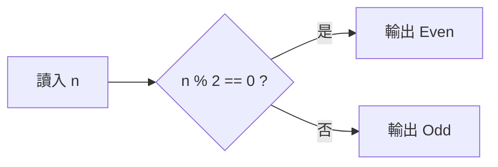

# 第二天 變數與運算子

大里 APCS 營隊 · 資料型態、運算子與流程控制

郭家睿

---
layout: default
---

## 今天的目標

- 認識基本**資料型態**：`int` / `double` / `char` / `bool` / `string`
- 學會**變數**的宣告、初始化與型態轉換
- 熟悉各種**運算子**：算術、遞增遞減、比較、邏輯
- 用 **if / else if / else** 做流程控制
- 完成 itouOJ Day2 的 4 題，**教一段、練一題**

<br>

> 變數是程式的「記憶」，運算子是程式的「思考」，流程控制是程式的「決定」。

---
layout: section
---

# 開場暖身

---

## 回顧昨天

<v-clicks>

- 程式要先**編譯**才能執行；編譯期錯誤 vs 執行期錯誤
- `cout <<` 輸出、`cin >>` 輸入，箭頭指向誰資料就流向誰
- 所有程式都是 **輸入 → 處理 → 輸出**
- 今天要學的，正是「處理」那一步的**第一種能力：做決定**

</v-clicks>

---

## 暖身問題

如果要用中文描述「幫一群學生的成績打等第（90 分以上是 A，80 以上是 B……）」，你會怎麼跟一個完全不懂程式的人解釋這個規則？

<div class="mt-6 text-sm opacity-70">

想 30 秒，等一下公佈參考答案。

</div>

---

## 參考答案

<v-clicks>

1. 先看這個人的分數是不是 90 分以上，是的話就是 A，結束
2. 不是的話，再看是不是 80 分以上，是的話就是 B，結束
3. 不是的話，再看是不是 70 分以上……以此類推
4. 都不是的話，就是最低的等第

</v-clicks>

<div class="mt-6 border-l-4 border-green-500 pl-4" v-click>

這種「先檢查一個條件，不成立才檢查下一個」的邏輯，就是今天的主角：**if / else if / else**。

</div>

---
layout: section
---

# 資料型態

---

## 為什麼需要型態？

<v-clicks>

- 電腦的記憶體只是一堆 0 和 1，本身沒有意義
- **型態**告訴電腦：這塊資料要佔多少空間、該怎麼解讀它
- 同樣是 4 個位元組，當成整數看是一個數字，當成別的看可能完全不同
- 選對型態，除了不浪費記憶體，也能避免很多奇怪的錯誤

</v-clicks>

---

## 變數就是一個貼了標籤的盒子

<div class="grid grid-cols-4 gap-3 my-8 text-center font-mono">
  <div>
    <div class="border-2 border-blue-500 py-6 text-xl">18</div>
    <div class="mt-2 text-sm">age</div>
    <div class="text-xs opacity-60">int · 4 bytes</div>
  </div>
  <div>
    <div class="border-2 border-green-500 py-6 text-xl">3.14</div>
    <div class="mt-2 text-sm">pi</div>
    <div class="text-xs opacity-60">double · 8 bytes</div>
  </div>
  <div>
    <div class="border-2 border-purple-500 py-6 text-xl">'A'</div>
    <div class="mt-2 text-sm">grade</div>
    <div class="text-xs opacity-60">char · 1 byte</div>
  </div>
  <div>
    <div class="border-2 border-orange-500 py-6 text-xl">"itou"</div>
    <div class="mt-2 text-sm">name</div>
    <div class="text-xs opacity-60">string · 不定</div>
  </div>
</div>

**型態**決定了：這個盒子**多大**、裡面的 0 和 1 要**怎麼解讀**。

---

## 基本資料型態

| 型別     | 說明     | 範例值          | 大約範圍         |
| -------- | -------- | --------------- | ---------------- |
| `int`    | 整數     | `42`, `-7`      | 約 ±21 億        |
| `double` | 浮點數   | `3.14159`       | 約 15 位有效數字 |
| `char`   | 單一字元 | `'A'`, `'9'`    | 一個字元         |
| `bool`   | 布林值   | `true`, `false` | 只有兩種值       |
| `string` | 字串     | `"Hello"`       | 任意長度文字     |

<br>

> 小數一律用 `double`，不要用 `float`——`float` 只有約 7 位有效數字，很容易算錯。

---

## `int`：整數

```cpp
int age = 16;
int score = -5;      // 可以是負的
int count = 0;
```

<div class="mt-4 text-sm opacity-70">

沒有小數點的數字都用 `int`。範圍大約 ±21 億，今天的題目都在這個範圍內，之後遇到更大的數字才需要換成 `long long`（今天先不用）。

</div>

---

## `double`：浮點數

```cpp
double pi = 3.14159;
double average = 87.5;
double temperature = -3.2;   // 也可以是負的
```

<div class="mt-4 text-sm opacity-70">

只要牽涉到**小數點**，一律用 `double`。等一下會看到， `int` 除以 `int` 是會把小數捨去的，這是今天最重要的踩雷點之一。

</div>

---

## `char`：單一字元

```cpp
char grade = 'A';
char op = '+';
```

<div class="mt-4 border-l-4 border-yellow-500 pl-4 text-sm">

`char` 只能裝**一個**字元，而且要用**單引號** `' '`，不是雙引號。 `'A'` 是 `char`，`"A"` 是只有一個字的 `string`，兩者不一樣。

</div>

---

## `bool`：布林值

```cpp
bool isStudent = true;
bool isRaining = false;
```

<div class="mt-4 text-sm opacity-70">

只有 `true`（成立）和 `false`（不成立）兩種值，通常用來存「條件成不成立」，今天的 if 判斷式算出來的結果，本質上就是一個 `bool`。

</div>

---

## `string`：字串

```cpp
string name = "itouSouta";
string city = "Taichung";
```

<div class="mt-4 text-sm opacity-70">

用**雙引號** `" "` 包起來的一串文字。今天不會深入 `string` 的細節，先會宣告、讀取、輸出就夠用，第四天會再深入。

</div>

---

## float 與 double 的差異

```cpp
float  a = 0.1234567890123456;
double b = 0.1234567890123456;

cout.precision(17);
cout << a << endl;  // 0.12345679104328156  ← 後面開始不準
cout << b << endl;  // 0.12345678901234560  ← 比較準
```

<div class="mt-4 border-l-4 border-yellow-500 pl-4 text-sm">

`float` 只有約 7 位有效數字，`double` 約 15 位。\*\*記不住就用 `double`，今天以後你寫的每一個小數都建議用 `double`。

</div>

---

## 小測驗：該用哪個型態？

要存「一位學生的身高（例如 175.5 公分）」，該用哪個型態？

<v-click>

<div class="mt-6 border-l-4 border-green-500 pl-4">`double`——身高有小數點。</div>

</v-click>

---

## 小測驗：該用哪個型態？（二）

要存「今天是不是週末」，該用哪個型態？

<v-click>

<div class="mt-6 border-l-4 border-green-500 pl-4">`bool`——只有「是」或「不是」兩種可能。</div>

</v-click>

---

## 變數宣告與初始化

```cpp
int a;          // 宣告：先佔位，值不確定（垃圾值）
a = 10;         // 賦值：把值放進去

int b = 20;     // 宣告同時初始化（建議！）
int x = 1, y = 2, z = 3;   // 一次宣告多個
```

<div class="mt-4 border-l-4 border-yellow-500 pl-4">

養成「**宣告就初始化**」的習慣。沒初始化的變數裡面是上一個程式留下的垃圾，在你的電腦上剛好是 0，在判題機上可能是 −858993460。

</div>

---

## 常見錯誤：忘記初始化就使用

```cpp
int sum;
cout << sum << endl;   // 忘記先給值，印出垃圾值
```

<div class="mt-4 border-l-4 border-red-500 pl-4 text-sm">

這種錯誤**編譯不會報錯**，程式能跑，但答案是隨機的垃圾值。是最難抓的一種錯誤，因為看起來「有印出東西」，容易被忽略。

</div>

---
layout: section
---

# 運算子基礎

---

## 算術運算子

```cpp
int a = 17, b = 5;

cout << a + b;   // 22
cout << a - b;   // 12
cout << a * b;   // 85
cout << a / b;   // 3   （整數除法，捨去小數）
cout << a % b;   // 2   （餘數 modulo）
```

<div class="mt-4 text-sm opacity-70">

`+ - *` 跟數學一樣好懂，`/` 等一下會講陷阱，`%` 是今天的新面孔。

</div>

---

## `%` 餘數：怎麼算出來的

```cpp
17 % 5
```

<div class="mt-4 text-sm">

17 除以 5，商是 3、餘數是 2（因為 `5 × 3 = 15`，`17 − 15 = 2`）。 `%` 拿到的就是這個**餘數**。

</div>

<div class="mt-4 grid grid-cols-4 gap-2 text-center font-mono text-sm">
  <div class="border border-gray-400 border-opacity-40 p-2">10 % 3<br/><b>1</b></div>
  <div class="border border-gray-400 border-opacity-40 p-2">9 % 3<br/><b>0</b></div>
  <div class="border border-gray-400 border-opacity-40 p-2">7 % 7<br/><b>0</b></div>
  <div class="border border-gray-400 border-opacity-40 p-2">3 % 7<br/><b>3</b></div>
</div>

---

## `%` 的兩個常見用途

<v-clicks>

- **判斷整除 / 倍數**：`n % 3 == 0` 代表 n 是 3 的倍數（餘數是 0）
- **判斷奇偶數**：`n % 2 == 0` 是偶數，`n % 2 != 0` 是奇數
- **取出末位數字**：`n % 10` 拿到 n 的個位數（明天翻轉數字會用到）

</v-clicks>

---

## 小測驗：`%` 的計算

`23 % 5` 等於多少？

<v-click>

<div class="mt-6 border-l-4 border-green-500 pl-4">`3`——`23 = 5 × 4 + 3`，餘數是 3。</div>

</v-click>

---
layout: section
---

# if 基礎

---

## if 是什麼

<v-clicks>

- `if` 讓程式**檢查一個條件**，成立才執行接下來的程式
- 條件寫在 `if` 後面的括號裡，結果一定是 `true` / `false`
- 只有條件成立（true）時，大括號裡的內容才會被執行

</v-clicks>

---

## 只有 if，沒有 else 會怎樣

```cpp
int score = 45;

if (score < 60) {
    cout << "不及格" << endl;
}
cout << "考試結束" << endl;
```

<div class="mt-4 text-sm opacity-70">

沒有 `else` 也完全合法。條件不成立的話，就直接跳過大括號，往下繼續執行 `if` 之後的程式碼。

</div>

---

## if / else：讓程式做決定



```cpp
if (n % 2 == 0) cout << "Even" << endl;
else            cout << "Odd"  << endl;
```

---

## else 什麼時候會觸發

<v-clicks>

- `else` 只有在 `if` 的條件**不成立**時才會執行
- 一個 `if` 最多只能配一個 `else`
- `if` 和 `else` 是**互斥**的：兩者當中一定剛好執行一個

</v-clicks>

---
layout: section
---

# 練習時間

---

## 第 2 題　判斷奇偶數

輸入一個整數，判斷奇數還是偶數。

| 輸入 | 一行一個整數 n（−10⁹ ≤ n ≤ 10⁹） |
| ---- | -------------------------------- |
| 輸出 | 偶數輸出 `Even`，否則輸出 `Odd`  |

<div class="grid grid-cols-2 gap-4 my-4 font-mono text-sm">
  <div class="border border-gray-400 border-opacity-40 p-3">
    <div class="opacity-60 text-xs mb-1">輸入</div>7
  </div>
  <div class="border border-gray-400 border-opacity-40 p-3">
    <div class="opacity-60 text-xs mb-1">輸出</div>Odd
  </div>
</div>

<div class="mt-2 text-sm opacity-70">

剛好用到你剛學的**兩樣東西**：`%` 運算子和 `if / else`。

</div>

---

## 第 2 題　讀題

<v-clicks>

- **輸入**：一個整數，可能是負數
- **輸出**：`Even` 或 `Odd`，注意大小寫
- **處理**：只需要判斷一次，用 `%` 檢查能不能被 2 整除

</v-clicks>

---

## 第 2 題　規劃程式骨架

```cpp
#include <iostream>
using namespace std;

int main() {
    int n;
    cin >> n;
    // 這裡判斷奇偶，輸出結果
    return 0;
}
```

---

## 第 2 題　完成判斷

```cpp
if (n % 2 == 0) cout << "Even" << endl;
else            cout << "Odd" << endl;
```

<div class="mt-4 border-l-4 border-red-500 pl-4 text-sm">

**負數陷阱**：`-7 % 2` 在 C++ 是 `-1`，不是數學上習慣的 `1`。如果寫成 `n % 2 == 1` 判斷奇數，負的奇數會判斷失敗。 **永遠用 `n % 2 == 0` 判斷偶數**，其餘情況自然就是奇數，比較安全。

</div>

---

## 第 2 題　完整程式

```cpp
#include <iostream>
using namespace std;

int main() {
    int n;
    cin >> n;
    if (n % 2 == 0) cout << "Even" << endl;
    else            cout << "Odd" << endl;
    return 0;
}
```

<div class="mt-4 text-sm opacity-70">

注意大小寫：是 `Even` / `Odd`，不是 `even` / `odd`。判題逐字比對。

</div>

---
layout: fact
---

# 動手做

打開 oj.itousouta.me → 課程 Day2 → 第 2 題

寫到 AC 為止，再往下聽

---
layout: section
---

# if 重複使用的技巧

---

## 先假設，再逐一比較更新

<v-clicks>

- 先假設第一個數字最大，記在一個變數裡
- 拿第二個數字跟目前記的最大值比，比較大就換掉
- 拿第三個數字再比一次
- 走完所有數字，記下來的就是真正的最大值

</v-clicks>

<div class="mt-4 border-l-4 border-blue-500 pl-4 text-sm" v-click>

注意：這裡是**兩個獨立的 if**，不是 if/else——因為每一次比較都是「獨立事件」，跟前一次比較的結果無關。

</div>

---

## 第 3 題　三數取最大值

輸入三個整數，輸出最大的一個。

<div class="grid grid-cols-2 gap-4 my-4 font-mono text-sm">
  <div class="border border-gray-400 border-opacity-40 p-3">
    <div class="opacity-60 text-xs mb-1">輸入</div>3 7 5
  </div>
  <div class="border border-gray-400 border-opacity-40 p-3">
    <div class="opacity-60 text-xs mb-1">輸出</div>7
  </div>
</div>

---

## 第 3 題　逐步追蹤

輸入 `3 7 5` 時：

| 步驟     | 動作                | ans |
| -------- | ------------------- | --- |
| 開始     | 假設 a=3 最大       | 3   |
| 檢查 b=7 | 7 > 3，換成 7       | 7   |
| 檢查 c=5 | 5 > 7？不成立，不換 | 7   |

<div class="mt-4 text-sm opacity-70">

走完三個數字，`ans` 是 `7`，就是答案。

</div>

---

## 第 3 題　程式

```cpp
int a, b, c;
cin >> a >> b >> c;

int ans = a;                 // 先假設 a 最大
if (b > ans) ans = b;        // b 更大就換成 b
if (c > ans) ans = c;        // c 更大就換成 c

cout << ans << endl;
```

<div class="mt-4 border-l-4 border-yellow-500 pl-4 text-sm">

這個「**先假設，再逐一比較更新**」的招式，第四天找陣列最大值時會原封不動再用一次。

</div>

---
layout: fact
---

# 動手做

打開 oj.itousouta.me → 課程 Day2 → 第 3 題

寫到 AC 為止，再往下聽

---
layout: fact
---

# 中場休息

15 分鐘後回來，我們進入運算子與流程控制的進階內容

---
layout: section
---

# 運算子進階

---

## 遞增與遞減

```cpp
int n = 10;

n++;     // n = 11   等同 n = n + 1
n--;     // n = 10   等同 n = n - 1
```

<div class="mt-4 text-sm opacity-70">

`++` 讓變數自己加 1，`--` 讓變數自己減 1。這是「複合指定運算子」的一種，之後寫迴圈時（明天）會天天用到。

</div>

---

## 前置 vs 後置：`++n` 跟 `n++` 差在哪

```cpp
int n = 5;
cout << n++;   // 印出 5，之後 n 變成 6（先用舊值，再加）
cout << ++n;   // 印出 7，因為先加，n 變成 7 再印
```

<div class="mt-4 border-l-4 border-yellow-500 pl-4 text-sm">

差別只在「單獨一行使用」時看不出來，兩者都會讓 n 加 1。差別只有在**跟其他運算式混用**、當下就要用到那個值的時候才會顯現。今天先知道兩種寫法都存在，之後看到 `++n` 不要慌。

</div>

---

## 複合指定運算子

```cpp
int n = 10;

n += 5;  // n = n + 5  → 15
n -= 3;  // n = n - 3  → 12
n *= 2;  // n = n * 2  → 24
n %= 5;  // n = n % 5  → 4
```

<div class="mt-4 text-sm opacity-70">

`n += 5` 是 `n = n + 5` 的簡寫，其他三個同理。寫起來更短，意思一樣。

</div>

---

## 比較運算子

```cpp
int a = 10, b = 3;

cout << (a > b);    // 1 (true)
cout << (a < b);    // 0 (false)
cout << (a >= b);   // 1
cout << (a <= b);   // 0
cout << (a == b);   // 0   ← 兩個等號才是「相等」
cout << (a != b);   // 1   ← 不等於
```

<div class="mt-4 text-sm opacity-70">

比較運算子算出來的結果永遠是 `bool`（`true` 或 `false`）， `cout` 印出來會顯示成 `1` 或 `0`。

</div>

---

## `==` vs `=`：最常見的錯誤

```cpp
if (a = 5) { ... }   // ❌ 這是賦值，不是比較！
if (a == 5) { ... }  // ✅ 這才是「a 是不是等於 5」
```

<div class="mt-4 border-l-4 border-red-500 pl-4 text-sm">

`if (a = 5)` 不是在問「a 等於 5 嗎」，而是**把 5 塞進 a**，而且賦值運算式的結果永遠是 `true`（因為 5 不是 0），所以這個 if 會**永遠成立**，是很難發現的邏輯錯誤。

</div>

---

## 邏輯運算子

```cpp
bool sunny = true, weekend = false;

cout << (sunny && weekend);  // false   AND：兩個都要成立
cout << (sunny || weekend);  // true    OR ：至少一個成立
cout << (!sunny);            // false   NOT：反過來
```

<div class="mt-4 text-sm opacity-70">

`&&`、`||`、`!` 讓你把多個條件組合成一個。

</div>

---

## `&&`（AND）真值表

| a     | b     | a && b   |
| ----- | ----- | -------- |
| true  | true  | **true** |
| true  | false | false    |
| false | true  | false    |
| false | false | false    |

<div class="mt-4 text-sm opacity-70">

只有**兩個都成立**，結果才是 true。

</div>

---

## `||`（OR）真值表

| a     | b     | a \|\| b  |
| ----- | ----- | --------- |
| true  | true  | true      |
| true  | false | true      |
| false | true  | true      |
| false | false | **false** |

<div class="mt-4 text-sm opacity-70">

只要**其中一個成立**，結果就是 true。只有兩個都不成立才是 false。

</div>

---

## 實際應用：判斷分數在範圍內

```cpp
int score = 85;
bool valid = (score >= 60 && score <= 100);  // true
```

<div class="mt-4 text-sm opacity-70">

要「同時滿足兩個條件」，就用 `&&` 把它們接起來。這裡要求 score 同時大於等於 60、且小於等於 100。

</div>

---

## 運算子優先順序

```cpp
cout << 2 + 3 * 4;        // 14，不是 20（先乘除後加減）
cout << (2 + 3) * 4;      // 20，括號優先
```

<div class="mt-4 border-l-4 border-yellow-500 pl-4 text-sm">

跟數學一樣：先乘除後加減；比較運算子（`>` `<` `==`）比邏輯運算子（`&&` `||`）先算。 **不確定的時候，加括號就對了**——多加括號不會扣分，順序算錯才會。

</div>

---

## 小測驗：這樣算出來是？

```cpp
cout << 10 - 2 * 3;
```

<v-click>

<div class="mt-6 border-l-4 border-green-500 pl-4">`4`——先算 `2 * 3 = 6`，再算 `10 - 6 = 4`。</div>

</v-click>

---

## 小測驗：這樣呢？

```cpp
int a = 6;
cout << (a % 2 == 0 && a > 5);
```

<v-click>

<div class="mt-6 border-l-4 border-green-500 pl-4">

`1`（true）\*\*——`a % 2 == 0` 是 true（6 是偶數），`a > 5` 也是 true，兩個都成立，`&&` 結果是 true。

</div>

</v-click>

---
layout: section
---

# if / else if / else 完整鏈

---

## if / else if / else

```cpp
int score = 85;

if (score >= 90) {
    cout << "A" << endl;
} else if (score >= 80) {
    cout << "B" << endl;     // ← 執行這個
} else if (score >= 60) {
    cout << "C" << endl;
} else {
    cout << "F" << endl;
}
```

<div class="mt-4 border-l-4 border-yellow-500 pl-4">

由上往下檢查，**第一個成立的就執行**，後面全部跳過。

</div>

---

## 順序陷阱：換個順序會怎樣

```cpp
int score = 95;

if (score >= 60) {
    cout << "C" << endl;     // ← 95 分也會走到這裡！
} else if (score >= 80) {
    cout << "B" << endl;
} else if (score >= 90) {
    cout << "A" << endl;
}
```

<div class="mt-4 border-l-4 border-red-500 pl-4 text-sm">

95 分明明應該是 A，但因為 `score >= 60` 被放在**最前面**，95 分也滿足這個條件，程式在這裡就停下來輸出 C 了，後面的判斷根本不會執行。 **條件要由嚴格到寬鬆排序。**

</div>

---

## 逐步追蹤：為什麼順序錯了會這樣

<div class="text-sm">

程式檢查條件是**由上往下、找到第一個成立的就停**：

</div>

| 檢查順序 | 條件          | score=95 成立嗎 | 結果           |
| -------- | ------------- | --------------- | -------------- |
| 1        | `score >= 60` | ✅ 成立         | 印 C，**停止** |
| 2        | `score >= 80` | 不會執行到      | —              |
| 3        | `score >= 90` | 不會執行到      | —              |

<div class="mt-4 text-sm opacity-70">

正確的寫法要把**最嚴格**（`>= 90`）的條件放在最前面，這樣只有真正達到那個門檻的人才會被攔截下來。

</div>

---

## 巢狀 if：if 裡面還有 if

```cpp
int age = 20;
bool hasTicket = true;

if (age >= 18) {
    if (hasTicket) {
        cout << "可以入場" << endl;
    } else {
        cout << "請先買票" << endl;
    }
} else {
    cout << "未成年不得入場" << endl;
}
```

<div class="mt-4 text-sm opacity-70">

`if` 裡面可以再放 `if`，用來表達「先滿足一個條件，才需要再檢查下一個」。今天的題目不會用到，但之後很常見，先看過一次有印象。

</div>

---

## 小測驗：這段程式會印出什麼？

```cpp
int x = 7;
if (x > 10) cout << "大";
else if (x > 5) cout << "中";
else cout << "小";
```

<v-click>

<div class="mt-6 border-l-4 border-green-500 pl-4">`中`——`x > 10` 不成立，`x > 5` 成立（7 > 5），印出「中」後停止。</div>

</v-click>

---
layout: section
---

# 練習時間

---

## 第 4 題　簡易計算機

輸入兩個整數與一個運算子，輸出結果。

<div class="grid grid-cols-2 gap-4 text-sm">
<div>

| 輸入 | `a op b`，op ∈ `+ − * /` |
| ---- | ------------------------ |
| 輸出 | 計算結果，或 `Error`     |

</div>
<div class="font-mono border border-gray-400 border-opacity-40 p-3">
輸入　6 * 7<br/>輸出　42
</div>
</div>

<div class="mt-2 text-sm opacity-70">

這題會用到今天教的**所有運算子**，再配上完整的 if/else if 鏈。

</div>

---

## 第 4 題　讀題：兩個要注意的地方

<v-clicks>

- 運算子是 `char` 型態，讀進來會是 `'+' '-' '*' '/'` 其中一個
- 除法**有兩個額外規則**：除以 0 要輸出 `Error`；其餘情況做整數除法

</v-clicks>

---

## 第 4 題　規劃骨架

```cpp
#include <iostream>
using namespace std;

int main() {
    int a, b;
    char op;
    cin >> a >> op >> b;
    // 這裡依照 op 做對應運算
    return 0;
}
```

---

## 第 4 題　處理加減乘

```cpp
if      (op == '+') cout << a + b << endl;
else if (op == '-') cout << a - b << endl;
else if (op == '*') cout << a * b << endl;
```

<div class="mt-4 text-sm opacity-70">

三種運算子都用字元的**單引號**比較：`op == '+'`，不是 `op == "+"`。

</div>

---

## 第 4 題　處理除法（含除以 0）

```cpp
else if (op == '/') {
    if (b == 0) cout << "Error" << endl;   // ← 別忘了！
    else        cout << a / b << endl;     // 整數除法
}
```

<div class="mt-4 border-l-4 border-red-500 pl-4 text-sm">

**除以 0** 數學上沒有定義，程式如果直接算會當掉（RE）。一定要先檢查 `b == 0`，輸出 `Error`，其餘情況才做除法。

</div>

---

## 第 4 題　除法是整數除法

<div class="text-sm">

題目說「無條件捨去小數部分」。`7 / 2` 要輸出 `3`。

</div>

<div class="mt-4 border-l-4 border-yellow-500 pl-4 text-sm">

這題**不要**轉成 `double`——這裡用 `int` 直接除才是正確答案，轉型反而會出錯。先讀懂題目要的是哪一種除法，再決定要不要轉型（等一下 BMI 那題就剛好相反，會需要轉型）。

</div>

---

## 第 4 題　完整程式

```cpp
int a, b;
char op;
cin >> a >> op >> b;

if      (op == '+') cout << a + b << endl;
else if (op == '-') cout << a - b << endl;
else if (op == '*') cout << a * b << endl;
else if (op == '/') {
    if (b == 0) cout << "Error" << endl;
    else        cout << a / b << endl;
}
```

---
layout: fact
---

# 動手做

打開 oj.itousouta.me → 課程 Day2 → 第 4 題

寫到 AC 為止，再往下聽

---
layout: section
---

# 常數與型別轉換

---

## 常數：宣告後不能再改

```cpp
const double PI = 3.14159;
const int MAX_SCORE = 100;

PI = 3.14;   // ❌ 編譯錯誤：不能修改常數
```

<div class="mt-4 text-sm opacity-70">

`const` 是「常數」的意思。宣告時給一次值之後，**整支程式都不能再改**。編譯器會幫你把這個規則守住，改了就報錯。

</div>

---

## 為什麼要用常數？

<v-clicks>

- 有些值本來就**不該被改**（例如圓周率、及格分數）
- 用 `const` 宣告，如果不小心手滑寫錯改到它，編譯器會馬上抓到
- 比起用一般變數，`const` 讓別人看你的程式碼時**一眼看出這是固定值**

</v-clicks>

---

## 型別轉換是什麼

```cpp
double x = 9.7;
int y = (int)x;        // y = 9，小數直接捨去（不是四捨五入！）
```

<div class="mt-4 border-l-4 border-yellow-500 pl-4 text-sm">

`(int)x` 叫做**強制轉型**，把 `double` 硬轉成 `int`。規則很單純：**直接捨去小數點後面**，不會四捨五入。`9.7` 變成 `9`，`9.99` 也會變成 `9`。

</div>

---

## 整數除法：最常見的踩雷點

```cpp
int a = 5, b = 2;

cout << a / b;              // 2    ← 不是 2.5！
cout << (double)a / b;      // 2.5  ← 先轉型再除
```

<div class="mt-4 grid grid-cols-3 gap-3 text-center text-sm">
  <div class="border border-red-500 border-opacity-60 p-3">
    <div class="font-mono text-lg">5 / 2</div>
    <div class="opacity-60">兩邊都是 int</div>
    <div class="font-bold">= 2</div>
  </div>
  <div class="border border-green-500 border-opacity-60 p-3">
    <div class="font-mono text-lg">5.0 / 2</div>
    <div class="opacity-60">有一邊是小數</div>
    <div class="font-bold">= 2.5</div>
  </div>
  <div class="border border-green-500 border-opacity-60 p-3">
    <div class="font-mono text-lg">(double)5 / 2</div>
    <div class="opacity-60">明確轉型</div>
    <div class="font-bold">= 2.5</div>
  </div>
</div>

---

## 為什麼 `5 / 2` 是 `2` 不是 `2.5`？

<v-clicks>

- C++ 看到 `int / int`，會認定「你要的也是 int」
- 於是先算出真正的商 `2.5`，再把小數部分整個丟掉，只留 `2`
- 只要算式裡\*\*有一邊是 `double`，結果就會是 `double`，才會有小數
- 這也是為什麼 `(double)a / b` 要轉的是**其中一個**，不用兩個都轉

</v-clicks>

---

## 小測驗：這樣算出來是多少？

```cpp
int a = 7, b = 2;
cout << a / b << endl;
```

<v-click>

<div class="mt-6 border-l-4 border-green-500 pl-4">`3`——`7 / 2` 數學上是 3.5，兩邊都是 int，捨去小數變成 3。</div>

</v-click>

---

## 小測驗：這樣呢？

```cpp
int a = 7, b = 2;
cout << (double)a / b << endl;
```

<v-click>

<div class="mt-6 border-l-4 border-green-500 pl-4">`3.5`——轉型成 double 之後再除，小數就保留下來了。</div>

</v-click>

---
layout: section
---

# 練習時間

---

## 第 5 題　BMI 分級

輸入體重（公斤）與身高（**公分**），計算 BMI 並分級。

<div class="my-4 text-center font-mono text-lg">
BMI = 體重 ÷ 身高(公尺)²
</div>

<div class="flex text-center text-sm my-6">
  <div class="flex-1 border-t-4 border-blue-400 pt-2">
    <div class="font-bold">過輕</div><div class="opacity-60">&lt; 18.5</div>
  </div>
  <div class="flex-1 border-t-4 border-green-500 pt-2">
    <div class="font-bold">正常</div><div class="opacity-60">18.5 ~ 24</div>
  </div>
  <div class="flex-1 border-t-4 border-yellow-500 pt-2">
    <div class="font-bold">過重</div><div class="opacity-60">24 ~ 27</div>
  </div>
  <div class="flex-1 border-t-4 border-red-500 pt-2">
    <div class="font-bold">肥胖</div><div class="opacity-60">≥ 27</div>
  </div>
</div>

---

## 第 5 題　讀題：單位陷阱

<div class="border-l-4 border-red-500 pl-4 text-sm">

輸入是**公分**，公式要的是**公尺**。而且身高讀進來是 `int`——直接寫 `h / 100` 會得到整數 `1`（175 除以 100 捨去小數），175 公分就變成了 1 公尺，算出來的 BMI 會離譜地大。要寫 `h / 100.0`。

</div>

---

## 第 5 題　規劃骨架

```cpp
#include <iostream>
using namespace std;

int main() {
    int w, h;
    cin >> w >> h;
    // 這裡把公分轉成公尺，算 BMI，再分級輸出
    return 0;
}
```

---

## 第 5 題　算出 BMI

```cpp
double m = h / 100.0;          // ← 100.0 不是 100
double bmi = w / (m * m);      // w 是 int，但除以 double 會自動轉
```

<div class="mt-4 text-sm opacity-70">

`w` 雖然是 `int`，但除以一個 `double`（`m * m`）時會自動轉型，結果自然是 `double`，不需要額外手動轉型。

</div>

---

## 第 5 題　分級輸出

```cpp
if      (bmi < 18.5) cout << "過輕" << endl;
else if (bmi < 24)   cout << "正常" << endl;
else if (bmi < 27)   cout << "過重" << endl;
else                 cout << "肥胖" << endl;
```

<div class="mt-4 border-l-4 border-yellow-500 pl-4 text-sm">

由上往下檢查的特性讓條件可以寫得很短：能走到第二個 `else if` 就代表 `bmi >= 18.5` 已經成立，不必再寫一次。

</div>

---

## 第 5 題　完整程式

```cpp
int w, h;
cin >> w >> h;

double m = h / 100.0;
double bmi = w / (m * m);

if      (bmi < 18.5) cout << "過輕" << endl;
else if (bmi < 24)   cout << "正常" << endl;
else if (bmi < 27)   cout << "過重" << endl;
else                 cout << "肥胖" << endl;
```

---
layout: fact
---

# 動手做

打開 oj.itousouta.me → 課程 Day2 → 第 5 題

寫到 AC 為止——今天 4 題全部完成！

---
layout: fact
---

# 🍱 短暫休息

10 分鐘後回來

---
layout: section
---

# 隨堂小測驗

---

## Q1

`int a = 5, b = 2; cout << a / b;` 會印出什麼？

<v-click>

<div class="mt-6 border-l-4 border-green-500 pl-4">`2`——兩邊都是 int，整數除法捨去小數。</div>

</v-click>

---

## Q2

`if (score = 90)` 這樣寫有什麼問題？

<v-click>

<div class="mt-6 border-l-4 border-green-500 pl-4">**把比較 `==` 寫成賦值 `=`，這行會把 90 塞進 score，而且條件永遠成立。</div>

</v-click>

---

## Q3

`-9 % 2` 在 C++ 是多少？

<v-click>

<div class="mt-6 border-l-4 border-green-500 pl-4">`-1`，不是 `1`。判斷偶數要用 `n % 2 == 0`，不要用 `n % 2 == 1` 判斷奇數。</div>

</v-click>

---

## Q4

`else if` 的條件為什麼要**由嚴格到寬鬆**排列？

<v-click>

<div class="mt-6 border-l-4 border-green-500 pl-4">因為程式由上往下檢查，**第一個成立的就停止**。如果寬鬆的條件放前面，
會提早攔截該屬於更嚴格條件的情況。</div>

</v-click>

---

## Q5

`&&` 和 `||` 的差別是什麼？

<v-click>

<div class="mt-6 border-l-4 border-green-500 pl-4">`&&`（AND）**兩個條件都要成立；`||`（OR）**只要一個成立就夠了。</div>

</v-click>

---
layout: section
---

# 分組討論

---

## 討論①

BMI 那一題，如果拿到 `else if (bmi < 18.5)` 這種寫法漏掉一個邊界（例如剛好 18.5），你會怎麼設計一組測試資料去抓出這種錯誤？

---

## 討論②

跟旁邊同學交換程式碼，檢查對方的 `if / else if` 條件順序有沒有排錯，互相唸出每個條件的「門檻」聽聽看順序合不合理。

---
layout: section
---

# 今日重點回顧

---

## 回顧①：型態

<v-clicks>

- 整數用 `int`，小數用 `double`，文字用 `string`，單一字元用 `char`
- `bool` 只有 `true` / `false` 兩種值
- 不確定用什麼型態時，先想「這個值會不會有小數點」

</v-clicks>

---

## 回顧②：變數與轉型

<v-clicks>

- 宣告就初始化，避免垃圾值
- `const` 宣告的常數不能再修改
- **整數 / 整數會捨去小數** → 要算平均、BMI 記得寫 `100.0`

</v-clicks>

---

## 回顧③：運算子

<v-clicks>

- `%` 餘數可以判斷奇偶、判斷倍數、取出末位數字
- 比較相等是 `==`（兩個等號），別跟賦值 `=` 搞混
- `&&` 兩個都要成立，`||` 一個成立就夠

</v-clicks>

---

## 回顧④：流程控制

<v-clicks>

- `if / else if / else` 由上往下，**第一個成立的執行**
- 條件順序很重要：**由嚴格到寬鬆**排列
- 輸出的**大小寫與拼字要跟題目一模一樣**

</v-clicks>

---

## 回顧⑤：今天的節奏

<div class="text-sm">

| 教了什麼                       | 馬上練  |
| ------------------------------ | ------- |
| 運算子基礎 + if 基礎           | 第 2 題 |
| if 重複使用的技巧              | 第 3 題 |
| 運算子進階 + if/else if 完整鏈 | 第 4 題 |
| 常數與型別轉換                 | 第 5 題 |

</div>

<div class="mt-4 text-sm opacity-70">

這種「教一段、練一題」的方式，明天開始也會延續下去。

</div>

---

## 明天預告

<div class="text-lg mt-6">

明天我們用「迴圈」讓電腦幫我們**重複做**幾千幾萬次事情。

</div>

<div class="mt-6 text-sm opacity-70">

今天的 if / else 讓程式會「做一次決定」，明天的迴圈讓程式「一直做決定、一直重複」，兩個合起來威力會非常大。

</div>

---
layout: statement
---

# 謝謝大家

明天見
