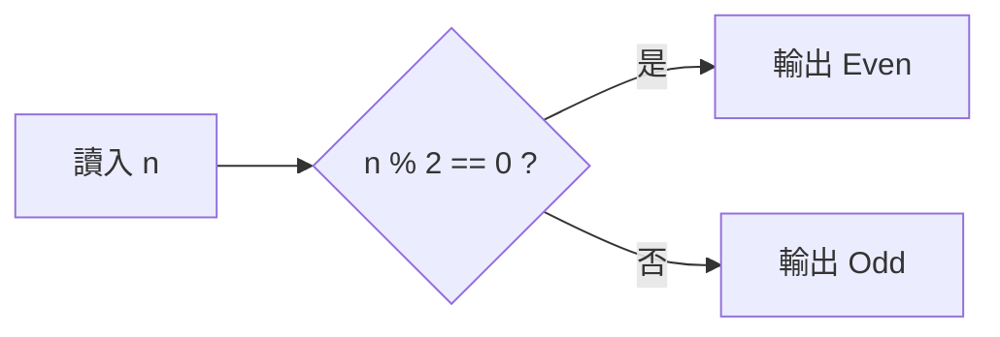

# 第二天 變數與運算子

大里 APCS 營隊 · 資料型態、運算子與流程控制

郭家睿

---
layout: default
---

## 今天的目標

- 認識基本**資料型態**：`int` / `double` / `char` / `bool` / `string`
- 學會**變數**的宣告、初始化與型態轉換
- 熟悉各種**運算子**：算術、遞增遞減、比較、邏輯
- 用 **if / else if / else** 做流程控制
- 完成 itouOJ Day2 的 4 題，**教一段、練一題**

<br>

> 變數是程式的「記憶」，運算子是程式的「思考」，流程控制是程式的「決定」。

<!--
先講一下今天要學什麼好了

昨天我們讓程式會講話、會聽話，你輸入甚麼，他就對應輸出甚麼

今天要讓它自己判斷——同樣一支程式，你餵不同的資料進去，它會走不同的路

要做到這件事需要兩樣東西：一個是變數跟型態，也就是程式怎麼「記住」資料

另一個是運算子跟 if，也就是程式怎麼思考和判斷。
-->

---
layout: section
---

# 開場暖身

<!--
（過場）
-->

---

## 回顧昨天

<v-clicks>

- 程式要先**編譯**才能執行；編譯期錯誤 vs 執行期錯誤
- `cout <<` 輸出、`cin >>` 輸入，箭頭指向誰資料就流向誰
- 所有程式都是 **輸入 → 處理 → 輸出**
- 今天要學的，正是「處理」那一步的**第一種能力：做決定**

</v-clicks>

<!--
在開始之前我們先來回顧一下昨天的進度好了

昨天說過所有程式都是輸入、處理、輸出。今天動的就是中間那塊「處理」，我們需要加的第一個能力就是做決定
-->

---

## 暖身問題

如果要用中文描述「幫一群學生的成績打等第（90 分以上是 A，80 以上是 B……）」，你會怎麼跟一個完全不懂程式的人解釋這個規則？

<div class="mt-6 text-sm opacity-70">

想 30 秒，等一下公佈參考答案。

</div>

<!--
我們先來想一下

如果我們今天要幫全班成績做個tier list，90 以上 A、80 以上 B，以此類推。你要怎麼跟一個完全不懂程式的人解釋這個規則？
-->

---

## 參考答案

<v-clicks>

1. 先看這個人的分數是不是 90 分以上，是的話就是 A，結束
2. 不是的話，再看是不是 80 分以上，是的話就是 B，結束
3. 不是的話，再看是不是 70 分以上……以此類推
4. 都不是的話，就是最低的等第

</v-clicks>

<div class="mt-6 border-l-4 border-green-500 pl-4" v-click>

這種「先檢查一個條件，不成立才檢查下一個」的邏輯，就是今天的主角：**if / else if / else**。

</div>

<!--
大概是這樣：

先看是不是 90 以上，是就 A，結束；不是的話再看是不是 80 以上，是就 B；再不是就繼續往下。

「先檢查一個條件，不成立才檢查下一個」——這個結構就是今天的 if / else if / else。

注意兩件事。第一，每一層都有「是就結束」，判斷完就不再往下看了。第二，我們是從 90 開始往下檢查的，不是從 60 開始。

第二點等一下會有一整張投影片專門講，因為順序寫反的話程式會錯，而且錯得很難發現。你現在先把「從嚴格的開始檢查」這個直覺記著。
-->

---
layout: section
---

# 資料型態

<!--
（過場）
-->

---

## 變數就是一個有型態的盒子

<div class="grid grid-cols-4 gap-3 my-8 text-center font-mono">
  <div>
    <div class="border-2 border-blue-500 py-6 text-xl">18</div>
    <div class="mt-2 text-sm">age</div>
    <div class="text-xs opacity-60">int · 4 bytes</div>
  </div>
  <div>
    <div class="border-2 border-green-500 py-6 text-xl">3.14</div>
    <div class="mt-2 text-sm">pi</div>
    <div class="text-xs opacity-60">double · 8 bytes</div>
  </div>
  <div>
    <div class="border-2 border-purple-500 py-6 text-xl">'A'</div>
    <div class="mt-2 text-sm">grade</div>
    <div class="text-xs opacity-60">char · 1 byte</div>
  </div>
  <div>
    <div class="border-2 border-orange-500 py-6 text-xl">"itou"</div>
    <div class="mt-2 text-sm">name</div>
    <div class="text-xs opacity-60">string · 可變長度</div>
  </div>
</div>

**型態告訴電腦：這個盒子裝什麼，以及裡面的資料該怎麼理解。**

<v-clicks>

- 記憶體裡只有 0 和 1，本身沒有意義
- 型態決定資料需要多少空間
- 型態決定 0 和 1 應該如何解讀
- 選對型態可以避免錯誤，也避免浪費空間

</v-clicks>

<!--
昨天我們把變數想成一個貼了標籤的盒子。

但是電腦需要知道：
這個盒子到底要裝什麼？

因為對電腦來說，記憶體裡面其實只有一堆 0 和 1。
它不知道這串資料代表年齡、價格，還是一個字母。

所以我們需要「型態」。

型態就像盒子的規格說明。

例如：
age 裡面放 18，是整數，所以使用 int。
pi 裡面放 3.14，是小數，所以使用 double。
grade 放一個字母 A，所以使用 char。
name 放文字，所以使用 string。

型態會告訴電腦兩件事：
第一，這個盒子需要多大的空間。
第二，盒子裡面的 0 和 1 要用什麼方式解讀。

所以寫程式時，宣告變數其實是在跟電腦說：

「我要一個這種規格的盒子，請幫我存這種資料。」

不用現在背每一種型態佔幾 bytes，
先記住最重要的觀念：

型態決定資料怎麼存，也決定資料怎麼被理解。
-->

---

## 基本資料型態

| 型別     | 說明     | 範例值          | 大約範圍         |
| -------- | -------- | --------------- | ---------------- |
| `int`    | 整數     | `42`, `-7`      | 約 ±21 億        |
| `double` | 浮點數   | `3.14159`       | 約 15 位有效數字 |
| `char`   | 單一字元 | `'A'`, `'9'`    | 一個字元         |
| `bool`   | 布林值   | `true`, `false` | 只有兩種值       |
| `string` | 字串     | `"Hello"`       | 任意長度文字     |

<br>

> 小數一律用 `double`，不要用 `float`——`float` 只有約 7 位有效數字，很容易算錯。

<!--
五個基本型態，我們一個一個看。

`int` 整數、`double` 小數、`char` 單一字元、`bool` 真假、`string` 文字。

先講結論：小數一律用 `double`，不要用 `float`。原因等一下會示範給你們看。

右邊那欄的範圍你們掃過去就好，重點只有兩個：`int` 大概到正負 21 億，`double` 大概 15 位有效數字。今天的題目都在這個範圍內，不會出事。
-->

---

## `int`：整數

```cpp
int age = 16;
int score = -5;      // 可以是負的
int count = 0;
```

<div class="mt-4 text-sm opacity-70">

沒有小數點的數字都用 `int`。範圍大約 ±21 億，今天的題目都在這個範圍內，之後遇到更大的數字才需要換成 `long long`（今天先不用）。

</div>

<!--
`int` 就是整數，沒有小數點的都用它。

年齡、分數、人數、次數，這些都是 `int`。

範圍大概正負 21 億。這個數字聽起來很大，但如果你之後遇到「把一千個數字加起來」這種題目，加一加就有可能超過，那時候要換成 `long long`。

今天用不到，第四天算陣列總和的時候會再遇到。
-->

---

## `double`：浮點數

```cpp
double pi = 3.14159;
double average = 87.5;
double temperature = -3.2;   // 也可以是負的
```

<div class="mt-4 text-sm opacity-70">

只要牽涉到**小數點**，一律用 `double`。等一下會看到， `int` 除以 `int` 是會把小數捨去的，這是今天最重要的踩雷點之一。

</div>

<!--
只要牽涉到小數點，一律 `double`。

平均、比例、身高體重、溫度，這些都要用 `double`。

還有一件事先預告：`int` 除以 `int` 會把小數丟掉。`5 / 2` 算出來不是 2.5，是 2。

這是今天最容易踩的坑，等一下有專門一張講，最後那題 BMI 也會實際踩到。你現在先有個心理準備：看到除法就要停下來想一下型態。
-->

---

## `char`：單一字元

```cpp
char grade = 'A';
char op = '+';
```

<div class="mt-4 border-l-4 border-yellow-500 pl-4 text-sm">

`char` 只能裝**一個**字元，而且要用**單引號** `' '`，不是雙引號。 `'A'` 是 `char`，`"A"` 是只有一個字的 `string`，兩者不一樣。

</div>

<!--
`char` 只能裝一個字元，而且要用單引號。

`'A'` 是 `char`，`"A"` 是只有一個字的 `string`，兩個不一樣。長得很像但電腦看起來完全是兩種東西。

那什麼時候用 `char`？當你要處理的就是單一個符號的時候。像是成績等第 A、B、C，或是運算符號加減乘除。

這個差別等一下第 4 題會直接用到。那題要判斷使用者輸入的是哪個運算符號，要寫 `op == '+'`，單引號。如果你寫成雙引號會編譯錯誤，因為型態對不起來。
-->

---

## `bool`：布林值

```cpp
bool isStudent = true;
bool isRaining = false;
```

<div class="mt-4 text-sm opacity-70">

只有 `true`（成立）和 `false`（不成立）兩種值，通常用來存「條件成不成立」，今天的 if 判斷式算出來的結果，本質上就是一個 `bool`。

</div>

<!--
`bool` 只有 `true` 跟 `false` 兩種值，通常拿來存「條件成不成立」。

像是「這個人成年了嗎」「這個數字是偶數嗎」，答案只有是跟不是，就用 `bool`。

等一下 if 的判斷式算出來的東西，本質上就是一個 `bool`。你寫 `if (score >= 60)`，括號裡面那串算出來就是 `true` 或 `false`，if 再根據它決定要不要執行。

所以 `bool` 這個型態就是 if 的基礎，等一下你會一直看到它。
-->

---

## `string`：字串

```cpp
string name = "itouSouta";
string city = "Taichung";
```

<div class="mt-4 text-sm opacity-70">

用**雙引號** `" "` 包起來的一串文字。今天不會深入 `string` 的細節，先會宣告、讀取、輸出就夠用，第四天會再深入。

</div>

<!--
`string` 就是用雙引號包起來的一串文字。

姓名、城市、句子，都是 `string`。昨天那題印自我介紹就用過了。

今天不深入，會宣告、會讀、會印就夠了。第四天會回來講怎麼取出裡面的某一個字、怎麼算長度、怎麼判斷迴文。

用 `string` 要多借一個工具箱，`#include <string>`。
-->

---

## float 與 double 的差異

```cpp
float  a = 0.1234567890123456;
double b = 0.1234567890123456;

cout.precision(17);
cout << a << endl;  // 0.12345679104328156  ← 後面開始不準
cout << b << endl;  // 0.12345678901234560  ← 比較準
```

<div class="mt-4 border-l-4 border-yellow-500 pl-4 text-sm">

`float` 只有約 7 位有效數字，`double` 約 15 位。\*\*記不住就用 `double`，今天以後你寫的每一個小數都建議用 `double`。

</div>

<!--
`float` 跟 `double` 的差別在精度。

你看這個例子，同樣一個小數，`float` 大概到第 8 位就開始不準了，印出來變成一串不是你原本輸入的數字；`double` 可以撐到 15 位左右。

為什麼會這樣？因為小數在電腦裡是用有限的位元去逼近的，位元不夠就只能四捨五入。`float` 只有 32 個位元，`double` 有 64 個。

所以剛剛那句：小數一律 `double`。這樣你就不用每次都去判斷「這題的精度夠不夠」，省事而且不會出錯。
-->

---

## 小測驗：該用哪個型態？

要存「一位學生的身高（例如 175.5 公分）」，該用哪個型態？

<v-click>

<div class="mt-6 border-l-4 border-green-500 pl-4">`double`——身高有小數點。</div>

</v-click>

<!--
存學生身高，175.5 公分，用哪個？

（讓他們答）`double`，因為有小數點。

判斷的方法就是問自己：這個值有沒有可能出現小數點？有就 `double`，沒有就 `int`。
-->

---

## 小測驗：該用哪個型態？（二）

要存「今天是不是週末」，該用哪個型態？

<v-click>

<div class="mt-6 border-l-4 border-green-500 pl-4">`bool`——只有「是」或「不是」兩種可能。</div>

</v-click>

<!--
存「今天是不是週末」呢？

（讓他們答）`bool`，只有是跟不是兩種。

有人可能會想用 `string` 存「是」或「否」，那樣也能動，但比較麻煩——因為之後你要判斷的時候還要比對文字。用 `bool` 的話直接丟給 if 就好。
-->

---

## 變數宣告與初始化

```cpp
int a;          // 宣告：先佔位，值不確定（垃圾值）
a = 10;         // 賦值：把值放進去

int b = 20;     // 宣告同時初始化（建議！）
int x = 1, y = 2, z = 3;   // 一次宣告多個
```

<div class="mt-4 border-l-4 border-yellow-500 pl-4">

養成「**宣告就初始化**」的習慣。沒初始化的變數裡面是上一個程式留下的垃圾，在你的電腦上剛好是 0，在判題機上可能是 −858993460。

</div>

<!--
宣告跟初始化。

`int a;` 是只佔位子不給值，`int b = 20;` 是佔位子順便給值。

建議養成第二種寫法的習慣，宣告的時候就順手給一個初始值。

為什麼？因為沒初始化的變數，裡面是上一個程式留下的垃圾。這件事最麻煩的地方在於它不固定——在你自己電腦上跑，那塊記憶體剛好是 0，答案就對了；換到判題機上，那塊記憶體是負八億多，答案就爆掉。

「我電腦上會過但 OJ 上不過」，很多時候就是這個原因。
-->

---

## 常見錯誤：忘記初始化就使用

```cpp
int sum;
cout << sum << endl;   // 忘記先給值，印出垃圾值
```

<div class="mt-4 border-l-4 border-red-500 pl-4 text-sm">

這種錯誤**編譯不會報錯**，程式能跑，但答案是隨機的垃圾值。是最難抓的一種錯誤，因為看起來「有印出東西」，容易被忽略。

</div>

<!--
這就是忘記初始化的樣子。

`sum` 宣告了但沒給值，直接拿去印。

三個重點：編譯不會報錯、程式能跑、但答案是隨機的。

這種錯誤最難抓，因為它「看起來有在動」。畫面上真的印出一個數字，你不會馬上覺得有問題，只會覺得「怎麼答案怪怪的」。

昨天講的兩種錯誤還記得嗎？這就是典型的第二種：能跑，但是錯。
-->

---
layout: section
---

# 運算子基礎

<!--
（過場）
-->

---

## 算術運算子

```cpp
int a = 17, b = 5;

cout << a + b;   // 22
cout << a - b;   // 12
cout << a * b;   // 85
cout << a / b;   // 3   （整數除法，捨去小數）
cout << a % b;   // 2   （餘數 modulo）
```

<div class="mt-4 text-sm opacity-70">

`+ - *` 跟數學一樣好懂，`/` 等一下會講陷阱，`%` 是今天的新面孔。

</div>

<!--
算術運算子。加減乘跟數學一樣，我們跳過。

停在後面兩個。

除號有坑，因為 `17 / 5` 算出來是 3 不是 3.4，小數被丟掉了。這個等一下專門講。

百分號是今天的新面孔，它叫取餘數。`17 % 5` 是 2。
-->

---

## `%` 餘數：怎麼算出來的

```cpp
17 % 5
```

<div class="mt-4 text-sm">

17 除以 5，商是 3、餘數是 2（因為 `5 × 3 = 15`，`17 − 15 = 2`）。 `%` 拿到的就是這個**餘數**。

</div>

<div class="mt-4 grid grid-cols-4 gap-2 text-center font-mono text-sm">
  <div class="border border-gray-400 border-opacity-40 p-2">10 % 3<br/><b>1</b></div>
  <div class="border border-gray-400 border-opacity-40 p-2">9 % 3<br/><b>0</b></div>
  <div class="border border-gray-400 border-opacity-40 p-2">7 % 7<br/><b>0</b></div>
  <div class="border border-gray-400 border-opacity-40 p-2">3 % 7<br/><b>3</b></div>
</div>

<!--
`17 % 5` 是 2。

回想小學的除法：17 除以 5，商是 3 餘 2。因為 5 乘以 3 等於 15，17 減 15 剩下 2。`%` 拿到的就是那個餘數。

很多人對餘數的印象停在小學，現在應該有點模糊了，我們用底下四個練一下。

`10 % 3`、`9 % 3`、`7 % 7`、`3 % 7`，你們算算看。

（點人回答）

最後那個 `3 % 7` 特別容易卡住。3 除以 7 商是 0、餘 3，所以答案是 3。當被除數比除數小的時候，餘數就是被除數本身。
-->

---

## `%` 的兩個常見用途

<v-clicks>

- **判斷整除 / 倍數**：`n % 3 == 0` 代表 n 是 3 的倍數（餘數是 0）
- **判斷奇偶數**：`n % 2 == 0` 是偶數，`n % 2 != 0` 是奇數
- **取出末位數字**：`n % 10` 拿到 n 的個位數（明天翻轉數字會用到）

</v-clicks>

<!--
`%` 有三個常用的地方。

第一，判斷倍數。`n % 3 == 0` 代表 n 除以 3 沒有餘數，也就是 3 的倍數。

第二，判斷奇偶。`n % 2 == 0` 是偶數，不成立就是奇數。這個等一下第 2 題馬上用到。

第三，取出末位數字。`n % 10` 會拿到個位數，因為除以 10 的餘數就是個位。像 1234 除以 10 餘 4。這個明天翻轉數字會用到。

這三個看起來不太一樣，但都是同一個概念：餘數告訴你「除不盡的那部分是多少」。
-->

---

## 小測驗：`%` 的計算

`23 % 5` 等於多少？

<v-click>

<div class="mt-6 border-l-4 border-green-500 pl-4">`3`——`23 = 5 × 4 + 3`，餘數是 3。</div>

</v-click>

<!--
`23 % 5` 是多少？

（讓他們答）3。因為 23 等於 5 乘 4 再加 3。
-->

---
layout: section
---

# if 基礎

<!--
（過場）
-->

---

## if 是什麼

<v-clicks>

- `if` 讓程式**檢查一個條件**，成立才執行接下來的程式
- 條件寫在 `if` 後面的括號裡，結果一定是 `true` / `false`
- 只有條件成立（true）時，大括號裡的內容才會被執行

</v-clicks>

<!--
`if` 就是讓程式檢查一個條件，成立才執行。

寫法是 `if` 後面接括號，括號裡面放條件，後面接大括號，裡面放條件成立要做的事。

括號裡那個條件算出來一定是 `true` 或 `false`，也就是剛剛講的 `bool`。這就是為什麼我剛剛說 `bool` 是 if 的基礎。

只有算出來是 `true` 的時候，大括號裡面的東西才會被執行。是 `false` 的話整包跳過。
-->

---

## 只有 if，沒有 else 會怎樣

```cpp
int score = 45;

if (score < 60) {
    cout << "不及格" << endl;
}
cout << "考試結束" << endl;
```

<div class="mt-4 text-sm opacity-70">

沒有 `else` 也完全合法。條件不成立的話，就直接跳過大括號，往下繼續執行 `if` 之後的程式碼。

</div>

<!--
`if` 不一定要配 `else`。

這段就是只有 `if`，完全合法。

我們跟著跑一次。`score` 是 45，條件 `score < 60` 成立，所以印出「不及格」。然後跳出大括號，繼續往下印「考試結束」。

那如果 `score` 是 90 呢？條件不成立，大括號整包跳過，直接印「考試結束」。

所以你看，`if` 的作用是「多做一件事」或「不做」，沒有 `else` 也很正常。
-->

---

## if / else：讓程式做決定



```cpp
if (n % 2 == 0) cout << "Even" << endl;
else            cout << "Odd"  << endl;
```

<!--
這是完整的 if / else。

上面那個流程圖，菱形代表判斷，從它會分出兩條路。這是流程圖的慣例，之後看到菱形就知道是在做決定。

下面程式碼就是它的實作。條件是 `n % 2 == 0`，成立走上面那條印 Even，不成立走下面那條印 Odd。

注意這裡的寫法：如果大括號裡面只有一行，大括號可以省略不寫。像這樣寫成一行也可以，比較短。但如果有兩行以上，大括號就不能省。
-->

---

## else 什麼時候會觸發

<v-clicks>

- `else` 只有在 `if` 的條件**不成立**時才會執行
- 一個 `if` 最多只能配一個 `else`
- `if` 和 `else` 是**互斥**的：兩者當中一定剛好執行一個

</v-clicks>

<!--
`else` 只有在 `if` 不成立的時候才會執行。

一個 `if` 最多配一個 `else`，不能配兩個。

而且兩者互斥——一定剛好執行其中一個，不會兩個都跑，也不會兩個都不跑。

這個「剛好一個」的性質很有用。等一下 else if 鏈也是同一個道理，不管你串多少層，最後一定只會執行其中一層。
-->

---
layout: section
---

# 練習時間

<!--
（過場）剛剛學的 `%` 跟 if / else，剛好夠解下一題。
-->

---

## 第 2 題　判斷奇偶數

輸入一個整數，判斷奇數還是偶數。

| 輸入 | 一行一個整數 n（−10⁹ ≤ n ≤ 10⁹） |
| ---- | -------------------------------- |
| 輸出 | 偶數輸出 `Even`，否則輸出 `Odd`  |

<div class="grid grid-cols-2 gap-4 my-4 font-mono text-sm">
  <div class="border border-gray-400 border-opacity-40 p-3">
    <div class="opacity-60 text-xs mb-1">輸入</div>7
  </div>
  <div class="border border-gray-400 border-opacity-40 p-3">
    <div class="opacity-60 text-xs mb-1">輸出</div>Odd
  </div>
</div>

<div class="mt-2 text-sm opacity-70">

剛好用到你剛學的**兩樣東西**：`%` 運算子和 `if / else`。

</div>

<!--
第 2 題，判斷奇偶數。

輸入一個整數，是偶數印 `Even`，是奇數印 `Odd`。

注意大小寫，是 `Even` 跟 `Odd`，第一個字母大寫。判題是逐字比對的，寫成小寫就 WA。

這題剛好用到你們剛學的兩樣東西：`%` 判斷能不能被 2 整除，還有 if / else 分兩條路。學了馬上用得到。
-->

---

## 第 2 題　讀題

<v-clicks>

- **輸入**：一個整數，可能是負數
- **輸出**：`Even` 或 `Odd`，注意大小寫
- **處理**：只需要判斷一次，用 `%` 檢查能不能被 2 整除

</v-clicks>

<!--
讀題。

輸入是一個整數。注意那個範圍，負十億到正十億——代表**可能是負數**。

輸出是 `Even` 或 `Odd`。

處理的部分只要判斷一次，用 `%` 看能不能被 2 整除。

那個「可能是負數」等一下會有事，先記著。題目給的範圍不是隨便寫的，它常常在暗示你會遇到什麼狀況。
-->

---

## 第 2 題　規劃程式骨架

```cpp
#include <iostream>
using namespace std;

int main() {
    int n;
    cin >> n;
    // 這裡判斷奇偶，輸出結果
    return 0;
}
```

<!--
先搭骨架。借工具箱、宣告變數、讀進來、留一個註解、`return 0`。

現在就打進去，不用等我講完。昨天講的那個工作方法還記得吧，先把架子搭好再填內容。
-->

---

## 第 2 題　完成判斷

```cpp
if (n % 2 == 0) cout << "Even" << endl;
else            cout << "Odd" << endl;
```

<div class="mt-4 border-l-4 border-red-500 pl-4 text-sm">

**負數陷阱**：`-7 % 2` 在 C++ 是 `-1`，不是數學上習慣的 `1`。如果寫成 `n % 2 == 1` 判斷奇數，負的奇數會判斷失敗。 **永遠用 `n % 2 == 0` 判斷偶數**，其餘情況自然就是奇數，比較安全。

</div>

<!--
來了，今天第一個坑。

`-7 % 2` 在 C++ 是 `-1`，不是數學上習慣的 `1`。

為什麼？因為 C++ 的餘數會跟著被除數的正負號走。被除數是負的，餘數就是負的。

這會害到什麼？如果你用 `n % 2 == 1` 判斷奇數，正的奇數會過，但負的奇數算出來是 `-1`，不等於 1，就會被誤判成偶數。

結論：一律用 `n % 2 == 0` 判斷偶數，剩下的自然就是奇數。這樣寫不管正負都不會出事。

這也是一個通則——當你有兩種寫法可以選的時候，選那個邊界情況不會出事的。
-->

---

## 第 2 題　完整程式

```cpp
#include <iostream>
using namespace std;

int main() {
    int n;
    cin >> n;
    if (n % 2 == 0) cout << "Even" << endl;
    else            cout << "Odd" << endl;
    return 0;
}
```

<div class="mt-4 text-sm opacity-70">

注意大小寫：是 `Even` / `Odd`，不是 `even` / `odd`。判題逐字比對。

</div>

<!--
完整程式。

再提醒一次大小寫，`Even` 跟 `Odd`。
-->

---
layout: fact
---

# 動手做

打開 [oj.itousouta.me → 課程 Day2 → 第 2 題](https://oj.itousouta.me/problems/12)

寫到 AC 為止，再往下聽

<!--
換你們寫，大概十到十五分鐘。

兩個容易錯的地方。第一是大小寫寫成小寫。第二是剛剛講的，用 `== 1` 判斷奇數。

如果你是用 `== 1` 寫的而且過了，那是這次測資剛好沒有負數，不代表你寫對。這種「剛好對」的程式最危險，因為你不知道它什麼時候會爆。

卡住就舉手。
-->

---
layout: section
---

# if 重複使用的技巧

<!--
（過場）
-->

---

## 先假設，再逐一比較更新

<v-clicks>

- 先假設第一個數字最大，記在一個變數裡
- 拿第二個數字跟目前記的最大值比，比較大就換掉
- 拿第三個數字再比一次
- 走完所有數字，記下來的就是真正的最大值

</v-clicks>

<div class="mt-4 border-l-4 border-blue-500 pl-4 text-sm" v-click>

注意：這裡是**兩個獨立的 if**，不是 if/else——因為每一次比較都是「獨立事件」，跟前一次比較的結果無關。

</div>

<!--
接下來這個招式，第四天會原封不動再用一次，值得記起來。

概念是這樣：先假設第一個數字最大，把它記在一個變數裡。然後拿第二個跟它比，如果比較大就換掉。第三個再比一次。走完所有數字，記下來的那個就是最大值。

這個想法的好處是，不管有幾個數字都適用。三個可以，一百個也可以——第四天配上迴圈就是一百個。

注意一件事：這裡是兩個獨立的 `if`，不是 if / else。

為什麼？因為每次比較都是獨立事件。b 比不比較大，跟 c 比不比較大，兩件事沒有關係，兩個都要檢查。如果寫成 if / else，b 大的時候就不會去檢查 c 了，那就漏掉了。
-->

---

## 第 3 題　三數取最大值

輸入三個整數，輸出最大的一個。

<div class="grid grid-cols-2 gap-4 my-4 font-mono text-sm">
  <div class="border border-gray-400 border-opacity-40 p-3">
    <div class="opacity-60 text-xs mb-1">輸入</div>3 7 5
  </div>
  <div class="border border-gray-400 border-opacity-40 p-3">
    <div class="opacity-60 text-xs mb-1">輸出</div>7
  </div>
</div>

<!--
第 3 題，三個整數取最大。

先不要想程式。你平常怎麼找三個數字裡最大的？大概就是拿第一個當基準，一個一個比過去。

程式做的事跟你腦袋做的一模一樣，只是要寫得更精確。
-->

---

## 第 3 題　逐步追蹤

輸入 `3 7 5` 時：

| 步驟     | 動作                | ans |
| -------- | ------------------- | --- |
| 開始     | 假設 a=3 最大       | 3   |
| 檢查 b=7 | 7 > 3，換成 7       | 7   |
| 檢查 c=5 | 5 > 7？不成立，不換 | 7   |

<div class="mt-4 text-sm opacity-70">

走完三個數字，`ans` 是 `7`，就是答案。

</div>

<!--
我們追蹤一次。輸入 3 7 5。

開始的時候，先假設 a 也就是 3 是最大的，`ans` 記 3。

檢查 b 等於 7。7 比 3 大，所以換掉，`ans` 變成 7。

檢查 c 等於 5。5 沒有比 7 大，條件不成立，不換，`ans` 還是 7。

走完了，答案就是 7。

注意中間那步「不換」也是一種正確的行為。不要覺得程式沒有動作就是漏掉什麼，條件不成立本來就是什麼都不做。
-->

---

## 第 3 題　程式

```cpp
int a, b, c;
cin >> a >> b >> c;

int ans = a;                 // 先假設 a 最大
if (b > ans) ans = b;        // b 更大就換成 b
if (c > ans) ans = c;        // c 更大就換成 c

cout << ans << endl;
```

<div class="mt-4 border-l-4 border-yellow-500 pl-4 text-sm">

這個「**先假設，再逐一比較更新**」的招式，第四天找陣列最大值時會原封不動再用一次。

</div>

<!--
程式就三行。

先假設 a 最大，然後兩個 `if` 各比一次。

看一下 `if (b > ans) ans = b;` 這行。它同時做了兩件事：判斷、還有更新。這種「邊走邊更新一個變數」的寫法，第三天累加、第四天找最大值都會一直出現。
-->

---
layout: fact
---

# 動手做

打開 [oj.itousouta.me → 課程 Day2 → 第 3 題](https://oj.itousouta.me/problems/13)

寫到 AC 為止，再往下聽

<!--
換你們寫，大概十分鐘。這題比上一題單純。

先寫完的可以去看旁邊同學的。教人是最快確認自己會了的方法——如果你講不清楚，代表你其實只是抄對了，沒有真的懂。
-->

---
layout: fact
---

# 中場休息

15 分鐘後回來，我們進入運算子與流程控制的進階內容

<!--
休息十五分鐘。

回來之後是今天比較硬的部分，運算子會一次講完，然後接完整的 if / else if 鏈。
-->

---
layout: section
---

# 運算子進階

<!--
（過場）
-->

---

## 遞增與遞減

```cpp
int n = 10;

n++;     // n = 11   等同 n = n + 1
n--;     // n = 10   等同 n = n - 1
```

<div class="mt-4 text-sm opacity-70">

`++` 讓變數自己加 1，`--` 讓變數自己減 1。這是「複合指定運算子」的一種，之後寫迴圈時（明天）會天天用到。

</div>

<!--
`++` 讓變數自己加 1，`--` 減 1。

`n++` 等同於 `n = n + 1`，只是寫起來短。

今天用不太到，但明天寫迴圈會天天用——迴圈每跑一輪就要讓計數器加一，用的就是這個。先認識一下。
-->

---

## 前置 vs 後置：`++n` 跟 `n++` 差在哪

```cpp
int n = 5;
cout << n++;   // 印出 5，之後 n 變成 6（先用舊值，再加）
cout << ++n;   // 印出 7，因為先加，n 變成 7 再印
```

<div class="mt-4 border-l-4 border-yellow-500 pl-4 text-sm">

差別只在「單獨一行使用」時看不出來，兩者都會讓 n 加 1。差別只有在**跟其他運算式混用**、當下就要用到那個值的時候才會顯現。今天先知道兩種寫法都存在，之後看到 `++n` 不要慌。

</div>

<!--
`++n` 跟 `n++` 的差別，我先講結論：單獨寫一行的時候完全一樣，兩個都會讓 n 加 1。

差別在你把它跟其他東西混在一起用的時候。

`cout << n++` 是先印出舊的值，印完才加。`cout << ++n` 是先加，加完才印。一個是「先用後加」，一個是「先加後用」。

今天你只要知道兩種寫法都存在，之後看到 `++n` 不要慌。明天寫迴圈的時候我們幾乎都是單獨寫一行，所以用哪個都一樣。
-->

---

## 複合指定運算子

```cpp
int n = 10;

n += 5;  // n = n + 5  → 15
n -= 3;  // n = n - 3  → 12
n *= 2;  // n = n * 2  → 24
n %= 5;  // n = n % 5  → 4
```

<div class="mt-4 text-sm opacity-70">

`n += 5` 是 `n = n + 5` 的簡寫，其他三個同理。寫起來更短，意思一樣。

</div>

<!--
複合指定運算子就是簡寫。

`n += 5` 就是 `n = n + 5`，其他三個同理。

為什麼要有這種寫法？一個是短，一個是意圖清楚——`n += 5` 一看就知道是「在原本的基礎上加 5」，比 `n = n + 5` 少讀一次 n。

明天累加的時候會一直用 `sum += x` 這種寫法，先熟悉一下。
-->

---

## 比較運算子

```cpp
int a = 10, b = 3;

cout << (a > b);    // 1 (true)
cout << (a < b);    // 0 (false)
cout << (a >= b);   // 1
cout << (a <= b);   // 0
cout << (a == b);   // 0   ← 兩個等號才是「相等」
cout << (a != b);   // 1   ← 不等於
```

<div class="mt-4 text-sm opacity-70">

比較運算子算出來的結果永遠是 `bool`（`true` 或 `false`）， `cout` 印出來會顯示成 `1` 或 `0`。

</div>

<!--
比較運算子。大於、小於、大於等於、小於等於、等於、不等於。

重點在這一行：判斷相等要用**兩個**等號。

一個等號是賦值，把右邊的值塞進左邊；兩個等號才是比較，問左右兩邊是不是一樣。

還有，比較算出來的結果是 `bool`。`cout` 印 `bool` 的時候會顯示成 1 或 0，1 就是 true、0 就是 false。所以你看右邊那些註解，1 跟 0 就是這樣來的。
-->

---

## `==` vs `=`：最常見的錯誤

```cpp
if (a = 5) { ... }   // ❌ 這是賦值，不是比較！
if (a == 5) { ... }  // ✅ 這才是「a 是不是等於 5」
```

<div class="mt-4 border-l-4 border-red-500 pl-4 text-sm">

`if (a = 5)` 不是在問「a 等於 5 嗎」，而是**把 5 塞進 a**，而且賦值運算式的結果永遠是 `true`（因為 5 不是 0），所以這個 if 會**永遠成立**，是很難發現的邏輯錯誤。

</div>

<!--
今天第二個坑，而且這個很陰。

`if (a = 5)` 不是在問「a 等於 5 嗎」，它是把 5 塞進 a。

然後這裡有個更麻煩的地方：賦值這個動作本身也會算出一個值，就是塞進去的那個值。所以 `a = 5` 這整串算出來是 5，而 5 在 C++ 裡當條件用會被當成 true——因為只有 0 才是 false。

結果就是：這個 if 永遠成立，不管 a 原本是多少。而且編譯完全會過，一個警告都不一定有。

這種錯誤很難抓，因為程式跑得好好的，只是行為完全不對。第五天的檢查清單裡也有這一條。
-->

---

## 邏輯運算子

```cpp
bool sunny = true, weekend = false;

cout << (sunny && weekend);  // false   AND：兩個都要成立
cout << (sunny || weekend);  // true    OR ：至少一個成立
cout << (!sunny);            // false   NOT：反過來
```

<div class="mt-4 text-sm opacity-70">

`&&`、`||`、`!` 讓你把多個條件組合成一個。

</div>

<!--
邏輯運算子有三個，作用是把多個條件組成一個。

`&&` 是「而且」，`||` 是「或者」，`!` 是「不是」，把 true 變 false、false 變 true。

細節看下面兩張真值表。
-->

---

## `&&`（AND）真值表

| a     | b     | a && b   |
| ----- | ----- | -------- |
| true  | true  | **true** |
| true  | false | false    |
| false | true  | false    |
| false | false | false    |

<div class="mt-4 text-sm opacity-70">

只有**兩個都成立**，結果才是 true。

</div>

<!--
`&&` 是兩個都要成立，結果才是 true。

只要有一個不成立，整個就是 false。你看表格，四種組合裡面只有第一列是 true。

用生活的例子想：「要去看電影，需要有錢而且有空」。錢有了但沒空，去不成；有空但沒錢，也去不成。兩個都要。
-->

---

## `||`（OR）真值表

| a     | b     | a \|\| b  |
| ----- | ----- | --------- |
| true  | true  | true      |
| true  | false | true      |
| false | true  | true      |
| false | false | **false** |

<div class="mt-4 text-sm opacity-70">

只要**其中一個成立**，結果就是 true。只有兩個都不成立才是 false。

</div>

<!--
`||` 是一個成立就夠。

四種組合裡面有三種是 true，只有兩個都不成立才是 false。

生活的例子：「搭捷運或公車都到得了」。有捷運就行，有公車也行，兩個都有更好。只有兩個都沒有才去不了。
-->

---

## 實際應用：判斷分數在範圍內

```cpp
int score = 85;
bool valid = (score >= 60 && score <= 100);  // true
```

<div class="mt-4 text-sm opacity-70">

要「同時滿足兩個條件」，就用 `&&` 把它們接起來。這裡要求 score 同時大於等於 60、且小於等於 100。

</div>

<!--
最常見的用法就是範圍檢查。

分數要合法的話，要同時大於等於 60、而且小於等於 100。兩個條件都要成立，所以用 `&&` 接起來。

這裡要特別注意，**不能寫成 `60 <= score <= 100`**。

那是數學的寫法，C++ 不認得。你這樣寫編譯居然會過，但算出來的結果完全不是你要的，因為它會先算 `60 <= score` 得到 true 或 false，再拿那個 true（也就是 1）去跟 100 比。

所以在 C++ 裡，範圍檢查一定要拆成兩個條件用 `&&` 接。
-->

---

## 運算子優先順序

```cpp
cout << 2 + 3 * 4;        // 14，不是 20（先乘除後加減）
cout << (2 + 3) * 4;      // 20，括號優先
```

<div class="mt-4 border-l-4 border-yellow-500 pl-4 text-sm">

跟數學一樣：先乘除後加減；比較運算子（`>` `<` `==`）比邏輯運算子（`&&` `||`）先算。 **不確定的時候，加括號就對了**——多加括號不會扣分，順序算錯才會。

</div>

<!--
優先順序跟數學一樣，先乘除後加減。

另外比較運算子比邏輯運算子先算，所以 `a > 5 && b < 3` 會先算兩個比較，再算 `&&`，不用特別加括號。

但結論很簡單：不確定的時候加括號。

多加括號不會扣分，也不會讓程式變慢，但順序算錯會讓答案整個不對。我不要求你們背優先順序表，記住「先乘除後加減」加上「不確定就加括號」就夠用了。
-->

---

## 小測驗：這樣算出來是？

```cpp
cout << 10 - 2 * 3;
```

<v-click>

<div class="mt-6 border-l-4 border-green-500 pl-4">`4`——先算 `2 * 3 = 6`，再算 `10 - 6 = 4`。</div>

</v-click>

<!--
`10 - 2 * 3` 是多少？

（會有人答 24，先數舉手再公佈）

4。先算 2 乘 3 等於 6，再用 10 減 6。

答 24 的是從左邊算到右邊，10 減 2 等於 8，再乘 3。那是計算機的算法，不是 C++ 的。
-->

---

## 小測驗：這樣呢？

```cpp
int a = 6;
cout << (a % 2 == 0 && a > 5);
```

<v-click>

<div class="mt-6 border-l-4 border-green-500 pl-4">

`1`（true）\*\*——`a % 2 == 0` 是 true（6 是偶數），`a > 5` 也是 true，兩個都成立，`&&` 結果是 true。

</div>

</v-click>

<!--
這題綜合一點，考 `%`、比較、`&&` 三個。

`a` 是 6。`a % 2 == 0` 成立嗎？6 是偶數，成立。`a > 5` 呢？6 大於 5，也成立。

兩個都成立，`&&` 的結果就是 true，印出來是 1。
-->

---
layout: section
---

# if / else if / else 完整鏈

<!--
（過場）
-->

---

## if / else if / else

```cpp
int score = 85;

if (score >= 90) {
    cout << "A" << endl;
} else if (score >= 80) {
    cout << "B" << endl;     // ← 執行這個
} else if (score >= 60) {
    cout << "C" << endl;
} else {
    cout << "F" << endl;
}
```

<div class="mt-4 border-l-4 border-yellow-500 pl-4">

由上往下檢查，**第一個成立的就執行**，後面全部跳過。

</div>

<!--
完整的 if / else if / else 長這樣。

規則只有一句：由上往下檢查，第一個成立的就執行，後面全部跳過。

我們跑一次。`score` 是 85。先看 `>= 90`，不成立。再看 `>= 80`，成立，印出 B，然後整串結束——後面那兩個判斷連看都不會看。

（用手從上往下指）檢查、成立、跳出。

最後那個 `else` 是「以上都不成立」的意思，不用寫條件，它接住所有漏網的情況。
-->

---

## 順序陷阱：換個順序會怎樣

```cpp
int score = 95;

if (score >= 60) {
    cout << "C" << endl;     // ← 95 分也會走到這裡！
} else if (score >= 80) {
    cout << "B" << endl;
} else if (score >= 90) {
    cout << "A" << endl;
}
```

<div class="mt-4 border-l-4 border-red-500 pl-4 text-sm">

95 分明明應該是 A，但因為 `score >= 60` 被放在**最前面**，95 分也滿足這個條件，程式在這裡就停下來輸出 C 了，後面的判斷根本不會執行。 **條件要由嚴格到寬鬆排序。**

</div>

<!--
今天第三個坑，也是最容易忽略的。

同樣的三個條件，只是換個順序。95 分會印出什麼？

（讓他們猜，大部分會答 A）

是 C。

為什麼？因為 `score >= 60` 被放在最前面，而 95 也滿足「大於等於 60」這個條件。程式在第一層就成立了，印出 C，然後整串結束，後面那兩個判斷根本不會執行。

所以條件要由嚴格排到寬鬆。這就是暖身那題為什麼要從 90 開始檢查——最嚴格的條件放最前面，只有真的達到那個門檻的才會被攔下來。
-->

---

## 逐步追蹤：為什麼順序錯了會這樣

<div class="text-sm">

程式檢查條件是**由上往下、找到第一個成立的就停**：

</div>

| 檢查順序 | 條件          | score=95 成立嗎 | 結果           |
| -------- | ------------- | --------------- | -------------- |
| 1        | `score >= 60` | ✅ 成立         | 印 C，**停止** |
| 2        | `score >= 80` | 不會執行到      | —              |
| 3        | `score >= 90` | 不會執行到      | —              |

<div class="mt-4 text-sm opacity-70">

正確的寫法要把**最嚴格**（`>= 90`）的條件放在最前面，這樣只有真正達到那個門檻的人才會被攔截下來。

</div>

<!--
把上一張拆開看，就更清楚了。

第一列，`score >= 60`，95 成立，印出 C，停止。

第二列跟第三列，因為第一列已經停了，連跑都沒跑到。

這種錯誤的麻煩之處在於：程式不會報錯，你也真的看到有東西印出來，只是內容不對。而且如果你測資剛好只測 50 分，答案還會是對的，你根本不會發現。

正確的寫法就是把 `>= 90` 放最前面。
-->

---

## 巢狀 if：if 裡面還有 if

```cpp
int age = 20;
bool hasTicket = true;

if (age >= 18) {
    if (hasTicket) {
        cout << "可以入場" << endl;
    } else {
        cout << "請先買票" << endl;
    }
} else {
    cout << "未成年不得入場" << endl;
}
```

<div class="mt-4 text-sm opacity-70">

`if` 裡面可以再放 `if`，用來表達「先滿足一個條件，才需要再檢查下一個」。今天的題目不會用到，但之後很常見，先看過一次有印象。

</div>

<!--
`if` 裡面可以再放 `if`，用來表達「先滿足一個條件，才需要再檢查下一個」。

你看這個例子，先看年齡夠不夠，夠了才需要問有沒有票。如果年齡就不夠，票有沒有根本不用問。

這種「條件有先後關係」的情況，就適合用巢狀 if。

今天的題目不會特別考這個，但等一下第 4 題處理除以 0 的時候會出現——先判斷是不是除法，是的話再判斷除數是不是 0。先看過有印象就好。
-->

---

## 小測驗：這段程式會印出什麼？

```cpp
int x = 7;
if (x > 10) cout << "大";
else if (x > 5) cout << "中";
else cout << "小";
```

<v-click>

<div class="mt-6 border-l-4 border-green-500 pl-4">`中`——`x > 10` 不成立，`x > 5` 成立（7 > 5），印出「中」後停止。</div>

</v-click>

<!--
`x = 7`，這段印什麼？

（讓他們答）

中。`x > 10` 不成立，往下；`x > 5` 成立，印出「中」，然後停。
-->

---
layout: section
---

# 練習時間

<!--
（過場）
-->

---

## 第 4 題　簡易計算機

輸入兩個整數與一個運算子，輸出結果。

<div class="grid grid-cols-2 gap-4 text-sm">
<div>

| 輸入 | `a op b`，op ∈ `+ − * /` |
| ---- | ------------------------ |
| 輸出 | 計算結果，或 `Error`     |

</div>
<div class="font-mono border border-gray-400 border-opacity-40 p-3">
輸入　6 * 7<br/>輸出　42
</div>
</div>

<div class="mt-2 text-sm opacity-70">

這題會用到今天教的**所有運算子**，再配上完整的 if/else if 鏈。

</div>

<!--
第 4 題，簡易計算機。今天最綜合的一題，會用到所有運算子加完整的 if / else if。

輸入是兩個整數跟一個運算符號，輸出計算結果。

注意有一個特殊輸出 `Error`，等一下會講什麼時候要輸出它。
-->

---

## 第 4 題　讀題：兩個要注意的地方

<v-clicks>

- 運算子是 `char` 型態，讀進來會是 `'+' '-' '*' '/'` 其中一個
- 除法**有兩個額外規則**：除以 0 要輸出 `Error`；其餘情況做整數除法

</v-clicks>

<!--
兩個要注意的地方。

第一，運算子是 `char` 型態。讀進來會是加減乘除其中一個符號，所以比較的時候要用單引號。這就是前面講 `char` 的時候先預告的地方。

第二，除法有額外規則：除以 0 要輸出 `Error`，其他情況做整數除法。

第二點最容易漏掉，因為題目描述裡它只是一句話，但漏了就會 RE 或 WA。我先講在前面。
-->

---

## 第 4 題　規劃骨架

```cpp
#include <iostream>
using namespace std;

int main() {
    int a, b;
    char op;
    cin >> a >> op >> b;
    // 這裡依照 op 做對應運算
    return 0;
}
```

<!--
骨架。

注意這行 `cin >> a >> op >> b;`，一次讀三個東西，而且型態不一樣——整數、字元、整數。

`cin` 會照順序讀，所以輸入 `6 * 7` 的話，6 進 `a`、星號進 `op`、7 進 `b`。

昨天講過 `cin` 會自動跳過空白，所以中間有沒有空格都沒差。
-->

---

## 第 4 題　處理加減乘

```cpp
if      (op == '+') cout << a + b << endl;
else if (op == '-') cout << a - b << endl;
else if (op == '*') cout << a * b << endl;
```

<div class="mt-4 text-sm opacity-70">

三種運算子都用字元的**單引號**比較：`op == '+'`，不是 `op == "+"`。

</div>

<!--
加減乘三個，照著寫就好。

看一下 `op == '+'` 這個寫法，單引號。

如果你寫成雙引號 `op == "+"` 會編譯錯誤，因為 `op` 是 `char`、`"+"` 是 `string`，型態對不起來，不能比。

這算好事，編譯期就擋下來了，總比跑出錯答案好。
-->

---

## 第 4 題　處理除法（含除以 0）

```cpp
else if (op == '/') {
    if (b == 0) cout << "Error" << endl;   // ← 別忘了！
    else        cout << a / b << endl;     // 整數除法
}
```

<div class="mt-4 border-l-4 border-red-500 pl-4 text-sm">

**除以 0** 數學上沒有定義，程式如果直接算會當掉（RE）。一定要先檢查 `b == 0`，輸出 `Error`，其餘情況才做除法。

</div>

<!--
除法要多一層判斷。

除以 0 在數學上沒有定義，程式直接算會當掉，在 OJ 上就是 RE。

所以要先檢查 `b == 0`，是的話輸出 `Error`，不是才做除法。

這裡就是剛剛講的巢狀 if——外層先判斷是不是除法，裡層再判斷除數是不是 0。剛看過的東西馬上就用到了。
-->

---

## 第 4 題　除法是整數除法

<div class="text-sm">

題目說「無條件捨去小數部分」。`7 / 2` 要輸出 `3`。

</div>

<div class="mt-4 border-l-4 border-yellow-500 pl-4 text-sm">

這題**不要**轉成 `double`——這裡用 `int` 直接除才是正確答案，轉型反而會出錯。先讀懂題目要的是哪一種除法，再決定要不要轉型（等一下 BMI 那題就剛好相反，會需要轉型）。

</div>

<!--
這題的除法要注意，跟等一下 BMI 那題剛好相反。

題目說無條件捨去小數，`7 / 2` 要輸出 3。

`int` 除以 `int` 本來就會把小數丟掉，所以這題直接除就是對的。

反過來說，這題**不要**轉 `double`。你如果自作聰明轉了，`7 / 2` 會變成 3.5，反而錯。

所以規則不是「除法就要轉型」，而是先讀懂題目要哪一種除法，再決定要不要轉。等一下 BMI 那題就是要小數的，那時候就要轉。
-->

---

## 第 4 題　完整程式

```cpp
int a, b;
char op;
cin >> a >> op >> b;

if      (op == '+') cout << a + b << endl;
else if (op == '-') cout << a - b << endl;
else if (op == '*') cout << a * b << endl;
else if (op == '/') {
    if (b == 0) cout << "Error" << endl;
    else        cout << a / b << endl;
}
```

<!--
完整程式。

四個分支，加減乘各一行，除法多包一層。
-->

---
layout: fact
---

# 動手做

打開 [oj.itousouta.me → 課程 Day2 → 第 4 題](https://oj.itousouta.me/problems/14)

寫到 AC 為止，再往下聽

<!--
換你們寫，這題比較花時間，抓十五分鐘。

三個容易卡的地方：忘記處理 `b == 0`、`op` 用雙引號比較、還有除法自作聰明轉成 `double`。
-->

---
layout: section
---

# 常數與型別轉換

<!--
（過場）
-->

---

## 常數：宣告後不能再改

```cpp
const double PI = 3.14159;
const int MAX_SCORE = 100;

PI = 3.14;   // ❌ 編譯錯誤：不能修改常數
```

<div class="mt-4 text-sm opacity-70">

`const` 是「常數」的意思。宣告時給一次值之後，**整支程式都不能再改**。編譯器會幫你把這個規則守住，改了就報錯。

</div>

<!--
`const` 就是常數，宣告的時候給一次值，之後整支程式都不能再改。

你如果不小心寫了 `PI = 3.14`，編譯器會直接報錯，不讓你改。
-->

---

## 為什麼要用常數？

<v-clicks>

- 有些值本來就**不該被改**（例如圓周率、及格分數）
- 用 `const` 宣告，如果不小心手滑寫錯改到它，編譯器會馬上抓到
- 比起用一般變數，`const` 讓別人看你的程式碼時**一眼看出這是固定值**

</v-clicks>

<!--
用它的理由有兩個。

一個是有些值本來就不該被改，像圓周率、及格分數這種。用 `const` 宣告的話，你手滑改到它，編譯器會馬上抓到，不會讓錯誤流到執行的時候。

另一個是給人看的。別人讀你的程式碼，看到 `const` 就知道「這是固定值，不用去追它中間有沒有被改過」。

今天的題目不強制用，知道有這個東西就好。
-->

---

## 型別轉換是什麼

```cpp
double x = 9.7;
int y = (int)x;        // y = 9，小數直接捨去（不是四捨五入！）
```

<div class="mt-4 border-l-4 border-yellow-500 pl-4 text-sm">

`(int)x` 叫做**強制轉型**，把 `double` 硬轉成 `int`。規則很單純：**直接捨去小數點後面**，不會四捨五入。`9.7` 變成 `9`，`9.99` 也會變成 `9`。

</div>

<!--
強制轉型 `(int)x`，把 `double` 硬轉成 `int`。

規則很單純：直接砍掉小數點後面，不是四捨五入。

`9.7` 變 9，`9.99` 也是 9，`9.999999` 還是 9。

很多人會直覺以為是四捨五入，特別要注意。如果你真的要四捨五入，那要另外處理，不能靠轉型。
-->

---

## 整數除法：最常見的踩雷點

```cpp
int a = 5, b = 2;

cout << a / b;              // 2    ← 不是 2.5！
cout << (double)a / b;      // 2.5  ← 先轉型再除
```

<div class="mt-4 grid grid-cols-3 gap-3 text-center text-sm">
  <div class="border border-red-500 border-opacity-60 p-3">
    <div class="font-mono text-lg">5 / 2</div>
    <div class="opacity-60">兩邊都是 int</div>
    <div class="font-bold">= 2</div>
  </div>
  <div class="border border-green-500 border-opacity-60 p-3">
    <div class="font-mono text-lg">5.0 / 2</div>
    <div class="opacity-60">有一邊是小數</div>
    <div class="font-bold">= 2.5</div>
  </div>
  <div class="border border-green-500 border-opacity-60 p-3">
    <div class="font-mono text-lg">(double)5 / 2</div>
    <div class="opacity-60">明確轉型</div>
    <div class="font-bold">= 2.5</div>
  </div>
</div>

<!--
今天最後一個坑，也是最常踩的。

`5 / 2` 是 2，不是 2.5。

看下面三格。兩邊都是 `int`，結果是 2。有一邊寫成 `5.0`，結果是 2.5。用 `(double)` 明確轉型，也是 2.5。

規律很清楚：只要有一邊是小數，結果就會有小數。兩邊都是整數，結果才會被砍。
-->

---

## 為什麼 `5 / 2` 是 `2` 不是 `2.5`？

<v-clicks>

- C++ 看到 `int / int`，會認定「你要的也是 int」
- 於是先算出真正的商 `2.5`，再把小數部分整個丟掉，只留 `2`
- 只要算式裡\*\*有一邊是 `double`，結果就會是 `double`，才會有小數
- 這也是為什麼 `(double)a / b` 要轉的是**其中一個**，不用兩個都轉

</v-clicks>

<!--
為什麼會這樣？

因為 C++ 看到 `int / int`，會認定「你要的結果也是 `int`」。所以它先算出真正的商 2.5，再把小數部分整個丟掉，只留 2。

它不是算不出來，是算出來之後故意丟掉的。

還有注意最後一條：只要轉其中一個就好，不用兩個都轉。因為只要有一邊變成 `double`，C++ 就會把另一邊也自動升級。寫 `(double)a / (double)b` 沒有錯，只是多餘。
-->

---

## 小測驗：這樣算出來是多少？

```cpp
int a = 7, b = 2;
cout << a / b << endl;
```

<v-click>

<div class="mt-6 border-l-4 border-green-500 pl-4">`3`——`7 / 2` 數學上是 3.5，兩邊都是 int，捨去小數變成 3。</div>

</v-click>

<!--
`7 / 2` 印什麼？

（讓他們答）3。數學上是 3.5，兩邊都是 `int`，小數砍掉變 3。
-->

---

## 小測驗：這樣呢？

```cpp
int a = 7, b = 2;
cout << (double)a / b << endl;
```

<v-click>

<div class="mt-6 border-l-4 border-green-500 pl-4">`3.5`——轉型成 double 之後再除，小數就保留下來了。</div>

</v-click>

<!--
那 `(double)7 / 2` 呢？

（讓他們答）3.5。轉型之後小數就留下來了。

兩題連著問，差別最清楚。同樣的兩個數字，只差一個轉型，答案就不一樣。
-->

---
layout: section
---

# 練習時間

<!--
（過場）
-->

---

## 第 5 題　BMI 分級

輸入體重（公斤）與身高（**公分**），計算 BMI 並分級。

<div class="my-4 text-center font-mono text-lg">
BMI = 體重 ÷ 身高(公尺)²
</div>

<div class="flex text-center text-sm my-6">
  <div class="flex-1 border-t-4 border-blue-400 pt-2">
    <div class="font-bold">過輕</div><div class="opacity-60">&lt; 18.5</div>
  </div>
  <div class="flex-1 border-t-4 border-green-500 pt-2">
    <div class="font-bold">正常</div><div class="opacity-60">18.5 ~ 24</div>
  </div>
  <div class="flex-1 border-t-4 border-yellow-500 pt-2">
    <div class="font-bold">過重</div><div class="opacity-60">24 ~ 27</div>
  </div>
  <div class="flex-1 border-t-4 border-red-500 pt-2">
    <div class="font-bold">肥胖</div><div class="opacity-60">≥ 27</div>
  </div>
</div>

<!--
第 5 題，BMI 分級。今天最後一題，也是整數除法陷阱的實戰。

輸入體重跟身高，算出 BMI 再分成四級。

公式在中間：BMI 等於體重除以身高的平方。注意公式要的身高單位是**公尺**，但題目輸入給你的是**公分**。
-->

---

## 第 5 題　讀題：單位陷阱

<div class="border-l-4 border-red-500 pl-4 text-sm">

輸入是**公分**，公式要的是**公尺**。而且身高讀進來是 `int`——直接寫 `h / 100` 會得到整數 `1`（175 除以 100 捨去小數），175 公分就變成了 1 公尺，算出來的 BMI 會離譜地大。要寫 `h / 100.0`。

</div>

<!--
這裡就是這題的坑。

身高讀進來是 `int`。如果你直接寫 `h / 100`，175 除以 100 是 1.75，但兩邊都是整數，小數被砍掉，變成 1。

175 公分就變成 1 公尺了。然後 BMI 等於體重除以 1 的平方，算出來會是一個大到很離譜的數字，全部都被分到「肥胖」。

要寫 `h / 100.0`。多一個小數點，結果就完全不一樣。
-->

---

## 第 5 題　規劃骨架

```cpp
#include <iostream>
using namespace std;

int main() {
    int w, h;
    cin >> w >> h;
    // 這裡把公分轉成公尺，算 BMI，再分級輸出
    return 0;
}
```

<!--
骨架。讀進體重跟身高，留註解，快速帶過。
-->

---

## 第 5 題　算出 BMI

```cpp
double m = h / 100.0;          // ← 100.0 不是 100
double bmi = w / (m * m);      // w 是 int，但除以 double 會自動轉
```

<div class="mt-4 text-sm opacity-70">

`w` 雖然是 `int`，但除以一個 `double`（`m * m`）時會自動轉型，結果自然是 `double`，不需要額外手動轉型。

</div>

<!--
關鍵就是這個小數點。`100.0` 不是 `100`。

順帶一提第二行，`w` 是 `int`，但它除以 `m * m` 這個 `double`，C++ 會自動把 `w` 升級成 `double`，所以不用手動轉型。

這就是剛剛講的「只要有一邊是小數就好」。
-->

---

## 第 5 題　分級輸出

```cpp
if      (bmi < 18.5) cout << "過輕" << endl;
else if (bmi < 24)   cout << "正常" << endl;
else if (bmi < 27)   cout << "過重" << endl;
else                 cout << "肥胖" << endl;
```

<div class="mt-4 border-l-4 border-yellow-500 pl-4 text-sm">

由上往下檢查的特性讓條件可以寫得很短：能走到第二個 `else if` 就代表 `bmi >= 18.5` 已經成立，不必再寫一次。

</div>

<!--
分級輸出，回到 else if 鏈。

四個範圍：小於 18.5 過輕、18.5 到 24 正常、24 到 27 過重、27 以上肥胖。

這裡可以看到 else if 的好處。第二個條件只寫了 `bmi < 24`，沒有寫「而且大於等於 18.5」。為什麼可以省略？因為能走到第二層，就代表第一層的 `bmi < 18.5` 已經不成立了，也就是 `bmi >= 18.5` 一定成立。

由上往下的特性幫你把前面的條件都排除掉了，所以條件可以寫得很短。
-->

---

## 第 5 題　完整程式

```cpp
int w, h;
cin >> w >> h;

double m = h / 100.0;
double bmi = w / (m * m);

if      (bmi < 18.5) cout << "過輕" << endl;
else if (bmi < 24)   cout << "正常" << endl;
else if (bmi < 27)   cout << "過重" << endl;
else                 cout << "肥胖" << endl;
```

<!--
完整程式。
-->

---
layout: fact
---

# 動手做

打開 [oj.itousouta.me → 課程 Day2 → 第 5 題](https://oj.itousouta.me/problems/15)

寫到 AC 為止——今天 4 題全部完成！

<!--
最後一次動手，十五分鐘。

最常見的錯就是 `100` 忘記寫成 `100.0`。判斷方法很簡單：你算出來的 BMI 如果是幾千，那就是這個問題。

目標是今天四題全部 AC。寫完的可以幫旁邊的人。
-->

---
layout: fact
---

# 🍱 短暫休息

10 分鐘後回來

<!--
休息十分鐘。

（進度落後的話這段可以砍掉，直接進回顧）
-->

---
layout: section
---

# 隨堂小測驗

<!--
（過場）時間不夠的話這段可以跳過，直接進回顧。
-->

---

## Q1

`int a = 5, b = 2; cout << a / b;` 會印出什麼？

<v-click>

<div class="mt-6 border-l-4 border-green-500 pl-4">`2`——兩邊都是 int，整數除法捨去小數。</div>

</v-click>

<!--
`int a = 5, b = 2; cout << a / b;` 印什麼？

2。兩邊都是整數，整數除法把小數砍掉。
-->

---

## Q2

`if (score = 90)` 這樣寫有什麼問題？

<v-click>

<div class="mt-6 border-l-4 border-green-500 pl-4">**把比較 `==` 寫成賦值 `=`，這行會把 90 塞進 score，而且條件永遠成立。</div>

</v-click>

<!--
`if (score = 90)` 有什麼問題？

把 `==` 寫成 `=`。這會把 90 塞進 score，而且因為 90 不是 0，條件永遠成立。
-->

---

## Q3

`-9 % 2` 在 C++ 是多少？

<v-click>

<div class="mt-6 border-l-4 border-green-500 pl-4">`-1`，不是 `1`。判斷偶數要用 `n % 2 == 0`，不要用 `n % 2 == 1` 判斷奇數。</div>

</v-click>

<!--
`-9 % 2` 在 C++ 是多少？

`-1`，不是 1。餘數跟著被除數的正負號走。

所以判斷偶數要用 `== 0`，不要用 `== 1` 判斷奇數。
-->

---

## Q4

`else if` 的條件為什麼要**由嚴格到寬鬆**排列？

<v-click>

<div class="mt-6 border-l-4 border-green-500 pl-4">因為程式由上往下檢查，**第一個成立的就停止**。如果寬鬆的條件放前面，
會提早攔截該屬於更嚴格條件的情況。</div>

</v-click>

<!--
`else if` 為什麼要由嚴格排到寬鬆？

因為由上往下檢查，第一個成立就停。寬鬆的條件放前面，會把本來該屬於嚴格條件的情況提早攔截掉。

這題答對代表今天的重點有進去。
-->

---

## Q5

`&&` 和 `||` 的差別是什麼？

<v-click>

<div class="mt-6 border-l-4 border-green-500 pl-4">`&&`（AND）**兩個條件都要成立；`||`（OR）**只要一個成立就夠了。</div>

</v-click>

<!--
`&&` 跟 `||` 差在哪？

`&&` 兩個條件都要成立，`||` 只要一個成立就夠。
-->

---
layout: section
---

# 分組討論

<!--
（過場）時間不夠可以跳過，或只做討論②。
-->

---

## 討論①

BMI 那一題，如果拿到 `else if (bmi < 18.5)` 這種寫法漏掉一個邊界（例如剛好 18.5），你會怎麼設計一組測試資料去抓出這種錯誤？

<!--
BMI 那題，如果有人漏掉「剛好 18.5」這個邊界，你要怎麼設計一組測資去抓出來？

跟旁邊討論一分鐘。

（引導方向：就是要餵一組剛好算出 18.5 的資料。這種「專門測邊界」的思路第五天會正式講，今天先讓他們自己想過一次）
-->

---

## 討論②

跟旁邊同學交換程式碼，檢查對方的 `if / else if` 條件順序有沒有排錯，互相唸出每個條件的「門檻」聽聽看順序合不合理。

<!--
跟旁邊交換程式碼，檢查對方的 if / else if 順序。

方法很簡單：把每個條件的門檻照順序唸出來。「大於等於 90、大於等於 80、大於等於 60」，唸起來順就對了。如果唸出來是「大於等於 60、大於等於 90」，你自己就會覺得怪。

唸出來比用看的有效，因為順序不對的時候耳朵會先發現。
-->

---
layout: section
---

# 今日重點回顧

<!--
（過場）
-->

---

## 回顧①：型態

<v-clicks>

- 整數用 `int`，小數用 `double`，文字用 `string`，單一字元用 `char`
- `bool` 只有 `true` / `false` 兩種值
- 不確定用什麼型態時，先想「這個值會不會有小數點」

</v-clicks>

<!--
型態。整數 `int`、小數 `double`、文字 `string`、單一字元 `char`、`bool` 只有兩種值。

不確定用哪個的時候，先問自己「這個值會不會有小數點」。有就 `double`，沒有就 `int`。
-->

---

## 回顧②：變數與轉型

<v-clicks>

- 宣告就初始化，避免垃圾值
- `const` 宣告的常數不能再修改
- **整數 / 整數會捨去小數** → 要算平均、BMI 記得寫 `100.0`

</v-clicks>

<!--
變數跟轉型。

宣告的時候就順手初始化，避免垃圾值。`const` 宣告的東西不能改。

還有整數除法：要算平均、BMI 這種會有小數的，記得寫 `100.0` 或用 `(double)` 轉型。
-->

---

## 回顧③：運算子

<v-clicks>

- `%` 餘數可以判斷奇偶、判斷倍數、取出末位數字
- 比較相等是 `==`（兩個等號），別跟賦值 `=` 搞混
- `&&` 兩個都要成立，`||` 一個成立就夠

</v-clicks>

<!--
運算子。

`%` 可以判斷奇偶、判斷倍數、取末位數字。

判斷相等是兩個等號，一個等號是賦值。

`&&` 兩個都要成立，`||` 一個成立就夠。
-->

---

## 回顧④：流程控制

<v-clicks>

- `if / else if / else` 由上往下，**第一個成立的執行**
- 條件順序很重要：**由嚴格到寬鬆**排列
- 輸出的**大小寫與拼字要跟題目一模一樣**

</v-clicks>

<!--
流程控制。if / else if 由上往下，第一個成立的執行，後面全部跳過。

條件要由嚴格排到寬鬆——這是今天最需要記住的一件事。

還有輸出的大小寫拼字要跟題目一模一樣，這個從昨天講到今天。
-->

---

## 回顧⑤：今天的節奏

<div class="text-sm">

| 教了什麼                       | 馬上練  |
| ------------------------------ | ------- |
| 運算子基礎 + if 基礎           | 第 2 題 |
| if 重複使用的技巧              | 第 3 題 |
| 運算子進階 + if/else if 完整鏈 | 第 4 題 |
| 常數與型別轉換                 | 第 5 題 |

</div>

<!--
今天的節奏長這樣：教一段、練一題，四輪。

運算子基礎加 if 基礎配第 2 題、比較更新的技巧配第 3 題、運算子進階加 if 鏈配第 4 題、轉型配第 5 題。

四題都 AC 的舉手？
-->

---

## 明天預告

<div class="text-lg mt-6">

明天我們用「迴圈」讓電腦幫我們**重複做**幾千幾萬次事情。

</div>

<div class="mt-6 text-sm opacity-70">

今天的 if / else 讓程式會「做一次決定」，明天的迴圈讓程式「一直做決定、一直重複」，兩個合起來威力會非常大。

</div>

<!--
今天程式只會做一次決定。明天它會一直做、做幾千次。

明天講迴圈。今天學的 if 明天不會消失，它會被放進迴圈裡面——一邊重複、一邊判斷，兩個合起來才是真的有用。
-->

---
layout: statement
---

# 謝謝大家

明天見

<!--
今天到這裡。

今天四題沒寫完的可以回家補，網站隨時開著。

明天見。
-->
