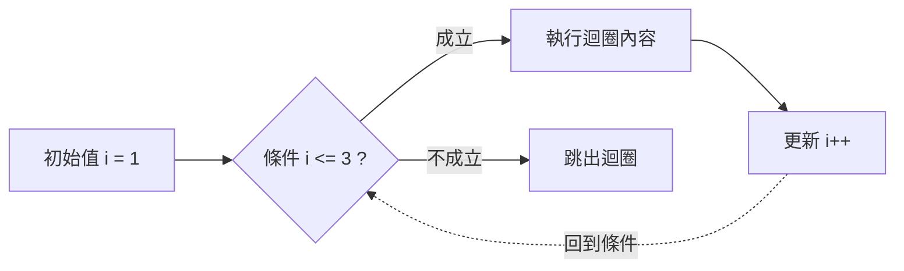

# 第三天 迴圈

大里 APCS 營隊 · 讓電腦重複幫你做事

邱皇愷

---
layout: default
---

## 今天的目標

- 學會三種迴圈：**for** / **while** / **do-while**
- 掌握迴圈三元素：**初始值、條件、更新**
- 用**巢狀迴圈**畫出乘法表與各種圖形
- 善用 **break / continue** 控制迴圈流程
- 每教完一段，馬上到 itouOJ 練一題，完成 Day3 的 6 題

---
layout: section
---

# 開場暖身

---

## 回顧昨天

<v-clicks>

- `if / else if / else` 讓程式**做一次決定**
- 條件要由**嚴格到寬鬆**排列，否則會被提早攔截
- `&&`、`||`、`!` 可以把多個條件組合起來
- 今天要學的，是讓程式**一直做決定、一直重複**

</v-clicks>

---

## 暖身問題（不用寫程式）

如果要在紙上，把 1 加到 100，你會怎麼做？寫 100 個加號嗎？

有沒有更輕鬆的做法？

<div class="mt-6 text-sm opacity-70">

想 30 秒，等一下公佈參考答案。

</div>

---

## 暖身問題：參考答案

<v-clicks>

- 高斯的做法：頭尾配對，`1+100`、`2+99`……每對都是 101，共 50 對，`101 × 50 = 5050`
- 但如果不是這麼剛好呢？例如加到 87？
- 最直接的做法：**準備一個小計，從第一個數字開始，一個一個加上去**
- 這個「一個一個做」的動作，就是今天要學的**迴圈**

</v-clicks>

<div class="mt-6 border-l-4 border-blue-500 pl-4" v-click>

高斯的技巧很聰明，但只適用於「連續整數求和」這種特殊情況。迴圈的威力在於：不管數字有沒有規律，它都能算，而且完全不用你自己想公式。

</div>

---
layout: section
---

# 為什麼需要迴圈？

---

## 沒有迴圈的世界

如果要印出 1 到 5：

```cpp
cout << 1 << endl;
cout << 2 << endl;
cout << 3 << endl;
cout << 4 << endl;
cout << 5 << endl;
```

那如果要印 1 到 10000 呢？😱

<br>

> 只要是「重複做同樣的事」，就交給迴圈。

---

## 生活中的迴圈

<v-clicks>

- 刷牙：「刷一下」重複 20 次
- 發考卷：「發給一個人」重複「班上人數」次
- 掃地：「掃一下」重複到「地板乾淨」為止

</v-clicks>

<div class="mt-6 border-l-4 border-blue-500 pl-4" v-click>

注意最後一個例子跟前兩個不一樣：前兩個知道**確切次數**，最後一個只知道**什麼時候該停**，不知道會重複幾次。這對應到等一下要學的兩種不同的迴圈。

</div>

---

## 沒有迴圈，程式碼會怎樣爆炸

<div class="text-sm">

想印出 1 到 100 的每個數字：

</div>

<div class="grid grid-cols-2 gap-4 mt-4 text-sm">
  <div class="border-2 border-red-500 p-4">
    <div class="font-bold mb-2">不用迴圈</div>
    100 行幾乎一樣的 <code>cout</code>，
    想印到 1000 就要重寫成 1000 行
  </div>
  <div class="border-2 border-green-500 p-4">
    <div class="font-bold mb-2">用迴圈</div>
    3 行程式碼，想印到 1000
    只要把條件的 100 改成 1000
  </div>
</div>

<div class="mt-4 text-sm opacity-70" v-click>

程式越長，出錯的機會越多。迴圈不只是「少打字」，更是**少一個出錯的地方**。

</div>

---
layout: section
---

# for 迴圈

---

## for 迴圈三元素

```cpp
for (int i = 1; i <= 5; i++) {
    cout << i << " ";   // 1 2 3 4 5
}
```

<div class="grid grid-cols-3 gap-3 my-6 text-center text-sm">
  <div class="border-2 border-blue-500 p-4">
    <div class="font-mono text-lg">int i = 1</div>
    <div class="mt-2 font-bold">初始值</div>
    <div class="opacity-70">從哪裡開始<br/>整個迴圈只做一次</div>
  </div>
  <div class="border-2 border-green-500 p-4">
    <div class="font-mono text-lg">i &lt;= 5</div>
    <div class="mt-2 font-bold">條件</div>
    <div class="opacity-70">還要繼續嗎<br/>每一輪開頭檢查</div>
  </div>
  <div class="border-2 border-orange-500 p-4">
    <div class="font-mono text-lg">i++</div>
    <div class="mt-2 font-bold">更新</div>
    <div class="opacity-70">下一輪怎麼變<br/>每一輪結束時做</div>
  </div>
</div>

---

## 拆開看①：初始值

```cpp {1}
for (int i = 1; i <= 5; i++) {
    cout << i << " ";
}
```

<div class="mt-4 border-l-4 border-blue-500 pl-4 text-sm">

`int i = 1` 只會在**進入迴圈前**執行一次。它同時做了兩件事：宣告一個新變數 `i`，並給它一個起始值。

</div>

---

## 拆開看②：條件

```cpp {1}
for (int i = 1; i <= 5; i++) {
    cout << i << " ";
}
```

<div class="mt-4 border-l-4 border-green-500 pl-4 text-sm">

`i <= 5` 在**每一輪開始前**都會檢查一次。成立才會執行大括號裡的內容，不成立就直接跳出迴圈，一步都不會多做。

</div>

---

## 拆開看③：更新

```cpp {1}
for (int i = 1; i <= 5; i++) {
    cout << i << " ";
}
```

<div class="mt-4 border-l-4 border-orange-500 pl-4 text-sm">

`i++` 在**每一輪結束後**才執行，然後才回頭再檢查一次條件。順序是：檢查條件 → 執行內容 → 更新 → 再檢查條件……一直循環。

</div>

---

## for 迴圈的執行順序



<div class="text-sm mt-2">

初始值只做一次；條件每輪**開頭**檢查；更新在每輪**結束**時做。

</div>

---

## 卡住的時候，就手動跑一遍

```cpp
for (int i = 1; i <= 3; i++) {
    cout << i;
}
```

| 輪次    | 檢查 `i <= 3` | 輸出 | 更新後 i |
| ------- | ------------- | ---- | -------- |
| 第 1 輪 | 1 ≤ 3 ✅      | `1`  | 2        |
| 第 2 輪 | 2 ≤ 3 ✅      | `2`  | 3        |
| 第 3 輪 | 3 ≤ 3 ✅      | `3`  | 4        |
| 第 4 輪 | 4 ≤ 3 ❌      | —    | 結束     |

<br>

> 這張表比盯著程式碼看有用一百倍。迴圈寫不出來就先畫它。

---

## 練習：手動跑一遍

```cpp
for (int i = 0; i < 4; i++) {
    cout << i * 2 << " ";
}
```

會印出什麼？先自己列表格算一次。

<v-click>

<div class="mt-6 border-l-4 border-green-500 pl-4">

`0 2 4 6`——`i` 從 0 開始、每次印 `i*2`，跑到 `i=3`（`3<4` 成立）就結束，`i=4` 不成立。

</div>

</v-click>

---

## 差一錯誤：`<=` 還是 `<`？

```cpp
for (int i = 1; i <= 5; i++) cout << i;   // 1 2 3 4 5　共 5 個
for (int i = 1; i <  5; i++) cout << i;   // 1 2 3 4    共 4 個
```

<div class="mt-4 border-l-4 border-yellow-500 pl-4 text-sm">

這種「多印一個或少印一個」的錯誤叫**差一錯誤**（off-by-one error），是寫迴圈最常見的 bug，連老手都會中招。**條件用 `<=` 還是 `<`，要看題目說的是「幾個」還是「到第幾個」。**

</div>

---

## 常見情境：要印「n 個」東西

<div class="text-sm">

題目說「印出 n 個數字」，該怎麼寫迴圈條件？

</div>

<div class="mt-4 grid grid-cols-2 gap-4 text-center text-sm">
  <div class="border-2 border-green-500 p-4">
    <div class="font-mono">for (i=1; i&lt;=n; i++)</div>
    <div class="mt-2 opacity-70">i 從 1 數到 n，共 n 個 ✅</div>
  </div>
  <div class="border-2 border-green-500 p-4">
    <div class="font-mono">for (i=0; i&lt;n; i++)</div>
    <div class="mt-2 opacity-70">i 從 0 數到 n-1，也是 n 個 ✅</div>
  </div>
</div>

<div class="mt-4 text-sm opacity-70">

兩種寫法都對，只是起點不同。**混著用才會出錯**——例如起點用 0、條件卻用 `<=n`，就會多跑一次。

</div>

---

## 小測驗：這樣印幾個數字？

```cpp
for (int i = 0; i <= 5; i++) {
    cout << i << " ";
}
```

<v-click>

<div class="mt-6 border-l-4 border-green-500 pl-4">

**6 個**（`0 1 2 3 4 5`）。從 0 開始、條件是 `<=5`，容易被誤以為是 5 個，其實是 6 個——這正是差一錯誤最容易發生的地方，起點跟終點都要仔細算。

</div>

</v-click>

---

## 迴圈也可以倒著數

```cpp
for (int i = 5; i >= 1; i--) {
    cout << i << " ";   // 5 4 3 2 1
}
```

<div class="mt-4 text-sm opacity-70">

三元素完全一樣的邏輯，只是**初始值變大、條件變成 `>=`、更新變成 `i--`**。想倒數就把這三個地方一起改，只改其中一個會變成無窮迴圈或一次都不執行。

</div>

---

## 練習：倒數輸出

寫一個迴圈，把 `10 9 8 7 6` 印出來。

<v-click>

<div class="mt-6 border-l-4 border-green-500 pl-4">

```cpp
for (int i = 10; i >= 6; i--) {
    cout << i << " ";
}
```

起點 10、終點 6、每次減 1，條件用 `>=` 才會包含到 6 本身。

</div>

</v-click>

---
layout: section
---

# 累加與累乘

---

## 經典應用：累加求和

```cpp
// 計算 1 + 2 + 3 + ... + 100
int sum = 0;               // ← 一定要在迴圈外面
for (int i = 1; i <= 100; i++) {
    sum += i;              // sum = sum + i
}
cout << sum;               // 5050
```

<div class="mt-4 border-l-4 border-red-500 pl-4 text-sm">

⚠️ 如果把 `int sum = 0;` 寫**進**迴圈裡，每一輪都會被歸零，最後只會剩下最後一次加的那個數。**累加變數一定要放在迴圈外面。**

</div>

---

## 累加變數放錯位置會怎樣

```cpp
for (int i = 1; i <= 5; i++) {
    int sum = 0;     // ← 錯！每輪都歸零
    sum += i;
}
cout << sum;          // 只會印出最後一輪的 5，不是 15
```

<div class="mt-4 text-sm opacity-70">

想像每輪開始都重新拿一張全新的紙來記錄，之前寫的東西全部作廢——這就是累加變數放在迴圈裡面的後果。

</div>

---

## 累乘：起始值不一樣

```cpp
int product = 1;                  // ← 累乘從 1 開始，不是 0
for (int i = 1; i <= 5; i++) {
    product *= i;
}
cout << product;                  // 120 (= 5!)
```

<div class="mt-4 border-l-4 border-yellow-500 pl-4 text-sm">

累加從 0 開始，因為 `任何數 + 0 = 原本的數`。累乘要從 1 開始，因為 `任何數 × 0 = 0`——如果從 0 開始，結果永遠是 0。

</div>

---

## 小測驗：這樣算出來是多少？

```cpp
int sum = 0;
for (int i = 1; i <= 4; i++) {
    sum += i;
}
cout << sum;
```

<v-click>

<div class="mt-6 border-l-4 border-green-500 pl-4">**`10`**——`1+2+3+4 = 10`。</div>

</v-click>

---

## 小測驗：找出錯誤

```cpp
for (int i = 1; i <= 5; i++) {
    int total = 0;
    total += i;
}
cout << total;
```

這段程式碼有什麼問題？

<v-click>

<div class="mt-6 border-l-4 border-green-500 pl-4">

`total` 宣告在迴圈**裡面**，每輪都會被重設成 0；而且迴圈外的 `cout` 根本看不到迴圈裡宣告的 `total`（會編譯錯誤）。應該把 `int total = 0;` 移到迴圈外面。

</div>

</v-click>

---
layout: section
---

# 練習時間

---

## 第 7 題　累加與累乘

輸入 n（1 ≤ n ≤ 10），輸出總和與總乘積。

<div class="grid grid-cols-2 gap-4 my-4 font-mono text-sm">
  <div class="border border-gray-400 border-opacity-40 p-3">
    <div class="opacity-60 text-xs mb-1">輸入</div>5
  </div>
  <div class="border border-gray-400 border-opacity-40 p-3">
    <div class="opacity-60 text-xs mb-1">輸出</div>15<br/>120
  </div>
</div>

---

## 第 7 題　程式

```cpp
int n;
cin >> n;

int sum = 0, product = 1;        // ← 起始值不一樣！
for (int i = 1; i <= n; i++) {
    sum += i;
    product *= i;
}
cout << sum << endl;             // 第一行
cout << product << endl;         // 第二行
```

<div class="mt-3 border-l-4 border-red-500 pl-4 text-sm">

⚠️ **累加從 0 開始，累乘從 1 開始。** 輸出是**兩行**，不是一行兩個數字。

</div>

---
layout: fact
---

# 動手做

打開 oj.itousouta.me → 課程 Day3 → 第 7 題

寫到 AC 為止，再往下聽

---
layout: section
---

# break 與 continue

---

## break：整個迴圈直接結束

```cpp
for (int i = 1; i <= 10; i++) {
    if (i == 5) break;
    cout << i << " ";      // 1 2 3 4
}
```

<div class="mt-4 text-sm opacity-70">

一遇到 `break`，**整個迴圈立刻停止**，後面的輪次全部不執行，程式繼續往迴圈**外面**的下一行走。

</div>

---

## continue：跳過這一輪，繼續下一輪

```cpp
for (int i = 1; i <= 10; i++) {
    if (i % 2 == 0) continue;
    cout << i << " ";      // 1 3 5 7 9
}
```

<div class="mt-4 text-sm opacity-70">

遇到 `continue`，只跳過**這一輪剩下的部分**，直接跳到更新、檢查下一輪，迴圈本身**不會**結束。

</div>

---

## break 與 continue 比較

| 關鍵字     | 效果             | 之後         |
| ---------- | ---------------- | ------------ |
| `break`    | 整個迴圈**結束** | 跳到迴圈外面 |
| `continue` | 只跳過**這一輪** | 繼續下一輪   |

<br>

> `break` 在「找到了就不用再找」的時候特別好用 —— 等一下質數判斷就會用到。

---

## 小測驗：這段會印出什麼？

```cpp
for (int i = 1; i <= 5; i++) {
    if (i == 3) continue;
    if (i == 5) break;
    cout << i << " ";
}
```

<v-click>

<div class="mt-6 border-l-4 border-green-500 pl-4">**`1 2 4`**——`i=3` 被跳過（continue），`i=5` 讓迴圈結束（break，且結束前不會印出 5）。</div>

</v-click>

---

## 應用：找出第一個能被 7 整除的數

```cpp
int found = -1;
for (int i = 100; i <= 1000; i++) {
    if (i % 7 == 0) {
        found = i;
        break;             // 找到就停，不用繼續往後找
    }
}
cout << found << endl;     // 105
```

<div class="mt-4 text-sm opacity-70">

如果沒有 `break`，迴圈會繼續跑到 1000，`found` 最後會被**後面找到的值蓋掉**，答案就變成「最後一個」而不是「第一個」符合條件的數。

</div>

---

## 應用：跳過所有 3 的倍數

```cpp
for (int i = 1; i <= 10; i++) {
    if (i % 3 == 0) continue;
    cout << i << " ";       // 1 2 4 5 7 8 10
}
```

<div class="mt-4 text-sm opacity-70">

`continue` 適合「大部分都要處理，只有少數情況要跳過」的場景，比起把主要邏輯包在一個很大的 `if` 裡面，用 `continue` 先擋掉不要的情況，剩下的程式碼可以少縮排一層，讀起來更清楚。

</div>

---
layout: section
---

# 質數判斷技巧

---

## 什麼是質數

<v-clicks>

- 質數是「只能被 1 和自己整除」的數（2, 3, 5, 7, 11……）
- 判斷方法：從 2 開始試除，只要找到一個能整除的數，就不是質數（用 `break` 提早結束）
- 如果試到最後都找不到，才是質數

</v-clicks>

---

## 樸素解法

```cpp
int n;
cin >> n;
bool isPrime = true;

for (int i = 2; i < n; i++) {
    if (n % i == 0) {
        isPrime = false;
        break;
    }
}
```

<div class="mt-4 border-l-4 border-yellow-500 pl-4 text-sm">

這樣寫**對**，但當 n 到 10⁶（一百萬）時，最壞情況要試將近一百萬次。還可以更快。

</div>

---

## 只要試到 √n

<div class="text-sm">

因數是**成對**出現的：`100 = 2×50 = 4×25 = 5×20 = 10×10 = 20×5……`

</div>

<div class="mt-4 grid grid-cols-4 gap-2 text-center font-mono text-sm">
  <div class="border border-gray-400 border-opacity-40 p-2">2×50</div>
  <div class="border border-gray-400 border-opacity-40 p-2">4×25</div>
  <div class="border-2 border-green-500 p-2">10×10</div>
  <div class="border border-gray-400 border-opacity-40 p-2">20×5</div>
</div>

<div class="mt-4 text-sm opacity-70">

過了 `10×10` 之後，後面全是前面配對的重複（`20×5` 其實就是 `5×20`）。所以**只要試到 √n 就夠了**——n 到 10⁶ 時，試除次數從一百萬次降到一千次。

</div>

---
layout: section
---

# 練習時間

---

## 第 6 題　質數判斷

輸入 n（2 ≤ n ≤ 10⁶），是質數輸出 `Prime`，否則輸出 `Not Prime`。

<div class="grid grid-cols-2 gap-4 my-4 font-mono text-sm">
  <div class="border border-gray-400 border-opacity-40 p-3">
    <div class="opacity-60 text-xs mb-1">輸入</div>17
  </div>
  <div class="border border-gray-400 border-opacity-40 p-3">
    <div class="opacity-60 text-xs mb-1">輸出</div>Prime
  </div>
</div>

---

## 第 6 題　完整程式

```cpp
int n;
cin >> n;
bool isPrime = true;

for (int i = 2; i * i <= n; i++) {   // ← 只要試到 √n
    if (n % i == 0) {
        isPrime = false;
        break;                       // 找到因數就可以停了
    }
}
cout << (isPrime ? "Prime" : "Not Prime") << endl;
```

---

## 第 6 題　常見錯誤：n = 2 判斷錯誤

```cpp
for (int i = 2; i * i <= n; i++) { ... }   // n=2 時，i*i=4 > 2，迴圈一次都不跑
```

<div class="mt-4 border-l-4 border-yellow-500 pl-4 text-sm">

`n = 2` 時迴圈一次都不會執行（`2*2=4 > 2`），`isPrime` 保持初始值 `true`，剛好輸出 `Prime`——這其實是**對的**（2 是質數），但如果 `isPrime` 沒有正確初始化成 `true`，這種邊界情況就會出錯。**永遠先想清楚最小的輸入會怎樣。**

</div>

---
layout: fact
---

# 動手做

打開 oj.itousouta.me → 課程 Day3 → 第 6 題

寫到 AC 為止，再往下聽

---
layout: section
---

# while 與 do-while

---

## while 迴圈

```cpp
// 先判斷，再執行
int n = 1;
while (n <= 5) {
    cout << n << " ";   // 1 2 3 4 5
    n++;                // 別忘了更新，否則無窮迴圈！
}
```

- 適合「不知道要跑幾次，只知道結束條件」的情況
- ⚠️ 一定要有讓條件「變 false」的那一步，否則永遠跑不完

---

## 無窮迴圈：忘記更新會怎樣

```cpp
int n = 1;
while (n <= 5) {
    cout << n << " ";
    // 忘記寫 n++;
}
```

<div class="mt-4 border-l-4 border-red-500 pl-4 text-sm">

`n` 永遠是 `1`，條件永遠成立，程式永遠不會停。在 itouOJ 上這種程式會一直跑到超過時間限制，判定為 **TLE**。

</div>

---

## 寫 while 之前，先問自己一句

<div class="text-lg mt-6">

**是誰讓條件終究會不成立？**

</div>

<div class="mt-6 border-l-4 border-yellow-500 pl-4 text-sm">

答得出來，才動手寫。答不出來，代表你還沒想清楚這個迴圈什麼時候該停。

</div>

---

## do-while 迴圈

```cpp
// 先執行，再判斷（至少執行一次）
int x = 10;
do {
    cout << "至少印一次" << endl;
    x++;
} while (x < 5);     // 條件一開始就 false，但仍印了一次
```

<br>

> 差別：`while` 先檢查條件，`do-while` 先做一次再檢查。

---

## while vs do-while：同一個條件，結果不同

```cpp
int x = 10;

// while：條件一開始就不成立，一次都不會執行
while (x < 5) { cout << "A"; }

// do-while：至少執行一次，才檢查條件
do { cout << "B"; } while (x < 5);
```

<div class="mt-4 text-sm opacity-70">

第一段完全不會印出東西；第二段會印一次 `B`，然後才發現條件不成立而停止。

</div>

---

## 三種迴圈怎麼選？

| 迴圈       | 特性                     | 適用時機               |
| ---------- | ------------------------ | ---------------------- |
| `for`      | 次數明確                 | 跑固定次數、走訪陣列   |
| `while`    | 先判斷，可能一次都不執行 | 次數未知、看條件       |
| `do-while` | 先執行一次，再判斷       | 至少要做一次（如選單） |

<br>

> 三種其實可以互換，先把 `for` 練熟就夠用了。

---

## 小測驗：哪一種迴圈比較適合？

情境：「重複詢問使用者輸入密碼，直到輸入正確為止」，密碼欄一開始一定要問過一次，該用哪種迴圈？

<v-click>

<div class="mt-6 border-l-4 border-green-500 pl-4">**`do-while`**——不管密碼對不對，第一次一定要先問過一次。</div>

</v-click>

---
layout: section
---

# 練習時間

---

## 第 8 題　數字翻轉

輸入正整數 n，反轉數字順序輸出（不含前導零）。

<div class="grid grid-cols-2 gap-4 my-4 font-mono text-sm">
  <div class="border border-gray-400 border-opacity-40 p-3">
    <div class="opacity-60 text-xs mb-1">輸入</div>120
  </div>
  <div class="border border-gray-400 border-opacity-40 p-3">
    <div class="opacity-60 text-xs mb-1">輸出</div>21
  </div>
</div>

---

## 第 8 題　想法：一次拆一位數字

<v-clicks>

- `n % 10` 可以拿到 n 的**個位數**
- `n / 10` 可以把個位數**砍掉**（整數除法）
- 每拆一個位數，就把它接到答案的後面，直到 n 變成 0——不知道要拆幾次，正好用 `while`

</v-clicks>

---

## 第 8 題　程式

```cpp
int n;
cin >> n;
int rev = 0;

while (n > 0) {
    rev = rev * 10 + n % 10;   // 取個位數，接到 rev 後面
    n /= 10;                   // 砍掉個位數
}
cout << rev << endl;
```

---

## 第 8 題　n = 120 的過程

| 輪次 | n   | `n % 10` | rev    |
| ---- | --- | -------- | ------ |
| 開始 | 120 | —        | 0      |
| 1    | 120 | 0        | 0      |
| 2    | 12  | 2        | 2      |
| 3    | 1   | 1        | **21** |

<br>

> 前導零自動就沒了 —— `0` 接在 `0` 後面還是 `0`。不用特別處理 🙂

---
layout: fact
---

# 動手做

打開 oj.itousouta.me → 課程 Day3 → 第 8 題

寫到 AC 為止，再往下聽

---
layout: fact
---

# ☕ 中場休息

15 分鐘後回來，我們進入「巢狀迴圈」

---
layout: section
---

# 巢狀迴圈基礎

---

## 迴圈裡面再放迴圈

```cpp
for (int i = 1; i <= 3; i++) {       // 外層：列
    for (int j = 1; j <= 3; j++) {   // 內層：行
        cout << i << "," << j << "  ";
    }
    cout << endl;                    // ← 位置很重要
}
```

<div class="grid grid-cols-2 gap-6 mt-2">
<div class="font-mono text-sm border border-gray-400 border-opacity-40 p-3">
1,1&nbsp; 1,2&nbsp; 1,3<br/>
2,1&nbsp; 2,2&nbsp; 2,3<br/>
3,1&nbsp; 3,2&nbsp; 3,3
</div>
<div class="text-sm">

外層跑一輪，內層就整圈跑完一遍。

`cout << endl;` 放在**內層外面、外層裡面** ——每印完一整列才換行。

</div>
</div>

---

## 執行次數：外層 × 內層

<v-clicks>

- 外層跑 3 次，**每一次**內層都要完整跑 3 次
- 總共執行內層的內容 `3 × 3 = 9` 次
- 這也是為什麼巢狀迴圈很容易讓程式變慢——次數是**相乘**的，不是相加

</v-clicks>

---

## 放錯位置的 endl 會怎樣

```cpp
for (int i = 1; i <= 3; i++) {
    for (int j = 1; j <= 3; j++) {
        cout << i << j;
        cout << endl;   // ← 放錯位置，變成內層的一部分
    }
}
```

<div class="mt-4 border-l-4 border-red-500 pl-4 text-sm">

這樣每印一個數字就換行一次，總共會換 9 次行，不是想要的「印完一整列才換行」。記住：`endl` 要跟內層迴圈的 `}` 同一層，不要寫進內層裡面。

</div>

---

## 小測驗：這段巢狀迴圈執行幾次？

```cpp
for (int i = 1; i <= 4; i++) {
    for (int j = 1; j <= 2; j++) {
        cout << "*";
    }
}
```

<v-click>

<div class="mt-6 border-l-4 border-green-500 pl-4">**8 次**——外層 4 次 × 內層 2 次 = 8 次，會印出 8 個星號。</div>

</v-click>

---

## 練習：追蹤巢狀迴圈

```cpp
for (int i = 1; i <= 2; i++) {
    for (int j = 1; j <= 3; j++) {
        cout << i * j << " ";
    }
    cout << endl;
}
```

會印出什麼？先列表格追蹤外層、內層各自的值。

<v-click>

<div class="mt-6 border-l-4 border-green-500 pl-4">

```
1 2 3
2 4 6
```

外層 `i=1` 時，內層 `j` 跑 1~3，印出 `i*j` = 1,2,3；外層 `i=2` 時同樣跑一輪，印出 2,4,6。

</div>

</v-click>

---

## 練手：完整九九乘法表

```cpp
for (int i = 1; i <= 9; i++) {
    for (int j = 1; j <= 9; j++) {
        cout << i << "*" << j << "=" << i * j << "\t";
    }
    cout << endl;
}
```

```
1*1=1   1*2=2   1*3=3   ...
2*1=2   2*2=4   2*3=6   ...
```

<div class="mt-3 border-l-4 border-yellow-500 pl-4 text-sm">

這是**練習用**的完整表格，用了巢狀迴圈。等一下 itouOJ 第 9 題只要印**一個數**的乘法表——會用到嗎？往下看就知道。

</div>

---
layout: section
---

# 練習時間

---

## 第 9 題　九九乘法表

輸入 n（1 ≤ n ≤ 9），印出 **n 的**乘法表。

<div class="grid grid-cols-2 gap-6">
<div>

```cpp
int n;
cin >> n;
for (int i = 1; i <= 9; i++) {
    cout << n << " x " << i
         << " = " << n * i << endl;
}
```

</div>
<div class="font-mono text-sm border border-gray-400 border-opacity-40 p-3">
<div class="opacity-60 text-xs mb-1">n = 3 的完整輸出</div>
3 x 1 = 3<br/>3 x 2 = 6<br/>3 x 3 = 9<br/>3 x 4 = 12<br/>3 x 5 = 15<br/>3 x 6 = 18<br/>3 x 7 = 21<br/>3 x 8 = 24<br/>3 x 9 = 27
</div>
</div>

<div class="mt-4 border-l-4 border-red-500 pl-4 text-sm">

⚠️ 中間是**小寫英文字母 `x`**，`x` 和 `=` 前後都有**一個空白**。⚠️ 這題只要**一層**迴圈就好，不是 9×9。

</div>

---

## 第 9 題　常見錯誤：多寫了一層迴圈

```cpp
for (int i = 1; i <= 9; i++) {
    for (int j = 1; j <= 9; j++) {        // ← 不需要這層！
        cout << n << " x " << j << " = " << n * j << endl;
    }
}
```

<div class="mt-4 border-l-4 border-red-500 pl-4 text-sm">

看到「乘法表」直覺想到剛剛的巢狀迴圈，但這題**只印一個數 n 的乘法表**，n 是輸入決定的固定值，不需要再用外層迴圈跑過 1~9。多寫的這層會讓同樣的內容重複印 9 遍——**不是每個「表格」都需要巢狀迴圈**。

</div>

---
layout: fact
---

# 動手做

打開 oj.itousouta.me → 課程 Day3 → 第 9 題

寫到 AC 為止，再往下聽

---
layout: section
---

# 巢狀迴圈進階

---

## 內層條件依賴外層變數

```cpp
int n;
cin >> n;
for (int i = 1; i <= n; i++) {
    for (int j = 1; j <= i; j++) {
        cout << "*";      // ← j 跑到 i，不是固定的 n
    }
    cout << endl;
}
```

<div class="font-mono border border-gray-400 border-opacity-40 p-3 mt-2">
*<br/>**<br/>***<br/>****
</div>

<div class="mt-4 border-l-4 border-yellow-500 pl-4 text-sm">

關鍵在內層條件是 **`j <= i`** 而不是 `j <= n` ——每一行要印幾個，是跟著**行號**走的。這是「內層條件依賴外層變數」的第一個例子，第四天處理二維陣列時會大量用到。

</div>

---

## 逐步追蹤 n=4 的過程

| 外層 i | 內層條件 | 印出   |
| ------ | -------- | ------ |
| i=1    | j 跑 1~1 | `*`    |
| i=2    | j 跑 1~2 | `**`   |
| i=3    | j 跑 1~3 | `***`  |
| i=4    | j 跑 1~4 | `****` |

<div class="mt-4 text-sm opacity-70">

外層的 `i` 除了控制跑幾列，同時也決定了**內層要跑幾次**。

</div>

---
layout: section
---

# 練習時間

---

## 第 10 題　直角三角形

輸入 n（1 ≤ n ≤ 20），第 i 行印 i 個星號。

<div class="grid grid-cols-2 gap-4 my-4 font-mono text-sm">
  <div class="border border-gray-400 border-opacity-40 p-3">
    <div class="opacity-60 text-xs mb-1">輸入</div>4
  </div>
  <div class="border border-gray-400 border-opacity-40 p-3">
    <div class="opacity-60 text-xs mb-1">輸出</div>*<br/>**<br/>***<br/>****
  </div>
</div>

<div class="mt-2 text-sm opacity-70">

跟剛剛教的「內層依賴外層」是同一件事，直接把那段程式拿來用即可。

</div>

---
layout: fact
---

# 動手做

打開 oj.itousouta.me → 課程 Day3 → 第 10 題

寫到 AC 為止，再往下聽

---
layout: section
---

# 菱形技巧

---

## 找出規律

<v-clicks>

- 空白數：每往中間一行少 1
- 星號數：每往中間一行多 2，而且永遠是**奇數**
- 上半和下半剛好**對稱**，可以用同一組算式，只是方向相反

</v-clicks>

---

## 用 half 表示「半徑」

<div class="text-sm">

n = 5 時，`half = n / 2 = 2`（整數除法捨去小數）。把每一行用 `i` 從 0 數到 half 來表示：

</div>

| i         | 空白數（half − i） | 星號數（2i + 1） |
| --------- | ------------------ | ---------------- |
| 0         | 2                  | 1                |
| 1         | 1                  | 3                |
| 2（中間） | 0                  | 5                |

<div class="mt-4 text-sm opacity-70">

上半是 `i` 從 0 數到 half；下半只是把同一組算式**倒著再跑一次**（`i` 從 half−1 數回 0）。

</div>

---
layout: section
---

# 練習時間

---

## 第 11 題　菱形（進階）

給定奇數 n，印出寬度 n 的星號菱形。**先數清楚每行幾個空白、幾個星號。**

<div class="grid grid-cols-2 gap-6">
<div class="font-mono border border-gray-400 border-opacity-40 p-3 text-center">
<span class="opacity-30">··</span>*<br/>
<span class="opacity-30">·</span>***<br/>
*****<br/>
<span class="opacity-30">·</span>***<br/>
<span class="opacity-30">··</span>*
</div>
<div class="text-sm">

n = 5：

| 行  | 空白 | 星號 |
| --- | ---- | ---- |
| 1   | 2    | 1    |
| 2   | 1    | 3    |
| 3   | 0    | 5    |
| 4   | 1    | 3    |
| 5   | 2    | 1    |

</div>
</div>

---

## 第 11 題　拆成上下兩半

```cpp
int n;
cin >> n;
int half = n / 2;                        // n=5 → half=2

for (int i = 0; i <= half; i++) {        // 上半（含中間那行）
    for (int j = 0; j < half - i; j++) cout << " ";
    for (int j = 0; j < 2 * i + 1; j++) cout << "*";
    cout << endl;
}
for (int i = half - 1; i >= 0; i--) {    // 下半
    for (int j = 0; j < half - i; j++) cout << " ";
    for (int j = 0; j < 2 * i + 1; j++) cout << "*";
    cout << endl;
}
```

---

## 第 11 題　行尾不能有多餘空白

<div class="border-l-4 border-red-500 pl-4 text-sm">

題目說**行尾不要有多餘空白**。空白只印在星號**前面**，印完星號就直接換行，不要在星號後面又補空白去對齊。

</div>

<div class="mt-4 text-sm opacity-70">

判題是逐字比對的，行尾多一個看不見的空白，也會被判定為 WA。

</div>

---
layout: fact
---

# 動手做

打開 oj.itousouta.me → 課程 Day3 → 第 11 題

寫到 AC 為止——今天 6 題全部完成！

---
layout: fact
---

# 🍱 短暫休息

10 分鐘後回來，做複習與小考

---

## 迴圈常見錯誤總複習

<div class="text-sm">

| 錯誤             | 長什麼樣子         | 怎麼避免                             |
| ---------------- | ------------------ | ------------------------------------ |
| 差一錯誤         | `<=` 跟 `<` 用混   | 先想清楚是「幾個」還是「到第幾個」   |
| 忘記更新         | while 少了 `n++`   | 問自己：誰讓條件會不成立             |
| 累加變數放錯位置 | `sum=0` 寫在迴圈裡 | 累加 / 累乘變數放迴圈**外面**        |
| endl 位置錯      | 放進內層迴圈裡     | 內層外面、外層裡面，才會一列換一次行 |

</div>

---
layout: section
---

# 隨堂小測驗

---

## Q1

`for` 迴圈的三元素，「更新」是在每輪的**開頭**還是**結尾**執行？

<v-click>

<div class="mt-6 border-l-4 border-green-500 pl-4">**結尾**。順序是：檢查條件 → 執行內容 → 更新 → 再檢查條件。</div>

</v-click>

---

## Q2

累加變數要放在迴圈的**裡面**還是**外面**？

<v-click>

<div class="mt-6 border-l-4 border-green-500 pl-4">**外面**。放裡面的話每一輪都會被重新歸零。</div>

</v-click>

---

## Q3

寫 `while` 迴圈之前，一定要先想清楚哪件事？

<v-click>

<div class="mt-6 border-l-4 border-green-500 pl-4">**是誰讓條件終究會不成立**——答不出來就是無窮迴圈，會 TLE。</div>

</v-click>

---

## Q4

巢狀迴圈裡，外層跑 4 次、內層跑 5 次，內層的內容總共會執行幾次？

<v-click>

<div class="mt-6 border-l-4 border-green-500 pl-4">**20 次**（4 × 5）。</div>

</v-click>

---

## Q5

`break` 跟 `continue` 的差別是什麼？

<v-click>

<div class="mt-6 border-l-4 border-green-500 pl-4">`break` 讓**整個迴圈結束**；`continue` 只跳過**這一輪**，迴圈繼續。</div>

</v-click>

---

## Q6

`for (int i = 1; i <= n; i++)` 跟 `for (int i = 0; i < n; i++)`，哪一個總共執行的次數比較多？

<v-click>

<div class="mt-6 border-l-4 border-green-500 pl-4">**一樣多**，都是 n 次，只是起點跟終點不同。</div>

</v-click>

---

## Q7

要把一段程式改成「倒著跑」，除了把 `i++` 改成 `i--`，還要改動哪兩個地方？

<v-click>

<div class="mt-6 border-l-4 border-green-500 pl-4">**初始值**（改成起點在最大值）跟**條件**（`<=` 改成 `>=`）。三個地方要一起改。</div>

</v-click>

---

## Q8

累乘（例如算階乘）如果不小心把初始值設成 `int product = 0;`，最後答案會是多少？

<v-click>

<div class="mt-6 border-l-4 border-green-500 pl-4">**永遠是 `0`**。任何數乘以 0 都是 0，第一輪之後 product 就再也回不去了。</div>

</v-click>

---

## Q9

用 `for (int i = 2; i * i <= n; i++)` 判斷質數，這樣寫比 `for (int i = 2; i < n; i++)` 快在哪裡？

<v-click>

<div class="mt-6 border-l-4 border-green-500 pl-4">因數是成對出現的，只要試到 √n 就能找到所有可能的因數，
n 到 10⁶ 時試除次數從一百萬次降到約一千次。</div>

</v-click>

---

## Q10

菱形圖案那一題，為什麼可以把上半跟下半拆成「同一組算式、方向相反」來寫？

<v-click>

<div class="mt-6 border-l-4 border-green-500 pl-4">因為菱形上下**對稱**：上半是空白遞減、星號遞增；下半剛好反過來，
用同一個 `half - i` 跟 `2i + 1` 的算式，只是 `i` 的走向顛倒。</div>

</v-click>

---
layout: section
---

# 分組討論

---

## 討論①

如果程式交上去顯示 **TLE**（超過時間限制），你會優先懷疑哪裡出了問題？跟旁邊同學討論一分鐘。

---

## 討論②

跟旁邊同學互相解釋一次：為什麼九九乘法表的 `cout << endl;` 要放在內層迴圈**外面**、外層迴圈**裡面**。

---

## 討論③

三種迴圈（for / while / do-while）理論上可以互相改寫。跟旁邊同學討論：今天寫的 6 題裡，哪些題目改用別種迴圈也寫得出來？

---
layout: section
---

# 今日重點回顧

---

## 回顧①：for 迴圈與累加累乘

<v-clicks>

- 三元素：**初始值、條件、更新**
- 卡住就手動列表格跑一遍
- 累加從 0、累乘從 1，變數要放在迴圈外面

</v-clicks>

---

## 回顧②：break/continue 與 while

<v-clicks>

- `break` 結束整個迴圈，`continue` 只跳過這一輪
- 質數判斷只要試到 √n，搭配 break 提早結束
- **while**：先判斷、可能一次都不執行；**do-while**：先做一次再判斷

</v-clicks>

---

## 回顧③：巢狀迴圈

<v-clicks>

- 執行次數是**外層 × 內層**
- 內層條件可以依賴外層變數（`j <= i`）
- 不是每個「表格」都需要巢狀迴圈——先看清楚題目要印幾層

</v-clicks>

---

## 回顧④：今天的節奏

<div class="text-sm">

| 教了什麼                 | 馬上練   |
| ------------------------ | -------- |
| for 迴圈、累加累乘       | 第 7 題  |
| break/continue、質數技巧 | 第 6 題  |
| while/do-while           | 第 8 題  |
| 巢狀迴圈基礎             | 第 9 題  |
| 巢狀迴圈進階             | 第 10 題 |
| 菱形技巧                 | 第 11 題 |

</div>

<div class="mt-4 text-sm opacity-70">

教一段、練一題，跟昨天一樣。

</div>

---

## 明天預告

<div class="text-lg mt-6">

明天我們要把一堆資料**一次裝起來** —— 陣列與字串。

</div>

<div class="mt-6 text-sm opacity-70">

今天學的迴圈，明天會拿來「走訪」一整排資料，兩個放在一起威力更大。

</div>

---
layout: statement
---

# 謝謝大家

明天見 👋
