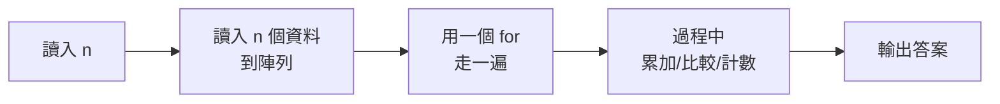

# 第五天 總複習與實戰

大里 APCS 營隊 · 把四天的功力全部用上

郭家睿

---
layout: default
---

## 今天的目標

- 把四天學的東西**串成一套解題流程**
- 認識 APCS 實作題的**固定套路**
- 學會**先想清楚再動手**：讀題 → 想法 → 手算 → 寫程式
- 完成 itouOJ Day5 的 3 題綜合應用

<br>

> 前四天在學「工具」，今天學的是「**遇到題目該怎麼想**」。

---
layout: section
---

# 開場暖身

---

## 回顧昨天

<v-clicks>

- 陣列讓一個名字裝一整排資料，索引從 0 開始
- 找最大最小的起始值要用 `a[0]`，不要用 0
- 二維陣列 `m[i][j]`：`i` 是列、`j` 是行
- 字串走訪跟陣列一模一樣，雙指標適合對稱問題

</v-clicks>

---

## 暖身問題（不用寫程式）

如果你是老師，要幫全班算出「幾個人不及格」，你會怎麼用中文描述這個步驟？盡量用到這四天學過的詞彙。

<div class="mt-6 text-sm opacity-70">

想 30 秒，等一下公佈參考答案。

</div>

---

## 暖身問題：參考答案

<v-clicks>

- 準備一個計數器，從 0 開始（**變數初始化**）
- 把全班成績讀進一個陣列（**陣列**）
- 用迴圈走訪每一個成績（**迴圈**）
- 每次檢查這個成績是不是不及格（**if 判斷**）
- 是的話計數器加一（**累加**）
- 走完全部，印出計數器（**輸出**）

</v-clicks>

<div class="mt-6 border-l-4 border-green-500 pl-4" v-click>

這六步用到了四天教的**全部**技巧。今天要練的就是這種「組合技」。

</div>

---

## 今天為什麼這樣安排

<v-clicks>

- 前四天各自專注一個新觀念，今天**不新增任何語法**
- 把時間拿來練「怎麼把工具組合起來解決一個完整的問題」
- 這正是實際考試時真正會遇到的情況——沒有人會告訴你這題該用哪個工具

</v-clicks>

---
layout: section
---

# 四天的地圖

---

## 你已經會的東西

<div class="grid grid-cols-2 gap-4 text-sm">
  <div class="border-l-4 border-blue-500 pl-4">
    <div class="font-bold">Day1　輸入輸出</div>
    <div class="opacity-80">cin / cout · 每支程式都是 輸入→處理→輸出</div>
  </div>
  <div class="border-l-4 border-green-500 pl-4">
    <div class="font-bold">Day2　變數與判斷</div>
    <div class="opacity-80">型態 · 整數除法 · % 餘數 · if / else if</div>
  </div>
  <div class="border-l-4 border-orange-500 pl-4">
    <div class="font-bold">Day3　迴圈</div>
    <div class="opacity-80">for / while · 累加累乘 · 巢狀 · break</div>
  </div>
  <div class="border-l-4 border-purple-500 pl-4">
    <div class="font-bold">Day4　陣列與字串</div>
    <div class="opacity-80">走訪 · 找極值 · 二維 · 雙指標</div>
  </div>
</div>

<div class="mt-6 border-l-4 border-yellow-500 pl-4">

**今天不教新語法。** 這四格就是你的全部工具，APCS 初級的題目九成都只需要這些。差別在**怎麼把它們組起來**。

</div>

---

## Day1 詳細回顧：輸入輸出

<v-clicks>

- 程式要先**編譯**才能執行；編譯期錯誤 vs 執行期錯誤
- `cout <<` 資料流向螢幕；`cin >>` 資料流向變數
- 所有程式都是 **輸入 → 處理 → 輸出**
- itouOJ 判題結果：`AC` 通過、`WA` 答案錯、`CE` 編譯錯誤

</v-clicks>

---

## Day2 詳細回顧：變數與判斷

<v-clicks>

- 整數用 `int`，小數用 `double`，文字用 `string`
- **整數 / 整數會捨去小數**——算平均記得轉型
- `%` 餘數可以判斷奇偶、判斷倍數
- `if / else if / else` 由上往下，**第一個成立的執行**，條件要嚴格到寬鬆排列

</v-clicks>

---

## Day3 詳細回顧：迴圈

<v-clicks>

- `for` 三元素：初始值、條件、更新
- 累加從 0、累乘從 1，變數要放在迴圈**外面**
- 巢狀迴圈執行次數是**外層 × 內層**
- `break` 結束整個迴圈，`continue` 只跳過這一輪

</v-clicks>

---

## Day4 詳細回顧：陣列與字串

<v-clicks>

- 陣列索引從 0 開始，開得比題目上限**大一點**
- 找最大最小的起始值用 `a[0]`，不要用 0
- 二維陣列 `m[i][j]`：`i` 是列、`j` 是行
- 字串走訪跟陣列一樣；**雙指標**適合迴文這類對稱問題

</v-clicks>

---

## 四天技巧一次對照

<div class="text-sm">

| 天數 | 關鍵字         | 一句話重點                   |
| ---- | -------------- | ---------------------------- |
| Day1 | cin / cout     | 輸入輸出的方向，看箭頭       |
| Day2 | if / else      | 條件由嚴格排到寬鬆           |
| Day3 | for / while    | 三元素：初始值、條件、更新   |
| Day4 | array / string | 索引從 0 開始，起始值用 a[0] |

</div>

<div class="mt-4 text-sm opacity-70">

這張表就是整套課程的濃縮版。忘記細節的時候，回來看這張表通常就夠了。

</div>

---

## APCS 實作題的固定套路



<div class="mt-4 text-sm">

**大部分題目都長這樣。** 差別只在中間那個 for 裡面做什麼：

- 累加 → 求總和、平均
- 比較 → 找最大最小
- 計數 → 統計次數、算符合條件的有幾個

</div>

---

## 為什麼幾乎每題都長這樣

<v-clicks>

- APCS 初級題目的資料量不大，**單層或雙層迴圈**幾乎都能在時限內跑完
- 「讀進來、走一遍、記點東西、印出來」這個模式覆蓋了絕大多數題型
- 認出這個套路後，**讀題時就是在填空**：這題要記什麼？要比較還是要算？

</v-clicks>

---

## 解題流程：先想清楚再動手

<v-clicks>

<div class="border-l-4 border-blue-500 pl-4 my-3">

**① 讀題，把輸出格式抄下來** 幾行？大小寫？小數幾位？——這裡錯了，演算法再對也是 WA。

</div>

<div class="border-l-4 border-green-500 pl-4 my-3">

**② 用範例手算一遍** 拿題目給的範例，用紙筆做一次。做不出來代表**你還沒讀懂題目**。

</div>

<div class="border-l-4 border-orange-500 pl-4 my-3">

**③ 想「要走幾遍、每一遍做什麼」** 通常答案是「走一遍，邊走邊記東西」。

</div>

<div class="border-l-4 border-purple-500 pl-4 my-3">

**④ 才開始寫程式**

</div>

</v-clicks>

---

## 展開步驟①：讀題

<div class="text-sm">

讀題時要抓出三件事：

</div>

<v-clicks>

- **輸入**有幾個東西？各是什麼型態？
- **輸出**要印幾行？每行長怎樣？
- 有沒有**特殊情況**題目特別提到（例如除以 0、n 的最小值）？

</v-clicks>

<div class="mt-4 border-l-4 border-yellow-500 pl-4 text-sm" v-click>

把輸出格式**逐字**抄下來，程式寫完後拿範例比對，一個字元都不能差。

</div>

---

## 展開步驟②：手算一遍

<div class="text-sm">

拿題目給的範例輸入，自己在紙上（或心裡）算出答案，確認你算出來的跟範例輸出**一致**。

</div>

<div class="mt-4 border-l-4 border-green-500 pl-4 text-sm">

這一步不能跳過。如果你自己都算不出正確答案，寫出來的程式一定也是錯的——差別只是你什麼時候會發現。

</div>

---

## 展開步驟③：想「要走幾遍」

<div class="text-sm">

大部分題目只需要**一遍**（一層迴圈）就能解決：

</div>

<v-clicks>

- 邊走訪、邊記錄需要的東西（總和、最大值、計數……）
- 少數題目需要**兩遍**：第一遍先算出基準值（例如平均），第二遍才能用它
- 想清楚「這一遍走的時候，手上要拿著什麼資訊」

</v-clicks>

---

## 展開步驟④：才開始寫程式

<v-clicks>

- 先搭骨架（讀輸入、迴圈框架、輸出），再填內容
- 一次只加一小段，加完就想一下對不對，不要一口氣寫完整支再檢查
- 這正是這四天每次帶大家做的事：**逐步完成**

</v-clicks>

---
layout: section
---

# 程式碼健檢

---

## 四天、四段程式碼，你能抓出問題嗎？

<div class="text-sm opacity-70">

接下來四段程式碼，各自藏著一天教過的常見錯誤。先自己看，想 15 秒再看解答。

</div>

---

## 健檢①：這段程式碼有什麼問題？

```cpp
int age;
cout << "你的年齡是 " << age << endl;
cin >> age;
```

<v-click>

<div class="mt-6 border-l-4 border-green-500 pl-4">

**Day1 的教訓**：`cin` 跟 `cout` 順序顛倒。程式是由上往下執行的，這裡在讀取之前就先印出 `age`，印到的是還沒賦值的垃圾值。

</div>

</v-click>

---

## 健檢②：這段程式碼有什麼問題？

```cpp
int w, h;
cin >> w >> h;
double bmi = w / (h / 100 * h / 100);
```

<v-click>

<div class="mt-6 border-l-4 border-green-500 pl-4">

**Day2 的教訓**：`h / 100` 是整數除法，175 公分會變成 1 公尺再平方，BMI 算出來會離譜地大。應該寫成 `h / 100.0`。

</div>

</v-click>

---

## 健檢③：這段程式碼有什麼問題？

```cpp
int product = 0;
for (int i = 1; i <= n; i++) {
    product *= i;
}
```

<v-click>

<div class="mt-6 border-l-4 border-green-500 pl-4">

**Day3 的教訓**：累乘的初始值設成 `0`，任何數乘以 0 都是 0，答案永遠是 0。累乘要從 `1` 開始。

</div>

</v-click>

---

## 健檢④：這段程式碼有什麼問題？

```cpp
int mx = 0;
for (int i = 0; i < n; i++) {
    if (a[i] > mx) mx = a[i];
}
```

<v-click>

<div class="mt-6 border-l-4 border-green-500 pl-4">

**Day4 的教訓**：起始值設成 `0` 而不是 `a[0]`。如果陣列全部是負數，答案會錯誤地停在 0。

</div>

</v-click>

---

## 健檢總結：錯誤都藏在「起始值」和「順序」

<div class="text-sm">

| 天數 | 錯誤類型     | 正確做法          |
| ---- | ------------ | ----------------- |
| Day1 | 執行順序顛倒 | 先 cin 再 cout    |
| Day2 | 整數除法時機 | 先轉型再除        |
| Day3 | 累乘起始值   | 從 1 開始，不是 0 |
| Day4 | 找極值起始值 | 用 a[0]，不是 0   |

</div>

<div class="mt-4 border-l-4 border-yellow-500 pl-4 text-sm">

四天累積下來的錯誤，有志一同都跟「一開始的那個值」或「先後順序」有關。寫程式時多花 5 秒想清楚起點，可以省下很多除錯時間。

</div>

---

## 健檢練習：換你來找碴

```cpp
int cnt = 0;
for (int i = 0; i <= n; i++) {
    if (a[i] % 2 == 0) cnt++;
}
```

這段程式在數陣列裡的偶數個數，有什麼問題？

<v-click>

<div class="mt-6 border-l-4 border-green-500 pl-4">

**差一錯誤**：條件是 `i <= n`，會多存取 `a[n]`——如果陣列只開到 `a[n-1]`，這裡就會越界。應該用 `i < n`。

</div>

</v-click>

---
layout: fact
---

# ☕ 中場休息

15 分鐘後回來，我們開始今天的題目

---
layout: section
---

# 今日題目

---

## 第 27 題　成績等第統計

輸入 n 位學生成績，統計 A / B / C / D / F 各有幾人。

<div class="grid grid-cols-5 gap-2 my-4 text-center text-sm">
  <div class="border-t-4 border-green-500 pt-2"><div class="font-bold">A</div><div class="opacity-70">90 以上</div></div>
  <div class="border-t-4 border-blue-500 pt-2"><div class="font-bold">B</div><div class="opacity-70">80–89</div></div>
  <div class="border-t-4 border-yellow-500 pt-2"><div class="font-bold">C</div><div class="opacity-70">70–79</div></div>
  <div class="border-t-4 border-orange-500 pt-2"><div class="font-bold">D</div><div class="opacity-70">60–69</div></div>
  <div class="border-t-4 border-red-500 pt-2"><div class="font-bold">F</div><div class="opacity-70">60 以下</div></div>
</div>

---

## 第 27 題　套進固定套路

<v-clicks>

- 讀入 n → **讀入 n 個資料到陣列**（或邊讀邊處理）
- 用一個 for 走一遍 → 每讀一個成績就判斷一次
- 過程中計數 → 這裡要記的是「**每個等第各幾人**」
- 輸出答案 → 印出 5 行

</v-clicks>

---

## 第 27 題　用今天教的方法手算一次

<div class="text-sm">

輸入 `95 82 76 60 45 100`，照著讀，逐一分類：

</div>

| 成績 | 屬於哪個等第 | 目前計數 |
| ---- | ------------ | -------- |
| 95   | A            | A=1      |
| 82   | B            | B=1      |
| 76   | C            | C=1      |
| 60   | D            | D=1      |
| 45   | F            | F=1      |
| 100  | A            | A=2      |

<div class="mt-2 text-sm opacity-70">

跟範例輸出 `A: 2, B: 1, C: 1, D: 1, F: 1` 一致，代表想法正確。

</div>

---

## 第 27 題　想法：計數陣列

<div class="text-sm">

5 種等第，開一個大小為 5 的陣列，每一格代表一個等第的人數：

</div>

```cpp
int cnt[5] = {};   // cnt[0]=A, cnt[1]=B, cnt[2]=C, cnt[3]=D, cnt[4]=F
```

<div class="mt-4 text-sm opacity-70">

每讀進一個成績，判斷它屬於哪個等第，就把對應那一格加一。

</div>

---

## 第 27 題　程式：讀入與分類

```cpp
int cnt[5] = {};                      // A B C D F 各一格，全部歸零
int n; cin >> n;
for (int i = 0; i < n; i++) {
    int s; cin >> s;
    if      (s >= 90) cnt[0]++;
    else if (s >= 80) cnt[1]++;
    else if (s >= 70) cnt[2]++;
    else if (s >= 60) cnt[3]++;
    else              cnt[4]++;
}
```

<div class="mt-4 text-sm opacity-70">

這裡不需要把每個成績都存起來——分類完馬上更新計數，成績本身用完就丟。

</div>

---

## 第 27 題　輸出

```cpp
string name[5] = {"A", "B", "C", "D", "F"};
for (int i = 0; i < 5; i++) {
    cout << name[i] << ": " << cnt[i] << endl;
}
```

<div class="grid grid-cols-2 gap-4 my-3 font-mono text-sm">
  <div class="border border-gray-400 border-opacity-40 p-3">
    <div class="opacity-60 text-xs mb-1">輸入</div>6<br/>95 82 76 60 45 100
  </div>
  <div class="border border-gray-400 border-opacity-40 p-3">
    <div class="opacity-60 text-xs mb-1">輸出</div>A: 2<br/>B: 1<br/>C: 1<br/>D: 1<br/>F: 1
  </div>
</div>

---

## 第 27 題　兩個容易失分的地方

<div class="border-l-4 border-red-500 pl-4 text-sm">

⚠️ **即使人數是 0 也要輸出那一行。** 用陣列 `cnt[5]` 而不是五個變數，就能用一個 for 全部印出來，自然不會漏掉。

⚠️ 格式是 `A: 2`——冒號後面**有一個空白**，不是 `A:2`。

</div>

<div class="mt-4 text-sm opacity-70">

這兩個都不是演算法問題，是**格式**問題——回想今天開場說的：輸出格式要逐字比對。

</div>

---

## 第 28 題　峰值偵測

某個位置的值**嚴格大於**左右鄰居，就是一個峰值。頭尾只跟唯一的鄰居比。

<div class="my-4 flex items-end justify-center gap-1 text-center font-mono text-sm">
  <div><div class="bg-blue-500 bg-opacity-40 w-12" style="height:20px"></div><div class="mt-1">1</div></div>
  <div><div class="bg-green-500 w-12" style="height:60px"></div><div class="mt-1 font-bold">3</div><div class="text-xs">峰值</div></div>
  <div><div class="bg-blue-500 bg-opacity-40 w-12" style="height:40px"></div><div class="mt-1">2</div></div>
  <div><div class="bg-green-500 w-12" style="height:80px"></div><div class="mt-1 font-bold">4</div><div class="text-xs">峰值</div></div>
  <div><div class="bg-blue-500 bg-opacity-40 w-12" style="height:20px"></div><div class="mt-1">1</div></div>
</div>

<div class="text-center text-sm mb-3">答案：<b>2</b></div>

---

## 第 28 題　套進固定套路

<v-clicks>

- 讀入 n 個資料到陣列 → 需要**同時看到左右鄰居**，一定要先存起來
- 用一個 for 走一遍 → 走訪每一個位置
- 過程中比較 → 跟左邊、右邊都比一次
- 過程中計數 → 是峰值就加一

</v-clicks>

---

## 第 28 題　為什麼一定要先存成陣列

<div class="border-l-4 border-blue-500 pl-4 text-sm">

跟第 27 題不一樣：這裡**沒辦法邊讀邊處理**，因為判斷 `a[i]` 是不是峰值，需要同時知道 `a[i-1]` 和 `a[i+1]`——也就是「還沒讀到的下一個值」。這種需要**前後對照**的題目，一定要先把資料存進陣列。

</div>

---

## 第 28 題　最容易出錯的地方：頭尾

<div class="border-l-4 border-yellow-500 pl-4 text-sm">

**頭尾是最容易出錯的地方。** `a[0]` 沒有左鄰居，只要比 `a[1]` 大就算； `a[n-1]` 同理沒有右鄰居。而 n = 1 時，那唯一一個元素**也算**一個峰值（因為它沒有任何鄰居，兩邊條件都自動成立）。

</div>

---

## 第 28 題　把邊界一次處理掉

```cpp
int n; cin >> n;
int a[1005];
for (int i = 0; i < n; i++) cin >> a[i];

int cnt = 0;
for (int i = 0; i < n; i++) {
    bool leftOk  = (i == 0)     || (a[i] > a[i - 1]);   // 沒有左鄰居就算過
    bool rightOk = (i == n - 1) || (a[i] > a[i + 1]);   // 沒有右鄰居就算過
    if (leftOk && rightOk) cnt++;
}
cout << cnt << endl;
```

---

## 第 28 題　為什麼這樣寫不會越界

<div class="border-l-4 border-green-500 pl-4 text-sm">

用 `(i == 0) ||` 這種寫法，**邊界和中間可以用同一個迴圈處理**，不必分成三段寫。 `||` 具有「短路」特性：左邊成立時，右邊根本不會被計算，所以當 `i == 0` 成立時，`a[i - 1]` 不會真的被存取，不會越界。

</div>

---

## 第 28 題　逐步追蹤 [1,3,2,4,1]

| i   | a[i] | leftOk         | rightOk    | 是峰值？ |
| --- | ---- | -------------- | ---------- | -------- |
| 0   | 1    | true（無左鄰） | 1&gt;3？否 | 否       |
| 1   | 3    | 3&gt;1？是     | 3&gt;2？是 | ✅       |
| 2   | 2    | 2&gt;3？否     | —          | 否       |
| 3   | 4    | 4&gt;2？是     | 4&gt;1？是 | ✅       |
| 4   | 1    | 1&gt;4？否     | —          | 否       |

<div class="mt-2 text-sm opacity-70">

共 2 個峰值，跟前面的答案一致。

</div>

---

## 第 29 題　最常見字元

輸入小寫字串，找出出現最多次的字元。並列時輸出**字母順序最小**的。

<div class="text-center text-sm mt-4">`banana` → 輸出 `a 3`</div>

---

## 第 29 題　套進固定套路

<v-clicks>

- 讀入資料 → 一個字串
- 用一個 for 走一遍 → 走訪字串的每個字元
- 過程中計數 → 這裡要記的是「**每個字母各出現幾次**」
- 輸出答案 → 找出次數最多的那個字母

</v-clicks>

<div class="mt-4 border-l-4 border-blue-500 pl-4 text-sm" v-click>

跟第 27 題「算等第人數」是**同一個技巧**，只是種類從 5 種變成 26 種。

</div>

---

## 第 29 題　用 "banana" 手算一次

| 字元 | 走到這裡時的 cnt |
| ---- | ---------------- |
| b    | b=1              |
| a    | a=1              |
| n    | n=1              |
| a    | a=2              |
| n    | n=2              |
| a    | a=3              |

<div class="mt-2 text-sm opacity-70">

走完後 `cnt['a']=3`、`cnt['b']=1`、`cnt['n']=2`，最大值是 a 的 3 次，跟範例輸出 `a 3` 一致。

</div>

---

## 第 29 題　程式：建立計數陣列

```cpp
string s;
cin >> s;

int cnt[26] = {};                    // 26 個字母各一格
for (char c : s) cnt[c - 'a']++;     // ← 關鍵：字元轉索引
```

<div class="my-4 flex items-end justify-center gap-1 text-center font-mono text-sm">
  <div><div class="bg-green-500 w-10" style="height:60px"></div><div class="mt-1 font-bold">a</div><div class="text-xs">3</div></div>
  <div><div class="bg-blue-500 bg-opacity-40 w-10" style="height:20px"></div><div class="mt-1">b</div><div class="text-xs">1</div></div>
  <div><div class="bg-blue-500 bg-opacity-40 w-10" style="height:40px"></div><div class="mt-1">n</div><div class="text-xs">2</div></div>
</div>

---

## 第 29 題　`c - 'a'` 是什麼意思

字元在電腦裡就是數字。`'a'` = 97、`'b'` = 98、……、`'z'` = 122。

<div class="grid grid-cols-4 gap-2 my-4 text-center font-mono text-sm">
  <div class="border border-gray-400 border-opacity-40 p-2">'a' − 'a'<br/><b>0</b></div>
  <div class="border border-gray-400 border-opacity-40 p-2">'b' − 'a'<br/><b>1</b></div>
  <div class="border border-gray-400 border-opacity-40 p-2">'c' − 'a'<br/><b>2</b></div>
  <div class="border border-gray-400 border-opacity-40 p-2">'z' − 'a'<br/><b>25</b></div>
</div>

所以 `cnt[c - 'a']++` 就是「把這個字母對應的格子加一」。

---

## 第 29 題　找出次數最多的字母

```cpp
int best = 0;                        // 從 a 開始找
for (int i = 1; i < 26; i++) {
    if (cnt[i] > cnt[best]) best = i;    // ← 嚴格大於才換
}
cout << (char)('a' + best) << " " << cnt[best] << endl;
```

<div class="mt-2 border-l-4 border-green-500 pl-4 text-sm">

用**嚴格大於** `>` 而不是 `>=`，並且**從 0 往上找**——並列時自然會留在字母順序較小的那一個，不必額外處理。

</div>

---

## 第 29 題　為什麼「嚴格大於」能處理並列

<div class="text-sm">

假設 `cnt['a']` 和 `cnt['c']` 都是最大值 3：

</div>

| i      | cnt[i] | cnt[i] &gt; cnt[best]？ | best      |
| ------ | ------ | ----------------------- | --------- |
| 0（a） | 3      | —                       | 0         |
| 1（b） | 1      | 否                      | 0         |
| 2（c） | 3      | 3 &gt; 3？**否**        | 0（不變） |

<div class="mt-2 text-sm opacity-70">

走到 `c` 時雖然次數一樣多，但因為不是「嚴格大於」，`best` 不會被換掉，自然留在先找到的 `a`——也就是字母順序較小的那個。

</div>

---

## 這招叫「計數陣列」

<div class="text-sm">

第 27 題數等第、第 29 題數字母，用的是**同一個技巧**：

</div>

```cpp
int cnt[種類數] = {};     // 每種一格，全部歸零
for (每一筆資料) cnt[這筆屬於第幾種]++;
```

<div class="mt-4 border-l-4 border-yellow-500 pl-4 text-sm">

只要題目在問「**各有幾個**」「**哪個最多**」，先想想能不能開一個計數陣列。種類不多的時候（等第 5 種、字母 26 種），這是最直接的解法。

</div>

---

## 計數陣列：什麼時候該用

<v-clicks>

- 資料的「種類數」不多、而且**固定**（等第、字母、骰子點數……）
- 只需要知道「每種各出現幾次」，不需要記住原始資料的順序
- 索引不一定是數字本身——**字元要先轉成索引**（`c - 'a'`）

</v-clicks>

---
layout: fact
---

# 🍱 短暫休息

10 分鐘後回來，我們談談怎麼避免失分

---
layout: section
---

# 送分與扣分

---

## 這些地方最常失分

<v-clicks>

<div class="border-l-4 border-red-500 pl-4 my-3">

**輸出格式沒對齊**　大小寫、冒號後的空白、小數位數、行數。判題是**逐字比對**的，`A: 2` 和 `A:2` 是兩件事。

</div>

<div class="border-l-4 border-red-500 pl-4 my-3">

**忘記邊界**　n = 1、全部相同、全是負數、除數為 0。寫完先問自己：**最小的輸入會怎樣？**

</div>

<div class="border-l-4 border-red-500 pl-4 my-3">

**整數除法**　要小數卻寫成 `a / b`。看到「平均」「比例」就警覺。

</div>

<div class="border-l-4 border-red-500 pl-4 my-3">

**陣列開太小**　題目說 n ≤ 1000 就開 `a[1005]`。多開不用錢。

</div>

</v-clicks>

---

## 失分案例①：格式差一個字

```cpp
cout << name[i] << ":" << cnt[i] << endl;   // ❌ 少了空白
```

<div class="mt-4 border-l-4 border-red-500 pl-4 text-sm">

題目要的是 `A: 2`，這樣寫出來是 `A:2`——演算法完全正確，但因為少了一個空白，整題判定 WA。**這是最冤枉的失分方式。**

</div>

---

## 失分案例②：沒想過邊界

```cpp
int mx = a[0], mn = a[0];
for (int i = 1; i < n; i++) { ... }   // n = 1 時，這個迴圈一次都不執行
```

<div class="mt-4 text-sm opacity-70">

`n = 1` 時只有一個元素，迴圈不執行，但 `mx` 和 `mn` 已經被設成 `a[0]`，剛好還是對的——但如果起始值設錯（例如設成 0），n=1 時就會直接曝露這個錯誤。 **用最小的輸入檢查一次，往往能提早抓到問題。**

</div>

---

## 失分案例③：整數除法忘記轉型

```cpp
int total = 85, n = 4;
cout << total / n;         // ❌ 印出 21，不是 21.25
cout << (double)total / n; // ✅ 印出 21.25
```

<div class="mt-4 text-sm opacity-70">

看到題目寫「平均」「比例」「百分比」，第一反應要想到：這裡會不會需要轉型成 `double`？

</div>

---

## 失分案例④：陣列開太小

```cpp
int n;             // 題目說 n ≤ 1000
cin >> n;
int a[1000];        // ❌ 剛好卡在上限，索引 0~999
```

<div class="mt-4 border-l-4 border-red-500 pl-4 text-sm">

如果程式碼裡有任何地方用到 `a[n]`（例如某些寫法會多存取一格）， `n = 1000` 時 `a[1000]` 就會越界。**陣列開得比上限大一點**，不要卡在剛剛好，這幾乎是零成本的保險。

</div>

---

## 失分案例⑤：多筆輸出漏了空行或漏了行

```cpp
for (int i = 0; i < 5; i++) {
    cout << name[i] << ": " << cnt[i];   // ❌ 忘記 endl
}
```

<div class="mt-4 border-l-4 border-red-500 pl-4 text-sm">

忘記換行的話，5 行答案會全部黏成一行，判題比對逐行內容時就會不符合。 **多行輸出，每一行結尾都要有 `endl`（或 `"\n"`）。**

</div>

---

## 這五個案例的共同點

<v-clicks>

- 沒有一個是「演算法想錯了」
- 全部都是**細節疏忽**：格式、邊界、轉型、陣列大小、換行
- 這代表什麼？**寫對演算法只是及格線，把細節顧好才能拿到分數**

</v-clicks>

---

## 養成習慣比硬背規則更有用

<div class="text-sm">

與其背「十條容易出錯的規則」，不如養成這個習慣：

</div>

<div class="mt-4 border-l-4 border-green-500 pl-4">

**每次寫完一段程式，花 5 秒問自己：「起始值對嗎？順序對嗎？邊界呢？」**

</div>

<div class="mt-4 text-sm opacity-70">

這五天所有的錯誤示範，最後都能歸納成這句話。與其記住每個案例，不如把這個提問變成反射動作。

</div>

---

## 交出去之前的檢查清單

<div class="text-sm">

- [ ] 範例輸入貼進去，輸出**一字不差**嗎？
- [ ] 輸出的**行數**對嗎？最後一行有換行嗎？
- [ ] n 取最小值（1 或 2）時會怎樣？
- [ ] 有沒有除以 0 的可能？
- [ ] 陣列開得比題目上限大嗎？
- [ ] 有沒有寫成 `=` 而不是 `==`？
- [ ] 需要小數的地方，有記得轉型嗎？

</div>

<div class="mt-6 border-l-4 border-green-500 pl-4">

**WA 的時候不要急著改演算法。** 先重看一次輸出格式——初學階段有一半以上的 WA 是格式問題，不是想錯。

</div>

---
layout: section
---

# 考場策略

---

## 先易後難

<v-clicks>

- 拿到題本先**全部瀏覽一遍**，不要照順序硬解
- 先解「一眼看出解法」的題目，把有把握的分數先拿到手
- 卡住超過預期時間，先跳過，等其他題目寫完再回來想
- 這樣即使時間不夠，也是「難題沒寫完」而不是「簡單題也沒寫到」

</v-clicks>

---

## 時間分配的簡單心法

<div class="text-sm">

考試前先看總題數和總時間，粗略算出**每題平均能分到多少時間**。

</div>

<div class="mt-4 border-l-4 border-yellow-500 pl-4 text-sm">

如果某一題已經花了超過平均時間的 1.5～2 倍還沒有頭緒，先寫下目前的想法、放著，去做下一題。**別讓一題拖垮全場。**

</div>

---

## 卡住的時候怎麼辦

<v-clicks>

- 回到今天教的四步驟：**重新讀題**，是不是漏看了什麼條件？
- 用**更小的範例**手算一次，通常能看出規律或想法哪裡卡住
- 想想這題屬於「累加、比較、計數」哪一種，還是需要組合
- 真的想不出來，**先寫出讀輸入和輸出的骨架**，部分分數也是分數

</v-clicks>

---

## 檢查習慣：寫完不代表結束

<div class="text-sm">

交卷前，養成習慣做這三件事：

</div>

<v-clicks>

- 用範例輸入**再手算一次**，跟範例輸出比對
- 想一下**最小的輸入**（n=1、n=0 如果合法、負數）會不會出錯
- 檢查輸出格式：大小寫、標點、空白、換行

</v-clicks>

---
layout: section
---

# 綜合小考

---

## Q1

APCS 實作題的固定套路是「讀入 → 走一遍 → **？** → 輸出」，中間那格通常是什麼？

<v-click>

<div class="mt-6 border-l-4 border-green-500 pl-4">**累加 / 比較 / 計數**——依題目要求，走訪過程中記錄需要的資訊。</div>

</v-click>

---

## Q2

解題四步驟中，「用範例手算一遍」的目的是什麼？

<v-click>

<div class="mt-6 border-l-4 border-green-500 pl-4">確認自己真的**讀懂題目**。如果連自己都算不出正確答案，寫出來的程式一定也是錯的。</div>

</v-click>

---

## Q3

計數陣列適合用在什麼情境？

<v-click>

<div class="mt-6 border-l-4 border-green-500 pl-4">資料的**種類數固定且不多**，只需要知道每種各出現幾次的時候（例如等第、字母）。</div>

</v-click>

---

## Q4

峰值偵測那題，為什麼 `(i == 0) || (a[i] > a[i-1])` 這樣寫不會讓 `a[-1]` 越界？

<v-click>

<div class="mt-6 border-l-4 border-green-500 pl-4">`||` 有短路特性：`i == 0` 成立時，右邊的 `a[i-1] `根本不會被計算。</div>

</v-click>

---

## Q5

初學階段的 WA，大約有多少比例其實是格式問題，不是演算法錯誤？

<v-click>

<div class="mt-6 border-l-4 border-green-500 pl-4">**超過一半**。所以 WA 時應該先重看輸出格式，不要急著改演算法。</div>

</v-click>

---

## Q6

`cnt[c - 'a']++` 這種寫法，如果字串裡出現大寫字母會怎樣？

<v-click>

<div class="mt-6 border-l-4 border-green-500 pl-4">會出錯——大寫字母的 ASCII 值跟小寫不同，`c - 'a'` 算出來的索引
可能是負數或超出 `cnt[26]` 的範圍，變成未定義行為。題目說「僅含小寫」就是在保證這件事不會發生。</div>

</v-click>

---

## Q7

考試中一題卡住很久，最建議的做法是什麼？

<v-click>

<div class="mt-6 border-l-4 border-green-500 pl-4">**先跳過，寫其他有把握的題目**，等時間允許再回來想。不要讓一題拖垮全場。</div>

</v-click>

---

## Q8

交卷前的檢查清單裡，「用範例輸入再手算一次」的用意是什麼？

<v-click>

<div class="mt-6 border-l-4 border-green-500 pl-4">確認程式的**實際輸出**跟範例輸出**逐字相同**，這是最後一道防線，
能抓到很多光看程式碼看不出來的格式問題。</div>

</v-click>

---

## Q9

程式碼健檢那四段程式碼的錯誤，有什麼共同點？

<v-click>

<div class="mt-6 border-l-4 border-green-500 pl-4">都跟「**起始值**」或「**先後順序**」有關，不是複雜的邏輯錯誤。</div>

</v-click>

---

## Q10

第 28 題峰值偵測為什麼不能像第 27 題一樣「邊讀邊處理」，一定要先存成陣列？

<v-click>

<div class="mt-6 border-l-4 border-green-500 pl-4">因為判斷一個位置是不是峰值，需要同時比較**左右兩邊的鄰居**，
其中右邊的值在讀到它之前根本還不知道，所以必須先把全部資料存起來才能比較。</div>

</v-click>

---

## Q11

考試中發現某一題已經花了很多時間還是卡住，最好的策略是什麼？

<v-click>

<div class="mt-6 border-l-4 border-green-500 pl-4">**先寫下目前的想法，跳去做其他有把握的題目**，等時間允許再回來。</div>

</v-click>

---
layout: section
---

# 分組討論

---

## 常見迷思：一定要一次寫對嗎？

<v-clicks>

- 不用。**itouOJ 可以重複提交**，交錯不會扣分，改完再交就好
- 比起追求「一次就 AC」，更重要的是**看懂錯在哪裡**再修正
- WA、CE 都是過程的一部分，不是失敗

</v-clicks>

<div class="mt-4 border-l-4 border-blue-500 pl-4 text-sm" v-click>

這五天你們交的每一筆 WA、CE，都是學習過程留下的紀錄，不是扣分項目。

</div>

---

## 討論①

三個題目（成績等第、峰值偵測、最常見字元）都可以套進「讀入→走一遍→記錄→輸出」這個固定套路。跟旁邊同學討論：三題的「記錄」那一步分別在記錄什麼？

---

## 討論②

回想這五天寫過的所有題目，哪一題你覺得最難？跟旁邊同學互相解釋一次那一題的解法，教別人是確認自己真的懂了的最好方法。

---

## 討論③

「程式碼健檢」的四段程式碼，你自己過去有沒有寫過類似的錯誤？跟旁邊同學分享一次自己踩過的雷，互相提醒之後怎麼避免。

---

## 討論④

如果要幫明年的學弟妹寫一張「這五天最重要的一件事」小卡片，你會寫什麼？跟旁邊同學比比看，各自的答案一樣嗎？

---
layout: fact
---

# 動手做

[oj.itousouta.me → 課程 → Day5](https://oj.itousouta.me/courses/7)

3 題：成績等第、峰值偵測、最常見字元

---
layout: section
---

# 五天下來你學會了什麼

---

## 技能回顧

<v-clicks>

- 讓電腦**接收輸入、算東西、印出結果**
- 用 **if** 讓程式做決定、用**迴圈**讓它重複做事
- 用**陣列**一次處理上千筆資料、用**字串**處理文字
- **計數陣列**：問「各有幾個」就開一格數一格
- 最重要的：**先讀懂題目、手算一遍、想清楚再動手**

</v-clicks>

---

## 語法會忘記，這個不會

<div class="border-l-4 border-green-500 pl-4 text-lg">

**「遇到問題先拆解」的習慣，才是這五天真正帶走的東西。**

</div>

<div class="mt-6 text-sm opacity-70">

語法查得到——忘記怎麼寫 `for` 迴圈，上網一查就有。但「先讀懂問題、想清楚步驟、再動手」這個順序，是需要練習才能養成的習慣，這五天每一題都在重複同一件事，就是希望這個習慣能留下來。

</div>

---

## 之後想繼續練

<v-clicks>

- itouOJ 上還有其他題目，慢慢刷就是了
- 卡住的時候，回頭用今天教的四步驟：讀題、手算、規劃、動手
- WA 的時候，先檢查格式，再檢查邊界，最後才懷疑演算法
- 忘記語法很正常，回來翻這五天的投影片就好

</v-clicks>

---

## 五天走過的路

<div class="text-sm">

| Day | 主題         | 學會的核心能力         |
| --- | ------------ | ---------------------- |
| 1   | 資訊啟蒙     | 讓電腦照你的話做事     |
| 2   | 變數與運算子 | 讓程式做決定           |
| 3   | 迴圈         | 讓程式重複做事         |
| 4   | 陣列、字串   | 一次處理一整排資料     |
| 5   | 總複習       | 把工具組合起來解決問題 |

</div>

---

## 給自己的一句話

<div class="text-lg mt-6 text-center">

寫程式最難的部分，往往不是語法，而是**願意動手試、願意面對錯誤**。

</div>

<div class="mt-6 text-sm opacity-70">

這五天你已經寫出好幾支能跑、能通過測試的程式——這不是小事，是很多人第一次體會到「我可以讓電腦照我的想法做事」的感覺。

</div>

---

## 統計一下：這五天你寫了幾題

<div class="text-sm">

| Day      | 題數      |
| -------- | --------- |
| 1        | 1         |
| 2        | 4         |
| 3        | 6         |
| 4        | 5         |
| 5        | 3         |
| **總計** | **19 題** |

</div>

<div class="mt-4 text-sm opacity-70">

19 支從無到有、能通過判題的程式——五天前的你，可能連 `Hello, World!` 都沒寫過。

</div>

---

## 如果還想走得更遠

<v-clicks>

- APCS 檢定：這五天教的內容是初級題的核心，多刷題、多練手感
- 想學更多：STL 容器（vector、map）、物件導向、演算法（排序、搜尋）
- 最重要的不是學多快，是**遇到不會的東西時，願不願意拆解它**

</v-clicks>

---

## 最後想說的話

<div class="text-sm opacity-70 mt-6">

有問題隨時回來找老師，或是在 itouOJ 上留言討論。寫程式這條路很長，這五天只是一個開始。

</div>

---
layout: statement
---

# 謝謝大家五天的參與

祝大家在 APCS 有好成績 🎉
