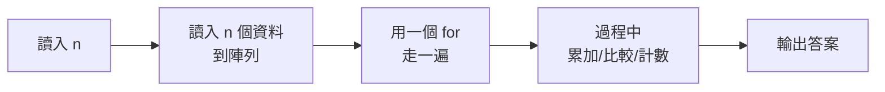

# 第五天 總複習與實戰

大里 APCS 營隊 · 把四天的功力全部用上

郭家睿

---
layout: default
---

## 今天的目標

- 把四天學的東西**串成一套解題流程**
- 認識 APCS 實作題的**固定套路**
- 學會**先想清楚再動手**：讀題 → 想法 → 手算 → 寫程式
- **90 分鐘**挑戰 itouOJ 上的 3 題綜合應用，賽後一起檢討、頒獎

<br>

> 前四天在學「工具」，今天學的是「**遇到題目該怎麼想**」。

---
layout: section
---

# 開場暖身

---

## 回顧昨天

<v-clicks>

- 陣列讓一個名字裝一整排資料，索引從 0 開始
- 找最大最小的起始值要用 `a[0]`，不要用 0
- 二維陣列 `m[i][j]`：`i` 是列、`j` 是行
- 字串走訪跟陣列一模一樣，雙指標適合對稱問題

</v-clicks>

---

## 暖身問題（不用寫程式）

如果你是老師，要幫全班算出「幾個人不及格」，你會怎麼用中文描述這個步驟？盡量用到這四天學過的詞彙。

<div class="mt-6 text-sm opacity-70">

想 30 秒，等一下公佈參考答案。

</div>

---

## 暖身問題：參考答案

<v-clicks>

- 準備一個計數器，從 0 開始（**變數初始化**）
- 把全班成績讀進一個陣列（**陣列**）
- 用迴圈走訪每一個成績（**迴圈**）
- 每次檢查這個成績是不是不及格（**if 判斷**）
- 是的話計數器加一（**累加**）
- 走完全部，印出計數器（**輸出**）

</v-clicks>

<div class="mt-6 border-l-4 border-green-500 pl-4" v-click>

這六步用到了四天教的**全部**技巧。今天要練的就是這種「組合技」。

</div>

---

## 今天為什麼這樣安排

<v-clicks>

- 前四天各自專注一個新觀念，今天**不新增任何語法**
- 把時間拿來練「怎麼把工具組合起來解決一個完整的問題」
- 這正是實際考試時真正會遇到的情況——沒有人會告訴你這題該用哪個工具

</v-clicks>

---
layout: section
---

# 四天的地圖

---

## 你已經會的東西

<div class="grid grid-cols-2 gap-4 text-sm">
  <div class="border-l-4 border-blue-500 pl-4">
    <div class="font-bold">Day1　輸入輸出</div>
    <div class="opacity-80">cin / cout · 每支程式都是 輸入→處理→輸出</div>
  </div>
  <div class="border-l-4 border-green-500 pl-4">
    <div class="font-bold">Day2　變數與判斷</div>
    <div class="opacity-80">型態 · 整數除法 · % 餘數 · if / else if</div>
  </div>
  <div class="border-l-4 border-orange-500 pl-4">
    <div class="font-bold">Day3　迴圈</div>
    <div class="opacity-80">for / while · 累加累乘 · 巢狀 · break</div>
  </div>
  <div class="border-l-4 border-purple-500 pl-4">
    <div class="font-bold">Day4　陣列與字串</div>
    <div class="opacity-80">走訪 · 找極值 · 二維 · 雙指標</div>
  </div>
</div>

<div class="mt-6 border-l-4 border-yellow-500 pl-4">

**今天不教新語法。** 這四格就是你的全部工具，APCS 初級的題目九成都只需要這些。差別在**怎麼把它們組起來**。

</div>

---

## Day1 詳細回顧：輸入輸出

<v-clicks>

- 程式要先**編譯**才能執行；編譯期錯誤 vs 執行期錯誤
- `cout <<` 資料流向螢幕；`cin >>` 資料流向變數
- 所有程式都是 **輸入 → 處理 → 輸出**
- itouOJ 判題結果：`AC` 通過、`WA` 答案錯、`CE` 編譯錯誤

</v-clicks>

---

## Day2 詳細回顧：變數與判斷

<v-clicks>

- 整數用 `int`，小數用 `double`，文字用 `string`
- **整數 / 整數會捨去小數**——算平均記得轉型
- `%` 餘數可以判斷奇偶、判斷倍數
- `if / else if / else` 由上往下，**第一個成立的執行**，條件要嚴格到寬鬆排列

</v-clicks>

---

## Day3 詳細回顧：迴圈

<v-clicks>

- `for` 三元素：初始值、條件、更新
- 累加從 0、累乘從 1，變數要放在迴圈**外面**
- 巢狀迴圈執行次數是**外層 × 內層**
- `break` 結束整個迴圈，`continue` 只跳過這一輪

</v-clicks>

---

## Day4 詳細回顧：陣列與字串

<v-clicks>

- 陣列索引從 0 開始，開得比題目上限**大一點**
- 找最大最小的起始值用 `a[0]`，不要用 0
- 二維陣列 `m[i][j]`：`i` 是列、`j` 是行
- 字串走訪跟陣列一樣；**雙指標**適合迴文這類對稱問題

</v-clicks>

---

## 四天技巧一次對照

<div class="text-sm">

| 天數 | 關鍵字         | 一句話重點                   |
| ---- | -------------- | ---------------------------- |
| Day1 | cin / cout     | 輸入輸出的方向，看箭頭       |
| Day2 | if / else      | 條件由嚴格排到寬鬆           |
| Day3 | for / while    | 三元素：初始值、條件、更新   |
| Day4 | array / string | 索引從 0 開始，起始值用 a[0] |

</div>

<div class="mt-4 text-sm opacity-70">

這張表就是整套課程的濃縮版。忘記細節的時候，回來看這張表通常就夠了。

</div>

---

## APCS 實作題的固定套路



<div class="mt-4 text-sm">

**大部分題目都長這樣。** 差別只在中間那個 for 裡面做什麼：

- 累加 → 求總和、平均
- 比較 → 找最大最小
- 計數 → 統計次數、算符合條件的有幾個

</div>

---

## 為什麼幾乎每題都長這樣

<v-clicks>

- APCS 初級題目的資料量不大，**單層或雙層迴圈**幾乎都能在時限內跑完
- 「讀進來、走一遍、記點東西、印出來」這個模式覆蓋了絕大多數題型
- 認出這個套路後，**讀題時就是在填空**：這題要記什麼？要比較還是要算？

</v-clicks>

---

## 解題流程：先想清楚再動手

<v-clicks>

<div class="border-l-4 border-blue-500 pl-4 my-3">

**① 讀題，把輸出格式抄下來** 幾行？大小寫？小數幾位？——這裡錯了，演算法再對也是 WA。

</div>

<div class="border-l-4 border-green-500 pl-4 my-3">

**② 用範例手算一遍** 拿題目給的範例，用紙筆做一次。做不出來代表**你還沒讀懂題目**。

</div>

<div class="border-l-4 border-orange-500 pl-4 my-3">

**③ 想「要走幾遍、每一遍做什麼」** 通常答案是「走一遍，邊走邊記東西」。

</div>

<div class="border-l-4 border-purple-500 pl-4 my-3">

**④ 才開始寫程式**

</div>

</v-clicks>

---

## 展開步驟①：讀題

<div class="text-sm">

讀題時要抓出三件事：

</div>

<v-clicks>

- **輸入**有幾個東西？各是什麼型態？
- **輸出**要印幾行？每行長怎樣？
- 有沒有**特殊情況**題目特別提到（例如除以 0、n 的最小值）？

</v-clicks>

<div class="mt-4 border-l-4 border-yellow-500 pl-4 text-sm" v-click>

把輸出格式**逐字**抄下來，程式寫完後拿範例比對，一個字元都不能差。

</div>

---

## 展開步驟②：手算一遍

<div class="text-sm">

拿題目給的範例輸入，自己在紙上（或心裡）算出答案，確認你算出來的跟範例輸出**一致**。

</div>

<div class="mt-4 border-l-4 border-green-500 pl-4 text-sm">

這一步不能跳過。如果你自己都算不出正確答案，寫出來的程式一定也是錯的——差別只是你什麼時候會發現。

</div>

---

## 展開步驟③：想「要走幾遍」

<div class="text-sm">

大部分題目只需要**一遍**（一層迴圈）就能解決：

</div>

<v-clicks>

- 邊走訪、邊記錄需要的東西（總和、最大值、計數……）
- 少數題目需要**兩遍**：第一遍先算出基準值（例如平均），第二遍才能用它
- 想清楚「這一遍走的時候，手上要拿著什麼資訊」

</v-clicks>

---

## 展開步驟④：才開始寫程式

<v-clicks>

- 先搭骨架（讀輸入、迴圈框架、輸出），再填內容
- 一次只加一小段，加完就想一下對不對，不要一口氣寫完整支再檢查
- 這正是這四天每次帶大家做的事：**逐步完成**

</v-clicks>

---
layout: section
---

# 程式碼健檢

---

## 四天、四段程式碼，你能抓出問題嗎？

<div class="text-sm opacity-70">

接下來四段程式碼，各自藏著一天教過的常見錯誤。先自己看，想 15 秒再看解答。

</div>

---

## 健檢①：這段程式碼有什麼問題？

```cpp
int age;
cout << "你的年齡是 " << age << endl;
cin >> age;
```

<v-click>

<div class="mt-6 border-l-4 border-green-500 pl-4">

**Day1 的教訓**：`cin` 跟 `cout` 順序顛倒。程式是由上往下執行的，這裡在讀取之前就先印出 `age`，印到的是還沒賦值的垃圾值。

</div>

</v-click>

---

## 健檢②：這段程式碼有什麼問題？

```cpp
int w, h;
cin >> w >> h;
double bmi = w / (h / 100 * h / 100);
```

<v-click>

<div class="mt-6 border-l-4 border-green-500 pl-4">

**Day2 的教訓**：`h / 100` 是整數除法，175 公分會變成 1 公尺再平方，BMI 算出來會離譜地大。應該寫成 `h / 100.0`。

</div>

</v-click>

---

## 健檢③：這段程式碼有什麼問題？

```cpp
int product = 0;
for (int i = 1; i <= n; i++) {
    product *= i;
}
```

<v-click>

<div class="mt-6 border-l-4 border-green-500 pl-4">

**Day3 的教訓**：累乘的初始值設成 `0`，任何數乘以 0 都是 0，答案永遠是 0。累乘要從 `1` 開始。

</div>

</v-click>

---

## 健檢④：這段程式碼有什麼問題？

```cpp
int mx = 0;
for (int i = 0; i < n; i++) {
    if (a[i] > mx) mx = a[i];
}
```

<v-click>

<div class="mt-6 border-l-4 border-green-500 pl-4">

**Day4 的教訓**：起始值設成 `0` 而不是 `a[0]`。如果陣列全部是負數，答案會錯誤地停在 0。

</div>

</v-click>

---

## 健檢總結：錯誤都藏在「起始值」和「順序」

<div class="text-sm">

| 天數 | 錯誤類型     | 正確做法          |
| ---- | ------------ | ----------------- |
| Day1 | 執行順序顛倒 | 先 cin 再 cout    |
| Day2 | 整數除法時機 | 先轉型再除        |
| Day3 | 累乘起始值   | 從 1 開始，不是 0 |
| Day4 | 找極值起始值 | 用 a[0]，不是 0   |

</div>

<div class="mt-4 border-l-4 border-yellow-500 pl-4 text-sm">

四天累積下來的錯誤，有志一同都跟「一開始的那個值」或「先後順序」有關。寫程式時多花 5 秒想清楚起點，可以省下很多除錯時間。

</div>

---

## 健檢練習：換你來找碴

```cpp
int cnt = 0;
for (int i = 0; i <= n; i++) {
    if (a[i] % 2 == 0) cnt++;
}
```

這段程式在數陣列裡的偶數個數，有什麼問題？

<v-click>

<div class="mt-6 border-l-4 border-green-500 pl-4">

**差一錯誤**：條件是 `i <= n`，會多存取 `a[n]`——如果陣列只開到 `a[n-1]`，這裡就會越界。應該用 `i < n`。

</div>

</v-click>

---
layout: section
---

# 送分與扣分

---

## 這些地方最常失分

<v-clicks>

<div class="border-l-4 border-red-500 pl-4 my-3">

**輸出格式沒對齊**　大小寫、冒號後的空白、小數位數、行數。判題是**逐字比對**的，`A: 2` 和 `A:2` 是兩件事。

</div>

<div class="border-l-4 border-red-500 pl-4 my-3">

**忘記邊界**　n = 1、全部相同、全是負數、除數為 0。寫完先問自己：**最小的輸入會怎樣？**

</div>

<div class="border-l-4 border-red-500 pl-4 my-3">

**整數除法**　要小數卻寫成 `a / b`。看到「平均」「比例」就警覺。

</div>

<div class="border-l-4 border-red-500 pl-4 my-3">

**陣列開太小**　題目說 n ≤ 1000 就開 `a[1005]`。多開不用錢。

</div>

</v-clicks>

---

## 失分案例①：格式差一個字

```cpp
cout << name[i] << ":" << cnt[i] << endl;   // ❌ 少了空白
```

<div class="mt-4 border-l-4 border-red-500 pl-4 text-sm">

題目要的是 `A: 2`，這樣寫出來是 `A:2`——演算法完全正確，但因為少了一個空白，整題判定 WA。**這是最冤枉的失分方式。**

</div>

---

## 失分案例②：沒想過邊界

```cpp
int mx = a[0], mn = a[0];
for (int i = 1; i < n; i++) { ... }   // n = 1 時，這個迴圈一次都不執行
```

<div class="mt-4 text-sm opacity-70">

`n = 1` 時只有一個元素，迴圈不執行，但 `mx` 和 `mn` 已經被設成 `a[0]`，剛好還是對的——但如果起始值設錯（例如設成 0），n=1 時就會直接曝露這個錯誤。 **用最小的輸入檢查一次，往往能提早抓到問題。**

</div>

---

## 失分案例③：整數除法忘記轉型

```cpp
int total = 85, n = 4;
cout << total / n;         // ❌ 印出 21，不是 21.25
cout << (double)total / n; // ✅ 印出 21.25
```

<div class="mt-4 text-sm opacity-70">

看到題目寫「平均」「比例」「百分比」，第一反應要想到：這裡會不會需要轉型成 `double`？

</div>

---

## 失分案例④：陣列開太小

```cpp
int n;             // 題目說 n ≤ 1000
cin >> n;
int a[1000];        // ❌ 剛好卡在上限，索引 0~999
```

<div class="mt-4 border-l-4 border-red-500 pl-4 text-sm">

如果程式碼裡有任何地方用到 `a[n]`（例如某些寫法會多存取一格）， `n = 1000` 時 `a[1000]` 就會越界。**陣列開得比上限大一點**，不要卡在剛剛好，這幾乎是零成本的保險。

</div>

---

## 失分案例⑤：多筆輸出漏了空行或漏了行

```cpp
for (int i = 0; i < 5; i++) {
    cout << name[i] << ": " << cnt[i];   // ❌ 忘記 endl
}
```

<div class="mt-4 border-l-4 border-red-500 pl-4 text-sm">

忘記換行的話，5 行答案會全部黏成一行，判題比對逐行內容時就會不符合。 **多行輸出，每一行結尾都要有 `endl`（或 `"\n"`）。**

</div>

---

## 這五個案例的共同點

<v-clicks>

- 沒有一個是「演算法想錯了」
- 全部都是**細節疏忽**：格式、邊界、轉型、陣列大小、換行
- 這代表什麼？**寫對演算法只是及格線，把細節顧好才能拿到分數**

</v-clicks>

---

## 養成習慣比硬背規則更有用

<div class="text-sm">

與其背「十條容易出錯的規則」，不如養成這個習慣：

</div>

<div class="mt-4 border-l-4 border-green-500 pl-4">

**每次寫完一段程式，花 5 秒問自己：「起始值對嗎？順序對嗎？邊界呢？」**

</div>

<div class="mt-4 text-sm opacity-70">

這五天所有的錯誤示範，最後都能歸納成這句話。與其記住每個案例，不如把這個提問變成反射動作。

</div>

---

## 交出去之前的檢查清單

<div class="text-sm">

- [ ] 範例輸入貼進去，輸出**一字不差**嗎？
- [ ] 輸出的**行數**對嗎？最後一行有換行嗎？
- [ ] n 取最小值（1 或 2）時會怎樣？
- [ ] 有沒有除以 0 的可能？
- [ ] 陣列開得比題目上限大嗎？
- [ ] 有沒有寫成 `=` 而不是 `==`？
- [ ] 需要小數的地方，有記得轉型嗎？

</div>

<div class="mt-6 border-l-4 border-green-500 pl-4">

**WA 的時候不要急著改演算法。** 先重看一次輸出格式——初學階段有一半以上的 WA 是格式問題，不是想錯。

</div>

---
layout: section
---

# 考場策略

---

## 先易後難

<v-clicks>

- 拿到題本先**全部瀏覽一遍**，不要照順序硬解
- 先解「一眼看出解法」的題目，把有把握的分數先拿到手
- 卡住超過預期時間，先跳過，等其他題目寫完再回來想
- 這樣即使時間不夠，也是「難題沒寫完」而不是「簡單題也沒寫到」

</v-clicks>

---

## 時間分配的簡單心法

<div class="text-sm">

考試前先看總題數和總時間，粗略算出**每題平均能分到多少時間**。

</div>

<div class="mt-4 border-l-4 border-yellow-500 pl-4 text-sm">

如果某一題已經花了超過平均時間的 1.5～2 倍還沒有頭緒，先寫下目前的想法、放著，去做下一題。**別讓一題拖垮全場。**

</div>

---

## 卡住的時候怎麼辦

<v-clicks>

- 回到今天教的四步驟：**重新讀題**，是不是漏看了什麼條件？
- 用**更小的範例**手算一次，通常能看出規律或想法哪裡卡住
- 想想這題屬於「累加、比較、計數」哪一種，還是需要組合
- 真的想不出來，**先寫出讀輸入和輸出的骨架**，部分分數也是分數

</v-clicks>

---

## 檢查習慣：寫完不代表結束

<div class="text-sm">

交卷前，養成習慣做這三件事：

</div>

<v-clicks>

- 用範例輸入**再手算一次**，跟範例輸出比對
- 想一下**最小的輸入**（n=1、n=0 如果合法、負數）會不會出錯
- 檢查輸出格式：大小寫、標點、空白、換行

</v-clicks>

---
layout: fact
---

# ☕ 中場休息

15 分鐘後回來，開始今天的 90 分鐘實戰演練

---
layout: section
---

# 90 分鐘實戰演練

---

## 比賽規則

<v-clicks>

- 綜合應用題：P1 畢業紀念冊之外的用途？、P2 校長的口號到底多有梗？（現場視情況再加一題）
- 每題都有子題配分，就算寫不完整支程式，先讓第一小題的輸出正確也拿得到分數
- 時間：**90 分鐘**，時間到系統就會關閉提交
- 可以重複提交，交錯不扣分，改完再交就好
- 卡住的話用今天教的方法：重新讀題、手算範例、想「這題屬於哪一種套路」
- 真的想不出來，先交出目前寫到的部分，**有交比空白好**

</v-clicks>

<div class="mt-6 border-l-4 border-yellow-500 pl-4 text-sm" v-click>

自己讀、自己想、自己寫。比賽結束後會逐題檢討，現在**先不要**上網查解法。

</div>

---
layout: fact
---

# 動手做

[oj.itousouta.me → 比賽](https://oj.itousouta.me/contests/3)

90 分鐘：P1 畢業紀念冊之外的用途？、P2 校長的口號到底多有梗？

---
layout: section
---

# 賽後檢討

---

## P1　畢業紀念冊之外的用途？

讀入 N 件投稿作品的紀錄 (owner, purpose)，purpose 為 2 或 3 視為「違規使用」。

<div class="text-sm mt-4">

輸出：① 違規總件數　② 每位「至少一件違規」的學生座號與違規件數，依座號由小到大。

</div>

<div class="mt-4 text-xs opacity-60">

子題一 40 分：只要第一行總件數對；子題二 60 分：後面每位學生的明細也要全對。

</div>

---

## P1　套進固定套路

<v-clicks>

- 讀入 n → 讀入 N 件作品紀錄
- 用一個 for 走一遍 → 每讀一筆就判斷 purpose 是不是 2 或 3
- 過程中計數 → 違規總數 +1；同時把**這位學生**的違規次數也 +1
- 輸出答案 → 先印總數，再依座號由小到大印出有違規的學生

</v-clicks>

---

## P1　用今天教的方法手算一次

<div class="text-sm">

輸入 `1 2` `2 1` `1 3` `3 2` `2 2`，照著讀，逐一判斷：

</div>

| 這筆 | owner | purpose | 違規？ | cnt[owner] |
| ---- | ----- | ------- | ------ | ---------- |
| 1    | 1     | 2       | 是     | cnt[1]=1   |
| 2    | 2     | 1       | 否     | —          |
| 3    | 1     | 3       | 是     | cnt[1]=2   |
| 4    | 3     | 2       | 是     | cnt[3]=1   |
| 5    | 2     | 2       | 是     | cnt[2]=1   |

<div class="mt-2 text-sm opacity-70">

共 4 件違規，依座號輸出 `1 2`、`2 1`、`3 1`，跟範例輸出一致。

</div>

---

## P1　想法：座號本身就是索引

<div class="text-sm">

座號 owner 的範圍是 1～100，**數字本身就能直接當計數陣列的索引**，不需要像字母那樣先轉換：

</div>

```cpp
int cnt[101] = {};   // cnt[owner] = 這位學生的違規件數
```

<div class="mt-4 text-sm opacity-70">

每讀進一筆違規紀錄，直接把 `cnt[owner]` 加一即可。

</div>

---

## P1　程式：讀入與計數

```cpp
int cnt[101] = {};      // 座號 1~100，直接當索引
int n; cin >> n;
int total = 0;
for (int i = 0; i < n; i++) {
    int owner, purpose;
    cin >> owner >> purpose;
    if (purpose == 2 || purpose == 3) {
        total++;
        cnt[owner]++;
    }
}
```

<div class="mt-4 text-sm opacity-70">

這裡不需要把每一筆原始紀錄都存起來——分類完馬上更新計數，紀錄本身用完就丟。

</div>

---

## P1　輸出

```cpp
cout << total << endl;
for (int owner = 1; owner <= 100; owner++) {
    if (cnt[owner] > 0) cout << owner << " " << cnt[owner] << endl;
}
```

<div class="mt-4 border-l-4 border-green-500 pl-4 text-sm">

依座號由小到大輸出，剛好就是照著陣列索引 1 到 100 掃過去的順序——完全不用額外排序，這也是計數陣列的一個附加好處。

</div>

---

## P1　容易失分的地方

<div class="border-l-4 border-red-500 pl-4 text-sm">

⚠️ 只統計 `purpose == 2 || purpose == 3`，`purpose == 1` 不算違規，別寫反條件。

⚠️ 子題一、子題二是**分開配分**的：程式碼要先確保第一行的總件數穩穩拿到 40 分，再去顧後面的明細——這正是「先求有再求好」。

</div>

---

## P2　校長的口號到底多有梗？

讀入 N 屆的紀錄 (year, slogan，僅大寫字母)。slogan 中**任一字母出現 ≥2 次**，該屆就是「重複用字口號」。

<div class="text-sm mt-4">

輸出：① 重複用字口號總屆數　② 每個重複用字屆的屆別、出現最多次的字母（並列取字母順序最小）與次數，**依屆別由小到大**。

</div>

<div class="mt-4 text-xs opacity-60">

子題一 40 分：只要第一行總屆數對；子題二 60 分：後面每屆的明細也要全對。

</div>

---

## P2　套進固定套路

<v-clicks>

- 讀入 n → 讀入 N 屆紀錄
- 用一個 for 走一遍 → **每一屆都重新算一次**這句口號的字母次數（用計數陣列統計 26 個字母，只是要重算 N 次）
- 過程中計數/比較 → 這屆有沒有字母出現 ≥2 次？有的話順便記下次數最高、字母順序最小的那個
- 輸出答案 → 先印總屆數，再依屆別由小到大印出明細

</v-clicks>

<div class="mt-4 border-l-4 border-blue-500 pl-4 text-sm" v-click>

題目要求「依屆別由小到大」，但輸入不保證照屆別排序——這件事要先想清楚，不能邊讀邊印。

</div>

---

## P2　用範例一手算一次

<div class="text-sm">

`PASSION` `BELIEVE` `DREAM` `TOGETHER` `SUCCESS`，逐屆算字母次數：

</div>

| 屆  | 口號     | 出現最多次的字母(次數) | 重複用字？ |
| --- | -------- | ---------------------- | ---------- |
| 1   | PASSION  | S(2)                   | 是         |
| 2   | BELIEVE  | E(3)                   | 是         |
| 3   | DREAM    | 全部各 1 次            | 否         |
| 4   | TOGETHER | T(2) / E(2) 並列，取 E | 是         |
| 5   | SUCCESS  | S(3)                   | 是         |

<div class="mt-2 text-sm opacity-70">

共 4 屆重複用字，依序是 1、2、4、5，跟範例輸出一致。

</div>

---

## P2　程式：每屆重算一次計數陣列

```cpp
int n; cin >> n;
int year[1005]; string slogan[1005];
for (int i = 0; i < n; i++) cin >> year[i] >> slogan[i];

int total = 0;
bool isDup[1005] = {};
char bestLetter[1005]; int bestCount[1005];

for (int i = 0; i < n; i++) {
    int cnt[26] = {};                       // 這屆專用，每屆都要歸零重來
    for (char c : slogan[i]) cnt[c - 'A']++;

    int best = 0;
    for (int j = 1; j < 26; j++)
        if (cnt[j] > cnt[best]) best = j;   // 嚴格大於才換，並列取字母順序最小

    if (cnt[best] >= 2) {
        isDup[i] = true;
        total++;
        bestLetter[i] = (char)('A' + best);
        bestCount[i] = cnt[best];
    }
}
```

<div class="mt-2 text-sm opacity-70">

跟 P1 用計數陣列統計是同一套技巧——只是這裡有 N 屆，`cnt[26]` 每一屆都要**重新歸零**，不能沿用上一屆算到一半的數字。

</div>

---

## P2　輸出：用屆別當索引，取代排序

<div class="text-sm">

year 最大只到 10000，可以開一個「以 year 當索引」的陣列，直接取代排序：

</div>

```cpp
int slot[10005];
for (int y = 0; y <= 10000; y++) slot[y] = -1;   // -1 = 沒有這屆
for (int i = 0; i < n; i++) slot[year[i]] = i;

cout << total << endl;
for (int y = 1; y <= 10000; y++) {
    int i = slot[y];
    if (i != -1 && isDup[i])
        cout << y << " " << bestLetter[i] << " " << bestCount[i] << endl;
}
```

<div class="mt-4 border-l-4 border-green-500 pl-4 text-sm">

照 `y` 由小到大掃過去，順序自然就是屆別由小到大——這五天沒教排序演算法，但用「索引本身就是資訊」的計數陣列技巧，一樣能做到同樣的效果。

</div>

---

## P2　容易失分的地方

<div class="border-l-4 border-red-500 pl-4 text-sm">

⚠️ 字母是**大寫**，要用 `c - 'A'`，不是 `c - 'a'`。

⚠️ `cnt[26]` 一定要放在**每屆的迴圈裡面**宣告（或每屆手動歸零），放在外面只會歸零一次，後面每屆的計數會疊加到前面去。

⚠️ 並列時要用**嚴格大於** `>` 找 `best`，才會停在字母順序最小的那個。

</div>

---

## 這招叫「計數陣列」

<div class="text-sm">

P1 用座號當索引、P2 用字母（和屆別）當索引，用的是**同一個技巧**：

</div>

```cpp
int cnt[種類數] = {};     // 每種一格，全部歸零
for (每一筆資料) cnt[這筆屬於第幾種]++;
```

<div class="mt-4 border-l-4 border-yellow-500 pl-4 text-sm">

只要題目在問「**各有幾個**」「**哪個最多**」，先想想能不能開一個計數陣列。索引範圍不大的時候（座號 100 種、字母 26 種、屆別到 10000），這是最直接的解法。

</div>

---

## 計數陣列：什麼時候該用

<v-clicks>

- 資料的「種類數」不多、而且**固定**（座號、字母、屆別……）
- 只需要知道「每種各出現幾次」或「依索引順序輸出」，不需要記住原始資料的順序
- 索引不一定是數字本身——**字元要先轉成索引**（`c - 'A'`），但如果本身就是數字（座號、屆別）可以直接當索引

</v-clicks>

---
layout: fact
---

# 🍱 短暫休息

10 分鐘後回來

---
layout: section
---

# 頒獎

---

## 恭喜完成 90 分鐘的挑戰

<div class="text-sm opacity-70 mt-4">

不管這場拿到幾分，你都已經在時間壓力下，把五天學到的東西整套用了一次——這比分數本身更值得恭喜。

</div>

---

## 公佈排行榜

[oj.itousouta.me → Day5 比賽 → 排行榜](https://oj.itousouta.me/contests/3/scoreboard)

<div class="mt-4 text-sm opacity-70">

一起看看誰在 90 分鐘內拿下最多分、最快全對。

</div>

---

## 頒獎

<div class="text-sm opacity-70 mb-4">

（以下依現場實際名次調整）

</div>

<v-clicks>

- 🥇 第一名
- 🥈 第二名
- 🥉 第三名
- 🌟 最佳進步獎
- 💡 最佳嘗試獎（沒拿到滿分，但過程最值得鼓勵）

</v-clicks>

---
layout: section
---

# 五天下來你學會了什麼

---

## 技能回顧

<v-clicks>

- 讓電腦**接收輸入、算東西、印出結果**
- 用 **if** 讓程式做決定、用**迴圈**讓它重複做事
- 用**陣列**一次處理上千筆資料、用**字串**處理文字
- **計數陣列**：問「各有幾個」就開一格數一格
- 最重要的：**先讀懂題目、手算一遍、想清楚再動手**

</v-clicks>

---

## 語法會忘記，這個不會

<div class="border-l-4 border-green-500 pl-4 text-lg">

**「遇到問題先拆解」的習慣，才是這五天真正帶走的東西。**

</div>

<div class="mt-6 text-sm opacity-70">

語法查得到——忘記怎麼寫 `for` 迴圈，上網一查就有。但「先讀懂問題、想清楚步驟、再動手」這個順序，是需要練習才能養成的習慣，這五天每一題都在重複同一件事，就是希望這個習慣能留下來。

</div>

---

## 之後想繼續練

<v-clicks>

- itouOJ 上還有其他題目，慢慢刷就是了
- 卡住的時候，回頭用今天教的四步驟：讀題、手算、規劃、動手
- WA 的時候，先檢查格式，再檢查邊界，最後才懷疑演算法
- 忘記語法很正常，回來翻這五天的投影片就好

</v-clicks>

---

## 五天走過的路

<div class="text-sm">

| Day | 主題         | 學會的核心能力         |
| --- | ------------ | ---------------------- |
| 1   | 資訊啟蒙     | 讓電腦照你的話做事     |
| 2   | 變數與運算子 | 讓程式做決定           |
| 3   | 迴圈         | 讓程式重複做事         |
| 4   | 陣列、字串   | 一次處理一整排資料     |
| 5   | 總複習與實戰 | 把工具組合起來解決問題 |

</div>

---

## 給自己的一句話

<div class="text-lg mt-6 text-center">

寫程式最難的部分，往往不是語法，而是**願意動手試、願意面對錯誤**。

</div>

<div class="mt-6 text-sm opacity-70">

這五天你已經寫出好幾支能跑、能通過測試的程式——這不是小事，是很多人第一次體會到「我可以讓電腦照我的想法做事」的感覺。

</div>

---

## 統計一下：這五天你寫了幾題

<div class="text-sm">

| Day      | 題數      |
| -------- | --------- |
| 1        | 1         |
| 2        | 4         |
| 3        | 6         |
| 4        | 5         |
| 5        | 3         |
| **總計** | **19 題** |

</div>

<div class="mt-4 text-sm opacity-70">

19 支從無到有、能通過判題的程式——五天前的你，可能連 `Hello, World!` 都沒寫過。

</div>

---

## 如果還想走得更遠

<v-clicks>

- APCS 檢定：這五天教的內容是初級題的核心，多刷題、多練手感
- 想學更多：STL 容器（vector、map）、物件導向、演算法（排序、搜尋）
- 最重要的不是學多快，是**遇到不會的東西時，願不願意拆解它**

</v-clicks>

---

## 最後想說的話

<div class="text-sm opacity-70 mt-6">

有問題隨時在 Discord 上 Call 我，或是在 itouOJ 上留言討論。寫程式這條路很長，這五天只是一個開始。

</div>
