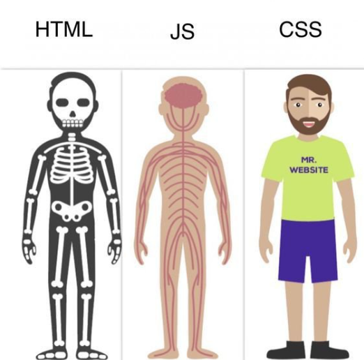
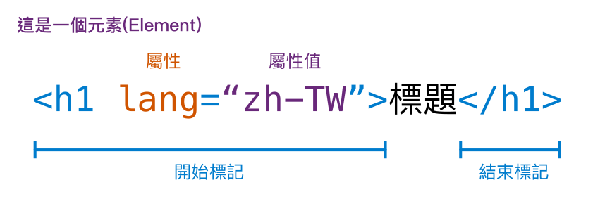
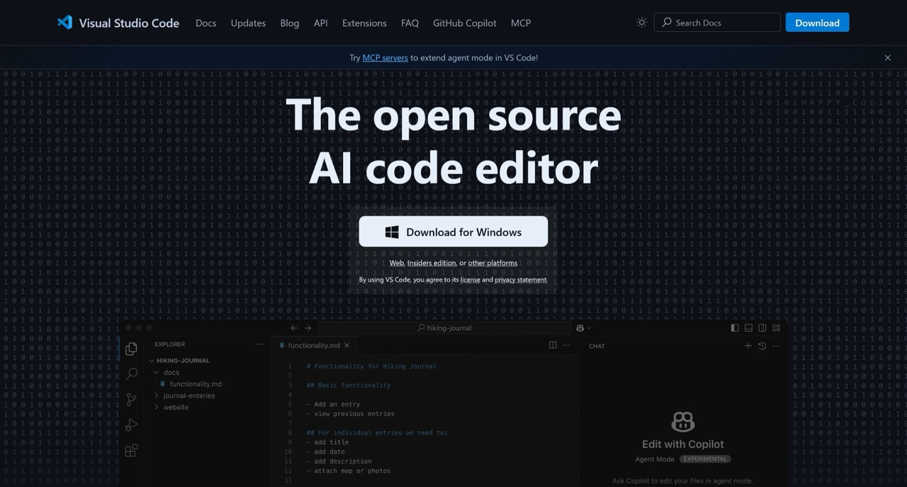
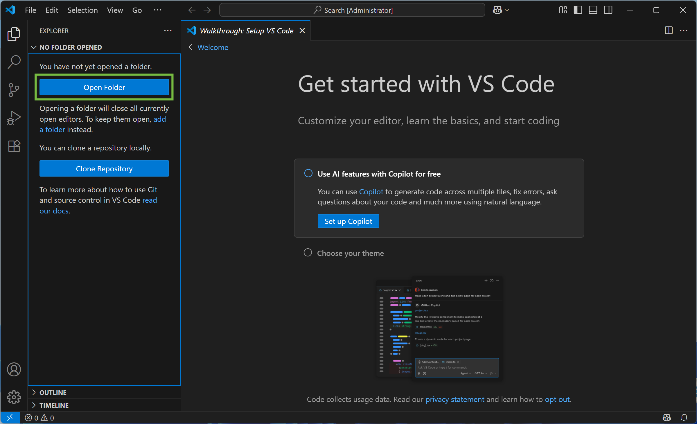
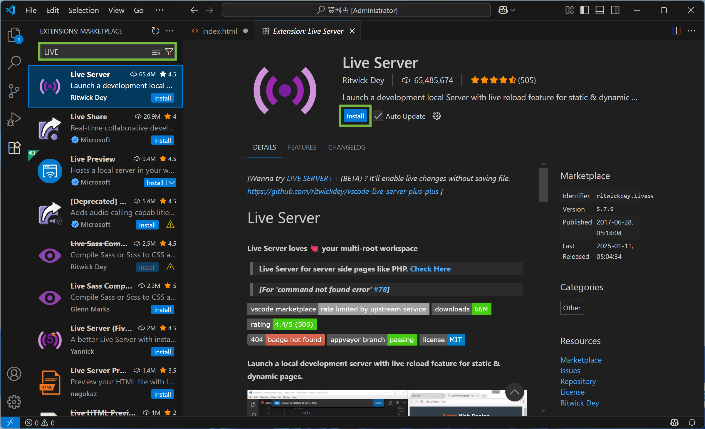
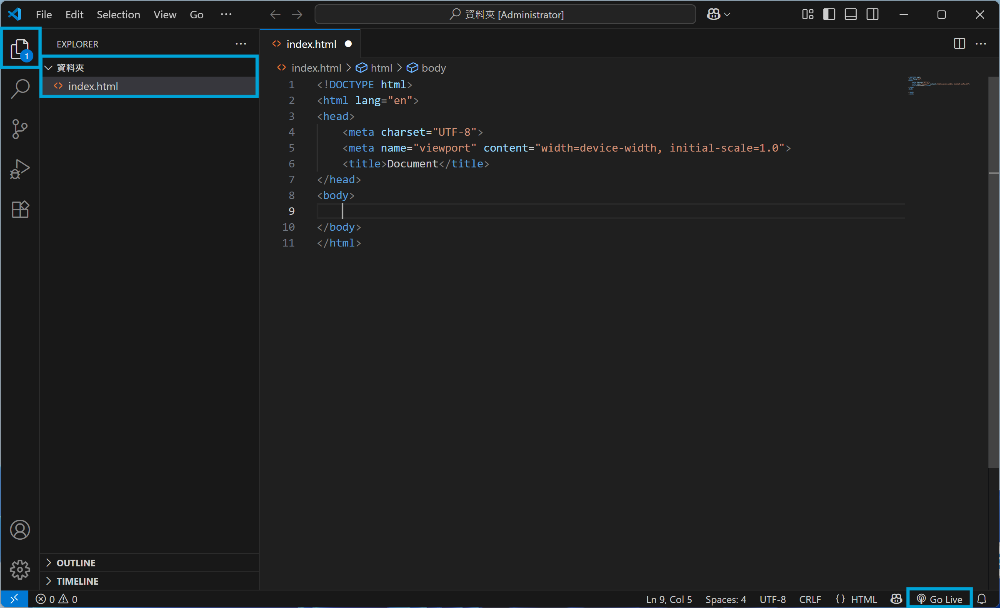

# HTML

毛哥EM

---

## 關於我

## 毛哥EM

- 九年網頁開發經驗
- Awwwards 常態評審
- 英文辯士

---

## 第一個網站

_網站講白就是要用瀏覽器打開的 Word 檔_

但是只有純文字太無聊了，所以我們在文字間做一些標記讓他們有不一樣的意義

---

## HTML

超文本標記語言 HyperText Markup Language  
作為網站的骨架



---

## Codepen

網頁的 Google Docs

網址：[pen.new](https://pen.new)

---

## 試試看

```html
<h1>這是標題</h1>
```

---

## 元素

網站所有東西都是由元素組成



---

## 標題

```html
<h1>H1</h1>
<h2>H2</h2>
<h3>H3</h3>
<h4>H4</h4>
<h5>H5</h5>
<h6>H6</h6>
```

---

## >< 好麻煩 /

---

## emmet

`h1` + `tab` 會變成 `<h1></h1>`

---

## 文字效果

```html
<p>
	段落
	<b>粗體</b>
	<i>斜體</i>
	<s>刪除線</s>
	<u>底線</u>
	H
	<sup>+</sup>
	CO
	<sub>2</sub>
</p>
```

---

## 空白、換行

一個以上的 tab、空格、換行都視為一個空格  
所以要換行要使用 `<br>` 標籤

---

## 無序清單

```html
<ul>
	<li>a</li>
	<li>b</li>
	<li>c</li>
</ul>
```

---

## 有序清單

```html
<ol>
	<li>a</li>
	<li>b</li>
	<li>c</li>
</ol>
```

---

## 清單裡的清單

```html
<ul>
	<li>清單裡可以有清單</li>
	<li>
		<ul>
			<li>沒錯</li>
			<li>就是這樣</li>
		</ul>
	</li>
</ul>
```

---

## 超連結

```html
<a href="連結">顯示文字</a>
```

```html
<a href="https://www.google.com">Google</a>
```

---

### 新分頁開啟

```html
<a href="連結" target="_blank">顯示文字</a>
```

---

## 圖片

```html

```

```html

```

---

## 表格

```html
<table>
	<tr>
		<th>國家</th>
		<th>首都</th>
		<th>人口</th>
		<th>語言</th>
	</tr>
	<tr>
		<td>USA</td>
		<td>Washington D.C.</td>
		<td>309</td>
		<td>English</td>
	</tr>
	<tr>
		<td>Sweden</td>
		<td>Stockholm</td>
		<td>9</td>
		<td>Swedish</td>
	</tr>
</table>
```

---

| 國家   | 首都            | 人口 | 語言    |
| ------ | --------------- | ---- | ------- |
| USA    | Washington D.C. | 309  | English |
| Sweden | Stockholm       | 9    | Swedish |

---

## 輸入框

```html
<input type="text" />
```

---

### 密碼輸入框

```html
<input type="password" />
```

---

### 勾選框

```html
<input type="checkbox" />
我已詳細閱讀使用者服務條款
```

---

### 勾選框（已勾選）

```html
<input type="checkbox" checked />
我已詳細閱讀使用者服務條款
```

---

### disabled

```html
<input type="checkbox" disabled />
我已詳細閱讀使用者服務條款
```

---

### label

```html
<input type="checkbox" id="terms" checked />
<label for="terms">我已詳細閱讀使用者服務條款</label>
```

---

## 單選框

```html
<input type="radio" name="color" value="red" />
red
<input type="radio" name="color" value="green" />
green
<input type="radio" name="color" value="blue" />
blue
```

---

## 表單

```html
<form action="資料傳給哪個網址" method="傳輸方式">
	<input type="text" name="name" placeholder="輸入你的名字" />
	<input type="submit" value="送出" />
</form>
```

---

### Google 搜尋範例

```html
<form action="https://www.google.com/search" method="get">
	<input type="text" name="q" placeholder="搜尋 Google" />
	<input type="submit" value="搜尋" />
</form>
```

---

## IDE

整合式開發環境

---

## Visual Studio Code



---

### 開啟資料夾



---

### 安裝擴充功能



---

### 建立第一個網頁



---

## 基本架構

emmet：`!` + `tab`

```html
<!DOCTYPE html>
<html lang="en">
	<head>
		<meta charset="UTF-8" />
		<meta name="viewport" content="width=device-width, initial-scale=1.0" />
		<title>Document</title>
	</head>
	<body>
		<!-- 內容直接顯示在網頁中 -->
	</body>
</html>
```

---

## 絕對路徑與相對路徑

- **絕對路徑**：這個檔案在本機或網路上的絕對位置
- **相對路徑**：相對於這個檔案的位置
  - 上一層：`../`

```html


```

---
layout: statement
---

本投影片由 [毛哥EM](https://elvismao.com/) 製作  
採用創用 CC「[姓名標示 4.0 國際](https://creativecommons.org/licenses/by/4.0/deed.zh-hant)」授權


[毛哥EM資訊密技](https://emtech.cc/) · [毛哥EM公開簡報](https://g.elvismao.com/slides)
